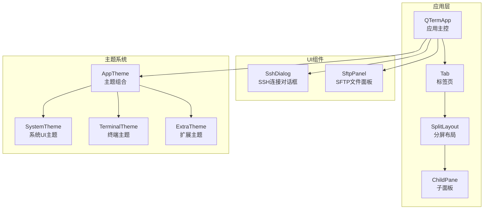
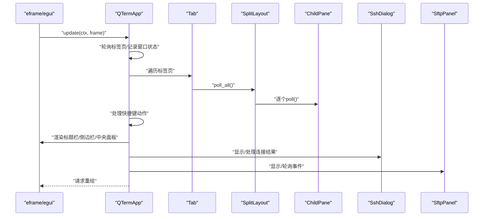
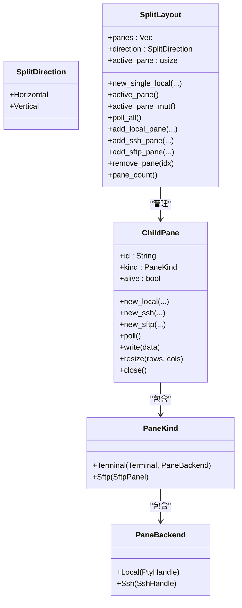
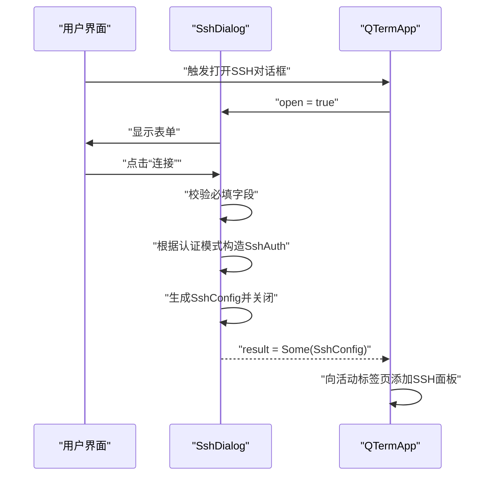
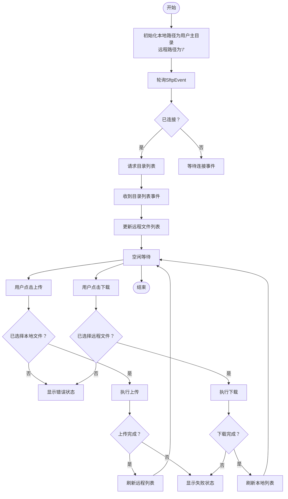
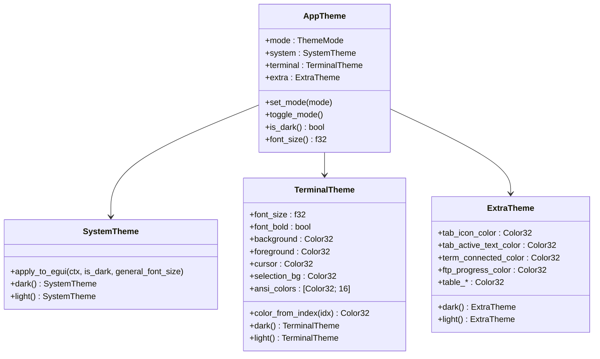
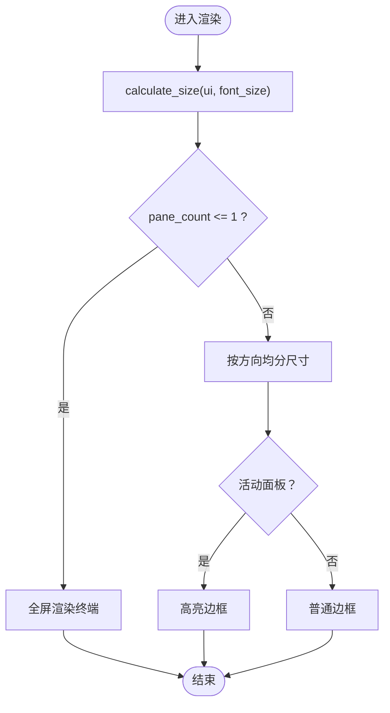
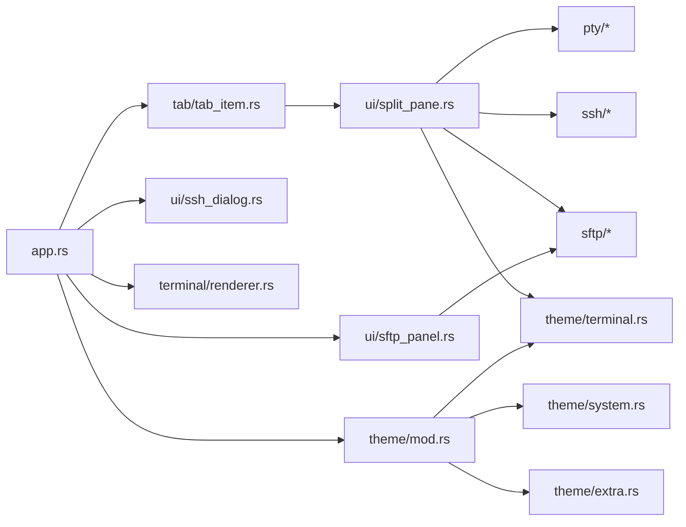

# UI模块

<cite>
**本文档引用的文件**
- [src/ui/mod.rs](file://src/ui/mod.rs)
- [src/ui/split_pane.rs](file://src/ui/split_pane.rs)
- [src/ui/ssh_dialog.rs](file://src/ui/ssh_dialog.rs)
- [src/ui/sftp_panel.rs](file://src/ui/sftp_panel.rs)
- [src/theme/mod.rs](file://src/theme/mod.rs)
- [src/theme/system.rs](file://src/theme/system.rs)
- [src/theme/terminal.rs](file://src/theme/terminal.rs)
- [src/theme/extra.rs](file://src/theme/extra.rs)
- [src/app.rs](file://src/app.rs)
- [src/main.rs](file://src/main.rs)
- [src/tabs/tab_item.rs](file://src/tab/tab_item.rs)
- [src/config.rs](file://src/config.rs)
- [src/terminal/renderer.rs](file://src/terminal/renderer.rs)
</cite>

## 目录
1. [简介](#简介)
2. [项目结构](#项目结构)
3. [核心组件](#核心组件)
4. [架构总览](#架构总览)
5. [详细组件分析](#详细组件分析)
6. [依赖关系分析](#依赖关系分析)
7. [性能考量](#性能考量)
8. [故障排查指南](#故障排查指南)
9. [结论](#结论)
10. [附录](#附录)

## 简介
本文件面向QTerm的UI模块，系统性梳理基于eframe/egui的用户界面架构设计，重点覆盖以下方面：
- 组件化UI系统与响应式布局管理
- 多面板分屏布局算法（分割、大小调整、焦点管理）
- SSH连接对话框与SFTP面板的实现细节（表单验证、交互与状态反馈）
- UI主题系统（颜色方案、字体管理、视觉效果）
- UI扩展指南（新增组件与自定义样式）

## 项目结构
UI模块位于src/ui目录，围绕“标签页-分屏布局-面板”三层组织：
- 标签页：承载分屏布局与标题管理
- 分屏布局：管理面板集合、方向与活动面板
- 面板：终端面板（本地/SSH）或SFTP面板

图表来源
- [src/app.rs:16-36](file://src/app.rs#L16-L36)
- [src/tab/tab_item.rs:3-9](file://src/tab/tab_item.rs#L3-L9)
- [src/ui/split_pane.rs:151-157](file://src/ui/split_pane.rs#L151-L157)
- [src/ui/ssh_dialog.rs:11-24](file://src/ui/ssh_dialog.rs#L11-L24)
- [src/ui/sftp_panel.rs:12-25](file://src/ui/sftp_panel.rs#L12-L25)
- [src/theme/mod.rs:14-21](file://src/theme/mod.rs#L14-L21)

章节来源
- [src/ui/mod.rs:1-3](file://src/ui/mod.rs#L1-L3)
- [src/app.rs:16-36](file://src/app.rs#L16-L36)
- [src/tab/tab_item.rs:3-9](file://src/tab/tab_item.rs#L3-L9)

## 核心组件
- 分屏布局管理器：负责面板集合、方向与活动面板的管理，支持水平/垂直分屏与活动面板切换。
- 子面板：封装终端或SFTP面板的生命周期、轮询、写入、调整大小与关闭。
- SSH对话框：弹窗表单，支持密码/私钥两种认证模式，进行连接参数校验与结果传递。
- SFTP面板：双栏文件浏览器，支持本地/远程目录浏览、上传/下载、状态反馈。
- 主题系统：组合系统UI主题、终端主题与扩展主题，支持浅色/深色切换与字体管理。

章节来源
- [src/ui/split_pane.rs:151-238](file://src/ui/split_pane.rs#L151-L238)
- [src/ui/ssh_dialog.rs:11-147](file://src/ui/ssh_dialog.rs#L11-L147)
- [src/ui/sftp_panel.rs:12-387](file://src/ui/sftp_panel.rs#L12-L387)
- [src/theme/mod.rs:14-81](file://src/theme/mod.rs#L14-L81)

## 架构总览
eframe/egui驱动的渲染循环中，应用主控负责：
- 快捷键与全局事件处理
- 标题栏、左侧功能区、中央终端区域的布局与渲染
- 分屏布局的尺寸计算与面板渲染
- 对话框与面板的状态同步与结果回传

图表来源
- [src/app.rs:284-575](file://src/app.rs#L284-L575)
- [src/ui/split_pane.rs:180-185](file://src/ui/split_pane.rs#L180-L185)
- [src/ui/ssh_dialog.rs:45-113](file://src/ui/ssh_dialog.rs#L45-L113)
- [src/ui/sftp_panel.rs:51-110](file://src/ui/sftp_panel.rs#L51-L110)

## 详细组件分析

### 分屏布局与多面板管理
- 数据结构
  - SplitDirection：水平/垂直分屏方向
  - PaneKind：终端面板（本地PTY或SSH）或SFTP面板
  - ChildPane：封装面板生命周期与后端通信
  - SplitLayout：管理面板集合、方向与活动面板索引
- 关键流程
  - 新建：支持本地终端、SSH远程终端、SFTP面板，最多6个
  - 轮询：读取后端输出，发送ANSI待回复，检查存活状态
  - 写入与调整大小：转发到对应后端（PTY/SSH）
  - 移除：至少保留1个面板，关闭后端并更新活动面板索引
- 响应式布局
  - 根据可用空间与字体大小计算目标行列数
  - 水平分屏：按面板数量均分高度；垂直分屏：均分宽度
  - 活动面板高亮边框，提升焦点感

图表来源
- [src/ui/split_pane.rs:6-135](file://src/ui/split_pane.rs#L6-L135)
- [src/ui/split_pane.rs:151-238](file://src/ui/split_pane.rs#L151-L238)

章节来源
- [src/ui/split_pane.rs:6-238](file://src/ui/split_pane.rs#L6-L238)
- [src/app.rs:436-557](file://src/app.rs#L436-L557)

### SSH连接对话框
- 功能要点
  - 弹窗表单：主机、端口、用户名、认证模式（密码/私钥）
  - 表单验证：主机与用户名必填；根据认证模式显示相应字段
  - 结果传递：生成SshConfig并回传给主逻辑，自动关闭对话框
  - 状态反馈：错误信息以强调色显示
- 交互流程

图表来源
- [src/ui/ssh_dialog.rs:45-113](file://src/ui/ssh_dialog.rs#L45-L113)
- [src/ui/ssh_dialog.rs:115-147](file://src/ui/ssh_dialog.rs#L115-L147)
- [src/app.rs:559-571](file://src/app.rs#L559-L571)

章节来源
- [src/ui/ssh_dialog.rs:11-147](file://src/ui/ssh_dialog.rs#L11-L147)
- [src/app.rs:559-571](file://src/app.rs#L559-L571)

### SFTP面板
- 功能要点
  - 双栏布局：本地文件浏览器 + 远程文件浏览器
  - 目录导航：上下级目录按钮、双击进入子目录
  - 文件操作：上传（本地→远程）、下载（远程→本地），禁用目录上传/下载
  - 状态反馈：连接成功/失败、上传/下载完成、创建目录/删除结果
  - 事件驱动：轮询SftpEvent并更新UI状态
- 交互流程

图表来源
- [src/ui/sftp_panel.rs:51-110](file://src/ui/sftp_panel.rs#L51-L110)
- [src/ui/sftp_panel.rs:326-356](file://src/ui/sftp_panel.rs#L326-L356)

章节来源
- [src/ui/sftp_panel.rs:12-387](file://src/ui/sftp_panel.rs#L12-L387)

### 主题系统
- 组合主题
  - AppTheme：包含系统主题、终端主题、扩展主题
  - SystemTheme：egui全局视觉样式（窗口、面板、控件、滚动条、文本样式）
  - TerminalTheme：终端颜色方案（背景、前景、光标、选区、ANSI 16色/256色映射）
  - ExtraTheme：扩展组件颜色（标签页、连接状态、SFTP进度条、表格）
- 字体管理
  - 应用启动时加载用户配置字体与系统回退字体（Windows/macOS/Linux）
  - 通过egui字体系统统一管理比例字体与等宽字体
- 切换与应用
  - 支持浅色/深色切换，自动应用到egui全局样式
  - 终端字体大小与粗体由偏好设置决定

图表来源
- [src/theme/mod.rs:14-81](file://src/theme/mod.rs#L14-L81)
- [src/theme/system.rs:5-292](file://src/theme/system.rs#L5-L292)
- [src/theme/terminal.rs:5-102](file://src/theme/terminal.rs#L5-L102)
- [src/theme/extra.rs:5-66](file://src/theme/extra.rs#L5-L66)

章节来源
- [src/theme/mod.rs:14-81](file://src/theme/mod.rs#L14-L81)
- [src/theme/system.rs:158-292](file://src/theme/system.rs#L158-L292)
- [src/theme/terminal.rs:19-102](file://src/theme/terminal.rs#L19-L102)
- [src/theme/extra.rs:27-66](file://src/theme/extra.rs#L27-L66)
- [src/app.rs:107-171](file://src/app.rs#L107-L171)

### 终端渲染与响应式布局
- 尺寸计算
  - 根据字体大小与可用空间计算可容纳的行列数与单元格尺寸
- 渲染流程
  - 分配绘制区域与交互感知
  - 绘制背景、单元格背景、字符、选区与光标
  - 返回鼠标响应与渲染参数，供后续拖拽选择、双击等交互使用
- 分屏渲染
  - 单面板：全屏渲染
  - 多面板：按方向均分高度/宽度，活动面板高亮边框

图表来源
- [src/terminal/renderer.rs:25-40](file://src/terminal/renderer.rs#L25-L40)
- [src/terminal/renderer.rs:42-78](file://src/terminal/renderer.rs#L42-L78)
- [src/app.rs:436-557](file://src/app.rs#L436-L557)

章节来源
- [src/terminal/renderer.rs:7-78](file://src/terminal/renderer.rs#L7-L78)
- [src/app.rs:436-557](file://src/app.rs#L436-L557)

## 依赖关系分析
- 模块耦合
  - app.rs依赖tab、theme、ui、terminal、config等模块
  - tab_item.rs依赖split_pane.rs中的SplitLayout与PaneKind
  - split_pane.rs依赖pty、ssh、sftp、terminal
  - sftp_panel.rs依赖sftp模块事件
  - theme系统独立，通过egui Context应用到全局样式
- 外部依赖
  - eframe/egui：UI框架与渲染
  - uuid：面板唯一标识
  - serde/serde_json：配置序列化
  - 平台相关：Windows Win32 API用于窗口位置检测

图表来源
- [src/app.rs:1-10](file://src/app.rs#L1-L10)
- [src/tab/tab_item.rs:1-2](file://src/tab/tab_item.rs#L1-L2)
- [src/ui/split_pane.rs:1-4](file://src/ui/split_pane.rs#L1-L4)
- [src/ui/sftp_panel.rs:1-3](file://src/ui/sftp_panel.rs#L1-L3)
- [src/theme/mod.rs:1-3](file://src/theme/mod.rs#L1-L3)

章节来源
- [src/app.rs:1-10](file://src/app.rs#L1-L10)
- [src/tab/tab_item.rs:1-2](file://src/tab/tab_item.rs#L1-L2)
- [src/ui/split_pane.rs:1-4](file://src/ui/split_pane.rs#L1-L4)
- [src/ui/sftp_panel.rs:1-3](file://src/ui/sftp_panel.rs#L1-L3)
- [src/theme/mod.rs:1-3](file://src/theme/mod.rs#L1-L3)

## 性能考量
- 轮询策略
  - 分屏布局与标签页均采用逐帧轮询，避免阻塞UI线程
  - ChildPane::poll按后端类型分别读取输出与发送ANSI响应
- 渲染优化
  - calculate_size仅在尺寸变化时调整终端大小，减少resize调用频率
  - 终端渲染仅绘制非默认背景色单元格，降低绘制开销
- I/O与网络
  - SFTP事件驱动，避免轮询等待
  - SSH/PTY后端采用异步读取与写入，提高吞吐

## 故障排查指南
- SSH连接失败
  - 检查必填字段（主机、用户名）是否为空
  - 查看对话框状态信息，确认认证模式与凭据正确
  - 若连接超时或断开，检查网络与服务器配置
- SFTP操作异常
  - 确认连接状态（Connected）后再进行列表/上传/下载
  - 目录上传/下载会被拒绝，需选择具体文件
  - 出错时查看状态栏提示，必要时重新连接
- 分屏布局问题
  - 检查面板数量与方向设置，确保至少保留1个面板
  - 活动面板切换可通过快捷键或点击面板实现
- 主题与字体
  - 切换主题后需重新应用到egui全局样式
  - 字体加载失败时检查字体路径与回退字体是否存在

章节来源
- [src/ui/ssh_dialog.rs:115-147](file://src/ui/ssh_dialog.rs#L115-L147)
- [src/ui/sftp_panel.rs:51-110](file://src/ui/sftp_panel.rs#L51-L110)
- [src/ui/split_pane.rs:223-232](file://src/ui/split_pane.rs#L223-L232)
- [src/theme/system.rs:158-292](file://src/theme/system.rs#L158-L292)
- [src/app.rs:107-171](file://src/app.rs#L107-L171)

## 结论
QTerm UI模块以eframe/egui为核心，构建了组件化、响应式的终端与文件管理界面。通过分屏布局与多面板管理，实现了灵活的终端工作流；SSH对话框与SFTP面板提供了完整的远程连接与文件传输能力；主题系统则保证了跨平台一致的视觉体验。整体架构清晰、职责分离明确，便于扩展与维护。

## 附录

### UI扩展指南
- 新增UI组件步骤
  - 在src/ui下创建新模块（如new_component.rs），导出到src/ui/mod.rs
  - 在app.rs中引入并渲染组件，遵循egui的生命周期与状态管理
  - 如需与后端交互，参考ChildPane::poll/write/resize模式
- 自定义视觉样式
  - 在theme模块中新增颜色或样式字段，参考SystemTheme/TerminalTheme/ExtraTheme的结构
  - 在AppTheme::set_mode中应用新样式，或在应用启动时加载
  - 通过egui Context.set_style统一生效
- 集成新面板类型
  - 在SplitLayout中新增面板创建方法，参考add_local_pane/add_ssh_pane/add_sftp_pane
  - 在ChildPane中实现poll/write/resize/close逻辑
  - 在app.rs的渲染分支中处理新面板类型

章节来源
- [src/ui/mod.rs:1-3](file://src/ui/mod.rs#L1-L3)
- [src/theme/mod.rs:23-71](file://src/theme/mod.rs#L23-L71)
- [src/ui/split_pane.rs:187-221](file://src/ui/split_pane.rs#L187-L221)
- [src/app.rs:458-557](file://src/app.rs#L458-L557)