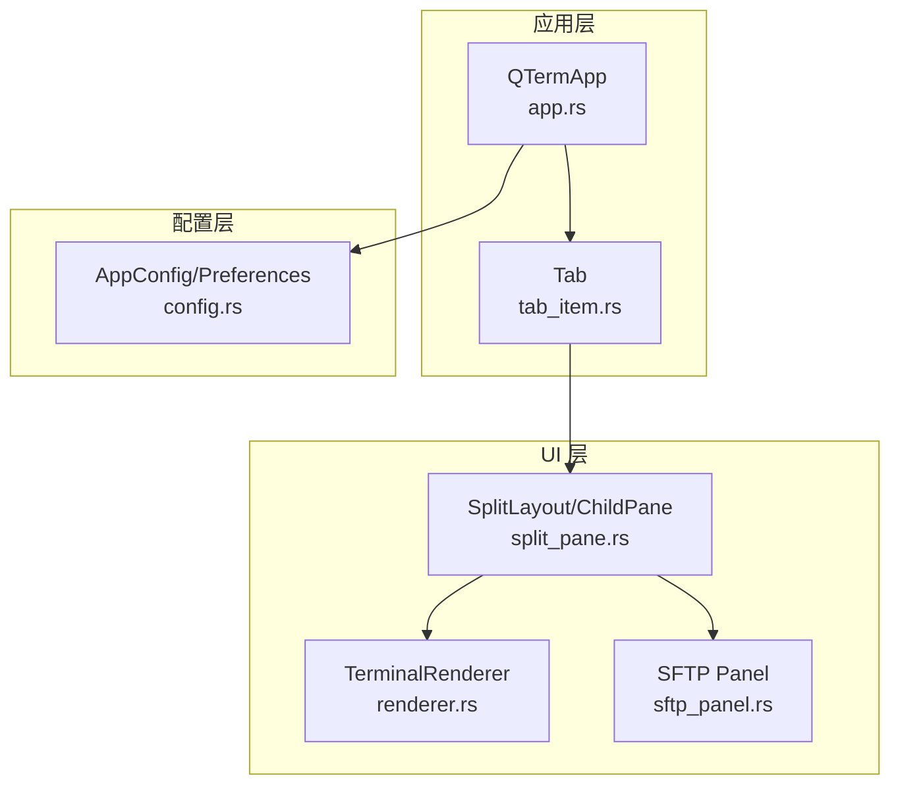
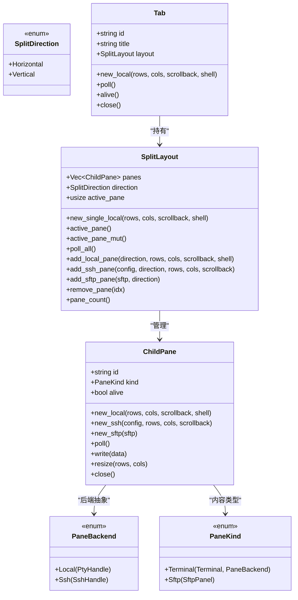
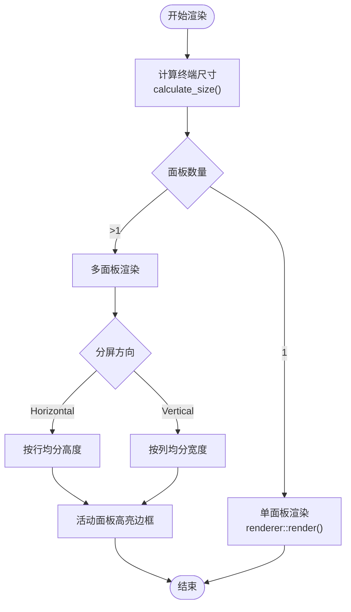
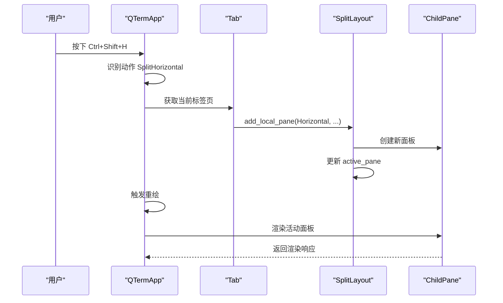
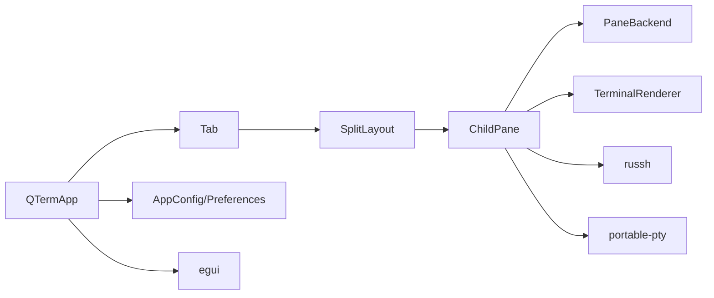

# 分屏布局管理

<cite>
**本文档引用的文件**
- [split_pane.rs](file://src/ui/split_pane.rs)
- [tab_item.rs](file://src/tab/tab_item.rs)
- [app.rs](file://src/app.rs)
- [renderer.rs](file://src/terminal/renderer.rs)
- [config.rs](file://src/config.rs)
- [sftp_panel.rs](file://src/ui/sftp_panel.rs)
- [2026-05-30-phase2-ssh-split-design.md](file://docs/specs/2026-05-30-phase2-ssh-split-design.md)
- [2026-05-30-phase2-ssh-split.md](file://docs/plans/2026-05-30-phase2-ssh-split.md)
</cite>

## 目录
1. [简介](#简介)
2. [项目结构](#项目结构)
3. [核心组件](#核心组件)
4. [架构总览](#架构总览)
5. [详细组件分析](#详细组件分析)
6. [依赖关系分析](#依赖关系分析)
7. [性能考量](#性能考量)
8. [故障排查指南](#故障排查指南)
9. [结论](#结论)
10. [附录](#附录)

## 简介
本文件针对 QTerm 的分屏布局管理模块进行深入文档化，重点覆盖以下方面：
- 多面板分屏布局算法：面板分割策略、动态调整机制与布局状态管理
- 分割线拖拽交互：鼠标事件处理、边界检测与实时预览效果
- 面板焦点管理与导航：键盘快捷键支持、焦点切换算法与用户体验优化
- 布局持久化与恢复：配置存储、布局序列化与跨会话状态保持
- 布局扩展指南：新增分割模式与自定义布局行为的实现路径

## 项目结构
分屏布局管理涉及的核心模块与文件如下：
- UI 层：split_pane.rs（分屏布局与面板管理）、sftp_panel.rs（SFTP 面板 UI）
- 应用层：app.rs（UI 渲染、事件处理、快捷键映射）
- 标签页层：tab_item.rs（标签页封装与轮询）
- 终端渲染：renderer.rs（终端尺寸计算与渲染）
- 配置层：config.rs（应用配置与偏好设置）

图表来源
- [app.rs:17-206](file://src/app.rs#L17-L206)
- [split_pane.rs:151-238](file://src/ui/split_pane.rs#L151-L238)
- [renderer.rs:25-198](file://src/terminal/renderer.rs#L25-L198)
- [sftp_panel.rs:12-387](file://src/ui/sftp_panel.rs#L12-L387)
- [config.rs:37-127](file://src/config.rs#L37-L127)

章节来源
- [app.rs:17-206](file://src/app.rs#L17-L206)
- [split_pane.rs:151-238](file://src/ui/split_pane.rs#L151-L238)
- [renderer.rs:25-198](file://src/terminal/renderer.rs#L25-L198)
- [sftp_panel.rs:12-387](file://src/ui/sftp_panel.rs#L12-L387)
- [config.rs:37-127](file://src/config.rs#L37-L127)

## 核心组件
- SplitDirection：分屏方向枚举（水平/垂直）
- PaneBackend：面板后端抽象（本地 PTY 或远程 SSH）
- PaneKind：面板内容类型（终端面板或 SFTP 面板）
- ChildPane：单个面板的生命周期与数据通道管理
- SplitLayout：多面板布局管理器（面板集合、方向、活动面板索引）
- Tab：标签页封装（包含 SplitLayout）

章节来源
- [split_pane.rs:6-149](file://src/ui/split_pane.rs#L6-L149)
- [tab_item.rs:3-48](file://src/tab/tab_item.rs#L3-L48)

## 架构总览
分屏布局采用“标签页承载布局”的结构：每个标签页维护一个 SplitLayout，SplitLayout 内部管理多个 ChildPane。ChildPane 通过 PaneBackend 抽象统一了本地与远程后端的数据流，从而实现一致的终端渲染与交互体验。

图表来源
- [split_pane.rs:6-149](file://src/ui/split_pane.rs#L6-L149)
- [split_pane.rs:151-238](file://src/ui/split_pane.rs#L151-L238)
- [tab_item.rs:3-48](file://src/tab/tab_item.rs#L3-L48)

## 详细组件分析

### 分屏布局算法与状态管理
- 分割策略
  - 水平分屏：面板按行均分高度，适用于上下排列
  - 垂直分屏：面板按列均分宽度，适用于左右排列
- 动态调整机制
  - 尺寸计算：根据可用空间与字体大小计算终端行列数
  - 尺寸同步：当窗口尺寸变化时，批量调整所有面板的终端大小
- 布局状态管理
  - 活动面板索引：通过 active_pane 管理当前焦点面板
  - 面板数量上限：最多 6 个面板
  - 生命周期：面板存活状态由后端健康检查决定

图表来源
- [app.rs:411-538](file://src/app.rs#L411-L538)
- [renderer.rs:25-198](file://src/terminal/renderer.rs#L25-L198)

章节来源
- [app.rs:411-538](file://src/app.rs#L411-L538)
- [renderer.rs:25-198](file://src/terminal/renderer.rs#L25-L198)
- [split_pane.rs:159-238](file://src/ui/split_pane.rs#L159-L238)

### 面板后端与数据通道
- 本地终端（PTY）
  - 通过 PtyHandle 管理子进程与 I/O
  - 终端输出通过 reader_rx 接收，ANSI 响应通过 writer_tx 发送
- 远程终端（SSH）
  - 通过 SshHandle 管理异步会话与 I/O
  - 与 PTY 接口一致，便于统一处理
- SFTP 面板
  - 独立的 UI 组件，不参与终端渲染流程

章节来源
- [split_pane.rs:13-149](file://src/ui/split_pane.rs#L13-L149)
- [sftp_panel.rs:12-387](file://src/ui/sftp_panel.rs#L12-L387)

### 面板焦点管理与导航
- 快捷键映射
  - Ctrl+Shift+H：水平分屏
  - Ctrl+Shift+V：垂直分屏
  - Ctrl+方向键：切换活动面板
  - Ctrl+Shift+W：关闭当前面板
  - Ctrl+Shift+N：打开 SSH 连接对话框
- 焦点切换算法
  - 活动面板索引按面板总数取模循环切换
- 用户体验优化
  - 活动面板以边框高亮提示
  - 标签页标题随终端 OSC 标题自动更新

图表来源
- [app.rs:290-382](file://src/app.rs#L290-L382)
- [app.rs:342-352](file://src/app.rs#L342-L352)
- [split_pane.rs:187-221](file://src/ui/split_pane.rs#L187-L221)

章节来源
- [app.rs:254-382](file://src/app.rs#L254-L382)
- [split_pane.rs:159-238](file://src/ui/split_pane.rs#L159-L238)

### 分割线拖拽交互逻辑
- 当前实现现状
  - 分屏渲染基于等分策略，未直接暴露分割线拖拽交互
  - 活动面板通过边框高亮提示当前焦点
- 可扩展方案
  - 引入可调分割比：在 SplitLayout 中引入每面板权重数组
  - 鼠标事件处理：在面板边界区域启用拖拽捕获，计算相对权重
  - 边界检测：限制最小面板尺寸，防止布局崩溃
  - 实时预览：拖拽过程中仅更新视觉反馈，松开后提交变更
  - 状态持久化：将分割权重序列化到配置中

章节来源
- [app.rs:462-536](file://src/app.rs#L462-L536)
- [split_pane.rs:151-238](file://src/ui/split_pane.rs#L151-L238)

### 布局持久化与恢复机制
- 应用配置存储
  - AppConfig：窗口位置、尺寸、主题、字体大小、滚动缓冲等
  - 配置文件：config.ini（INI 格式），支持加载与保存
- 布局序列化
  - 设计文档建议：SplitLayout 提供 resize_all 方法，便于按比例分配尺寸
  - 扩展思路：在 AppConfig 中增加布局序列化字段，记录面板数量、方向、后端类型与关键参数
- 跨会话状态保持
  - 应用退出时保存窗口状态与主题
  - 启动时加载配置，重建标签页与布局

章节来源
- [config.rs:37-127](file://src/config.rs#L37-L127)
- [config.rs:129-143](file://src/config.rs#L129-L143)
- [app.rs:558-570](file://src/app.rs#L558-L570)
- [2026-05-30-phase2-ssh-split-design.md:72-101](file://docs/specs/2026-05-30-phase2-ssh-split-design.md#L72-L101)

### 布局扩展指南
- 新增分割模式
  - 在 SplitDirection 中添加新方向枚举值
  - 在渲染逻辑中实现新方向的等分策略
- 自定义布局行为
  - 在 SplitLayout 中添加权重数组与 resize_all 方法
  - 在 UI 中实现拖拽交互与边界检测
- 面板类型扩展
  - 在 PaneKind 中添加新面板类型
  - 在 PaneBackend 中添加对应后端变体
  - 在 ChildPane 中实现相应生命周期方法

章节来源
- [2026-05-30-phase2-ssh-split-design.md:72-101](file://docs/specs/2026-05-30-phase2-ssh-split-design.md#L72-L101)
- [split_pane.rs:6-149](file://src/ui/split_pane.rs#L6-L149)
- [split_pane.rs:151-238](file://src/ui/split_pane.rs#L151-L238)

## 依赖关系分析
- 组件耦合
  - SplitLayout 与 ChildPane 高内聚，通过枚举与结构体实现清晰职责分离
  - Tab 仅持有 SplitLayout，降低与具体渲染细节的耦合
  - QTermApp 通过 Action 枚举集中处理快捷键，便于扩展
- 外部依赖
  - egui：UI 渲染与事件处理
  - russh：SSH 连接与会话管理
  - portable-pty：本地终端后端

图表来源
- [app.rs:17-206](file://src/app.rs#L17-L206)
- [split_pane.rs:13-149](file://src/ui/split_pane.rs#L13-L149)
- [renderer.rs:25-198](file://src/terminal/renderer.rs#L25-L198)
- [config.rs:37-127](file://src/config.rs#L37-L127)

章节来源
- [app.rs:17-206](file://src/app.rs#L17-L206)
- [split_pane.rs:13-149](file://src/ui/split_pane.rs#L13-L149)
- [renderer.rs:25-198](file://src/terminal/renderer.rs#L25-L198)
- [config.rs:37-127](file://src/config.rs#L37-L127)

## 性能考量
- 渲染优化
  - 终端渲染按颜色分段绘制，减少绘制调用次数
  - 选区高亮与光标绘制采用最小必要矩形
- 数据通道
  - 本地与远程后端均采用异步通道，避免阻塞 UI 线程
- 内存占用
  - 单个 SSH 连接内存增量控制在设计目标以内

章节来源
- [renderer.rs:63-172](file://src/terminal/renderer.rs#L63-L172)
- [2026-05-30-phase2-ssh-split-design.md:156-165](file://docs/specs/2026-05-30-phase2-ssh-split-design.md#L156-L165)

## 故障排查指南
- SSH 连接失败
  - 检查主机地址、端口、用户名与认证方式
  - 查看 SSH 对话框状态信息
- 面板无法关闭
  - 确保至少保留一个面板
  - 检查面板后端是否存活
- 终端显示异常
  - 调整字体大小或窗口尺寸，触发终端重算
  - 检查主题配置是否影响渲染

章节来源
- [app.rs:544-551](file://src/app.rs#L544-L551)
- [split_pane.rs:223-232](file://src/ui/split_pane.rs#L223-L232)
- [config.rs:68-127](file://src/config.rs#L68-L127)

## 结论
QTerm 的分屏布局管理模块通过 SplitLayout 与 ChildPane 实现了灵活的多面板管理，并以 PaneBackend 抽象统一了本地与远程后端。当前实现提供了稳定的分屏渲染与焦点导航能力；未来可在分割线拖拽交互、布局权重持久化与自定义布局行为等方面进一步扩展，以满足更复杂的用户场景。

## 附录
- 设计文档要点
  - 分屏模块接口与行为规范
  - SSH 模块与分屏模块的集成方式
  - 快捷键与验证标准

章节来源
- [2026-05-30-phase2-ssh-split-design.md:1-165](file://docs/specs/2026-05-30-phase2-ssh-split-design.md#L1-L165)
- [2026-05-30-phase2-ssh-split.md:1-1116](file://docs/plans/2026-05-30-phase2-ssh-split.md#L1-L1116)