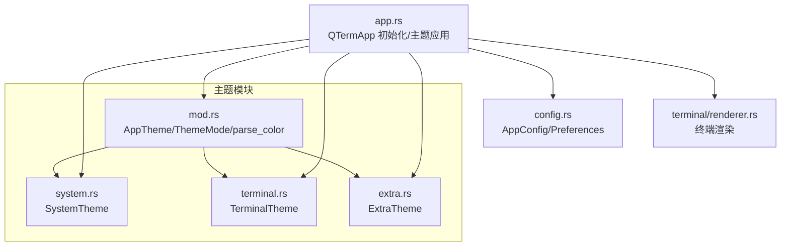
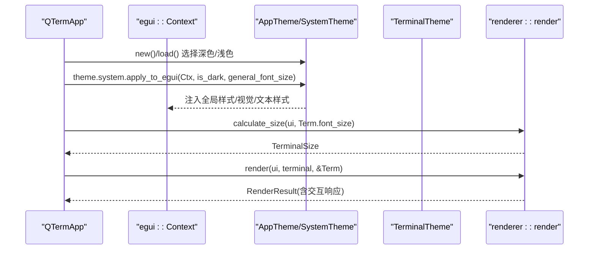
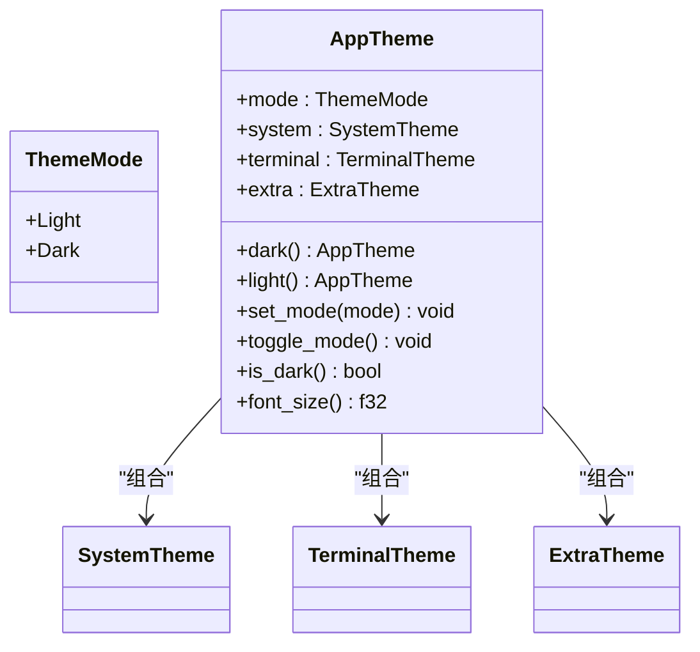
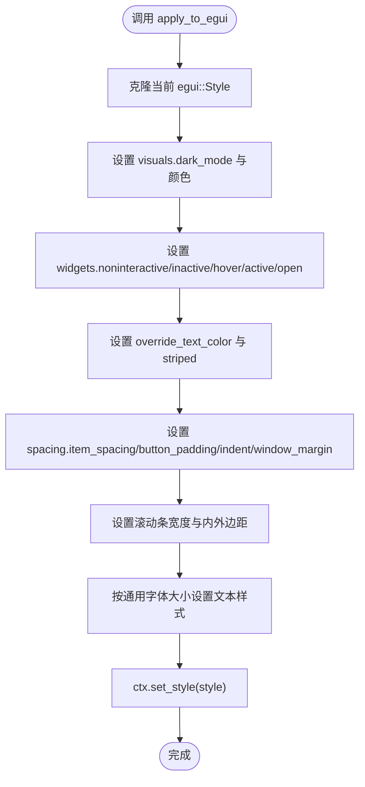
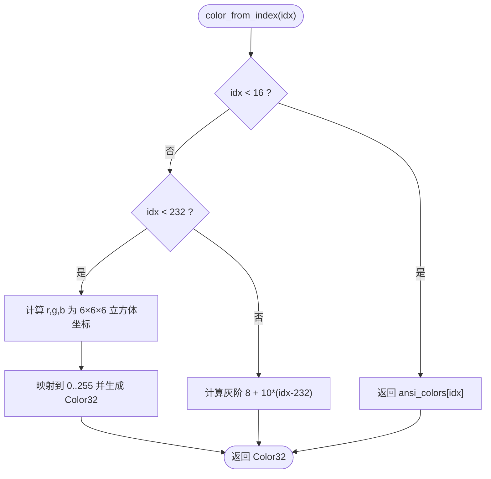
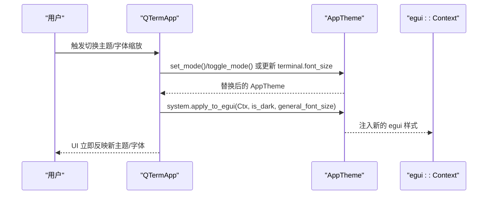
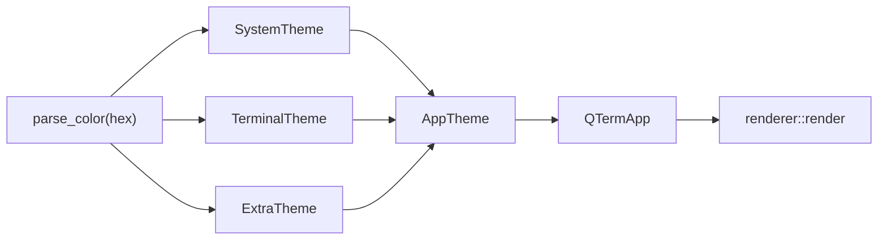

# 主题模块

<cite>
**本文引用的文件**
- [src/theme/mod.rs](file://src/theme/mod.rs)
- [src/theme/system.rs](file://src/theme/system.rs)
- [src/theme/terminal.rs](file://src/theme/terminal.rs)
- [src/theme/extra.rs](file://src/theme/extra.rs)
- [src/app.rs](file://src/app.rs)
- [src/config.rs](file://src/config.rs)
- [src/terminal/renderer.rs](file://src/terminal/renderer.rs)
- [whaleterm_主题.md](file://whaleterm_主题.md)
</cite>

## 目录
1. [简介](#简介)
2. [项目结构](#项目结构)
3. [核心组件](#核心组件)
4. [架构总览](#架构总览)
5. [详细组件分析](#详细组件分析)
6. [依赖关系分析](#依赖关系分析)
7. [性能考量](#性能考量)
8. [故障排查指南](#故障排查指南)
9. [结论](#结论)
10. [附录](#附录)

## 简介
本文件面向 QTerm 的主题模块，系统性阐述主题系统的架构设计、数据结构、切换机制与与 UI 组件的集成方式，并提供扩展指南。主题系统采用三层结构：系统主题（SystemTheme，负责 egui UI 控件与布局）、终端主题（TerminalTheme，负责 VT100/xterm 颜色与光标）、扩展主题（ExtraTheme，负责 SFTP 进度条、表格等非核心 UI）。通过 AppTheme 组合上述主题，并在应用启动时将系统主题注入 egui 全局样式，确保所有内置控件自动遵循主题色彩。

## 项目结构
主题模块位于 src/theme 目录，包含四个子模块与一个聚合入口：
- mod.rs：主题模式枚举、AppTheme 组合结构与颜色解析工具
- system.rs：系统主题（UI 控件、面板、弹窗、表格等）的深浅两套配色与应用到 egui 的方法
- terminal.rs：终端主题（背景、前景、光标、选区、ANSI 16 色）与 256 色映射
- extra.rs：扩展主题（标签页图标、连接状态、SFTP 进度条、表格悬停色等）

图表来源
- [src/theme/mod.rs:1-81](file://src/theme/mod.rs#L1-L81)
- [src/theme/system.rs:1-292](file://src/theme/system.rs#L1-L292)
- [src/theme/terminal.rs:1-102](file://src/theme/terminal.rs#L1-L102)
- [src/theme/extra.rs:1-66](file://src/theme/extra.rs#L1-L66)
- [src/app.rs:1-120](file://src/app.rs#L1-L120)
- [src/config.rs:1-127](file://src/config.rs#L1-L127)
- [src/terminal/renderer.rs:1-58](file://src/terminal/renderer.rs#L1-L58)

章节来源
- [src/theme/mod.rs:1-81](file://src/theme/mod.rs#L1-L81)
- [src/theme/system.rs:1-292](file://src/theme/system.rs#L1-L292)
- [src/theme/terminal.rs:1-102](file://src/theme/terminal.rs#L1-L102)
- [src/theme/extra.rs:1-66](file://src/theme/extra.rs#L1-L66)
- [src/app.rs:1-120](file://src/app.rs#L1-L120)
- [src/config.rs:1-127](file://src/config.rs#L1-L127)
- [src/terminal/renderer.rs:1-58](file://src/terminal/renderer.rs#L1-L58)

## 核心组件
- 主题模式（ThemeMode）：浅色/深色两种模式，用于统一切换系统主题与终端主题。
- AppTheme：组合结构，包含系统主题、终端主题与扩展主题，并提供创建深色/浅色实例、切换模式、查询是否深色、获取终端字体大小等方法。
- SystemTheme：定义 UI 控件的大量颜色与样式参数，提供 apply_to_egui 方法将主题注入 egui 全局样式。
- TerminalTheme：定义终端背景、前景、光标、选区以及 ANSI 16 色表；提供 color_from_index 将索引映射到 256 色。
- ExtraTheme：定义扩展 UI 的颜色，如标签页图标、连接状态、SFTP 进度条与表格悬停色等。

章节来源
- [src/theme/mod.rs:8-81](file://src/theme/mod.rs#L8-L81)
- [src/theme/system.rs:5-292](file://src/theme/system.rs#L5-L292)
- [src/theme/terminal.rs:5-102](file://src/theme/terminal.rs#L5-L102)
- [src/theme/extra.rs:5-66](file://src/theme/extra.rs#L5-L66)

## 架构总览
主题系统通过 AppTheme 在应用启动时初始化，并将系统主题应用到 egui 全局样式，使所有内置控件自动遵循主题。终端主题则在渲染终端内容时被传入，用于绘制背景、字符、选区与光标。扩展主题用于非核心 UI 组件的颜色控制。

图表来源
- [src/app.rs:60-94](file://src/app.rs#L60-L94)
- [src/theme/system.rs:158-290](file://src/theme/system.rs#L158-L290)
- [src/terminal/renderer.rs:25-58](file://src/terminal/renderer.rs#L25-L58)

章节来源
- [src/app.rs:60-94](file://src/app.rs#L60-L94)
- [src/theme/system.rs:158-290](file://src/theme/system.rs#L158-L290)
- [src/terminal/renderer.rs:25-58](file://src/terminal/renderer.rs#L25-L58)

## 详细组件分析

### AppTheme 与主题模式
- 提供 ThemeMode（浅色/深色）与 AppTheme 组合结构，包含 mode、system、terminal、extra 字段。
- 提供 dark()/light() 构造函数，分别组合对应模式的系统、终端与扩展主题。
- 提供 set_mode()/toggle_mode() 切换模式，内部通过替换整个 AppTheme 实例实现。
- 提供 is_dark() 查询当前模式，font_size() 获取终端字体大小。

图表来源
- [src/theme/mod.rs:8-81](file://src/theme/mod.rs#L8-L81)

章节来源
- [src/theme/mod.rs:8-81](file://src/theme/mod.rs#L8-L81)

### SystemTheme：系统主题与 egui 注入
- 定义 UI 控件的大量颜色参数，涵盖应用基础、头部、侧边栏、状态栏、左侧列表、内容区域、弹出层、下拉菜单、输入框、表格等。
- 提供 dark()/light() 两套默认配色。
- 提供 apply_to_egui(ctx, is_dark, general_font_size) 方法：
  - 设置 egui::Style.visuals.dark_mode
  - 设置面板/窗口/弹窗填充与描边
  - 设置阴影、选区、超链接、错误/警告颜色
  - 设置各类 egui Widget 的非交互/非活跃/悬停/按下/打开态的背景、前景、描边与圆角
  - 设置全局文本颜色与 striped 表格
  - 设置间距、滚动条宽度与边距
  - 设置文本样式（Small/Body/Monospace/Button/Heading）并按通用字体大小缩放

图表来源
- [src/theme/system.rs:158-290](file://src/theme/system.rs#L158-L290)

章节来源
- [src/theme/system.rs:5-292](file://src/theme/system.rs#L5-L292)

### TerminalTheme：终端颜色与 256 色映射
- 定义终端背景、前景、光标、选区颜色与 ANSI 16 色数组。
- 提供 dark()/light() 两套默认配色，分别对应 Solarized Dark 与 Default Light Modern。
- 提供 color_from_index(idx) 将 ANSI 索引映射到颜色：
  - 0-15：标准 16 色
  - 16-231：6×6×6 立方体（r,g,b ∈ [0..5]）
  - 232-255：24 级灰阶

图表来源
- [src/theme/terminal.rs:84-101](file://src/theme/terminal.rs#L84-L101)

章节来源
- [src/theme/terminal.rs:5-102](file://src/theme/terminal.rs#L5-L102)

### ExtraTheme：扩展主题（SFTP、表格、标签页等）
- 定义标签页图标、活动标签文字、活动状态色、终端连接状态指示灯、SFTP 进度条填充/轨道/文字/边框色、表格表头/单元格/悬停色等。
- 提供 dark()/light() 两套默认配色，与系统主题模式保持一致。

章节来源
- [src/theme/extra.rs:5-66](file://src/theme/extra.rs#L5-L66)

### 主题切换机制与状态同步
- AppTheme.set_mode(mode)：当模式变更时，通过替换整个 AppTheme 实例（dark()/light()）实现完全重建。
- AppTheme.toggle_mode()：在浅色与深色之间切换。
- 应用启动时，根据 Preferences.theme 与 AppConfig.font_size 决定初始主题与字体大小，并调用 SystemTheme.apply_to_egui 注入 egui 全局样式。
- 字体缩放：通过快捷键增加/减少字体大小，更新 AppConfig.font_size 与 AppTheme.terminal.font_size，并重新配置字体。

图表来源
- [src/theme/mod.rs:44-60](file://src/theme/mod.rs#L44-L60)
- [src/app.rs:371-380](file://src/app.rs#L371-L380)
- [src/theme/system.rs:158-290](file://src/theme/system.rs#L158-L290)

章节来源
- [src/theme/mod.rs:44-60](file://src/theme/mod.rs#L44-L60)
- [src/app.rs:371-380](file://src/app.rs#L371-L380)
- [src/theme/system.rs:158-290](file://src/theme/system.rs#L158-L290)

### 主题与 UI 组件的集成方式
- 系统主题集成：SystemTheme.apply_to_egui 将主题注入 egui 全局样式，所有 egui 内置控件（按钮、输入框、菜单等）自动使用主题颜色。
- 终端主题集成：在渲染终端内容时，将 TerminalTheme 传入 renderer::render，用于绘制背景、字符、选区与光标。
- 扩展主题集成：在 UI 渲染中直接使用 AppTheme.extra 的颜色，例如标签页图标、连接状态、SFTP 进度条与表格悬停色等。
- 颜色继承与优先级：
  - egui 内置控件：优先使用 SystemTheme.apply_to_egui 注入的全局样式。
  - 终端内容：优先使用 TerminalTheme 的颜色与映射。
  - 非核心 UI：优先使用 ExtraTheme 的颜色。
- 默认值处理：若 egui 样式中某项未显式设置，则使用 egui 默认值；SystemTheme.apply_to_egui 已覆盖常用场景。

章节来源
- [src/theme/system.rs:158-290](file://src/theme/system.rs#L158-L290)
- [src/terminal/renderer.rs:42-58](file://src/terminal/renderer.rs#L42-L58)
- [src/app.rs:400-538](file://src/app.rs#L400-L538)

### 主题配置的数据结构
- AppTheme：组合字段（mode/system/terminal/extra）
- SystemTheme：大量 UI 控件颜色与样式参数
- TerminalTheme：终端背景/前景/光标/选区与 ANSI 16 色数组
- ExtraTheme：扩展 UI 颜色（标签页、连接状态、SFTP 进度条、表格等）
- 颜色定义：使用十六进制字符串（#RRGGBB），通过 parse_color(hex) 解析为 egui::Color32
- 字体设置：TerminalTheme.font_size、font_bold；SystemTheme.apply_to_egui 还会按通用字体大小缩放文本样式

章节来源
- [src/theme/mod.rs:73-81](file://src/theme/mod.rs#L73-L81)
- [src/theme/system.rs:5-292](file://src/theme/system.rs#L5-L292)
- [src/theme/terminal.rs:5-102](file://src/theme/terminal.rs#L5-L102)
- [src/theme/extra.rs:5-66](file://src/theme/extra.rs#L5-L66)

### 主题扩展指南
- 添加新的主题变量：
  - 在对应模块（system.rs/terminal.rs/extra.rs）的结构体中新增字段，并在 dark()/light() 中赋值
  - 若为系统主题，可在 SystemTheme.apply_to_egui 中考虑将其映射到 egui::Style 的相应位置
  - 若为终端主题，确保渲染逻辑中使用该颜色
  - 若为扩展主题，确保 UI 渲染中使用该颜色
- 自定义样式规则：
  - 对于 egui 控件样式，优先通过 SystemTheme.apply_to_egui 注入全局样式
  - 对于终端内容，通过 TerminalTheme 的颜色与映射实现
  - 对于非核心 UI，通过 ExtraTheme 的颜色实现
- 与 WhaleTerm 主题规范对齐：
  - 参考 whaleterm_主题.md 中的系统/终端/笔记主题字段与默认值，确保命名与含义一致
  - 扩展主题色在 light/dark 模式下由前端硬编码选择，无需随主题切换而单独管理

章节来源
- [src/theme/system.rs:158-290](file://src/theme/system.rs#L158-L290)
- [src/theme/terminal.rs:5-102](file://src/theme/terminal.rs#L5-L102)
- [src/theme/extra.rs:5-66](file://src/theme/extra.rs#L5-L66)
- [whaleterm_主题.md:477-561](file://whaleterm_主题.md#L477-L561)

## 依赖关系分析
- AppTheme 依赖 SystemTheme/TerminalTheme/ExtraTheme
- SystemTheme 依赖 parse_color 工具函数
- TerminalTheme 依赖 parse_color 工具函数
- ExtraTheme 依赖 parse_color 工具函数
- QTermApp 在启动时依赖 Preferences/AppConfig 决定初始主题与字体，并调用 SystemTheme.apply_to_egui 注入 egui 样式
- 终端渲染依赖 TerminalTheme 的颜色与映射

图表来源
- [src/theme/mod.rs:73-81](file://src/theme/mod.rs#L73-L81)
- [src/theme/system.rs:1-4](file://src/theme/system.rs#L1-L4)
- [src/theme/terminal.rs:1-4](file://src/theme/terminal.rs#L1-L4)
- [src/theme/extra.rs:1-4](file://src/theme/extra.rs#L1-L4)
- [src/app.rs:60-94](file://src/app.rs#L60-L94)
- [src/terminal/renderer.rs:42-58](file://src/terminal/renderer.rs#L42-L58)

章节来源
- [src/theme/mod.rs:73-81](file://src/theme/mod.rs#L73-L81)
- [src/app.rs:60-94](file://src/app.rs#L60-L94)
- [src/terminal/renderer.rs:42-58](file://src/terminal/renderer.rs#L42-L58)

## 性能考量
- 主题切换通过整体替换 AppTheme 实现，简单直接，但每次切换都会触发 egui 样式重绘与终端渲染重算。在频繁切换场景下，可考虑仅更新必要字段并局部刷新。
- SystemTheme.apply_to_egui 会克隆并修改 egui::Style，随后 set_style，属于一次性的全局样式注入，成本可控。
- TerminalTheme.color_from_index 采用常数时间映射，性能优异。
- 终端渲染 calculate_size/render 会根据字体大小计算单元格尺寸并分配绘制区域，建议在窗口尺寸变化或字体变化时再触发重算。

[本节为通用性能讨论，不直接分析具体文件]

## 故障排查指南
- 主题未生效：
  - 检查 AppTheme 是否正确创建（dark()/light()），以及是否调用了 SystemTheme.apply_to_egui
  - 检查 egui::Context 是否正确传入，且在应用启动阶段调用
- 字体未变化：
  - 检查 AppConfig.font_size 与 AppTheme.terminal.font_size 是否同步更新
  - 检查是否调用了字体配置函数（如在应用中重新配置字体）
- 颜色异常：
  - 检查十六进制颜色字符串格式是否正确（#RRGGBB）
  - 检查 egui 样式是否被其他代码覆盖（例如局部 UI 自定义样式）
- 终端颜色不正确：
  - 检查 TerminalTheme.ansi_colors 与 color_from_index 的映射逻辑
  - 检查终端渲染时是否传入正确的 TerminalTheme 引用

章节来源
- [src/app.rs:60-94](file://src/app.rs#L60-L94)
- [src/theme/system.rs:158-290](file://src/theme/system.rs#L158-L290)
- [src/theme/terminal.rs:84-101](file://src/theme/terminal.rs#L84-L101)
- [src/terminal/renderer.rs:42-58](file://src/terminal/renderer.rs#L42-L58)

## 结论
QTerm 的主题系统采用清晰的三层结构与组合模式，通过 AppTheme 将系统、终端与扩展主题统一管理，并在应用启动时将系统主题注入 egui 全局样式，确保 UI 控件与终端内容均遵循同一套主题。主题切换通过整体替换实现，简洁可靠；终端颜色映射与渲染流程清晰明确。扩展主题为非核心 UI 提供了灵活的颜色控制。未来可在保持现有结构的基础上，进一步优化主题切换与渲染的局部刷新策略，以提升性能与用户体验。

[本节为总结性内容，不直接分析具体文件]

## 附录
- 主题持久化与配置：
  - AppConfig 保存窗口位置、尺寸、主题、字体大小等运行时配置
  - Preferences 从 WhaleTerm preferences.json 读取字体与主题配置
- 主题与 WhaleTerm 主题规范对齐：
  - 参考 whaleterm_主题.md 中的系统/终端/笔记主题字段与默认值，确保命名与含义一致
  - 扩展主题色在 light/dark 模式下由前端硬编码选择，无需随主题切换而单独管理

章节来源
- [src/config.rs:37-127](file://src/config.rs#L37-L127)
- [src/config.rs:206-281](file://src/config.rs#L206-L281)
- [whaleterm_主题.md:477-561](file://whaleterm_主题.md#L477-L561)