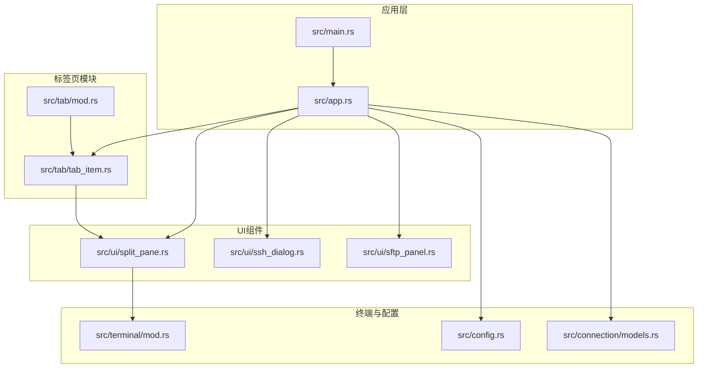
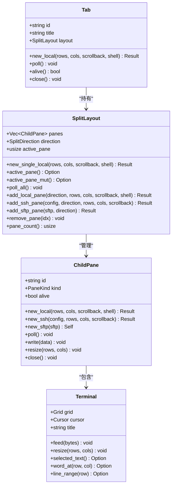
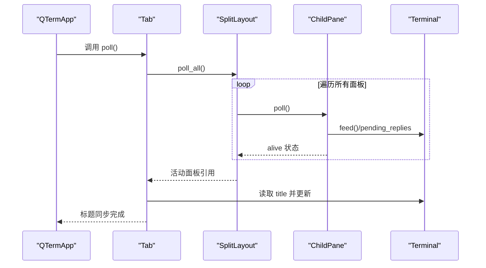
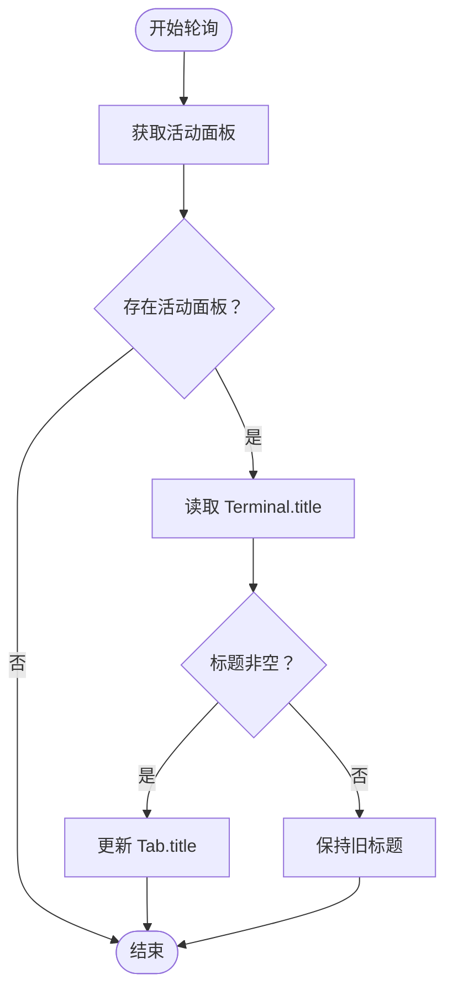
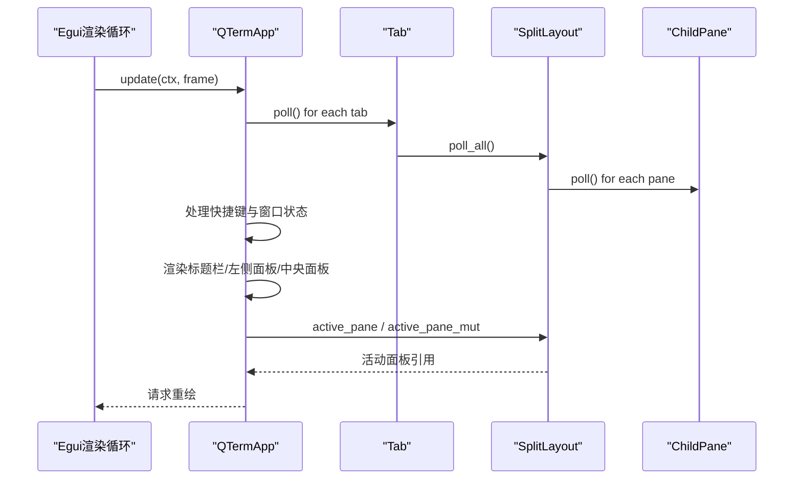
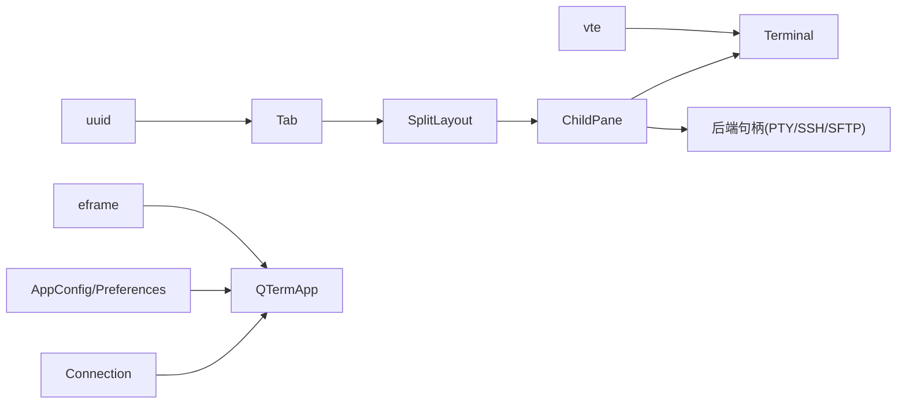

# 标签页模块

<cite>
**本文档引用的文件**
- [src/tab/mod.rs](file://src/tab/mod.rs)
- [src/tab/tab_item.rs](file://src/tab/tab_item.rs)
- [src/ui/split_pane.rs](file://src/ui/split_pane.rs)
- [src/ui/ssh_dialog.rs](file://src/ui/ssh_dialog.rs)
- [src/ui/sftp_panel.rs](file://src/ui/sftp_panel.rs)
- [src/app.rs](file://src/app.rs)
- [src/main.rs](file://src/main.rs)
- [src/terminal/mod.rs](file://src/terminal/mod.rs)
- [src/config.rs](file://src/config.rs)
- [src/connection/models.rs](file://src/connection/models.rs)
</cite>

## 目录
1. [简介](#简介)
2. [项目结构](#项目结构)
3. [核心组件](#核心组件)
4. [架构总览](#架构总览)
5. [详细组件分析](#详细组件分析)
6. [依赖关系分析](#依赖关系分析)
7. [性能考虑](#性能考虑)
8. [故障排查指南](#故障排查指南)
9. [结论](#结论)
10. [附录](#附录)

## 简介
本文件面向QTerm的标签页模块，系统性阐述标签页管理系统的架构设计与实现细节，重点覆盖以下方面：
- 标签页生命周期管理与状态同步机制
- 标签页的创建、激活、关闭与销毁流程，以及资源清理与内存管理
- 标签页标题管理：动态标题更新与状态指示器显示
- 标签页与主应用的交互方式：事件传递与状态查询
- 标签页扩展指南：如何添加新的标签页类型与自定义行为

## 项目结构
标签页模块位于src/tab目录下，核心文件为mod.rs与tab_item.rs；标签页内部采用SplitLayout进行多面板管理，涉及UI组件如split_pane.rs、ssh_dialog.rs、sftp_panel.rs；主应用在app.rs中集中管理标签页集合与交互逻辑；入口在main.rs中初始化并启动eframe渲染循环。

图表来源
- [src/tab/mod.rs:1-3](file://src/tab/mod.rs#L1-L3)
- [src/tab/tab_item.rs:1-48](file://src/tab/tab_item.rs#L1-L48)
- [src/ui/split_pane.rs:1-238](file://src/ui/split_pane.rs#L1-L238)
- [src/ui/ssh_dialog.rs:1-147](file://src/ui/ssh_dialog.rs#L1-L147)
- [src/ui/sftp_panel.rs:1-387](file://src/ui/sftp_panel.rs#L1-L387)
- [src/app.rs:1-1349](file://src/app.rs#L1-L1349)
- [src/main.rs:1-87](file://src/main.rs#L1-L87)
- [src/terminal/mod.rs:1-200](file://src/terminal/mod.rs#L1-L200)
- [src/config.rs:1-281](file://src/config.rs#L1-L281)
- [src/connection/models.rs:1-43](file://src/connection/models.rs#L1-L43)

章节来源
- [src/tab/mod.rs:1-3](file://src/tab/mod.rs#L1-L3)
- [src/tab/tab_item.rs:1-48](file://src/tab/tab_item.rs#L1-L48)
- [src/ui/split_pane.rs:1-238](file://src/ui/split_pane.rs#L1-L238)
- [src/app.rs:1-1349](file://src/app.rs#L1-L1349)
- [src/main.rs:1-87](file://src/main.rs#L1-L87)

## 核心组件
- 标签页结构体Tab：封装标签页唯一ID、标题与分屏布局管理器，负责轮询、存活检测与关闭。
- 分屏布局SplitLayout：管理多个子面板（ChildPane），支持水平/垂直分屏、活动面板切换、面板增删与轮询。
- 子面板ChildPane：承载具体面板内容（终端或SFTP），维护存活状态与生命周期。
- 终端Terminal：负责字符网格、光标、颜色属性、滚动区域、选择与ANSI解析。
- 应用主结构QTermApp：集中管理标签页集合、活动标签、配置、主题、窗口状态与UI渲染。
- UI对话框与面板：SSH对话框用于建立远程连接，SFTP面板用于文件浏览与传输。

章节来源
- [src/tab/tab_item.rs:5-48](file://src/tab/tab_item.rs#L5-L48)
- [src/ui/split_pane.rs:25-238](file://src/ui/split_pane.rs#L25-L238)
- [src/terminal/mod.rs:24-41](file://src/terminal/mod.rs#L24-L41)
- [src/app.rs:15-34](file://src/app.rs#L15-L34)

## 架构总览
标签页模块采用“标签页持有布局”的设计：每个Tab包含一个SplitLayout，SplitLayout内部管理多个ChildPane。ChildPane根据内容类型分为终端面板与SFTP面板，分别绑定本地PTY或远程SSH后端，或SFTP客户端句柄。主应用在每次渲染循环中调用Tab::poll，驱动SplitLayout::poll_all，从而实现终端输出读取、ANSI响应发送、面板存活检查与标题同步。

图表来源
- [src/tab/tab_item.rs:5-48](file://src/tab/tab_item.rs#L5-L48)
- [src/ui/split_pane.rs:151-238](file://src/ui/split_pane.rs#L151-L238)
- [src/ui/split_pane.rs:25-71](file://src/ui/split_pane.rs#L25-L71)
- [src/terminal/mod.rs:24-41](file://src/terminal/mod.rs#L24-L41)

## 详细组件分析

### 标签页生命周期管理与状态同步
- 创建：Tab::new_local通过SplitLayout::new_single_local创建单面板布局，并初始化标题为默认值。
- 轮询：Tab::poll调用layout.poll_all，逐个ChildPane执行poll，读取后端输出、处理ANSI响应、检查存活状态；同时从活动面板的Terminal读取OSC标题并更新Tab::title。
- 存活检测：Tab::alive基于SplitLayout.panes中至少一个ChildPane.alive为真。
- 关闭：Tab::close遍历所有ChildPane并调用其close，释放后端资源（本地PTY或SSH连接、SFTP会话）。
- 销毁：主应用在退出时统一调用Tab::close并保存配置，确保资源回收。

图表来源
- [src/tab/tab_item.rs:23-35](file://src/tab/tab_item.rs#L23-L35)
- [src/ui/split_pane.rs:180-185](file://src/ui/split_pane.rs#L180-L185)
- [src/ui/split_pane.rs:70-113](file://src/ui/split_pane.rs#L70-L113)

章节来源
- [src/tab/tab_item.rs:11-48](file://src/tab/tab_item.rs#L11-L48)
- [src/ui/split_pane.rs:159-185](file://src/ui/split_pane.rs#L159-L185)

### 标题管理与状态指示
- 动态标题更新：Tab::poll从活动面板的Terminal读取title字段，若非空则覆盖Tab::title，实现终端标题（如OSC标题）的实时同步。
- 状态指示：主应用在标题栏渲染时，若Tab::alive为假，则显示“已关闭”提示；否则显示实际标题。此机制通过ChildPane.alive反映后端存活状态，避免显示已死面板的标题。

图表来源
- [src/tab/tab_item.rs:25-35](file://src/tab/tab_item.rs#L25-L35)

章节来源
- [src/tab/tab_item.rs:25-35](file://src/tab/tab_item.rs#L25-L35)
- [src/app.rs:620-672](file://src/app.rs#L620-L672)

### 标签页与主应用的交互
- 事件传递：主应用在eframe::App::update中统一调用所有Tab::poll，实现标签页数据的周期性轮询；同时处理全局快捷键，触发新建标签页、关闭标签页、切换面板、打开SSH/SFTP等操作。
- 状态查询：主应用通过Tab::alive判断标签页是否存活；通过SplitLayout::pane_count与active_pane决定渲染策略；通过SplitLayout::active_pane与active_pane_mut访问当前活动面板并进行渲染与输入处理。
- UI渲染：主应用在中央面板根据面板数量与分屏方向渲染单面板或多面板布局，活动面板带有高亮边框；标题栏渲染时显示标签页卡片与关闭按钮，点击切换活动标签或关闭标签。

图表来源
- [src/app.rs:273-556](file://src/app.rs#L273-L556)
- [src/tab/tab_item.rs:23-35](file://src/tab/tab_item.rs#L23-L35)
- [src/ui/split_pane.rs:170-178](file://src/ui/split_pane.rs#L170-L178)

章节来源
- [src/app.rs:273-556](file://src/app.rs#L273-L556)
- [src/tab/tab_item.rs:23-35](file://src/tab/tab_item.rs#L23-L35)

### 标签页扩展指南
- 新增面板类型：在SplitLayout中新增面板创建方法（如add_xxx_pane），并在ChildPane::new_xxx中创建对应内容与后端；在ChildPane::poll中处理该类型特有的轮询逻辑与存活检测。
- 新增标签页类型：在Tab中新增工厂方法，创建包含特定SplitLayout配置的新标签页；在主应用中增加快捷键或UI入口以触发创建。
- 自定义行为：通过SplitLayout的active_pane与active_pane_mut访问当前面板，实现自定义输入处理、尺寸调整或状态同步逻辑；在ChildPane::write与resize中对接后端能力。

章节来源
- [src/ui/split_pane.rs:159-238](file://src/ui/split_pane.rs#L159-L238)
- [src/tab/tab_item.rs:11-21](file://src/tab/tab_item.rs#L11-L21)
- [src/app.rs:334-382](file://src/app.rs#L334-L382)

## 依赖关系分析
- 模块耦合：Tab依赖SplitLayout；SplitLayout依赖ChildPane；ChildPane依赖Terminal与后端句柄（PtyHandle/SshHandle/SftpHandle）；主应用依赖Tab与UI组件。
- 外部依赖：UUID用于生成唯一ID；eframe用于UI框架；vte用于ANSI解析；配置与连接信息来自外部文件。
- 潜在风险：ChildPane的alive状态直接影响Tab::alive与UI显示；若后端异常未正确设置alive=false，可能导致UI显示异常或资源泄漏。

图表来源
- [src/tab/tab_item.rs:17-18](file://src/tab/tab_item.rs#L17-L18)
- [src/app.rs:1-10](file://src/app.rs#L1-L10)
- [src/terminal/mod.rs:69-74](file://src/terminal/mod.rs#L69-L74)
- [src/config.rs:39-66](file://src/config.rs#L39-L66)
- [src/connection/models.rs:31-43](file://src/connection/models.rs#L31-L43)

章节来源
- [src/tab/tab_item.rs:1-48](file://src/tab/tab_item.rs#L1-L48)
- [src/ui/split_pane.rs:1-238](file://src/ui/split_pane.rs#L1-L238)
- [src/app.rs:1-1349](file://src/app.rs#L1-L1349)

## 性能考虑
- 轮询频率：主应用每帧调用Tab::poll，SplitLayout::poll_all遍历所有面板，建议控制面板数量上限（当前限制为6），避免过多轮询导致CPU占用。
- I/O处理：ChildPane::poll中对PTY/SSH的读取采用非阻塞接收，ANSI响应批量发送，有助于降低阻塞风险。
- 渲染优化：主应用根据面板数量与分屏方向计算目标行列数，避免频繁调整终端尺寸；活动面板高亮边框仅在渲染时设置，减少样式变更成本。
- 内存管理：ChildPane::close统一释放后端资源，Tab::close遍历关闭所有面板，确保无残留句柄；主应用退出时统一关闭所有标签页并保存配置。

[本节为通用性能讨论，不直接分析具体文件]

## 故障排查指南
- 标签页标题不更新：确认Tab::poll被调用且活动面板存在；检查Terminal::title是否被后端正确设置；验证SplitLayout::active_pane与active_pane_mut的索引一致性。
- 标签页无法关闭：检查Tab::close是否遍历所有ChildPane并调用其close；确认ChildPane::close对后端句柄的释放逻辑正常。
- 面板存活状态异常：检查ChildPane::poll中后端alive检测逻辑（如PTY/SSH/SFTP的is_alive）；确保错误状态能正确设置alive=false。
- SSH/SFTP面板问题：确认SshDialog与SftpPanel的状态与事件处理正常；检查主应用中result传递与错误反馈逻辑。

章节来源
- [src/tab/tab_item.rs:42-47](file://src/tab/tab_item.rs#L42-L47)
- [src/ui/split_pane.rs:136-148](file://src/ui/split_pane.rs#L136-L148)
- [src/ui/split_pane.rs:89-102](file://src/ui/split_pane.rs#L89-L102)
- [src/ui/ssh_dialog.rs:115-147](file://src/ui/ssh_dialog.rs#L115-L147)
- [src/ui/sftp_panel.rs:51-110](file://src/ui/sftp_panel.rs#L51-L110)

## 结论
标签页模块通过“标签页持有布局”的架构，实现了灵活的多面板管理与统一的生命周期控制。Tab::poll驱动SplitLayout::poll_all，确保终端输出、ANSI响应与标题同步的及时性；ChildPane的alive状态为UI提供了可靠的存活指示。主应用集中处理事件与渲染，形成清晰的职责边界。扩展新面板类型与自定义行为只需遵循现有接口与生命周期约定即可安全集成。

[本节为总结性内容，不直接分析具体文件]

## 附录
- 快捷键与操作映射：主应用中定义了新建标签页、关闭标签页、切换标签页、分屏、切换面板、关闭面板、打开SSH对话框、打开SFTP、切换左侧面板、字体缩放等快捷键与动作。
- 配置与主题：AppConfig与Preferences分别负责运行时配置与WhaleTerm偏好设置的加载与保存；主应用在启动时应用字体与主题设置。
- 连接管理：从WhaleTerm的connections.json加载连接列表，支持双击打开SSH会话。

章节来源
- [src/app.rs:254-269](file://src/app.rs#L254-L269)
- [src/app.rs:57-94](file://src/app.rs#L57-L94)
- [src/config.rs:68-127](file://src/config.rs#L68-L127)
- [src/config.rs:239-281](file://src/config.rs#L239-L281)
- [src/connection/models.rs:31-43](file://src/connection/models.rs#L31-L43)