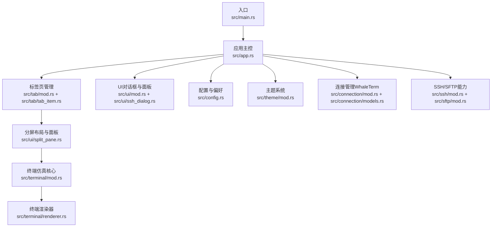
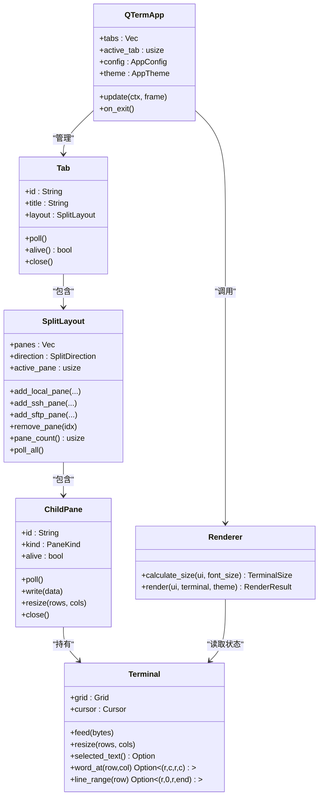
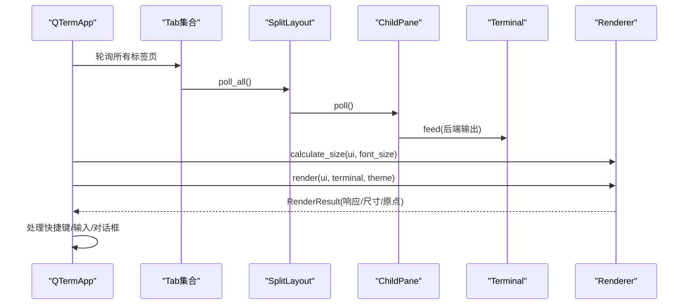
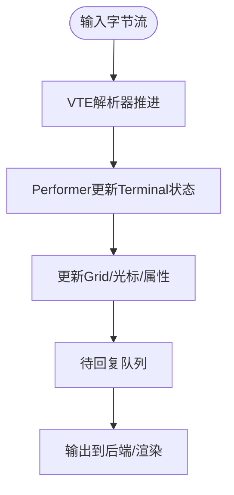
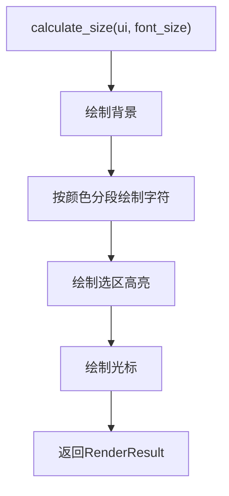
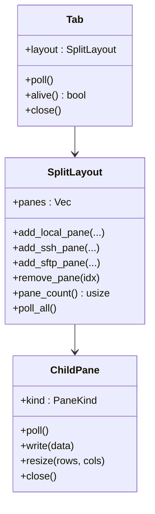
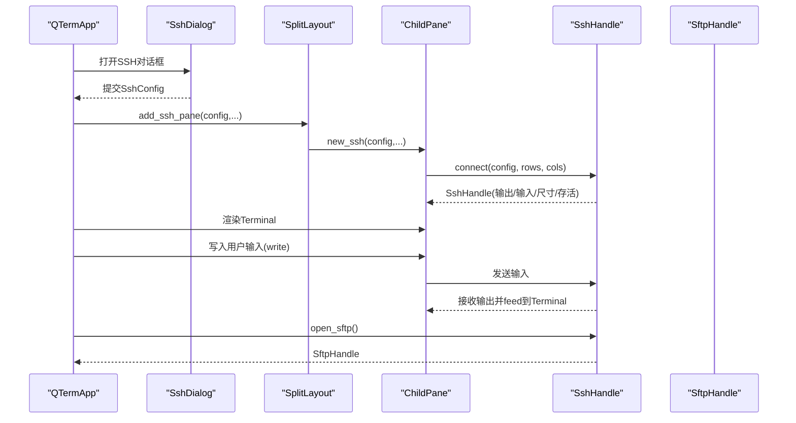
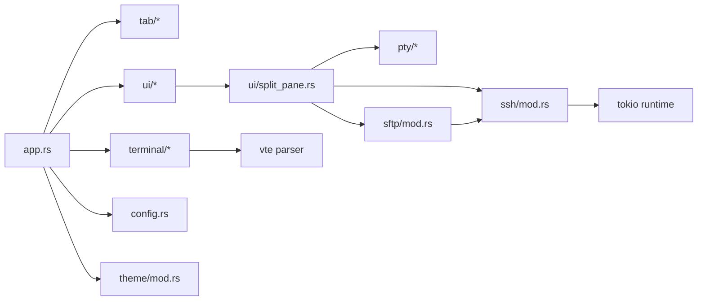

# 模块化架构设计

<cite>
**本文引用的文件**
- [main.rs](file://src/main.rs)
- [app.rs](file://src/app.rs)
- [config.rs](file://src/config.rs)
- [terminal/mod.rs](file://src/terminal/mod.rs)
- [terminal/renderer.rs](file://src/terminal/renderer.rs)
- [ui/mod.rs](file://src/ui/mod.rs)
- [ui/split_pane.rs](file://src/ui/split_pane.rs)
- [ui/ssh_dialog.rs](file://src/ui/ssh_dialog.rs)
- [tab/mod.rs](file://src/tab/mod.rs)
- [tab/tab_item.rs](file://src/tab/tab_item.rs)
- [connection/mod.rs](file://src/connection/mod.rs)
- [connection/models.rs](file://src/connection/models.rs)
- [ssh/mod.rs](file://src/ssh/mod.rs)
- [sftp/mod.rs](file://src/sftp/mod.rs)
- [theme/mod.rs](file://src/theme/mod.rs)
</cite>

## 目录
1. [简介](#简介)
2. [项目结构](#项目结构)
3. [核心组件](#核心组件)
4. [架构总览](#架构总览)
5. [详细组件分析](#详细组件分析)
6. [依赖分析](#依赖分析)
7. [性能考量](#性能考量)
8. [故障排查指南](#故障排查指南)
9. [结论](#结论)
10. [附录](#附录)

## 简介
本文件面向QTerm模块化架构设计，系统性阐述src目录下功能模块的组织原则、MVC模式在项目中的落地实践、模块间接口设计与数据传递协议、解耦策略（依赖注入、接口抽象、事件驱动通信），以及扩展与兼容性维护指南。目标是帮助开发者快速理解系统结构、高效定位问题并安全地进行功能扩展。

## 项目结构
QTerm采用“按功能域分层”的模块组织方式，核心模块围绕“应用主控（App）—视图（Renderer）—模型（Terminal）”的MVC分层展开，并通过UI、连接、主题、PTY/SSH/SFTP等子系统实现横向能力扩展。入口位于main.rs，应用主控在eframe生命周期中协调各模块；终端仿真核心位于terminal子模块；UI交互与布局由ui子模块负责；连接与配置由connection与config模块提供；ssh与sftp模块提供网络能力；theme模块统一视觉风格。

图表来源
- [main.rs:51-87](file://src/main.rs#L51-L87)
- [app.rs:68-105](file://src/app.rs#L68-L105)
- [tab/mod.rs:1-3](file://src/tab/mod.rs#L1-L3)
- [tab/tab_item.rs:11-48](file://src/tab/tab_item.rs#L11-L48)
- [ui/split_pane.rs:132-209](file://src/ui/split_pane.rs#L132-L209)
- [terminal/mod.rs:24-41](file://src/terminal/mod.rs#L24-L41)
- [terminal/renderer.rs:42-198](file://src/terminal/renderer.rs#L42-L198)
- [ui/mod.rs:1-4](file://src/ui/mod.rs#L1-L4)
- [ui/ssh_dialog.rs:39-132](file://src/ui/ssh_dialog.rs#L39-L132)
- [config.rs:37-127](file://src/config.rs#L37-L127)
- [theme/mod.rs:14-71](file://src/theme/mod.rs#L14-L71)
- [connection/mod.rs:30-59](file://src/connection/mod.rs#L30-L59)
- [ssh/mod.rs:18-136](file://src/ssh/mod.rs#L18-L136)
- [sftp/mod.rs:7-115](file://src/sftp/mod.rs#L7-L115)

章节来源
- [main.rs:1-87](file://src/main.rs#L1-L87)
- [app.rs:16-105](file://src/app.rs#L16-L105)

## 核心组件
- 应用主控（App）
  - 职责：管理窗口状态、标签页集合、主题与字体、全局快捷键、UI渲染与事件处理、配置持久化。
  - 关键点：实现eframe::App生命周期，集中调度标签页轮询、尺寸计算与渲染、对话框状态、窗口位置与大小保存。
- 视图（Renderer）
  - 职责：将Terminal网格渲染为egui绘制元素，支持选区高亮、光标绘制、背景与前景色解析。
  - 关键点：根据可用空间计算行列数，按颜色分段绘制文本，优化绘制性能。
- 模型（Terminal）
  - 职责：维护字符网格、光标、颜色属性、滚动区域、选择范围、ANSI解析与响应队列。
  - 关键点：通过VTE解析器处理字节流，提供选词、选行、备用屏幕等终端语义。

章节来源
- [app.rs:16-105](file://src/app.rs#L16-L105)
- [terminal/mod.rs:24-200](file://src/terminal/mod.rs#L24-L200)
- [terminal/renderer.rs:7-198](file://src/terminal/renderer.rs#L7-L198)

## 架构总览
QTerm遵循MVC模式：
- Model（模型）：terminal子模块封装终端状态与解析逻辑。
- View（视图）：terminal/renderer负责将模型渲染为UI元素。
- Controller（控制器）：app.rs作为应用控制器，协调模型与视图，处理输入、布局与状态持久化。

图表来源
- [app.rs:16-105](file://src/app.rs#L16-L105)
- [tab/tab_item.rs:3-48](file://src/tab/tab_item.rs#L3-L48)
- [ui/split_pane.rs:132-209](file://src/ui/split_pane.rs#L132-L209)
- [terminal/mod.rs:24-200](file://src/terminal/mod.rs#L24-L200)
- [terminal/renderer.rs:25-198](file://src/terminal/renderer.rs#L25-L198)

## 详细组件分析

### 应用主控（App）与生命周期
- 生命周期
  - 初始化：加载配置与偏好，设置字体与主题，创建首个本地标签页。
  - 更新：轮询标签页数据，处理全局快捷键，渲染标题栏、左侧面板、中央终端区域，处理对话框与输入事件。
  - 退出：保存窗口状态与主题，关闭所有标签页。
- 关键流程
  - 快捷键映射与动作执行（新建/关闭标签页、分屏、切换面板、打开SSH/SFTP、字体缩放、切换左侧面板）。
  - 终端区域渲染：根据分屏方向与面板数量计算目标行列数，逐面板渲染并收集鼠标交互信息。
  - 对话框处理：SSH对话框提交后，尝试在活动标签页添加SSH面板。

图表来源
- [app.rs:284-575](file://src/app.rs#L284-L575)
- [ui/split_pane.rs:156-160](file://src/ui/split_pane.rs#L156-L160)
- [terminal/renderer.rs:25-198](file://src/terminal/renderer.rs#L25-L198)

章节来源
- [app.rs:68-105](file://src/app.rs#L68-L105)
- [app.rs:284-575](file://src/app.rs#L284-L575)

### 终端仿真器（Model）
- 数据结构
  - Terminal：包含Grid、Cursor、颜色属性、滚动区域、选择范围、VTE解析器与待回复队列。
  - Selection：标准化选择范围，提供选词与选行辅助。
- 处理逻辑
  - feed：遍历字节，交由VTE解析器与Performer更新终端状态。
  - resize：重设网格尺寸并校正光标位置。
  - 选择与语义：提供选中文本、单词范围、行范围等查询。

图表来源
- [terminal/mod.rs:65-74](file://src/terminal/mod.rs#L65-L74)

章节来源
- [terminal/mod.rs:24-200](file://src/terminal/mod.rs#L24-L200)

### 终端渲染器（View）
- 计算尺寸：根据字体度量与可用空间计算行列数与单元格尺寸。
- 绘制策略：按颜色分段批量绘制文本，减少绘制调用；绘制选区背景与文本；绘制光标及其强调字符。
- 输出：返回RenderResult，供控制器处理鼠标交互。

图表来源
- [terminal/renderer.rs:25-198](file://src/terminal/renderer.rs#L25-L198)

章节来源
- [terminal/renderer.rs:25-198](file://src/terminal/renderer.rs#L25-L198)

### 标签页与分屏布局（Controller）
- Tab：封装SplitLayout，负责轮询、标题同步与生命周期管理。
- SplitLayout：管理多个ChildPane，支持本地/SSH/SFTP三种后端，提供增删改查与轮询。
- ChildPane：统一Terminal与后端（PTY/SSH）交互，负责数据读写、尺寸调整与存活检测。

图表来源
- [tab/tab_item.rs:3-48](file://src/tab/tab_item.rs#L3-L48)
- [ui/split_pane.rs:132-209](file://src/ui/split_pane.rs#L132-L209)

章节来源
- [tab/tab_item.rs:11-48](file://src/tab/tab_item.rs#L11-L48)
- [ui/split_pane.rs:28-130](file://src/ui/split_pane.rs#L28-L130)

### SSH与SFTP（网络能力）
- SSH
  - SshConfig：主机、端口、用户名、认证方式（密码/私钥）、超时。
  - SshHandle：封装输出通道、输入发送、尺寸调整、存活标志与russh客户端句柄；提供connect/write/resize/is_alive/disconnect/open_sftp。
  - 全局Tokio运行时：懒初始化，供SSH会话与SFTP任务使用。
- SFTP
  - SftpHandle：事件通道与命令通道，封装list/upload/download/mkdir/delete/disconnect/poll/is_alive。
  - 后台任务：通过共享SSH句柄打开SFTP子系统，循环处理命令并上报事件。

图表来源
- [ssh/mod.rs:68-136](file://src/ssh/mod.rs#L68-L136)
- [sftp/mod.rs:46-115](file://src/sftp/mod.rs#L46-L115)
- [ui/split_pane.rs:41-51](file://src/ui/split_pane.rs#L41-L51)
- [ui/ssh_dialog.rs:104-131](file://src/ui/ssh_dialog.rs#L104-L131)

章节来源
- [ssh/mod.rs:18-136](file://src/ssh/mod.rs#L18-L136)
- [sftp/mod.rs:7-115](file://src/sftp/mod.rs#L7-L115)

### 配置与主题（基础设施）
- 配置（AppConfig/Preferences）
  - AppConfig：窗口位置/尺寸/最大化、字体大小、回滚行数、主题、Shell路径等运行时配置；提供INI文件读写。
  - Preferences：从WhaleTerm preferences.json读取字体与主题偏好，用于初始化egui字体系统与主题。
- 主题（AppTheme/System/Terminal/Extra）
  - AppTheme组合系统主题、终端主题与扩展主题，支持浅色/深色切换与应用到egui上下文。

章节来源
- [config.rs:37-127](file://src/config.rs#L37-L127)
- [config.rs:206-281](file://src/config.rs#L206-L281)
- [theme/mod.rs:14-71](file://src/theme/mod.rs#L14-L71)

### 连接管理（WhaleTerm集成）
- 从WhaleTerm connections.json加载连接，解密密码（AES-256-CFB），派生密钥（主板序列号或回退密钥），生成扁平连接列表供UI使用。

章节来源
- [connection/mod.rs:30-59](file://src/connection/mod.rs#L30-L59)
- [connection/models.rs:31-43](file://src/connection/models.rs#L31-L43)

## 依赖分析
- 模块内聚与耦合
  - app.rs对tab、terminal/renderer、theme、ui、config有直接依赖，体现控制器职责。
  - terminal与renderer强内聚，通过公共API（TerminalSize/RenderResult）对外暴露。
  - ui/split_pane.rs对pty/ssh/sftp抽象统一为PaneBackend/PaneKind，降低上层复杂度。
  - ssh/sftp模块通过通道与共享句柄解耦，避免直接耦合UI。
- 外部依赖
  - egui/eframe：UI框架与生命周期。
  - vte：ANSI转义序列解析。
  - tokio/russh：异步SSH会话与SFTP子系统。
  - serde/serde_json：配置与连接文件解析。
- 潜在环依赖
  - 未发现直接环依赖；ssh/sftp通过共享句柄与通道间接协作，属于事件驱动通信。

图表来源
- [app.rs:16-105](file://src/app.rs#L16-L105)
- [ui/split_pane.rs:1-209](file://src/ui/split_pane.rs#L1-L209)
- [ssh/mod.rs:1-136](file://src/ssh/mod.rs#L1-L136)
- [sftp/mod.rs:1-238](file://src/sftp/mod.rs#L1-L238)

章节来源
- [app.rs:16-105](file://src/app.rs#L16-L105)
- [ui/split_pane.rs:1-209](file://src/ui/split_pane.rs#L1-L209)

## 性能考量
- 绘制优化
  - 按颜色分段绘制文本，减少绘制调用次数。
  - 仅在非默认背景色处绘制背景矩形，避免全量填充。
- 事件与轮询
  - ChildPane::poll采用非阻塞接收，避免阻塞UI线程。
  - SSH/SFTP使用通道与共享句柄，后台任务独立运行。
- 字体与尺寸
  - 通过egui字体度量计算单元格尺寸，避免硬编码导致的布局抖动。
- 建议
  - 对超长行文本可考虑分块绘制或延迟绘制策略。
  - 在高频输入场景下，可限制通道容量与背压策略，防止内存膨胀。

## 故障排查指南
- SSH连接失败
  - 检查SshConfig字段（host/port/username/auth）与超时设置。
  - 查看SshError错误信息（连接/认证/通道）。
  - 确认全局Tokio运行时可用且会话未提前结束。
- SFTP操作异常
  - 检查SftpEvent错误事件与命令返回结果。
  - 确认SFTP子系统已在SSH通道上正确打开。
- 终端渲染异常
  - 检查calculate_size计算结果与可用空间。
  - 确认字体已正确加载，颜色解析函数返回有效颜色。
- 配置与主题
  - 若字体缺失，确认Preferences与find_font_paths逻辑。
  - 主题切换后需重新应用到egui上下文。

章节来源
- [ssh/mod.rs:35-53](file://src/ssh/mod.rs#L35-L53)
- [sftp/mod.rs:23-33](file://src/sftp/mod.rs#L23-L33)
- [terminal/renderer.rs:25-40](file://src/terminal/renderer.rs#L25-L40)
- [config.rs:109-171](file://src/config.rs#L109-L171)

## 结论
QTerm通过清晰的模块划分与MVC分层实现了良好的可维护性与扩展性。控制器（App）集中编排，模型（Terminal）专注状态与解析，视图（Renderer）负责渲染，UI与网络能力通过抽象接口解耦。建议在新增功能时遵循现有接口风格与事件驱动范式，确保与既有模块的兼容性。

## 附录

### MVC职责与交互清单
- 控制器（App）
  - 输入处理、全局快捷键、窗口状态、标签页管理、对话框状态、配置持久化。
- 视图（Renderer）
  - 尺寸计算、绘制优化、选区与光标渲染、鼠标交互响应。
- 模型（Terminal）
  - ANSI解析、网格更新、选择与语义查询、备用屏幕切换。

章节来源
- [app.rs:284-575](file://src/app.rs#L284-L575)
- [terminal/renderer.rs:25-198](file://src/terminal/renderer.rs#L25-L198)
- [terminal/mod.rs:65-200](file://src/terminal/mod.rs#L65-L200)

### 模块扩展指南
- 添加新功能模块
  - 定义领域模型与公共API，尽量保持与现有接口一致（如通道/句柄模式）。
  - 在UI层通过抽象（如PaneKind）接入，避免直接修改App渲染逻辑。
  - 使用事件驱动通信，避免强耦合。
- 维护兼容性
  - 保持配置项与主题字段的向后兼容，必要时提供默认值。
  - 对外暴露的错误类型应稳定，避免破坏调用方的错误处理分支。
  - 新增模块尽量复用现有通道与运行时，减少外部依赖。