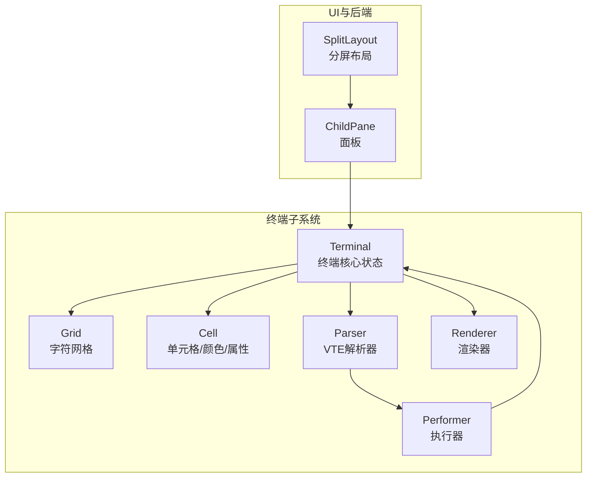
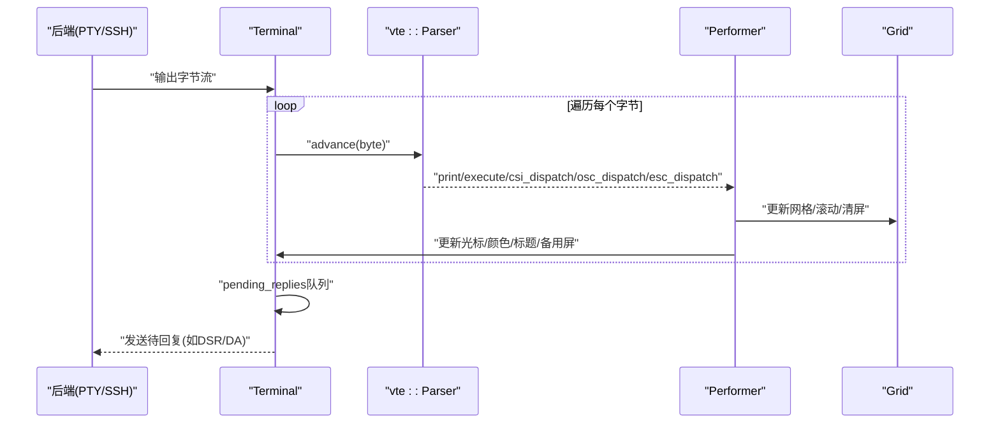
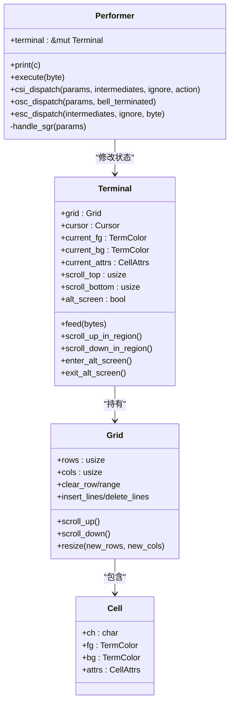
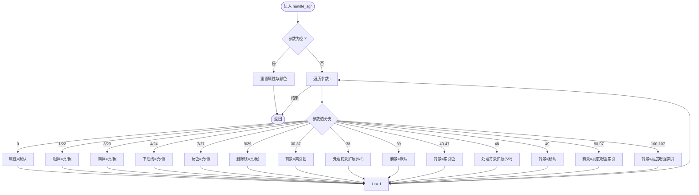
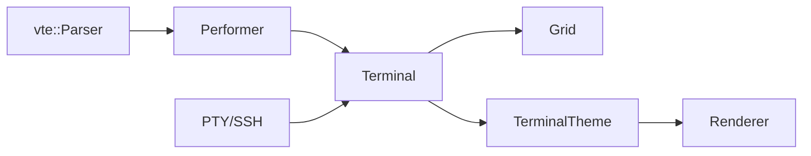

# VTE解析器

<cite>
**本文引用的文件**
- [parser.rs](file://src/terminal/parser.rs)
- [mod.rs](file://src/terminal/mod.rs)
- [grid.rs](file://src/terminal/grid.rs)
- [cell.rs](file://src/terminal/cell.rs)
- [renderer.rs](file://src/terminal/renderer.rs)
- [split_pane.rs](file://src/ui/split_pane.rs)
- [tab_item.rs](file://src/tab/tab_item.rs)
- [Cargo.toml](file://Cargo.toml)
</cite>

## 目录
1. [简介](#简介)
2. [项目结构](#项目结构)
3. [核心组件](#核心组件)
4. [架构总览](#架构总览)
5. [详细组件分析](#详细组件分析)
6. [依赖分析](#依赖分析)
7. [性能考量](#性能考量)
8. [故障排查指南](#故障排查指南)
9. [结论](#结论)
10. [附录：扩展指南](#附录扩展指南)

## 简介
本文件面向QTerm项目的VTE（虚拟终端仿真器）解析器，系统性阐述其ANSI转义序列识别与处理机制、状态机设计、控制序列处理实现（光标移动、文本属性、清屏、颜色控制等），以及Performer结构体如何将解析结果映射为终端状态变更。同时提供扩展指南，帮助开发者添加新的控制序列与自定义终端功能。

## 项目结构
QTerm采用模块化组织，终端相关代码集中在src/terminal目录，UI与后端集成位于src/ui与src/tab等目录。VTE解析器位于src/terminal/parser.rs，终端核心状态位于src/terminal/mod.rs，网格与单元格位于src/terminal/grid.rs与src/terminal/cell.rs，渲染位于src/terminal/renderer.rs，UI集成位于src/ui/split_pane.rs与src/tab/tab_item.rs，依赖vte库通过Cargo.toml声明。

**图表来源**
- [mod.rs:24-41](file://src/terminal/mod.rs#L24-L41)
- [parser.rs:4-8](file://src/terminal/parser.rs#L4-L8)
- [grid.rs:5-14](file://src/terminal/grid.rs#L5-L14)
- [cell.rs:5-53](file://src/terminal/cell.rs#L5-L53)
- [renderer.rs:42-180](file://src/terminal/renderer.rs#L42-L180)
- [split_pane.rs:151-157](file://src/ui/split_pane.rs#L151-L157)

**章节来源**
- [Cargo.toml:8-12](file://Cargo.toml#L8-L12)
- [mod.rs:1-41](file://src/terminal/mod.rs#L1-L41)

## 核心组件
- VTE解析器与执行器
  - 解析器：基于vte::Parser逐字节推进，识别转义序列并回调执行器。
  - 执行器：实现vte::Perform接口，把解析结果映射为终端状态变更（光标、颜色、滚动、屏幕等）。
- 终端核心状态
  - Terminal：维护Grid、光标、颜色属性、滚动区域、标题、备用屏幕、待回复队列等。
- 网格与单元格
  - Grid：二维字符矩阵与回滚缓冲区；提供滚动、插入/删除行、清屏等操作。
  - Cell：字符、前景/背景色、显示属性（粗体、斜体、下划线、删除线、反色）。
- 渲染器
  - 根据Terminal状态绘制背景、文本、选区与光标，支持反色与颜色索引映射。
- UI集成
  - SplitLayout/ChildPane：管理本地或SSH后端的终端面板，轮询输出并调用Terminal.feed进行解析。

**章节来源**
- [parser.rs:4-8](file://src/terminal/parser.rs#L4-L8)
- [parser.rs:10-233](file://src/terminal/parser.rs#L10-L233)
- [mod.rs:24-41](file://src/terminal/mod.rs#L24-L41)
- [grid.rs:5-14](file://src/terminal/grid.rs#L5-L14)
- [cell.rs:5-53](file://src/terminal/cell.rs#L5-L53)
- [renderer.rs:42-180](file://src/terminal/renderer.rs#L42-L180)
- [split_pane.rs:70-113](file://src/ui/split_pane.rs#L70-L113)

## 架构总览
VTE解析流程：后端（PTY/SSH）输出字节流 → Terminal.feed逐字节交给vte::Parser → Parser回调Performer → Performer修改Terminal状态 → Renderer读取Terminal状态进行绘制。

**图表来源**
- [mod.rs:65-74](file://src/terminal/mod.rs#L65-L74)
- [parser.rs:10-233](file://src/terminal/parser.rs#L10-L233)
- [split_pane.rs:70-113](file://src/ui/split_pane.rs#L70-L113)

## 详细组件分析

### VTE解析器与执行器（Performer）
Performer实现了vte::Perform接口，负责：
- print：在光标处写入字符，自动换行与滚动。
- execute：处理控制字符（退格、制表、换行、回车）。
- csi_dispatch：处理CSI序列（光标移动、清屏、滚动、颜色、私有模式等）。
- osc_dispatch：处理OSC序列（主要设置标题）。
- esc_dispatch：处理ESC序列（保存/恢复光标、索引/反向索引、全复位）。
- handle_sgr：处理SGR序列（文本属性与前景/背景色）。

**图表来源**
- [parser.rs:4-8](file://src/terminal/parser.rs#L4-L8)
- [parser.rs:10-233](file://src/terminal/parser.rs#L10-L233)
- [mod.rs:24-41](file://src/terminal/mod.rs#L24-L41)
- [grid.rs:5-14](file://src/terminal/grid.rs#L5-L14)
- [cell.rs:55-75](file://src/terminal/cell.rs#L55-L75)

**章节来源**
- [parser.rs:10-233](file://src/terminal/parser.rs#L10-L233)
- [mod.rs:43-135](file://src/terminal/mod.rs#L43-L135)

### ANSI转义序列处理要点
- 可打印字符与控制字符
  - print：光标右移、自动换行、滚动、写入当前字符与颜色属性。
  - execute：退格、制表、换行、回车等控制行为。
- CSI序列（控制序列引入器）
  - 光标移动：A/B/C/D、H/f、G、d。
  - 清屏与行清：J、K。
  - 插入/删除行：L、M。
  - 滚动：S（向上）、T（向下）。
  - 滚动区域设置：r。
  - 私有模式：h/l（如光标可见、备用屏）。
  - 颜色与属性：m（SGR）。
  - 查询与报告：n（DSR）、c（DA）。
- ESC序列
  - 保存/恢复光标：7/8。
  - 索引/反向索引：D/M。
  - 全复位：c。
- OSC序列
  - 标题设置：0/1/2。

**章节来源**
- [parser.rs:12-61](file://src/terminal/parser.rs#L12-L61)
- [parser.rs:63-173](file://src/terminal/parser.rs#L63-L173)
- [parser.rs:175-193](file://src/terminal/parser.rs#L175-L193)
- [parser.rs:195-228](file://src/terminal/parser.rs#L195-L228)

### SGR（选择图形再现）序列处理
handle_sgr遍历参数，支持：
- 属性：0重置全部；1/22、3/23、4/24、7/27、9/29。
- 前景色：30-37、38（索引/RGB）、39。
- 背景色：40-47、48（索引/RGB）、49。
- 扩展前景色：90-97（亮度增强）。
- 扩展背景色：100-107（亮度增强）。

**图表来源**
- [parser.rs:235-310](file://src/terminal/parser.rs#L235-L310)

**章节来源**
- [parser.rs:235-310](file://src/terminal/parser.rs#L235-L310)

### 终端状态变更与滚动区域
- 滚动区域：scroll_top与scroll_bottom定义滚动区域，超出边界触发区域滚动或整体滚动。
- 备用屏幕：1049私有模式进入/退出备用屏幕，切换Grid。
- DSR/DA：查询类序列通过pending_replies队列生成响应，随后由后端写出。

**章节来源**
- [mod.rs:100-135](file://src/terminal/mod.rs#L100-L135)
- [parser.rs:133-172](file://src/terminal/parser.rs#L133-L172)
- [split_pane.rs:80-97](file://src/ui/split_pane.rs#L80-L97)

## 依赖分析
- vte库：提供ANSI转义序列解析器，Parser逐字节推进，回调Performer。
- egui：渲染终端内容，依赖Terminal状态与主题。
- portable-pty、russh：后端PTY/SSH，产生字节流供Terminal.feed解析。

**图表来源**
- [Cargo.toml:8-12](file://Cargo.toml#L8-L12)
- [parser.rs:10-233](file://src/terminal/parser.rs#L10-L233)
- [renderer.rs:42-180](file://src/terminal/renderer.rs#L42-L180)

**章节来源**
- [Cargo.toml:8-12](file://Cargo.toml#L8-L12)

## 性能考量
- 字符写入与滚动：print中对光标越界与滚动的检查为O(1)，网格写入为O(1)。
- 清屏与行操作：clear_row/clear_row_from/clear_row_to为O(cols)，insert_lines/delete_lines为O(rows*cols)。
- SGR解析：handle_sgr线性扫描参数，复杂度O(n)。
- 渲染优化：按颜色分段绘制文本，减少绘制调用次数。
- 待回复队列：pending_replies在轮询阶段统一发送，避免阻塞解析。

[本节为一般性指导，不直接分析具体文件]

## 故障排查指南
- 无法显示颜色
  - 检查TermColor::to_color32与TerminalTheme::color_from_index映射是否正确。
  - 确认SGR参数序列是否完整（如扩展索引/RGB需连续参数）。
- 光标位置异常
  - 检查CSI H/f/G/d与execute中的回车/换行逻辑。
  - 确认滚动区域设置r是否合理。
- 滚动无效
  - 检查scroll_top/scroll_bottom与scroll_up_in_region/scroll_down_in_region的分支。
- 备用屏幕不生效
  - 确认私有模式1049的h/l处理与enter_alt_screen/exit_alt_screen切换。
- 查询类响应未返回
  - 检查n（DSR）与c（DA）分支是否正确设置pending_replies。

**章节来源**
- [parser.rs:12-61](file://src/terminal/parser.rs#L12-L61)
- [parser.rs:63-173](file://src/terminal/parser.rs#L63-L173)
- [parser.rs:195-228](file://src/terminal/parser.rs#L195-L228)
- [mod.rs:100-135](file://src/terminal/mod.rs#L100-L135)
- [split_pane.rs:80-97](file://src/ui/split_pane.rs#L80-L97)

## 结论
QTerm的VTE解析器通过vte::Parser与Performer清晰分离“识别”与“执行”，将ANSI序列映射为Terminal状态变更，并由渲染器高效呈现。现有实现覆盖了光标、清屏、滚动、颜色与标题等关键功能。扩展时建议遵循现有接口与状态更新模式，确保一致性与可维护性。

[本节为总结性内容，不直接分析具体文件]

## 附录：扩展指南

### 如何添加新的CSI控制序列
- 在csi_dispatch中新增action分支，解析params与intermediates，更新Terminal状态。
- 若涉及滚动区域，优先使用scroll_up_in_region/scroll_down_in_region。
- 若涉及备用屏幕，使用enter_alt_screen/exit_alt_screen。
- 若涉及查询/报告，将响应放入pending_replies，由后端在poll阶段写出。

**章节来源**
- [parser.rs:63-173](file://src/terminal/parser.rs#L63-L173)
- [mod.rs:100-135](file://src/terminal/mod.rs#L100-L135)
- [split_pane.rs:80-97](file://src/ui/split_pane.rs#L80-L97)

### 如何添加新的SGR属性或颜色
- 在handle_sgr中新增参数分支，更新Terminal的current_attrs或current_fg/current_bg。
- 若新增颜色模型（如HSV/CMYK），在TermColor中扩展枚举并在to_color32中映射。

**章节来源**
- [parser.rs:235-310](file://src/terminal/parser.rs#L235-L310)
- [cell.rs:27-53](file://src/terminal/cell.rs#L27-L53)

### 如何添加新的ESC序列
- 在esc_dispatch中新增byte分支，实现保存/恢复光标、索引/反向索引、全复位等行为。

**章节来源**
- [parser.rs:195-228](file://src/terminal/parser.rs#L195-L228)

### 如何添加新的OSC序列
- 在osc_dispatch中新增cmd分支，解析参数并更新Terminal状态（如标题）。

**章节来源**
- [parser.rs:175-193](file://src/terminal/parser.rs#L175-L193)

### 如何集成到UI与后端
- 后端输出字节流后，调用Terminal.feed逐字节解析。
- 在SplitLayout/ChildPane的poll中，读取pending_replies并写出。

**章节来源**
- [mod.rs:65-74](file://src/terminal/mod.rs#L65-L74)
- [split_pane.rs:70-113](file://src/ui/split_pane.rs#L70-L113)