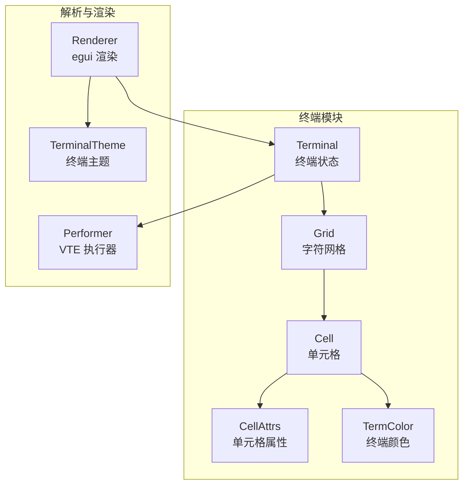
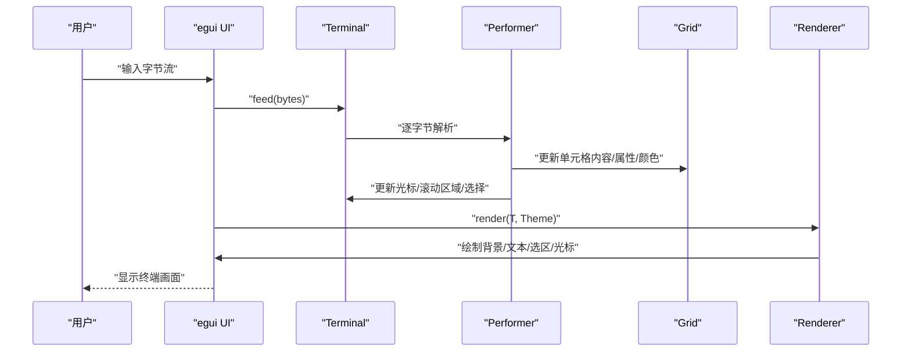
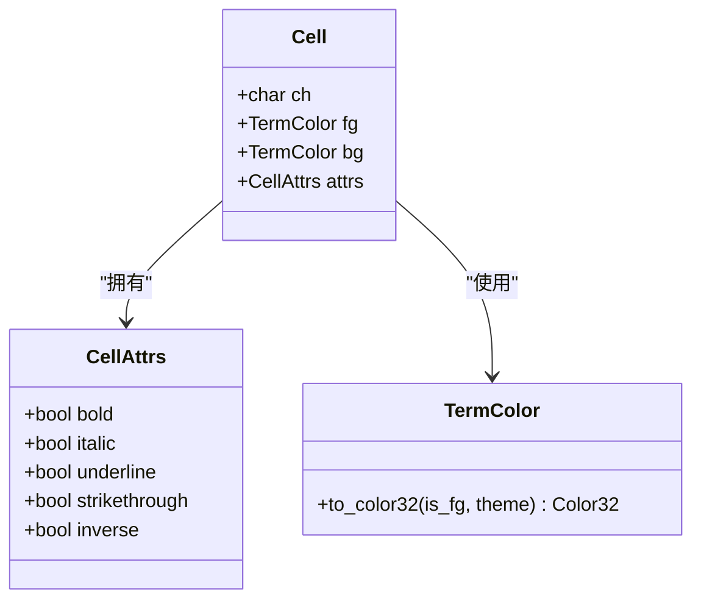
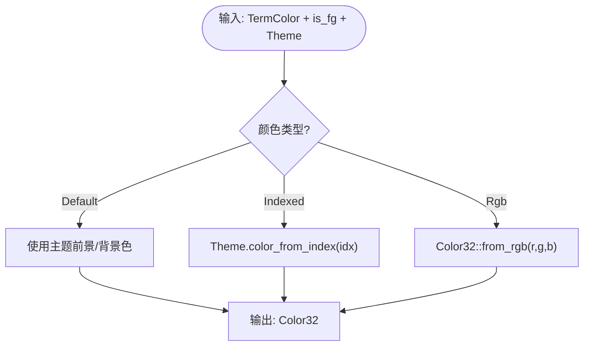
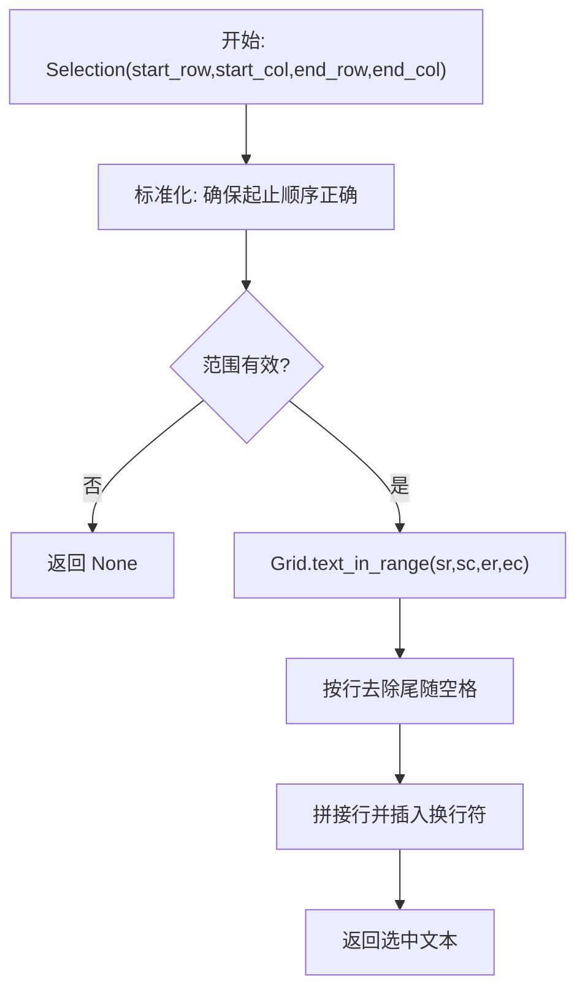
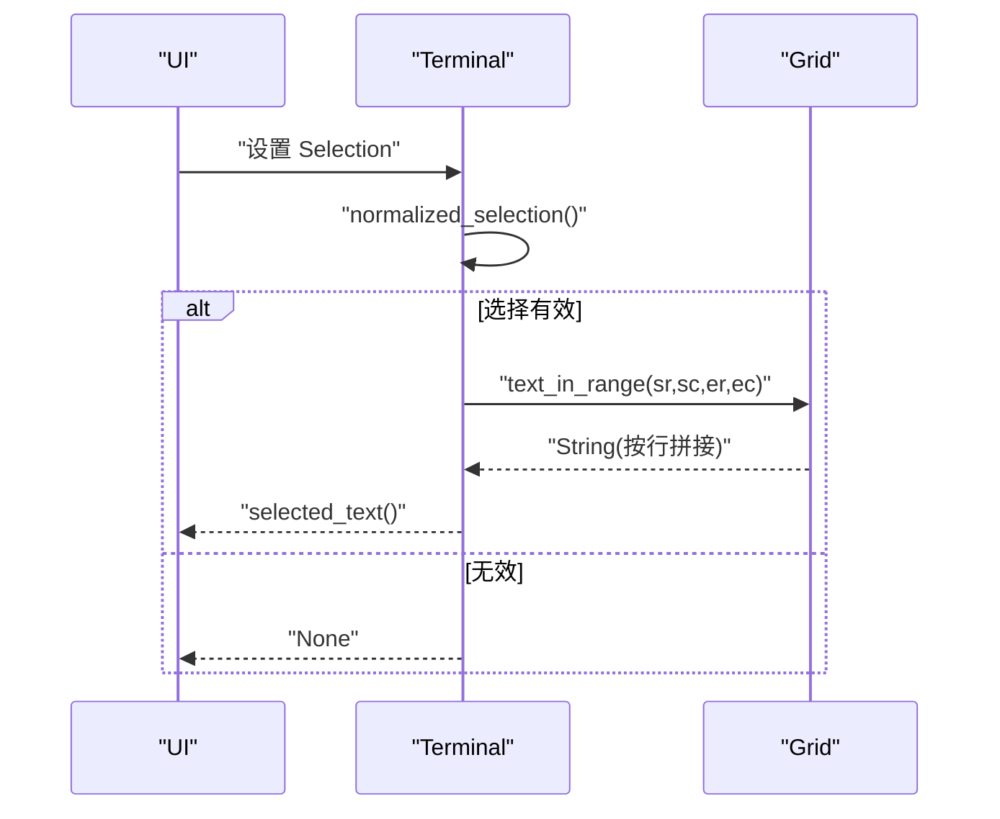
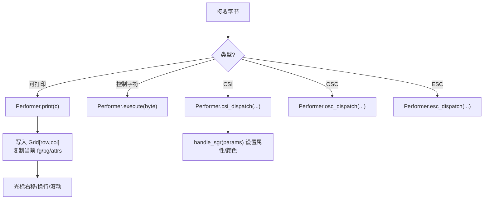
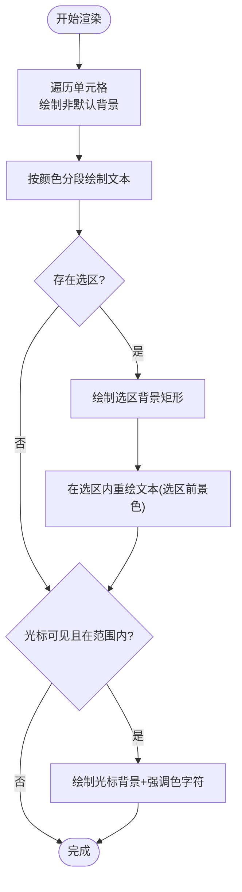
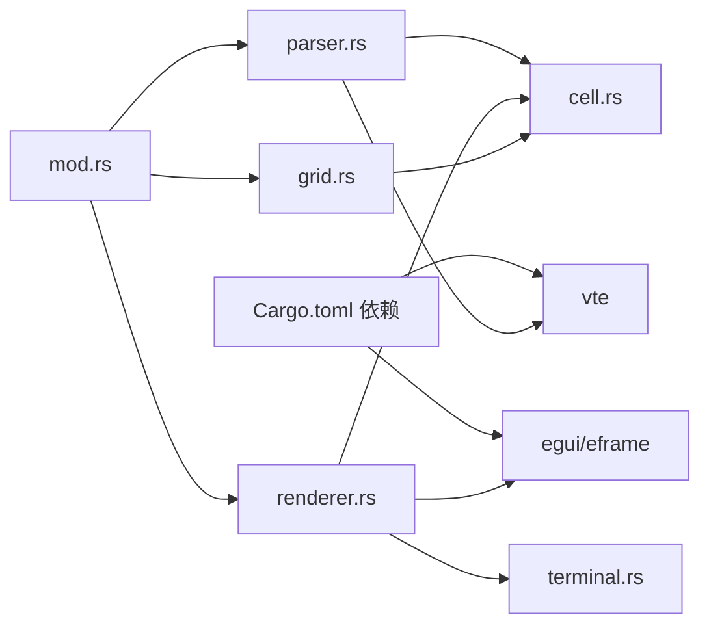

# 单元格处理

<cite>
**本文引用的文件**
- [cell.rs](file://src/terminal/cell.rs)
- [grid.rs](file://src/terminal/grid.rs)
- [mod.rs](file://src/terminal/mod.rs)
- [parser.rs](file://src/terminal/parser.rs)
- [renderer.rs](file://src/terminal/renderer.rs)
- [terminal.rs](file://src/theme/terminal.rs)
- [mod.rs](file://src/theme/mod.rs)
- [Cargo.toml](file://Cargo.toml)
</cite>

## 目录
1. [简介](#简介)
2. [项目结构](#项目结构)
3. [核心组件](#核心组件)
4. [架构总览](#架构总览)
5. [详细组件分析](#详细组件分析)
6. [依赖关系分析](#依赖关系分析)
7. [性能考量](#性能考量)
8. [故障排查指南](#故障排查指南)
9. [结论](#结论)
10. [附录](#附录)

## 简介
本文件面向 QTerm 的“单元格处理”子系统，系统性阐述终端单元格的数据结构设计与渲染管线，包括：
- 字符存储、文本属性与颜色信息的组织方式
- 单元格属性系统（粗体、斜体、下划线、删除线、反色）的实现机制
- 颜色体系（默认色、索引色、RGB）与主题映射
- 单元格状态管理（活跃、选择、高亮）与交互
- 单元格比较与复制（文本选择与复制）流程
- 扩展指南（特殊字符渲染、Unicode 支持、复合字符处理）

## 项目结构
终端模块采用“数据模型 + 解析器 + 渲染器”的分层设计：
- 数据模型：单元格、网格、终端状态
- 解析器：VTE 解析器驱动的 ANSI 序列执行器
- 渲染器：基于 egui 的绘制与交互

图表来源
- [mod.rs:26-41](file://src/terminal/mod.rs#L26-L41)
- [grid.rs:7-14](file://src/terminal/grid.rs#L7-L14)
- [cell.rs:55-75](file://src/terminal/cell.rs#L55-L75)
- [parser.rs:6-8](file://src/terminal/parser.rs#L6-L8)
- [renderer.rs:44-180](file://src/terminal/renderer.rs#L44-L180)
- [terminal.rs:7-17](file://src/theme/terminal.rs#L7-L17)

章节来源
- [mod.rs:1-200](file://src/terminal/mod.rs#L1-L200)
- [grid.rs:1-148](file://src/terminal/grid.rs#L1-L148)
- [cell.rs:1-75](file://src/terminal/cell.rs#L1-L75)
- [parser.rs:1-311](file://src/terminal/parser.rs#L1-L311)
- [renderer.rs:1-198](file://src/terminal/renderer.rs#L1-L198)
- [terminal.rs:1-102](file://src/theme/terminal.rs#L1-L102)

## 核心组件
- 单元格 Cell：包含字符、前景色、背景色、属性，是终端显示的基本单位
- 单元格属性 CellAttrs：粗体、斜体、下划线、删除线、反色
- 颜色 TermColor：默认色、索引色（ANSI 16/256）、RGB
- 网格 Grid：二维单元格矩阵、回滚缓冲区、滚动偏移
- 终端 Terminal：聚合 Grid、光标、颜色/属性状态、滚动区域、选择范围
- 解析器 Performer：将 ANSI 序列转换为终端状态变更
- 渲染器 Renderer：将 Terminal 渲染到 egui，并处理选区与光标

章节来源
- [cell.rs:5-75](file://src/terminal/cell.rs#L5-L75)
- [grid.rs:7-148](file://src/terminal/grid.rs#L7-L148)
- [mod.rs:9-41](file://src/terminal/mod.rs#L9-L41)
- [parser.rs:6-311](file://src/terminal/parser.rs#L6-L311)
- [renderer.rs:44-198](file://src/terminal/renderer.rs#L44-L198)

## 架构总览
终端渲染与交互的关键流程如下：
- 输入字节经 VTE 解析器进入 Performer，更新 Terminal 状态（光标、颜色、属性、网格）
- 渲染器根据 Terminal 状态与主题，绘制背景、文本、选区与光标
- 用户交互（点击/拖拽）生成 Selection，随后可复制选中文本

图表来源
- [mod.rs:67-74](file://src/terminal/mod.rs#L67-L74)
- [parser.rs:10-32](file://src/terminal/parser.rs#L10-L32)
- [renderer.rs:44-180](file://src/terminal/renderer.rs#L44-L180)

## 详细组件分析

### 单元格数据结构与颜色体系
- 单元格 Cell：包含字符、前景色、背景色、属性
- 单元格属性 CellAttrs：布尔标志表示粗体、斜体、下划线、删除线、反色
- 颜色 TermColor：支持默认色、索引色（ANSI 16/256）、RGB；提供 to_color32 转换，结合 TerminalTheme 的颜色映射

图表来源
- [cell.rs:55-75](file://src/terminal/cell.rs#L55-L75)
- [cell.rs:6-25](file://src/terminal/cell.rs#L6-L25)
- [cell.rs:27-53](file://src/terminal/cell.rs#L27-L53)

章节来源
- [cell.rs:5-75](file://src/terminal/cell.rs#L5-L75)

### 颜色映射与主题
- TerminalTheme 提供背景、前景、光标、选区颜色以及 ANSI 16 色映射
- color_from_index 实现 ANSI 256 色彩空间（16 色标准 + 6×6×6 彩色立方体 + 24 灰阶）
- TermColor::to_color32 将默认/索引/RGB 转换为 egui::Color32

图表来源
- [cell.rs:36-53](file://src/terminal/cell.rs#L36-L53)
- [terminal.rs:84-101](file://src/theme/terminal.rs#L84-L101)

章节来源
- [terminal.rs:1-102](file://src/theme/terminal.rs#L1-L102)
- [cell.rs:27-53](file://src/terminal/cell.rs#L27-L53)

### 网格与滚动、复制
- Grid 管理 rows×cols 的单元格矩阵、回滚缓冲区、滚动偏移
- 提供滚动、插入/删除行、清屏、文本范围提取等操作
- Terminal 提供 selected_text 与 normalized_selection，结合 Grid.text_in_range 实现复制

图表来源
- [mod.rs:137-155](file://src/terminal/mod.rs#L137-L155)
- [grid.rs:126-147](file://src/terminal/grid.rs#L126-L147)

章节来源
- [grid.rs:1-148](file://src/terminal/grid.rs#L1-L148)
- [mod.rs:137-155](file://src/terminal/mod.rs#L137-L155)

### 文本选择与复制
- Terminal 提供 Selection 结构与 normalized_selection，保证起止点有序
- word_at 与 line_range 支持双击选词与三击选行
- selected_text 调用 Grid.text_in_range 并去除行尾空格，避免复制多余空白

图表来源
- [mod.rs:137-155](file://src/terminal/mod.rs#L137-L155)
- [grid.rs:126-147](file://src/terminal/grid.rs#L126-L147)

章节来源
- [mod.rs:16-41](file://src/terminal/mod.rs#L16-L41)
- [mod.rs:157-200](file://src/terminal/mod.rs#L157-L200)
- [grid.rs:126-147](file://src/terminal/grid.rs#L126-L147)

### 解析器与属性应用
- Performer::print 在光标处写入字符，同时复制当前的前景色、背景色、属性
- 执行控制字符（退格、制表、换行、回车）更新光标位置
- csi_dispatch 处理光标移动、清屏、滚动、插入/删除行、设置滚动区域等
- handle_sgr 解析 SGR 序列，设置/重置属性与前景/背景色（含索引色与 RGB）

图表来源
- [parser.rs:10-32](file://src/terminal/parser.rs#L10-L32)
- [parser.rs:34-61](file://src/terminal/parser.rs#L34-L61)
- [parser.rs:63-173](file://src/terminal/parser.rs#L63-L173)
- [parser.rs:175-193](file://src/terminal/parser.rs#L175-L193)
- [parser.rs:195-228](file://src/terminal/parser.rs#L195-L228)
- [parser.rs:235-311](file://src/terminal/parser.rs#L235-L311)

章节来源
- [parser.rs:1-311](file://src/terminal/parser.rs#L1-L311)

### 渲染与高亮
- 渲染器按行扫描，先绘制非默认背景色的单元格，再按颜色分段绘制文本
- 选区高亮：绘制选区背景矩形，再在选区内以选区前景色重绘文本
- 光标：绘制光标背景色方块，并在非空字符处绘制强调色字符
- 反色：resolve_fg/resolve_bg 在属性 inverse 为真时交换前景/背景色

图表来源
- [renderer.rs:44-180](file://src/terminal/renderer.rs#L44-L180)
- [renderer.rs:182-198](file://src/terminal/renderer.rs#L182-L198)

章节来源
- [renderer.rs:1-198](file://src/terminal/renderer.rs#L1-L198)

## 依赖关系分析
- 终端模块依赖 egui 进行绘制与交互，依赖 vte 进行 ANSI 序列解析
- 颜色体系依赖 TerminalTheme 提供的 ANSI 16 色映射与 RGB 转换
- 渲染器依赖 UI 可用空间动态计算单元格尺寸

图表来源
- [Cargo.toml:8-25](file://Cargo.toml#L8-L25)
- [parser.rs:1-8](file://src/terminal/parser.rs#L1-L8)
- [renderer.rs:1-6](file://src/terminal/renderer.rs#L1-L6)
- [terminal.rs:1-4](file://src/theme/terminal.rs#L1-L4)
- [cell.rs:1-4](file://src/terminal/cell.rs#L1-L4)
- [grid.rs:1-4](file://src/terminal/grid.rs#L1-L4)
- [mod.rs:1-8](file://src/terminal/mod.rs#L1-L8)

章节来源
- [Cargo.toml:1-30](file://Cargo.toml#L1-L30)

## 性能考量
- 文本绘制优化：按颜色分段绘制，减少绘制调用次数
- 背景绘制优化：仅对非默认背景色单元格绘制背景矩形
- 选区绘制：先绘制背景，再重绘文本，避免透明度开销
- 单元格尺寸：使用等宽字体“M”的宽度作为基准，行高为字体大小的 1.4 倍，便于 UI 计算

章节来源
- [renderer.rs:25-40](file://src/terminal/renderer.rs#L25-L40)
- [renderer.rs:80-107](file://src/terminal/renderer.rs#L80-L107)
- [renderer.rs:109-147](file://src/terminal/renderer.rs#L109-L147)

## 故障排查指南
- 文本颜色异常
  - 检查 TermColor::to_color32 的 is_fg 参数与 TerminalTheme 的颜色映射
  - 确认 SGR 序列是否正确设置前景/背景色（索引/RGB）
- 反色效果不生效
  - 确认 CellAttrs.inverse 已设置，且渲染时 resolve_fg/resolve_bg 正确交换
- 选区复制为空
  - 检查 Selection 是否有效，normalized_selection 是否返回有序范围
  - 确认 Grid.text_in_range 的行列边界与 trim 行为
- 光标不显示
  - 检查 Terminal.cursor.visible 与位置是否在网格范围内
- 滚动区域异常
  - 确认 CSI r 设置的滚动区域与光标移动逻辑一致

章节来源
- [cell.rs:36-53](file://src/terminal/cell.rs#L36-L53)
- [parser.rs:235-311](file://src/terminal/parser.rs#L235-L311)
- [renderer.rs:182-198](file://src/terminal/renderer.rs#L182-L198)
- [mod.rs:137-155](file://src/terminal/mod.rs#L137-L155)
- [grid.rs:126-147](file://src/terminal/grid.rs#L126-L147)
- [mod.rs:118-135](file://src/terminal/mod.rs#L118-L135)

## 结论
QTerm 的单元格处理系统以清晰的数据模型（Cell/CellAttrs/TermColor/Grid）为基础，配合 VTE 解析器与 egui 渲染器，实现了 ANSI 终端的核心能力。其设计重点在于：
- 明确的颜色与属性模型，支持默认、索引与 RGB 三种颜色来源
- 高效的渲染策略（按颜色分段、选区重绘、背景优化）
- 完备的选择与复制流程，覆盖单字符、单词、整行场景
- 可扩展的主题系统，便于定制终端外观

## 附录

### 单元格扩展指南
- 特殊字符渲染
  - 使用 Unicode 字符集，确保字体具备相应字形
  - 对于零宽字符或组合字符，建议在写入前进行预处理，避免渲染错位
- Unicode 支持
  - 保持字符编码一致性（UTF-8），解析器与渲染器均按 Unicode 处理
  - 注意等宽字体对不同字符宽度的影响，必要时使用字符宽度查询接口
- 复合字符处理
  - 对组合字符序列进行归一化，避免拆分导致的显示问题
  - 在选择与复制时，按“字符粒度”而非“字节粒度”处理，确保语义正确

[本节为概念性指导，无需代码来源]