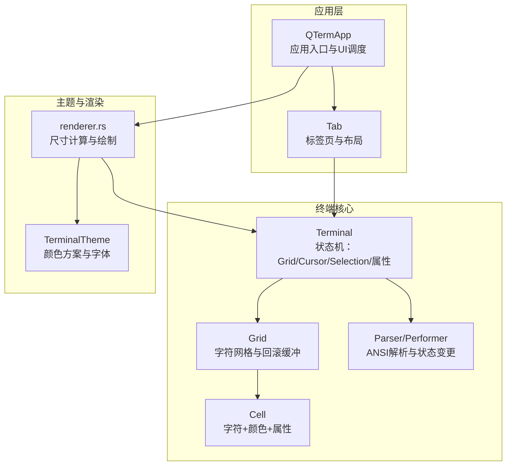
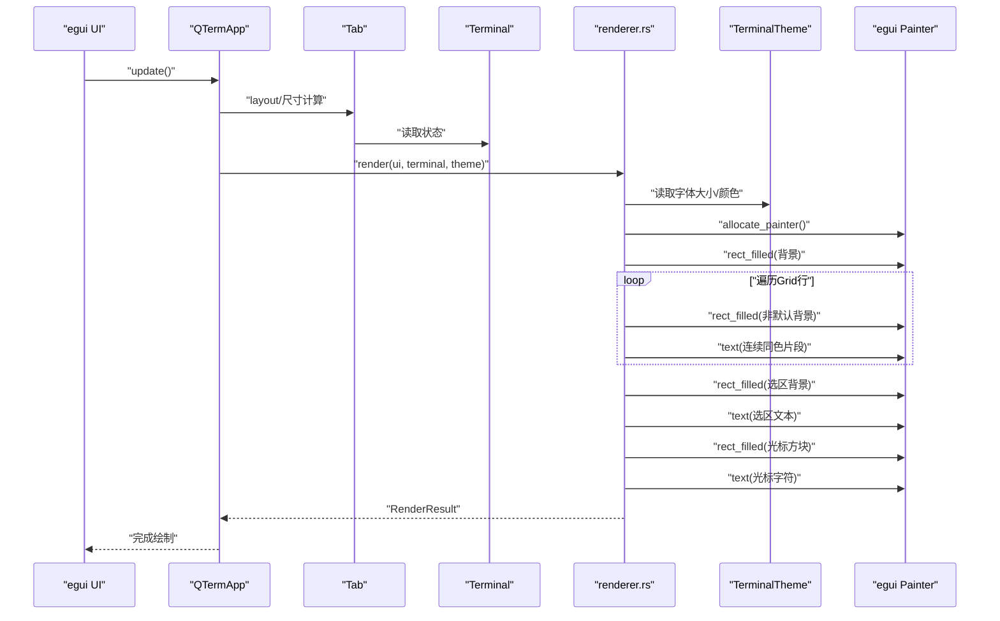
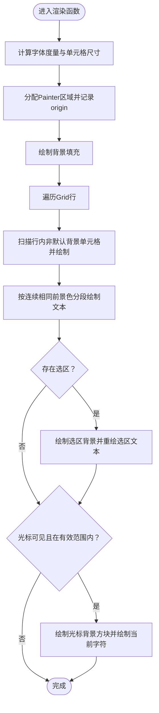
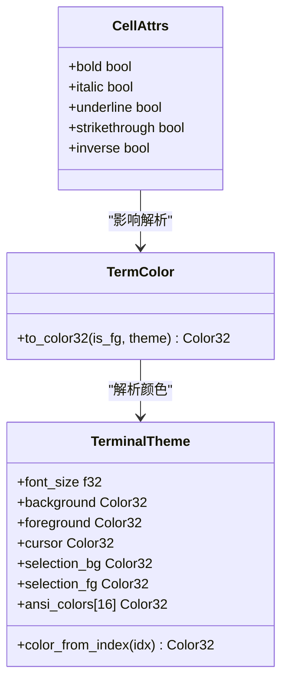
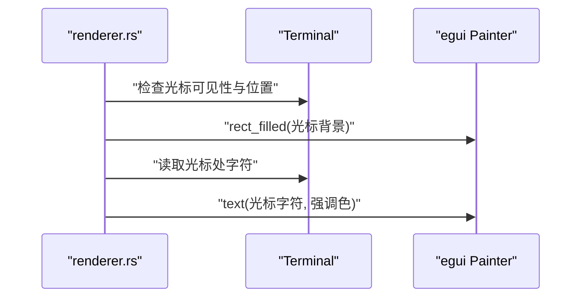
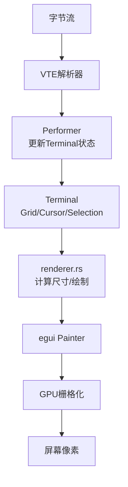
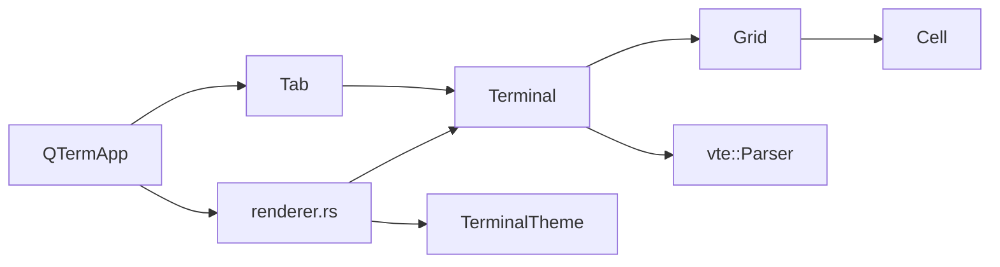

# 渲染引擎

<cite>
**本文引用的文件**
- [renderer.rs](file://src/terminal/renderer.rs)
- [mod.rs](file://src/terminal/mod.rs)
- [cell.rs](file://src/terminal/cell.rs)
- [grid.rs](file://src/terminal/grid.rs)
- [parser.rs](file://src/terminal/parser.rs)
- [terminal.rs](file://src/theme/terminal.rs)
- [mod.rs](file://src/theme/mod.rs)
- [app.rs](file://src/app.rs)
- [tab_item.rs](file://src/tab/tab_item.rs)
- [Cargo.toml](file://Cargo.toml)
</cite>

## 目录
1. [简介](#简介)
2. [项目结构](#项目结构)
3. [核心组件](#核心组件)
4. [架构总览](#架构总览)
5. [详细组件分析](#详细组件分析)
6. [依赖关系分析](#依赖关系分析)
7. [性能考量](#性能考量)
8. [故障排查指南](#故障排查指南)
9. [结论](#结论)
10. [附录](#附录)

## 简介
本文件面向QTerm渲染引擎，系统性梳理从“终端状态”到“像素绘制”的完整流水线，覆盖文本渲染、颜色系统、光标渲染、与egui框架的集成以及性能优化策略。文档以代码为依据，配合图示帮助读者快速理解渲染架构与关键实现细节。

## 项目结构
渲染引擎位于终端模块内部，围绕终端状态（Grid、Cell、Cursor、Selection）与主题（TerminalTheme）协作，通过渲染函数将状态转换为egui绘制指令，最终呈现在UI上。应用层负责布局、输入与事件分发，并调用渲染函数完成绘制。

图表来源
- [app.rs:400-538](file://src/app.rs#L400-L538)
- [tab_item.rs:1-48](file://src/tab/tab_item.rs#L1-L48)
- [mod.rs:24-41](file://src/terminal/mod.rs#L24-L41)
- [grid.rs:5-14](file://src/terminal/grid.rs#L5-L14)
- [cell.rs:55-75](file://src/terminal/cell.rs#L55-L75)
- [parser.rs:4-8](file://src/terminal/parser.rs#L4-L8)
- [terminal.rs:5-17](file://src/theme/terminal.rs#L5-L17)
- [renderer.rs:25-40](file://src/terminal/renderer.rs#L25-L40)

章节来源
- [app.rs:400-538](file://src/app.rs#L400-L538)
- [tab_item.rs:1-48](file://src/tab/tab_item.rs#L1-L48)
- [mod.rs:24-41](file://src/terminal/mod.rs#L24-L41)
- [grid.rs:5-14](file://src/terminal/grid.rs#L5-L14)
- [cell.rs:55-75](file://src/terminal/cell.rs#L55-L75)
- [parser.rs:4-8](file://src/terminal/parser.rs#L4-L8)
- [terminal.rs:5-17](file://src/theme/terminal.rs#L5-L17)
- [renderer.rs:25-40](file://src/terminal/renderer.rs#L25-L40)

## 核心组件
- 终端状态模型
  - Terminal：维护Grid、光标、颜色属性、滚动区域、选择、标题等。
  - Grid：二维字符矩阵，支持滚动、插入/删除行、回滚缓冲。
  - Cell：单个单元格，包含字符、前景/背景色、显示属性。
- 主题与颜色
  - TerminalTheme：定义字体大小、前景/背景、光标、选区、ANSI颜色映射。
- 渲染管线
  - renderer.rs：计算尺寸、分配绘制区域、绘制背景、文本、选区高亮、光标。
- 输入解析
  - parser.rs + Performer：将ANSI序列应用到终端状态，驱动Grid与Cursor变化。

章节来源
- [mod.rs:24-41](file://src/terminal/mod.rs#L24-L41)
- [grid.rs:5-14](file://src/terminal/grid.rs#L5-L14)
- [cell.rs:27-75](file://src/terminal/cell.rs#L27-L75)
- [terminal.rs:5-17](file://src/theme/terminal.rs#L5-L17)
- [renderer.rs:42-180](file://src/terminal/renderer.rs#L42-L180)
- [parser.rs:4-8](file://src/terminal/parser.rs#L4-L8)

## 架构总览
渲染引擎采用“状态驱动+逐帧绘制”的模式：
- 应用层在每帧调用渲染函数，传入Terminal与TerminalTheme。
- 渲染函数根据可用空间与字体度量计算终端尺寸，分配Painter区域。
- 遍历Grid，按行绘制背景、文本、选区高亮与光标。
- 颜色解析统一走TermColor→Color32，支持Default/Indexed/Rgb与反色模式。

图表来源
- [app.rs:440-538](file://src/app.rs#L440-L538)
- [renderer.rs:42-180](file://src/terminal/renderer.rs#L42-L180)
- [terminal.rs:5-17](file://src/theme/terminal.rs#L5-L17)

## 详细组件分析

### 文本渲染与字符栅格生成
- 字体度量与单元格尺寸
  - 使用等宽字体的“M”字符宽度作为单元格宽度基准；行高为字体大小的固定倍数。
  - 根据可用空间与计算出的单元格尺寸推导行列数，保证渲染区域不小于终端网格。
- 文本绘制策略
  - 按行扫描，先绘制非默认背景色的单元格背景，再按连续相同前景色进行分段绘制，减少绘制调用次数。
  - 文本绘制使用egui::Painter::text，对齐左上，逐行绘制。
- 选区高亮
  - 若存在选区，先绘制选区背景矩形，再在选区内重绘文本（使用选区前景色），实现覆盖效果。

图表来源
- [renderer.rs:25-180](file://src/terminal/renderer.rs#L25-L180)

章节来源
- [renderer.rs:25-180](file://src/terminal/renderer.rs#L25-L180)

### 颜色系统与解析
- TermColor支持三种来源：Default（使用主题默认色）、Indexed（ANSI 16/256色索引）、Rgb（自定义RGB）。
- 颜色解析
  - Default：前景/背景分别映射到主题的foreground/background。
  - Indexed：TerminalTheme提供color_from_index，支持标准16色、216色RGB立方体与24阶灰度。
  - Rgb：直接构造Color32。
- 反色模式
  - CellAttrs.inverse为true时，前景/背景互换解析逻辑，实现反色效果。

图表来源
- [cell.rs:27-53](file://src/terminal/cell.rs#L27-L53)
- [terminal.rs:5-101](file://src/theme/terminal.rs#L5-L101)

章节来源
- [cell.rs:27-53](file://src/terminal/cell.rs#L27-L53)
- [terminal.rs:5-101](file://src/theme/terminal.rs#L5-L101)

### 光标渲染机制
- 光标绘制流程
  - 绘制一个与单元格等大的背景色方块。
  - 若当前字符非空格，则在光标方块内绘制该字符，使用光标强调色。
- 可见性与边界
  - 仅当光标可见且行列索引有效时才绘制。
- 与输入解析的关系
  - Parser在print/execute/csi_dispatch中更新光标位置与可见性（如CSI ?25 h/l）。

图表来源
- [renderer.rs:149-172](file://src/terminal/renderer.rs#L149-L172)
- [parser.rs:133-150](file://src/terminal/parser.rs#L133-L150)

章节来源
- [renderer.rs:149-172](file://src/terminal/renderer.rs#L149-L172)
- [parser.rs:133-150](file://src/terminal/parser.rs#L133-L150)

### 与egui框架的集成与性能优化
- 集成要点
  - 使用Ui.allocate_painter分配绘制区域，同时获得交互响应对象，便于后续鼠标选择等交互。
  - 字体系统通过应用层配置，支持用户字体与系统回退字体（等宽+CJK）。
- 性能优化策略
  - 文本绘制分段：按连续相同前景色合并绘制，降低绘制调用次数。
  - 背景绘制优化：仅对非默认背景单元格绘制矩形，避免全行背景重绘。
  - 尺寸计算：基于字体度量与可用空间计算，避免溢出与多余绘制。
  - 主题字体：TerminalTheme集中管理字体大小，渲染时复用FontId，减少重复度量。

章节来源
- [renderer.rs:42-180](file://src/terminal/renderer.rs#L42-L180)
- [app.rs:96-160](file://src/app.rs#L96-L160)
- [terminal.rs:5-17](file://src/theme/terminal.rs#L5-L17)

### 终端状态到像素的完整流水线
- 输入阶段
  - 字节流经VTE解析器，Performer将ANSI序列应用到Terminal状态（移动光标、设置颜色、清屏、滚动等）。
- 渲染阶段
  - renderer根据Terminal与TerminalTheme计算尺寸、分配Painter、绘制背景、文本、选区与光标。
- 输出阶段
  - egui将绘制命令提交至GPU，呈现到屏幕。

图表来源
- [parser.rs:10-32](file://src/terminal/parser.rs#L10-L32)
- [mod.rs:65-74](file://src/terminal/mod.rs#L65-L74)
- [renderer.rs:42-180](file://src/terminal/renderer.rs#L42-L180)

章节来源
- [parser.rs:10-32](file://src/terminal/parser.rs#L10-L32)
- [mod.rs:65-74](file://src/terminal/mod.rs#L65-L74)
- [renderer.rs:42-180](file://src/terminal/renderer.rs#L42-L180)

## 依赖关系分析
- 渲染依赖
  - renderer.rs依赖Terminal、TermColor、TerminalTheme。
  - Terminal依赖Grid、CellAttrs、TermColor、vte::Parser。
  - Grid依赖Cell。
  - TerminalTheme依赖Color32与颜色索引映射。
- 应用层依赖
  - QTermApp在每帧调用renderer::render，并根据分屏方向与面板数量计算目标行列数，动态调整终端尺寸。

图表来源
- [renderer.rs:1-5](file://src/terminal/renderer.rs#L1-L5)
- [mod.rs:1-4](file://src/terminal/mod.rs#L1-L4)
- [terminal.rs:1-3](file://src/theme/terminal.rs#L1-L3)
- [app.rs:400-538](file://src/app.rs#L400-L538)

章节来源
- [renderer.rs:1-5](file://src/terminal/renderer.rs#L1-L5)
- [mod.rs:1-4](file://src/terminal/mod.rs#L1-L4)
- [terminal.rs:1-3](file://src/theme/terminal.rs#L1-L3)
- [app.rs:400-538](file://src/app.rs#L400-L538)

## 性能考量
- 绘制调用优化
  - 文本分段绘制：按连续相同前景色合并绘制，减少Painter调用次数。
  - 背景优化：仅对非默认背景单元格绘制矩形，避免全行背景重绘。
- 字体与度量
  - 使用“M”字符宽度作为基准，行高固定倍数，避免频繁测量。
  - 字体由应用层集中配置，渲染时复用FontId，减少度量成本。
- 尺寸与布局
  - 根据可用空间与字体度量计算行列数，避免溢出与多余绘制。
  - 分屏模式下按面板数量均分尺寸，减少重排成本。
- 平台与图形后端
  - 依赖eframe/egui的wgpu后端，利用GPU加速栅格化与合成。

章节来源
- [renderer.rs:68-106](file://src/terminal/renderer.rs#L68-L106)
- [app.rs:417-437](file://src/app.rs#L417-L437)
- [Cargo.toml](file://Cargo.toml#L9)

## 故障排查指南
- 字体显示异常
  - 检查应用层字体配置与回退字体路径是否正确加载。
  - 确认TerminalTheme.font_size与实际渲染一致。
- 文本颜色不正确
  - 检查TermColor来源（Default/Indexed/Rgb）与TerminalTheme.color_from_index映射。
  - 注意CellAttrs.inverse对前景/背景解析的影响。
- 光标不显示
  - 检查Terminal.cursor.visible与行列索引有效性。
  - 确认CSI ?25 h/l序列是否正确处理。
- 选区高亮错位
  - 检查normalized_selection与渲染时的行列范围计算。
- 渲染卡顿
  - 确认未发生不必要的全行背景重绘与过多Painter调用。
  - 检查分屏面板数量与尺寸计算是否合理。

章节来源
- [app.rs:96-160](file://src/app.rs#L96-L160)
- [terminal.rs:84-100](file://src/theme/terminal.rs#L84-L100)
- [parser.rs:133-150](file://src/terminal/parser.rs#L133-L150)
- [renderer.rs:109-147](file://src/terminal/renderer.rs#L109-L147)

## 结论
QTerm渲染引擎以Terminal为核心状态容器，结合TerminalTheme与renderer.rs实现从终端状态到像素的高效绘制。通过分段文本绘制、按需背景绘制与统一颜色解析，实现了良好的性能与可维护性。与egui的深度集成使得渲染与交互无缝衔接，适合进一步扩展多面板、高DPI与复杂主题场景。

## 附录
- 关键API与职责
  - renderer::calculate_size：根据字体与可用空间计算终端尺寸。
  - renderer::render：绘制背景、文本、选区与光标。
  - Terminal.feed：输入字节流，驱动状态更新。
  - TerminalTheme.color_from_index：ANSI颜色索引到Color32映射。
- 相关文件路径
  - [renderer.rs](file://src/terminal/renderer.rs)
  - [mod.rs](file://src/terminal/mod.rs)
  - [cell.rs](file://src/terminal/cell.rs)
  - [grid.rs](file://src/terminal/grid.rs)
  - [parser.rs](file://src/terminal/parser.rs)
  - [terminal.rs](file://src/theme/terminal.rs)
  - [mod.rs](file://src/theme/mod.rs)
  - [app.rs](file://src/app.rs)
  - [tab_item.rs](file://src/tab/tab_item.rs)
  - [Cargo.toml](file://Cargo.toml)