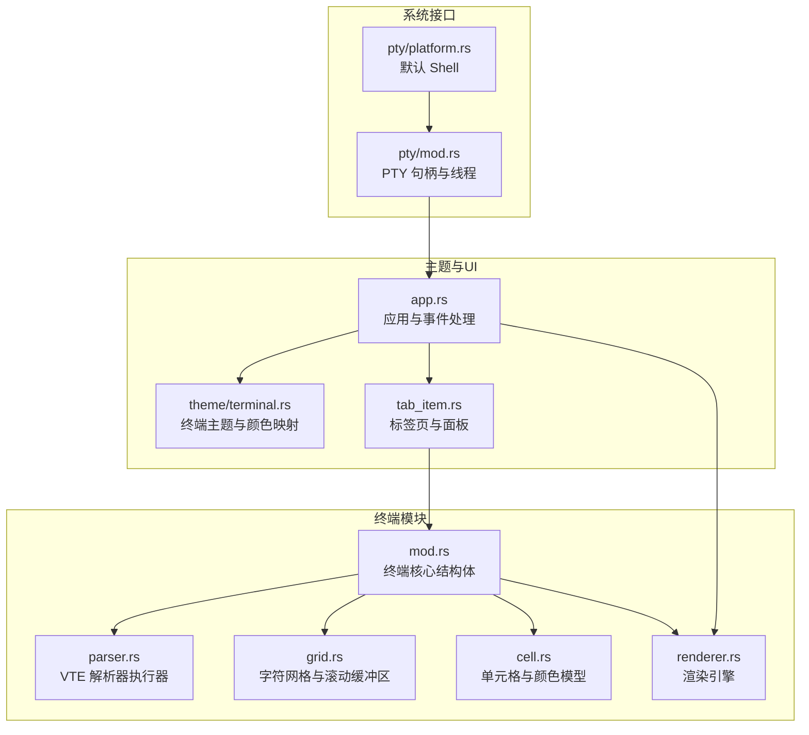
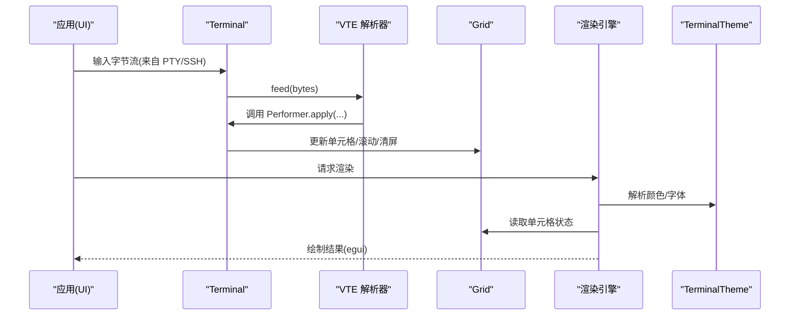
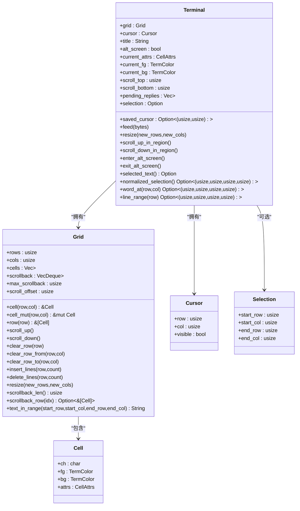
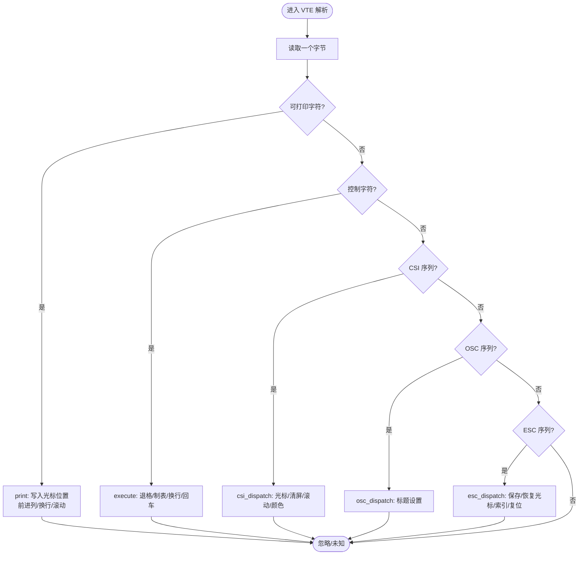
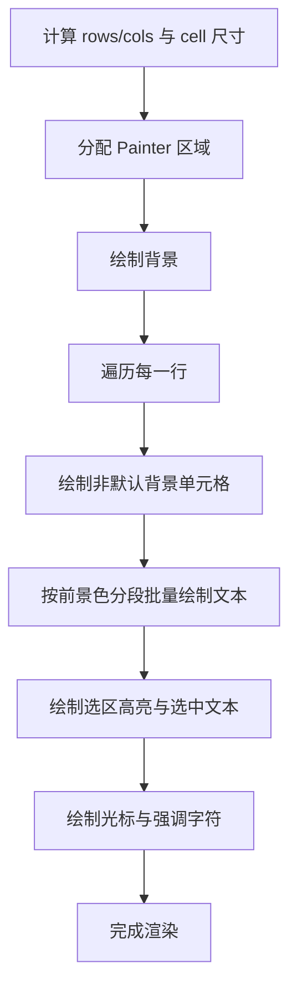
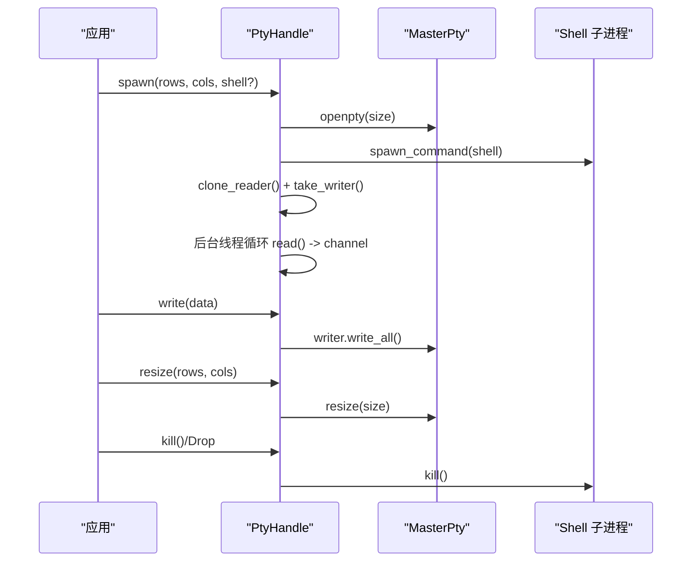
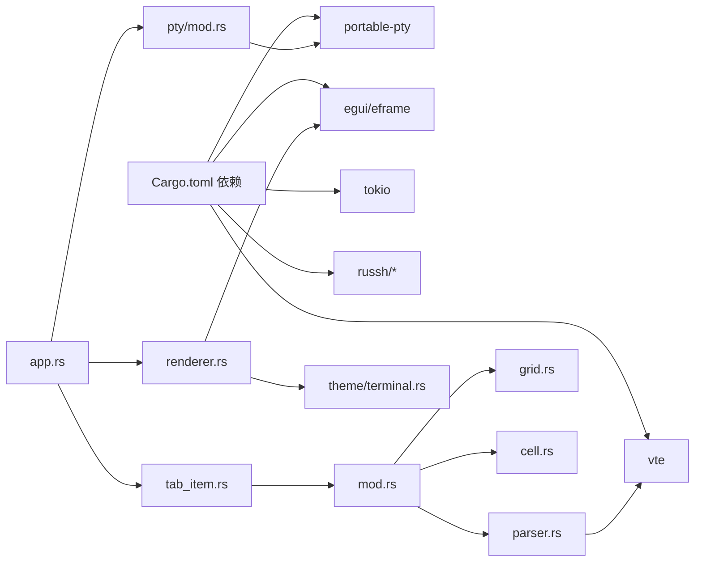

# 终端模块

<cite>
**本文引用的文件**
- [mod.rs](file://src/terminal/mod.rs)
- [parser.rs](file://src/terminal/parser.rs)
- [grid.rs](file://src/terminal/grid.rs)
- [cell.rs](file://src/terminal/cell.rs)
- [renderer.rs](file://src/terminal/renderer.rs)
- [pty/mod.rs](file://src/pty/mod.rs)
- [pty/platform.rs](file://src/pty/platform.rs)
- [theme/terminal.rs](file://src/theme/terminal.rs)
- [app.rs](file://src/app.rs)
- [tab_item.rs](file://src/tab/tab_item.rs)
- [Cargo.toml](file://Cargo.toml)
</cite>

## 目录
1. [简介](#简介)
2. [项目结构](#项目结构)
3. [核心组件](#核心组件)
4. [架构总览](#架构总览)
5. [详细组件分析](#详细组件分析)
6. [依赖关系分析](#依赖关系分析)
7. [性能考量](#性能考量)
8. [故障排查指南](#故障排查指南)
9. [结论](#结论)
10. [附录](#附录)

## 简介
本文件面向 QTerm 的终端模块，系统性阐述终端仿真器的架构设计与实现要点，重点覆盖：
- VTE 解析器的集成与 ANSI 控制序列处理
- 文本网格的数据结构与滚动缓冲区机制
- 渲染引擎的工作原理与性能优化策略
- 终端状态管理（光标、文本属性、颜色、选择）
- 与操作系统 PTY 的交互（进程创建、数据流、大小调整、信号）
- 终端扩展指南（颜色、字体、文本选择）

目标是帮助开发者快速理解并安全地扩展终端能力。

## 项目结构
终端模块位于 src/terminal 目录，配合 src/pty 提供操作系统层交互，src/theme 提供主题与颜色映射，src/app 与 src/tab 负责 UI 集成与事件处理。

图表来源
- [mod.rs:1-200](file://src/terminal/mod.rs#L1-L200)
- [parser.rs:1-311](file://src/terminal/parser.rs#L1-L311)
- [grid.rs:1-148](file://src/terminal/grid.rs#L1-L148)
- [cell.rs:1-75](file://src/terminal/cell.rs#L1-L75)
- [renderer.rs:1-198](file://src/terminal/renderer.rs#L1-L198)
- [pty/mod.rs:1-121](file://src/pty/mod.rs#L1-L121)
- [pty/platform.rs:1-21](file://src/pty/platform.rs#L1-L21)
- [theme/terminal.rs:1-102](file://src/theme/terminal.rs#L1-L102)
- [app.rs:1-800](file://src/app.rs#L1-L800)
- [tab_item.rs:1-48](file://src/tab/tab_item.rs#L1-L48)

章节来源
- [mod.rs:1-200](file://src/terminal/mod.rs#L1-L200)
- [pty/mod.rs:1-121](file://src/pty/mod.rs#L1-L121)
- [theme/terminal.rs:1-102](file://src/theme/terminal.rs#L1-L102)
- [app.rs:1-800](file://src/app.rs#L1-L800)
- [tab_item.rs:1-48](file://src/tab/tab_item.rs#L1-L48)

## 核心组件
- 终端核心（Terminal）：聚合网格、光标、颜色属性、滚动区域、选择、VTE 解析器、待回复队列等。
- 解析器执行器（Performer）：将 VTE 解析出的 ANSI 序列转换为终端状态变更。
- 网格（Grid）：二维字符单元格矩阵与回滚缓冲区，支持滚动、插入/删除行、清屏等。
- 单元格（Cell）：字符、前景/背景色、文本属性。
- 渲染引擎（renderer）：基于 egui 的绘制管线，支持选区高亮、光标绘制、颜色解析。
- PTY 句柄（PtyHandle）：封装本地伪终端，负责进程创建、读写、大小调整、生命周期管理。
- 主题（TerminalTheme）：终端配色方案与 ANSI 256 色索引映射。

章节来源
- [mod.rs:24-41](file://src/terminal/mod.rs#L24-L41)
- [parser.rs:4-8](file://src/terminal/parser.rs#L4-L8)
- [grid.rs:5-14](file://src/terminal/grid.rs#L5-L14)
- [cell.rs:5-63](file://src/terminal/cell.rs#L5-L63)
- [renderer.rs:7-23](file://src/terminal/renderer.rs#L7-L23)
- [pty/mod.rs:9-17](file://src/pty/mod.rs#L9-L17)
- [theme/terminal.rs:5-17](file://src/theme/terminal.rs#L5-L17)

## 架构总览
终端模块采用“解析-状态-渲染”的三层架构：
- 解析层：VTE 解析器将字节流解析为控制序列，Performer 将其应用到 Terminal 状态。
- 状态层：Terminal 维护网格、光标、颜色、滚动区域、选择等状态；Grid 提供二维存储与滚动缓冲。
- 渲染层：renderer 将 Terminal 状态映射为 egui 绘制命令，完成像素输出。

图表来源
- [mod.rs:65-74](file://src/terminal/mod.rs#L65-L74)
- [parser.rs:10-32](file://src/terminal/parser.rs#L10-L32)
- [grid.rs:16-114](file://src/terminal/grid.rs#L16-L114)
- [renderer.rs:42-180](file://src/terminal/renderer.rs#L42-L180)
- [theme/terminal.rs:84-100](file://src/theme/terminal.rs#L84-L100)

## 详细组件分析

### 终端核心与状态管理
- 终端状态字段：网格、光标、标题、保存光标、备用屏幕、当前属性与颜色、滚动区域、待回复队列、选择。
- 关键行为：
  - feed：遍历字节，逐字交由 VTE 解析器驱动 Performer 更新状态。
  - resize：重设网格尺寸并校正光标位置与滚动区域。
  - 滚动区域：scroll_up_in_region/scroll_down_in_region 在区域边界内进行滚动或插入/删除行。
  - 备用屏幕：enter_alt_screen/exit_alt_screen 在主屏与备用屏之间切换。
  - 选择：normalized_selection/word_at/line_range 支持双击选词、三击选行、复制文本。

图表来源
- [mod.rs:9-41](file://src/terminal/mod.rs#L9-L41)
- [grid.rs:5-148](file://src/terminal/grid.rs#L5-L148)
- [cell.rs:55-75](file://src/terminal/cell.rs#L55-L75)

章节来源
- [mod.rs:24-200](file://src/terminal/mod.rs#L24-L200)
- [grid.rs:16-148](file://src/terminal/grid.rs#L16-L148)
- [cell.rs:55-75](file://src/terminal/cell.rs#L55-L75)

### VTE 解析器与 ANSI 控制序列
- 解析器执行器（Performer）实现 vte::Perform 接口，将解析结果映射到 Terminal 状态。
- 关键处理：
  - print：在光标处写入字符并前进，处理换行与滚动。
  - execute：处理退格、制表、换行、回车等控制字符。
  - csi_dispatch：支持光标移动、清屏、插入/删除行、滚动、颜色设置、私有模式（如备用屏幕、光标显隐）。
  - osc_dispatch：处理 OSC 标题设置（0/1/2）。
  - esc_dispatch：处理 ESC 序列（保存/恢复光标、索引/反向索引、全复位）。
  - handle_sgr：解析 SGR 参数，设置粗体、斜体、下划线、删除线、反色以及前景/背景色（默认、索引、RGB）。

图表来源
- [parser.rs:10-32](file://src/terminal/parser.rs#L10-L32)
- [parser.rs:34-61](file://src/terminal/parser.rs#L34-L61)
- [parser.rs:63-173](file://src/terminal/parser.rs#L63-L173)
- [parser.rs:175-193](file://src/terminal/parser.rs#L175-L193)
- [parser.rs:195-228](file://src/terminal/parser.rs#L195-L228)
- [parser.rs:235-311](file://src/terminal/parser.rs#L235-L311)

章节来源
- [parser.rs:1-311](file://src/terminal/parser.rs#L1-L311)

### 文本网格与滚动缓冲区
- 数据结构：
  - cells：二维单元格矩阵，按需扩容/缩容。
  - scrollback：双向队列，保存超出屏幕范围的历史行，受 max_scrollback 限制。
  - scroll_offset：当前可视偏移（0 表示未滚动）。
- 关键操作：
  - scroll_up：将顶行移入 scrollback 并在底部追加空行。
  - scroll_down：移除底部行并在顶部插入空行。
  - insert_lines/delete_lines：在指定行插入/删除空行。
  - clear_row/clear_row_from/clear_row_to：清屏相关。
  - text_in_range：复制选中文本时按行拼接并去除行尾空格。

复杂度分析：
- scroll_up/scroll_down：O(cols)，受每行单元格数量影响。
- insert_lines/delete_lines：O(rows*cols) 最坏情况（整体移动）。
- text_in_range：O(行数*列数)。

章节来源
- [grid.rs:5-148](file://src/terminal/grid.rs#L5-L148)

### 渲染引擎与绘制流程
- 尺寸计算：根据可用空间与等宽字体度量计算 rows/cols 与 cell_width/cell_height。
- 绘制步骤：
  - 分配 Painter 区域并启用点击/拖拽感知。
  - 绘制背景。
  - 按颜色分段批量绘制文本，减少绘制调用次数。
  - 绘制选区高亮与选中文本。
  - 绘制光标背景与当前字符强调色。
- 颜色解析：resolve_fg/resolve_bg 考虑反色模式，TermColor::to_color32 将颜色映射为 egui::Color32。

图表来源
- [renderer.rs:25-40](file://src/terminal/renderer.rs#L25-L40)
- [renderer.rs:42-180](file://src/terminal/renderer.rs#L42-L180)
- [renderer.rs:182-198](file://src/terminal/renderer.rs#L182-L198)

章节来源
- [renderer.rs:1-198](file://src/terminal/renderer.rs#L1-L198)
- [theme/terminal.rs:84-100](file://src/theme/terminal.rs#L84-L100)

### 终端与操作系统 PTY 的交互
- PTY 句柄（PtyHandle）：
  - spawn：创建 PTY 对，启动 Shell 子进程，克隆 master reader，启动后台线程持续读取输出。
  - write：向子进程写入数据。
  - resize：调整 PTY 终端大小。
  - is_alive/kill：检查进程状态与终止。
- 默认 Shell：根据平台选择 COMSPEC/Powershell、$SHELL 或 /bin/zsh、/bin/bash。
- 生命周期：Drop 自动终止子进程，避免僵尸进程。

图表来源
- [pty/mod.rs:19-121](file://src/pty/mod.rs#L19-L121)
- [pty/platform.rs:1-21](file://src/pty/platform.rs#L1-L21)

章节来源
- [pty/mod.rs:1-121](file://src/pty/mod.rs#L1-L121)
- [pty/platform.rs:1-21](file://src/pty/platform.rs#L1-L21)

### 颜色与主题系统
- TermColor：支持 Default、Indexed、Rgb 三种颜色来源。
- TerminalTheme：定义字体大小、前景/背景、光标、选区颜色，以及 ANSI 16 色映射。
- color_from_index：实现 ANSI 16-255 色索引到 RGB 的映射（6×6×6 立方体 + 24 灰阶）。

章节来源
- [cell.rs:27-53](file://src/terminal/cell.rs#L27-L53)
- [theme/terminal.rs:5-102](file://src/theme/terminal.rs#L5-L102)

### UI 集成与事件处理
- 应用层（app.rs）：
  - 计算终端尺寸并按分屏方向分配给各面板。
  - 调用 renderer::render 获取交互响应与单元格尺寸。
  - 处理鼠标事件：双击选词、三击选行、拖拽选择。
  - 处理键盘事件：复制、粘贴、特殊键转 ANSI 序列。
- 标签页（tab_item.rs）：封装分屏布局与面板生命周期。

章节来源
- [app.rs:436-575](file://src/app.rs#L436-L575)
- [app.rs:1103-1465](file://src/app.rs#L1103-L1465)
- [tab_item.rs:1-48](file://src/tab/tab_item.rs#L1-L48)

## 依赖关系分析
- 外部库：
  - vte：ANSI 控制序列解析。
  - portable-pty：跨平台 PTY 创建与读写。
  - egui：UI 渲染与事件系统。
  - tokio、russh 等：为 SSH/SFTP 功能提供异步支持（终端模块不直接依赖）。
- 内部模块耦合：
  - Terminal 依赖 Grid/Cell/Parser/Renderer。
  - Renderer 依赖 Terminal 与 TerminalTheme。
  - App/Tab 依赖 Terminal 与 Renderer。

图表来源
- [Cargo.toml:8-25](file://Cargo.toml#L8-L25)
- [parser.rs:1-8](file://src/terminal/parser.rs#L1-L8)
- [pty/mod.rs:3-7](file://src/pty/mod.rs#L3-L7)
- [renderer.rs:1-5](file://src/terminal/renderer.rs#L1-L5)
- [app.rs:1-36](file://src/app.rs#L1-L36)
- [tab_item.rs:1-9](file://src/tab/tab_item.rs#L1-L9)
- [mod.rs:1-8](file://src/terminal/mod.rs#L1-L8)

章节来源
- [Cargo.toml:1-30](file://Cargo.toml#L1-L30)

## 性能考量
- 渲染优化：
  - 按颜色分段批量绘制文本，减少绘制调用次数。
  - 仅在非默认背景单元格处绘制背景矩形，避免全行背景填充。
- 网格操作：
  - insert_lines/delete_lines 会整体移动行，建议批量操作或限制频率。
  - scroll_up/scroll_down 为 O(cols)，在大窗口下仍需注意调用频率。
- PTY 读取：
  - 后台线程以固定缓冲区大小读取，避免阻塞主线程。
- 建议：
  - 对高频滚动场景，可考虑延迟刷新或增量绘制。
  - 对超大窗口，适当降低字体大小或限制 scrollback。

[本节为通用性能讨论，无需特定文件来源]

## 故障排查指南
- 终端无输出或显示异常
  - 检查 PTY 是否正常启动与存活。
  - 确认后台读取线程是否正常工作。
  - 查看终端尺寸计算是否正确，避免 0 尺寸导致绘制异常。
- 文本颜色不正确
  - 检查 TermColor::to_color32 与 TerminalTheme::color_from_index 的映射。
  - 确认 OSC 标题设置是否被正确解析。
- 选择功能异常
  - 确认鼠标事件坐标转换是否基于正确的 origin 与 cell 尺寸。
  - 检查 normalized_selection 的边界处理。
- 滚动与光标错位
  - 校验 scroll_top/scroll_bottom 与光标位置的约束逻辑。
  - resize 后需同步校正光标与滚动区域。

章节来源
- [pty/mod.rs:104-114](file://src/pty/mod.rs#L104-L114)
- [renderer.rs:42-180](file://src/terminal/renderer.rs#L42-L180)
- [parser.rs:175-193](file://src/terminal/parser.rs#L175-L193)
- [app.rs:1103-1140](file://src/app.rs#L1103-L1140)
- [mod.rs:86-98](file://src/terminal/mod.rs#L86-L98)

## 结论
QTerm 终端模块以清晰的分层架构实现了 ANSI 兼容的终端仿真：VTE 解析器负责语义解析，Terminal 状态机承载网格与属性，渲染引擎高效输出到 egui。与 PTY 的集成保证了跨平台的本地终端能力。通过合理的颜色映射与主题系统，终端具备良好的可定制性。未来可在保持现有架构稳定性的前提下，逐步扩展字体渲染、文本选择增强、颜色深度与高 DPI 支持等特性。

[本节为总结性内容，无需特定文件来源]

## 附录

### 终端扩展指南

- 添加新的颜色支持
  - 在 TermColor 中扩展颜色来源（如 Palette/Named），并在 TermColor::to_color32 中增加映射分支。
  - 在 TerminalTheme 中扩展颜色数组或映射函数，支持更多 ANSI 索引范围。
  - 在 SGR 解析中增加新参数分支，将外部颜色源写入 current_fg/current_bg。
  
  章节来源
  - [cell.rs:27-53](file://src/terminal/cell.rs#L27-L53)
  - [theme/terminal.rs:84-100](file://src/theme/terminal.rs#L84-L100)
  - [parser.rs:235-311](file://src/terminal/parser.rs#L235-L311)

- 添加字体渲染增强
  - 在 TerminalTheme 中增加字体族与粗体开关，并在 renderer 中使用 FontId::proportional/monospace。
  - 在 UI 层（app.rs）暴露字体配置项，动态更新 egui 字体系统。
  - 注意字体度量对 cell_width/cell_height 的影响，确保尺寸计算准确。
  
  章节来源
  - [theme/terminal.rs:7-17](file://src/theme/terminal.rs#L7-L17)
  - [renderer.rs:25-40](file://src/terminal/renderer.rs#L25-L40)
  - [app.rs:107-171](file://src/app.rs#L107-L171)

- 添加文本选择功能
  - 在 renderer 中记录 RenderResult 的响应与尺寸，以便 UI 层进行坐标转换。
  - 在 app.rs 的 handle_input 中处理双击/三击/拖拽事件，调用 Terminal 的 word_at/line_range/normalized_selection。
  - 支持 Ctrl+C 复制与右键菜单，必要时扩展上下文菜单项。
  
  章节来源
  - [renderer.rs:18-23](file://src/terminal/renderer.rs#L18-L23)
  - [app.rs:1103-1140](file://src/app.rs#L1103-L1140)
  - [app.rs:1374-1395](file://src/app.rs#L1374-L1395)
  - [mod.rs:137-199](file://src/terminal/mod.rs#L137-L199)

- 扩展滚动与备用屏幕
  - 在 CSI 私有模式中支持更多滚动行为与备用屏幕选项。
  - 优化 scroll_up/scroll_down 的性能，考虑分段滚动或虚拟化。
  
  章节来源
  - [parser.rs:125-150](file://src/terminal/parser.rs#L125-L150)
  - [grid.rs:46-61](file://src/terminal/grid.rs#L46-L61)
  - [mod.rs:100-135](file://src/terminal/mod.rs#L100-L135)