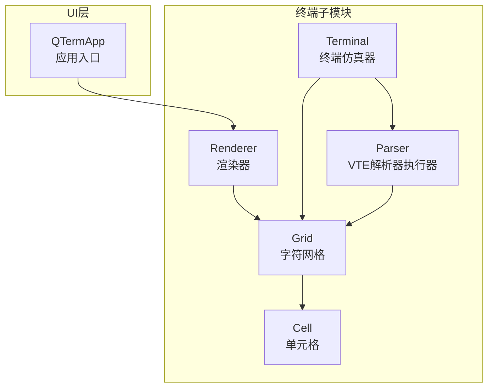
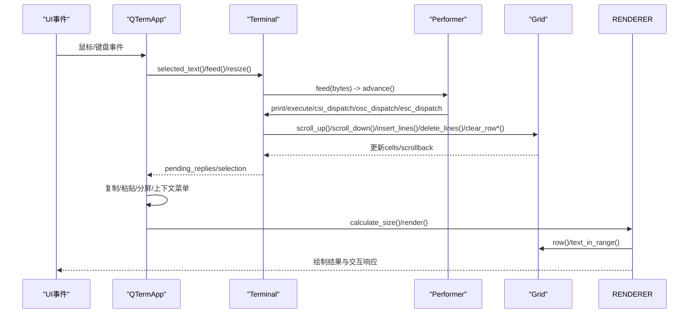
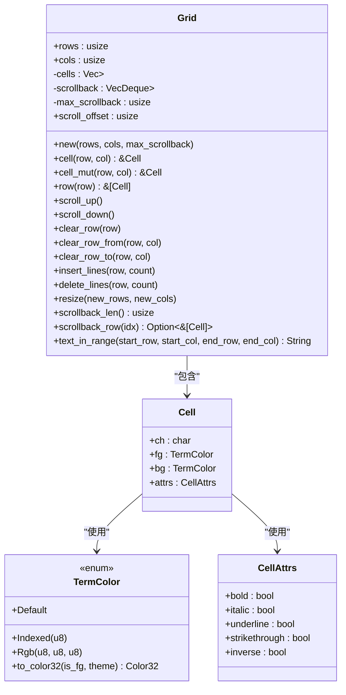
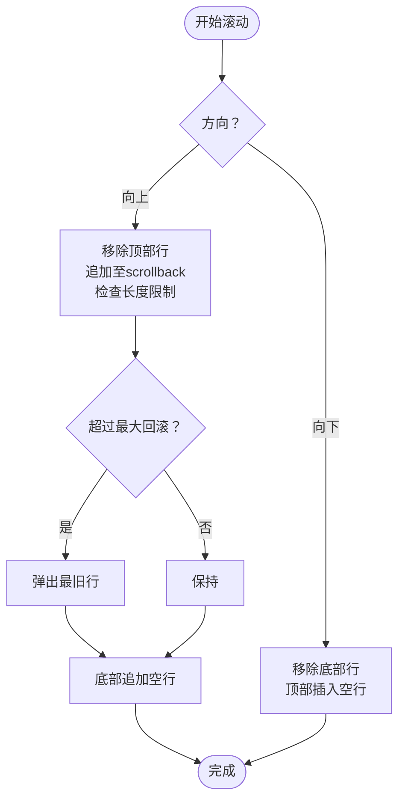
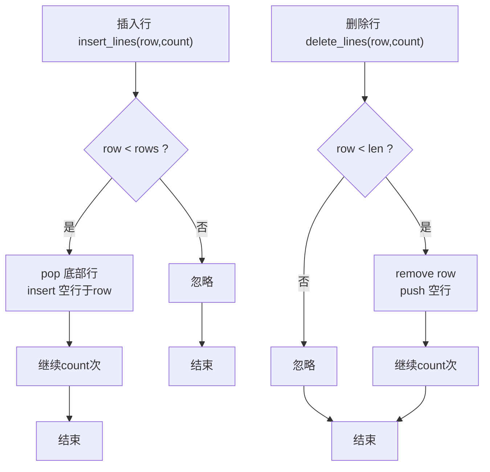
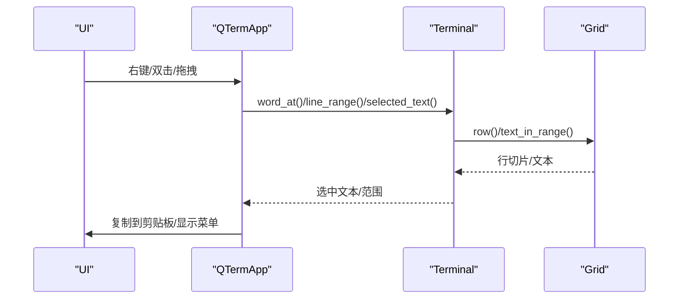
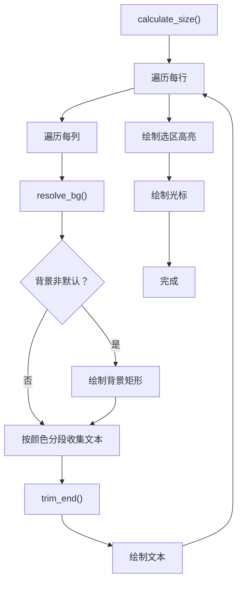
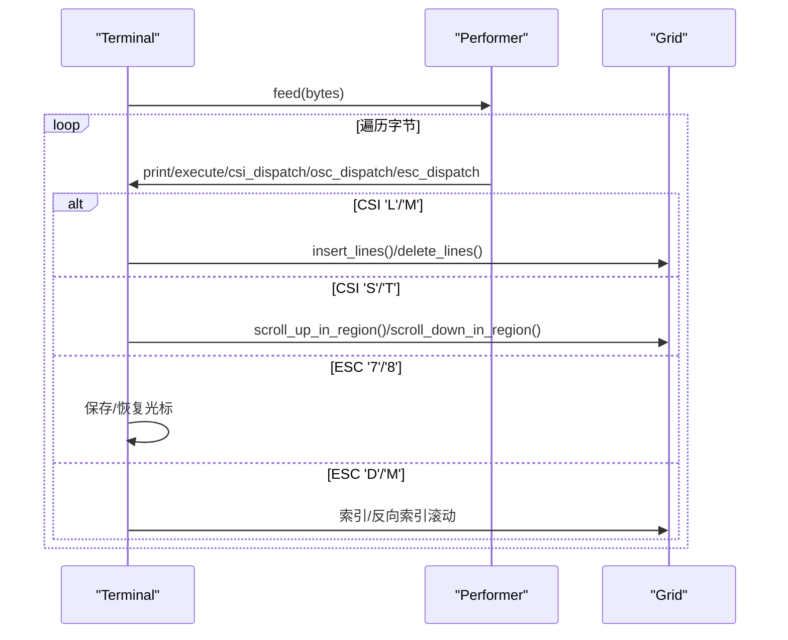
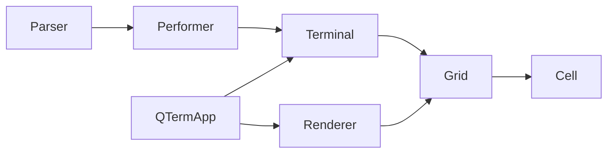

# 网格系统

<cite>
**本文档引用的文件**
- [grid.rs](file://src/terminal/grid.rs)
- [cell.rs](file://src/terminal/cell.rs)
- [mod.rs](file://src/terminal/mod.rs)
- [parser.rs](file://src/terminal/parser.rs)
- [renderer.rs](file://src/terminal/renderer.rs)
- [app.rs](file://src/app.rs)
</cite>

## 目录
1. [简介](#简介)
2. [项目结构](#项目结构)
3. [核心组件](#核心组件)
4. [架构总览](#架构总览)
5. [详细组件分析](#详细组件分析)
6. [依赖关系分析](#依赖关系分析)
7. [性能考量](#性能考量)
8. [故障排查指南](#故障排查指南)
9. [结论](#结论)
10. [附录](#附录)

## 简介
本文件面向QTerm的“网格系统”，系统性阐述终端字符网格的数据结构设计、滚动缓冲区的实现原理、网格操作的核心算法、文本提取与选择机制，并提供扩展指南（表格模式、高亮显示等）。文档同时给出可视化图示，帮助读者快速理解各模块之间的关系与数据流。

## 项目结构
网格系统位于终端子模块中，围绕Grid（字符网格）组织，Cell（单元格）承载字符与样式，Terminal（终端仿真器）协调解析器、渲染器与UI交互。整体采用“解析-渲染-交互”的分层架构。

图表来源
- [grid.rs:1-148](file://src/terminal/grid.rs#L1-L148)
- [cell.rs:1-75](file://src/terminal/cell.rs#L1-L75)
- [mod.rs:1-200](file://src/terminal/mod.rs#L1-L200)
- [parser.rs:1-311](file://src/terminal/parser.rs#L1-L311)
- [renderer.rs:1-198](file://src/terminal/renderer.rs#L1-L198)
- [app.rs:1-1349](file://src/app.rs#L1-L1349)

章节来源
- [grid.rs:1-148](file://src/terminal/grid.rs#L1-L148)
- [cell.rs:1-75](file://src/terminal/cell.rs#L1-L75)
- [mod.rs:1-200](file://src/terminal/mod.rs#L1-L200)
- [parser.rs:1-311](file://src/terminal/parser.rs#L1-L311)
- [renderer.rs:1-198](file://src/terminal/renderer.rs#L1-L198)
- [app.rs:1-1349](file://src/app.rs#L1-L1349)

## 核心组件
- Grid：二维字符网格，包含当前屏幕矩阵、回滚缓冲区、滚动偏移与最大回滚行数；提供滚动、插入/删除行、清屏、文本提取等操作。
- Cell：单元格，包含字符、前景/背景色、显示属性（粗体、斜体、下划线、删除线、反色），支持颜色索引与RGB映射。
- Terminal：终端仿真器，持有Grid、光标、颜色属性、滚动区域、选择范围、VTE解析器等，负责解析ANSI序列并驱动Grid状态。
- Parser：VTE解析器执行器，将字节流转换为终端状态变更（打印字符、控制字符、CSI/OSC/ESC序列），调用Terminal/GRID方法。
- Renderer：渲染器，基于egui绘制背景、文本、选区高亮与光标，计算单元格尺寸并处理交互响应。
- App：应用入口，调度渲染与输入事件，处理复制/粘贴、分屏、上下文菜单等UI行为。

章节来源
- [grid.rs:1-148](file://src/terminal/grid.rs#L1-L148)
- [cell.rs:1-75](file://src/terminal/cell.rs#L1-L75)
- [mod.rs:1-200](file://src/terminal/mod.rs#L1-L200)
- [parser.rs:1-311](file://src/terminal/parser.rs#L1-L311)
- [renderer.rs:1-198](file://src/terminal/renderer.rs#L1-L198)
- [app.rs:1-1349](file://src/app.rs#L1-L1349)

## 架构总览
网格系统贯穿“解析-渲染-交互”链路：
- 输入层：UI事件（鼠标/键盘）与后端输出（PTY/SSH）进入Terminal.feed，经VTE解析器分派到Performer。
- 状态层：Performer根据ANSI序列更新Terminal状态（光标、颜色、滚动区域）并调用Grid方法。
- 数据层：Grid维护cells与scrollback，提供滚动、插入/删除行、清屏与文本提取。
- 视觉层：Renderer按单元格绘制文本、选区与光标，支持颜色反转、背景优化与按颜色分段绘制。

图表来源
- [mod.rs:65-74](file://src/terminal/mod.rs#L65-L74)
- [parser.rs:10-32](file://src/terminal/parser.rs#L10-L32)
- [parser.rs:63-173](file://src/terminal/parser.rs#L63-L173)
- [grid.rs:46-102](file://src/terminal/grid.rs#L46-L102)
- [renderer.rs:42-180](file://src/terminal/renderer.rs#L42-L180)
- [app.rs:1052-1176](file://src/app.rs#L1052-L1176)

## 详细组件分析

### 数据结构设计：二维字符数组与索引机制
- Grid.cells：二维Vec<Vec<Cell>>，按行存储，行索引与列索引直接映射到单元格。
- Grid.scrollback：VecDeque<Vec<Cell>>，用于存储超出屏幕范围的历史行，支持固定大小限制。
- Grid.scroll_offset：当前可视偏移（0表示不滚动），配合渲染器使用。
- Cell：包含字符、前景/背景色（TermColor，默认/索引/RGB）、显示属性（CellAttrs）。

图表来源
- [grid.rs:7-14](file://src/terminal/grid.rs#L7-L14)
- [grid.rs:31-39](file://src/terminal/grid.rs#L31-L39)
- [grid.rs:126-147](file://src/terminal/grid.rs#L126-L147)
- [cell.rs:55-75](file://src/terminal/cell.rs#L55-L75)
- [cell.rs:27-53](file://src/terminal/cell.rs#L27-L53)
- [cell.rs:5-25](file://src/terminal/cell.rs#L5-L25)

章节来源
- [grid.rs:1-148](file://src/terminal/grid.rs#L1-L148)
- [cell.rs:1-75](file://src/terminal/cell.rs#L1-L75)

### 滚动缓冲区实现原理
- 固定大小缓冲区：通过max_scrollback限制scrollback长度，超过上限时弹出最旧行。
- 循环存储：scroll_up将顶部行移入scrollback，底部追加空行；scroll_down相反。
- 内存回收策略：VecDeque自动管理容量，当长度超过max_scrollback时，pop_front回收最旧行；resize时重设cells与scroll_offset。

图表来源
- [grid.rs:46-61](file://src/terminal/grid.rs#L46-L61)
- [grid.rs:117-119](file://src/terminal/grid.rs#L117-L119)
- [grid.rs:121-124](file://src/terminal/grid.rs#L121-L124)

章节来源
- [grid.rs:46-61](file://src/terminal/grid.rs#L46-L61)
- [grid.rs:117-124](file://src/terminal/grid.rs#L117-L124)

### 网格操作核心算法
- 插入行：insert_lines在指定行位置插入空行，同时将下方行下推，顶部行被挤出并可能进入scrollback。
- 删除行：delete_lines在指定行位置删除行，同时将下方行上拉，底部补空行。
- 滚动上移/下移：scroll_up/scroll_down分别触发滚动区域内的滚动逻辑，或在滚动区域内调用插入/删除行。
- 清屏：clear_row系列方法按行清理，支持从某列到行尾、从行首到某列、整行清理。

图表来源
- [grid.rs:84-102](file://src/terminal/grid.rs#L84-L102)
- [mod.rs:100-116](file://src/terminal/mod.rs#L100-L116)

章节来源
- [grid.rs:84-102](file://src/terminal/grid.rs#L84-L102)
- [mod.rs:100-116](file://src/terminal/mod.rs#L100-L116)

### 文本提取与选择机制
- 文本提取：text_in_range按行提取指定矩形区域文本，首行与末行使用指定列范围，中间行使用整行，行尾空格去除。
- 选择范围：Selection结构体记录起止行列；normalized_selection保证起止点有序；word_at与line_range用于双击/三击选择。
- UI交互：App根据鼠标事件计算行列，调用Terminal的word_at/line_range/selected_text，支持复制、粘贴、清屏、分屏等菜单操作。

图表来源
- [mod.rs:137-155](file://src/terminal/mod.rs#L137-L155)
- [mod.rs:158-199](file://src/terminal/mod.rs#L158-L199)
- [grid.rs:126-147](file://src/terminal/grid.rs#L126-L147)
- [app.rs:980-1050](file://src/app.rs#L980-L1050)
- [app.rs:1052-1176](file://src/app.rs#L1052-L1176)

章节来源
- [mod.rs:137-155](file://src/terminal/mod.rs#L137-L155)
- [mod.rs:158-199](file://src/terminal/mod.rs#L158-L199)
- [grid.rs:126-147](file://src/terminal/grid.rs#L126-L147)
- [app.rs:980-1050](file://src/app.rs#L980-L1050)
- [app.rs:1052-1176](file://src/app.rs#L1052-L1176)

### 渲染与颜色处理
- 渲染流程：calculate_size计算行列与单元格尺寸；render遍历cells，按颜色分段绘制文本，绘制选区背景与文本，最后绘制光标。
- 颜色解析：TermColor::to_color32根据前景/背景与主题映射颜色；resolve_fg/bg在反色模式下交换前景/背景。
- 性能优化：按颜色分段绘制减少绘制调用次数；仅对非默认背景的单元格绘制背景矩形。

图表来源
- [renderer.rs:25-40](file://src/terminal/renderer.rs#L25-L40)
- [renderer.rs:42-180](file://src/terminal/renderer.rs#L42-L180)
- [cell.rs:36-53](file://src/terminal/cell.rs#L36-L53)
- [renderer.rs:182-198](file://src/terminal/renderer.rs#L182-L198)

章节来源
- [renderer.rs:1-198](file://src/terminal/renderer.rs#L1-L198)
- [cell.rs:1-75](file://src/terminal/cell.rs#L1-L75)

### 解析与ANSI序列处理
- 解析器：Performer实现vte::Perform，处理print/execute/csi_dispatch/osc_dispatch/esc_dispatch。
- 关键操作：print在光标处写入字符并推进光标；CSI序列支持光标移动、清屏、插入/删除行、滚动、颜色设置；ESC序列支持索引/反向索引、保存/恢复光标、全复位；OSC序列用于设置标题。
- 终端联动：Performer调用Terminal方法（如enter_alt_screen/exit_alt_screen）与Grid方法（insert_lines/delete_lines/scroll_up_in_region/scroll_down_in_region）。

图表来源
- [mod.rs:65-74](file://src/terminal/mod.rs#L65-L74)
- [parser.rs:10-32](file://src/terminal/parser.rs#L10-L32)
- [parser.rs:63-173](file://src/terminal/parser.rs#L63-L173)
- [parser.rs:195-228](file://src/terminal/parser.rs#L195-L228)
- [grid.rs:84-102](file://src/terminal/grid.rs#L84-L102)
- [grid.rs:46-61](file://src/terminal/grid.rs#L46-L61)

章节来源
- [mod.rs:65-74](file://src/terminal/mod.rs#L65-L74)
- [parser.rs:10-32](file://src/terminal/parser.rs#L10-L32)
- [parser.rs:63-173](file://src/terminal/parser.rs#L63-L173)
- [parser.rs:195-228](file://src/terminal/parser.rs#L195-L228)
- [grid.rs:46-102](file://src/terminal/grid.rs#L46-L102)

## 依赖关系分析
- 组件耦合
  - Grid与Cell：强内聚，Grid持有Cell集合，Cell为值类型便于拷贝。
  - Terminal与Grid：Terminal持有Grid并驱动其状态变更，耦合度中等。
  - Parser与Terminal/Grid：Parser通过Performer间接调用Terminal/Grid方法，降低直接耦合。
  - Renderer与Grid：Renderer只读访问Grid（row/text_in_range），耦合度低。
- 外部依赖
  - vte：解析ANSI序列。
  - egui：渲染与交互。
  - 主题系统：TerminalTheme提供颜色映射。

图表来源
- [parser.rs:6-8](file://src/terminal/parser.rs#L6-L8)
- [mod.rs:24-41](file://src/terminal/mod.rs#L24-L41)
- [grid.rs:1-14](file://src/terminal/grid.rs#L1-L14)
- [renderer.rs:1-6](file://src/terminal/renderer.rs#L1-L6)
- [app.rs:1-10](file://src/app.rs#L1-L10)

章节来源
- [parser.rs:1-311](file://src/terminal/parser.rs#L1-L311)
- [mod.rs:1-200](file://src/terminal/mod.rs#L1-L200)
- [grid.rs:1-148](file://src/terminal/grid.rs#L1-L148)
- [renderer.rs:1-198](file://src/terminal/renderer.rs#L1-L198)
- [app.rs:1-1349](file://src/app.rs#L1-L1349)

## 性能考量
- 绘制优化
  - 按颜色分段绘制文本，减少绘制调用次数。
  - 仅对非默认背景的单元格绘制背景矩形，避免过度绘制。
- 内存管理
  - VecDeque滚动缓冲区自动管理容量，超过max_scrollback时弹出最旧行。
  - resize时统一调整cells与每行长度，避免碎片化。
- 计算复杂度
  - text_in_range为O(R*C)，其中R为行数，C为列数；在典型终端尺寸下可接受。
  - insert_lines/delete_lines为O(R*C)（最坏情况），但通常只影响局部行。

[本节为一般性指导，无需特定文件来源]

## 故障排查指南
- 文本复制为空
  - 检查Selection是否为空或起止点相等；确认normalized_selection是否正确排序。
  - 章节来源
    - [mod.rs:137-155](file://src/terminal/mod.rs#L137-L155)
- 选区高亮异常
  - 检查Renderer中选区背景与文本绘制顺序；确认col_start/col_end边界。
  - 章节来源
    - [renderer.rs:109-147](file://src/terminal/renderer.rs#L109-L147)
- 滚动缓冲区溢出
  - 确认max_scrollback设置合理；检查scroll_up后是否超过上限。
  - 章节来源
    - [grid.rs:46-61](file://src/terminal/grid.rs#L46-L61)
    - [grid.rs:117-119](file://src/terminal/grid.rs#L117-L119)
- 颜色显示异常
  - 检查TermColor::to_color32与resolve_fg/bg逻辑；确认反色模式下的颜色交换。
  - 章节来源
    - [cell.rs:36-53](file://src/terminal/cell.rs#L36-L53)
    - [renderer.rs:182-198](file://src/terminal/renderer.rs#L182-L198)

## 结论
QTerm网格系统以Grid为核心，结合Cell的丰富样式与Terminal的解析/渲染链路，实现了稳定的终端字符显示与交互体验。滚动缓冲区采用固定上限的循环队列，兼顾历史保留与内存效率；文本提取与选择机制完善，满足复制/粘贴与双击/三击等常见需求。建议在扩展功能时遵循现有接口契约，优先通过Terminal/Parser/Renderer的协作实现，确保一致性与可维护性。

[本节为总结性内容，无需特定文件来源]

## 附录

### 扩展指南：表格模式与高亮显示
- 表格模式
  - 建议在Terminal中新增表格状态（如表格区域、列宽、对齐方式），在Renderer中按列绘制边框与内容，必要时扩展Cell的样式字段（例如表格边框属性）。
  - 章节来源
    - [mod.rs:24-41](file://src/terminal/mod.rs#L24-L41)
    - [renderer.rs:42-180](file://src/terminal/renderer.rs#L42-L180)
- 高亮显示
  - 可在CellAttrs中增加高亮标记（如高亮颜色索引），在Renderer中根据高亮状态覆盖前景/背景色，或在选区绘制阶段叠加高亮效果。
  - 章节来源
    - [cell.rs:5-25](file://src/terminal/cell.rs#L5-L25)
    - [renderer.rs:109-147](file://src/terminal/renderer.rs#L109-L147)