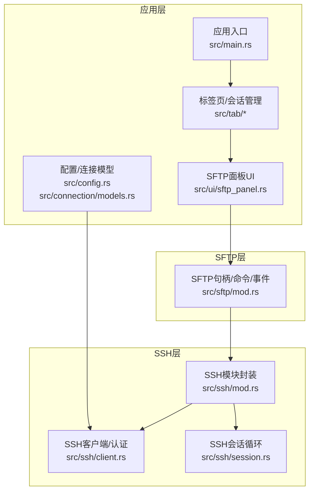
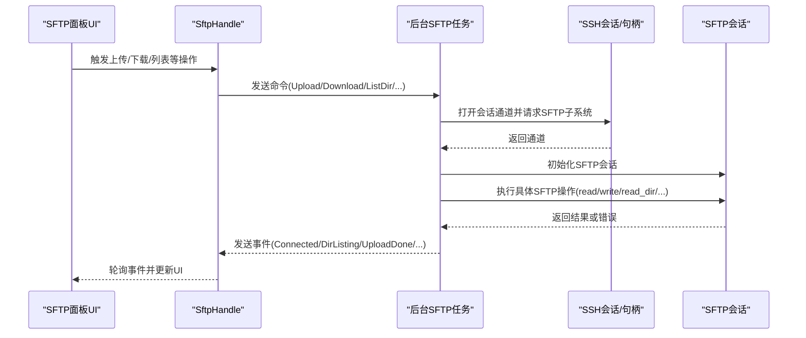
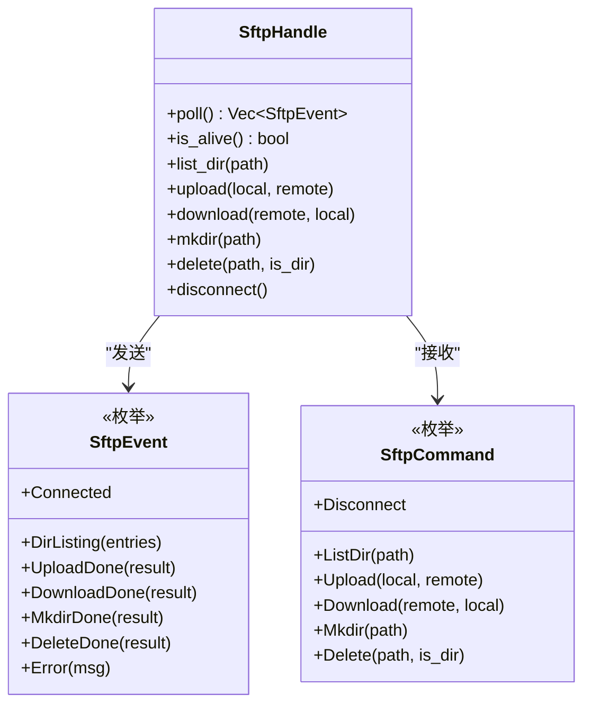
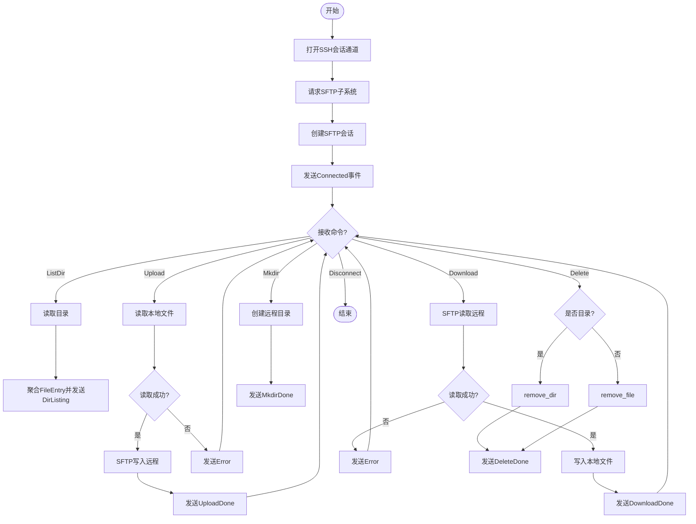
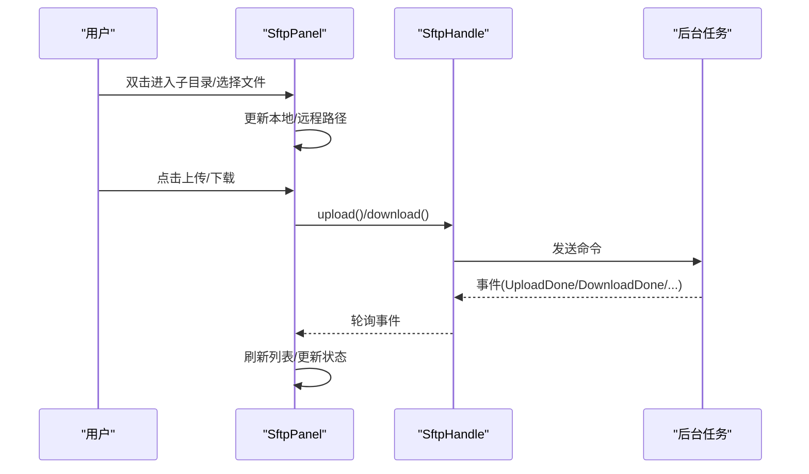
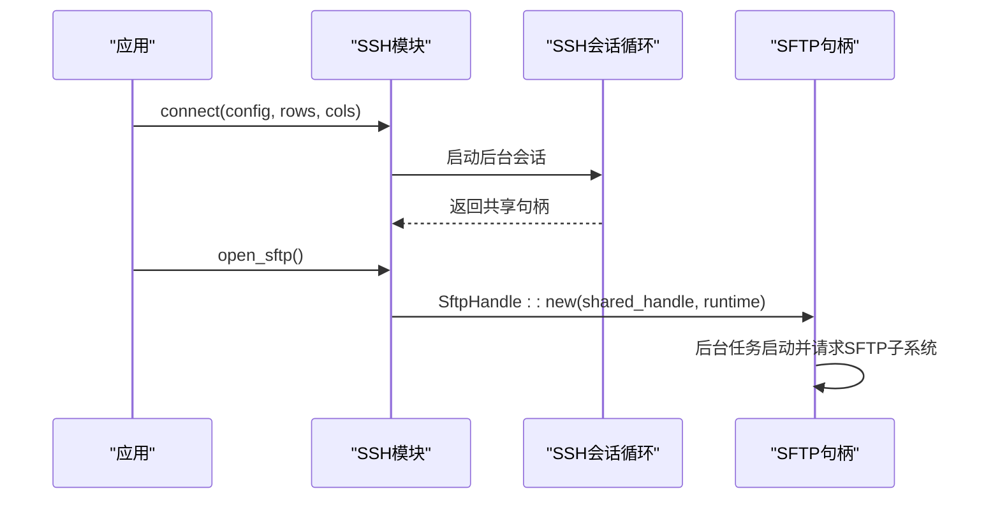
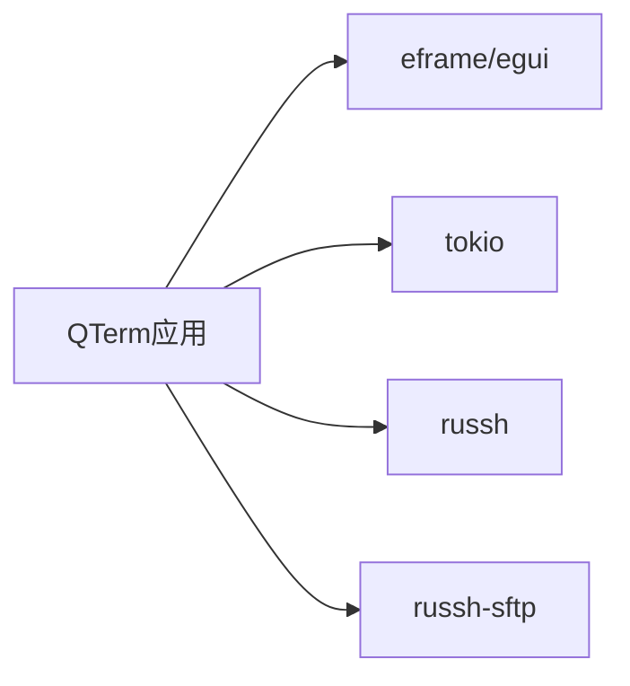

# SFTP文件传输

<cite>
**本文引用的文件**
- [src/sftp/mod.rs](file://src/sftp/mod.rs)
- [src/ui/sftp_panel.rs](file://src/ui/sftp_panel.rs)
- [src/ssh/client.rs](file://src/ssh/client.rs)
- [src/ssh/session.rs](file://src/ssh/session.rs)
- [src/ssh/mod.rs](file://src/ssh/mod.rs)
- [src/connection/models.rs](file://src/connection/models.rs)
- [src/app.rs](file://src/app.rs)
- [src/main.rs](file://src/main.rs)
- [Cargo.toml](file://Cargo.toml)
- [docs/specs/2026-05-30-phase3-sftp-design.md](file://docs/specs/2026-05-30-phase3-sftp-design.md)
</cite>

## 目录
1. [简介](#简介)
2. [项目结构](#项目结构)
3. [核心组件](#核心组件)
4. [架构总览](#架构总览)
5. [详细组件分析](#详细组件分析)
6. [依赖分析](#依赖分析)
7. [性能考虑](#性能考虑)
8. [故障排除指南](#故障排除指南)
9. [结论](#结论)
10. [附录](#附录)

## 简介
本文件面向QTerm的SFTP文件传输功能，系统性阐述其SFTP协议实现细节、文件系统操作、目录遍历与文件属性管理、双向文件传输机制（上传/下载）、会话管理与并发控制、进度监控现状、权限与符号链接处理、大文件传输优化建议，以及使用示例与故障排除策略。文档基于仓库现有代码与设计说明进行分析，并提供可视化图示帮助理解。

## 项目结构
QTerm采用模块化组织，SFTP相关代码位于独立模块，UI层通过面板组件与SFTP客户端句柄交互，SSH会话负责底层连接与通道复用，配置与连接模型支撑认证与参数传递。

**图表来源**
- [src/main.rs:51-87](file://src/main.rs#L51-L87)
- [src/ui/sftp_panel.rs:14-49](file://src/ui/sftp_panel.rs#L14-L49)
- [src/sftp/mod.rs:9-115](file://src/sftp/mod.rs#L9-L115)
- [src/ssh/mod.rs:59-136](file://src/ssh/mod.rs#L59-L136)
- [src/ssh/client.rs:25-63](file://src/ssh/client.rs#L25-L63)
- [src/ssh/session.rs:11-90](file://src/ssh/session.rs#L11-L90)
- [src/connection/models.rs:34-43](file://src/connection/models.rs#L34-L43)

**章节来源**
- [src/main.rs:51-87](file://src/main.rs#L51-L87)
- [src/ui/sftp_panel.rs:14-49](file://src/ui/sftp_panel.rs#L14-L49)
- [src/sftp/mod.rs:9-115](file://src/sftp/mod.rs#L9-L115)
- [src/ssh/mod.rs:59-136](file://src/ssh/mod.rs#L59-L136)
- [src/ssh/client.rs:25-63](file://src/ssh/client.rs#L25-L63)
- [src/ssh/session.rs:11-90](file://src/ssh/session.rs#L11-L90)
- [src/connection/models.rs:34-43](file://src/connection/models.rs#L34-L43)

## 核心组件
- SFTP客户端句柄（SftpHandle）：通过命令通道与事件通道与后台任务通信，提供目录列举、上传、下载、创建目录、删除等操作接口，并暴露轮询事件与存活检测。
- SFTP后台任务（sftp_task/handle_command）：在Tokio运行时中打开SSH子系统通道，初始化SFTP会话，循环处理命令并回发事件。
- SFTP面板UI（SftpPanel）：双栏文件浏览器，支持本地/远程路径导航、文件选择、上传/下载触发与状态反馈；轮询SFTP事件更新UI。
- SSH会话与句柄：复用同一SSH连接建立SFTP子系统通道，提供共享句柄传递给SFTP模块。
- 认证与配置：支持密码与私钥认证，连接模型包含主机、端口、用户名、认证方式等。

**章节来源**
- [src/sftp/mod.rs:9-115](file://src/sftp/mod.rs#L9-L115)
- [src/sftp/mod.rs:119-167](file://src/sftp/mod.rs#L119-L167)
- [src/sftp/mod.rs:169-238](file://src/sftp/mod.rs#L169-L238)
- [src/ui/sftp_panel.rs:14-49](file://src/ui/sftp_panel.rs#L14-L49)
- [src/ui/sftp_panel.rs:52-110](file://src/ui/sftp_panel.rs#L52-L110)
- [src/ssh/mod.rs:59-136](file://src/ssh/mod.rs#L59-L136)
- [src/ssh/client.rs:25-63](file://src/ssh/client.rs#L25-L63)

## 架构总览
SFTP功能以“UI面板 -> SFTP句柄 -> 后台任务 -> SSH子系统 -> SFTP会话”的链路工作。UI通过SftpPanel驱动SftpHandle发出命令，后台任务在异步环境中与SFTP会话交互，所有操作均通过SSH共享句柄复用同一底层连接，降低资源消耗。

**图表来源**
- [src/ui/sftp_panel.rs:52-110](file://src/ui/sftp_panel.rs#L52-L110)
- [src/sftp/mod.rs:49-115](file://src/sftp/mod.rs#L49-L115)
- [src/sftp/mod.rs:119-167](file://src/sftp/mod.rs#L119-L167)
- [src/sftp/mod.rs:169-238](file://src/sftp/mod.rs#L169-L238)
- [src/ssh/mod.rs:133-136](file://src/ssh/mod.rs#L133-L136)

## 详细组件分析

### SFTP句柄与后台任务
- 结构与职责
  - SftpHandle：持有事件接收端、命令发送端与存活标志，提供list_dir/upload/download/mkdir/delete/disconnect等方法。
  - 后台任务：在Tokio运行时中启动，打开SSH会话通道并请求SFTP子系统，初始化SftpSession，循环接收命令并处理，最终关闭会话。
- 数据流
  - 命令通道：主线程向后台任务发送操作请求。
  - 事件通道：后台任务向主线程发送操作结果与错误。
- 并发与同步
  - 使用Tokio多路复用通道，配合原子布尔标志控制生命周期。
  - 事件通道为同步MPSC，命令通道为异步MPSC，容量为256。

**图表来源**
- [src/sftp/mod.rs:9-44](file://src/sftp/mod.rs#L9-L44)
- [src/sftp/mod.rs:46-115](file://src/sftp/mod.rs#L46-L115)

**章节来源**
- [src/sftp/mod.rs:9-115](file://src/sftp/mod.rs#L9-L115)
- [src/sftp/mod.rs:119-167](file://src/sftp/mod.rs#L119-L167)
- [src/sftp/mod.rs:169-238](file://src/sftp/mod.rs#L169-L238)

### SFTP后台任务与命令处理
- 通道与会话初始化
  - 通过共享SSH句柄打开会话通道，请求SFTP子系统，创建SftpSession。
  - 成功后发送Connected事件，随后进入命令循环。
- 命令处理
  - ListDir：读取远程目录，聚合为FileEntry列表并返回。
  - Upload：读取本地文件字节，调用SFTP写入远程路径。
  - Download：调用SFTP读取远程文件，写入本地路径。
  - Mkdir/Remove：创建/删除远程目录或文件。
  - 错误统一包装为Error事件。
- 生命周期
  - 通过alive标志与命令Disconnect优雅退出，关闭SFTP会话。

**图表来源**
- [src/sftp/mod.rs:119-167](file://src/sftp/mod.rs#L119-L167)
- [src/sftp/mod.rs:169-238](file://src/sftp/mod.rs#L169-L238)

**章节来源**
- [src/sftp/mod.rs:119-167](file://src/sftp/mod.rs#L119-L167)
- [src/sftp/mod.rs:169-238](file://src/sftp/mod.rs#L169-L238)

### SFTP面板UI与交互
- 双栏浏览
  - 左侧本地文件系统，右侧远程文件系统，支持双击进入子目录、单击选择。
  - 本地路径默认为用户主目录，远程路径默认为根目录。
- 操作触发
  - 上传：选中本地文件，点击“上传 ->”，构造本地/远程路径并调用SftpHandle.upload。
  - 下载：选中远程文件，点击“<- 下载”，构造远程/本地路径并调用SftpHandle.download。
- 状态与刷新
  - Connected后请求远程目录列表，轮询事件更新状态与文件列表。
  - 上传/下载完成后刷新对应侧列表。

**图表来源**
- [src/ui/sftp_panel.rs:114-152](file://src/ui/sftp_panel.rs#L114-L152)
- [src/ui/sftp_panel.rs:326-356](file://src/ui/sftp_panel.rs#L326-L356)
- [src/ui/sftp_panel.rs:52-110](file://src/ui/sftp_panel.rs#L52-L110)
- [src/sftp/mod.rs:85-114](file://src/sftp/mod.rs#L85-L114)

**章节来源**
- [src/ui/sftp_panel.rs:14-49](file://src/ui/sftp_panel.rs#L14-L49)
- [src/ui/sftp_panel.rs:114-152](file://src/ui/sftp_panel.rs#L114-L152)
- [src/ui/sftp_panel.rs:326-356](file://src/ui/sftp_panel.rs#L326-L356)
- [src/ui/sftp_panel.rs:52-110](file://src/ui/sftp_panel.rs#L52-L110)
- [src/sftp/mod.rs:85-114](file://src/sftp/mod.rs#L85-L114)

### SSH会话与SFTP复用
- SSH会话循环负责建立连接、请求PTY与Shell，同时将共享句柄传递给其他子系统（如SFTP）。
- SftpHandle::new通过共享SSH句柄在后台任务中打开SFTP子系统，实现“一个SSH连接，多个子系统”的高效复用。

**图表来源**
- [src/ssh/mod.rs:68-136](file://src/ssh/mod.rs#L68-L136)
- [src/ssh/session.rs:11-90](file://src/ssh/session.rs#L11-L90)
- [src/sftp/mod.rs:49-68](file://src/sftp/mod.rs#L49-L68)

**章节来源**
- [src/ssh/mod.rs:68-136](file://src/ssh/mod.rs#L68-L136)
- [src/ssh/session.rs:11-90](file://src/ssh/session.rs#L11-L90)
- [src/sftp/mod.rs:49-68](file://src/sftp/mod.rs#L49-L68)

### 文件系统操作与目录遍历
- 目录遍历：ListDir通过SFTP读取目录，聚合为FileEntry（包含名称、是否目录、大小），并发送DirListing事件。
- 文件属性：当前实现提取文件名、类型与大小字段；权限与时间戳未在事件中体现。
- 符号链接：代码未显式处理符号链接，目录遍历与文件读写行为遵循SFTP会话默认语义。

**章节来源**
- [src/sftp/mod.rs:176-196](file://src/sftp/mod.rs#L176-L196)
- [src/sftp/mod.rs:18-21](file://src/sftp/mod.rs#L18-L21)

### 双向文件传输机制
- 上传（本地→远程）：SftpHandle.upload触发后台任务读取本地文件字节并写入远程路径，完成后发送UploadDone事件。
- 下载（远程→本地）：SftpHandle.download触发后台任务读取远程文件字节并写入本地路径，完成后发送DownloadDone事件。
- 断点续传：当前实现未提供断点续传功能，建议后续引入偏移读写与本地断点记录机制。

**章节来源**
- [src/sftp/mod.rs:198-218](file://src/sftp/mod.rs#L198-L218)
- [src/ui/sftp_panel.rs:326-356](file://src/ui/sftp_panel.rs#L326-L356)

### 会话管理、并发控制与进度监控
- 会话管理：通过alive标志与命令Disconnect控制后台任务生命周期；SSH会话循环同样使用alive标志控制主循环。
- 并发控制：命令通道容量为256，事件通道为同步MPSC，后台任务串行处理命令，避免竞态。
- 进度监控：当前事件未携带传输进度信息，仅在完成后通知。建议扩展事件结构以携带已传输字节数与总大小。

**章节来源**
- [src/sftp/mod.rs:54-55](file://src/sftp/mod.rs#L54-L55)
- [src/sftp/mod.rs:155-162](file://src/sftp/mod.rs#L155-L162)
- [src/ssh/session.rs:49-82](file://src/ssh/session.rs#L49-L82)

### 权限处理、符号链接支持与大文件优化
- 权限处理：当前未对文件权限进行显式设置或查询；如需保留权限，可在后续扩展中加入chmod/stat操作。
- 符号链接：未见专门处理逻辑；若需要跟随符号链接或跳过，需在目录遍历与文件操作中增加相应选项。
- 大文件优化：当前实现一次性读取本地文件与一次性写入远程文件，内存占用与网络带宽压力较大。建议改为分块读写（chunked read/write），结合进度事件与背压控制，提升稳定性与用户体验。

**章节来源**
- [src/sftp/mod.rs:200-207](file://src/sftp/mod.rs#L200-L207)
- [src/sftp/mod.rs:211-218](file://src/sftp/mod.rs#L211-L218)

## 依赖分析
- russh与russh-sftp：提供SSH客户端与SFTP会话能力。
- tokio：提供异步运行时与通道，支撑后台任务与并发控制。
- eframe/egui：提供UI框架，SFTP面板基于该框架构建。

**图表来源**
- [Cargo.toml:8-25](file://Cargo.toml#L8-L25)

**章节来源**
- [Cargo.toml:8-25](file://Cargo.toml#L8-L25)

## 性能考虑
- 内存与带宽
  - 当前上传/下载为全量读取/写入，大文件易导致内存峰值与网络拥塞。建议采用分块策略与背压控制。
- 并发与吞吐
  - 后台任务串行处理命令，简单可靠但吞吐受限。可考虑命令队列与任务池化，但需注意SFTP协议的有序性要求。
- UI响应
  - UI轮询事件，建议在渲染循环中批量处理事件，避免频繁重绘。

[本节为通用性能讨论，无需特定文件引用]

## 故障排除指南
- 连接/认证问题
  - 检查SSH配置与认证方式（密码/私钥），确认主机可达与端口开放。
  - 若出现“SFTP子系统请求失败/会话初始化失败/打开通道失败”等错误，优先排查SSH会话是否正常建立。
- 传输错误
  - 上传/下载失败时，事件中会携带错误信息；检查本地路径可读性、远程路径可写性与磁盘空间。
- 会话中断
  - 若UI提示“连接断开”，检查alive标志与后台任务是否仍在运行；必要时重新发起SFTP会话。
- 权限与符号链接
  - 若遇到权限不足或符号链接异常，建议在后续版本中增加权限设置与符号链接处理选项。

**章节来源**
- [src/sftp/mod.rs:131-147](file://src/sftp/mod.rs#L131-L147)
- [src/sftp/mod.rs:194](file://src/sftp/mod.rs#L194)
- [src/sftp/mod.rs:204](file://src/sftp/mod.rs#L204)
- [src/sftp/mod.rs:216](file://src/sftp/mod.rs#L216)

## 结论
QTerm的SFTP功能以简洁可靠的架构实现了基础的文件传输与目录浏览，通过SSH复用与异步通道保证了良好的并发与资源利用率。当前版本在进度监控与大文件优化方面存在改进空间，断点续传与权限/符号链接支持亦可增强。建议在保持现有架构稳定的基础上，逐步引入分块传输、进度事件与权限管理等特性，以满足更复杂的生产环境需求。

[本节为总结性内容，无需特定文件引用]

## 附录

### 使用示例（基于现有实现）
- 在SSH终端Pane中右键选择“SFTP”，在当前Tab中添加SFTP Pane。
- SFTP Pane自动复用当前SSH连接，打开远程根目录，本地路径默认为主目录。
- 双击进入子目录，单击选中文件，点击“上传 ->”或“<- 下载”执行传输。
- 传输完成后，面板会刷新对应侧列表并显示状态信息。

**章节来源**
- [docs/specs/2026-05-30-phase3-sftp-design.md:157-174](file://docs/specs/2026-05-30-phase3-sftp-design.md#L157-L174)

### 设计与实现对照
- 设计文档规划了SFTP面板UI、传输列表与进度展示，当前实现已具备双栏浏览与基本传输能力，进度监控与传输列表可按设计逐步完善。

**章节来源**
- [docs/specs/2026-05-30-phase3-sftp-design.md:90-155](file://docs/specs/2026-05-30-phase3-sftp-design.md#L90-L155)