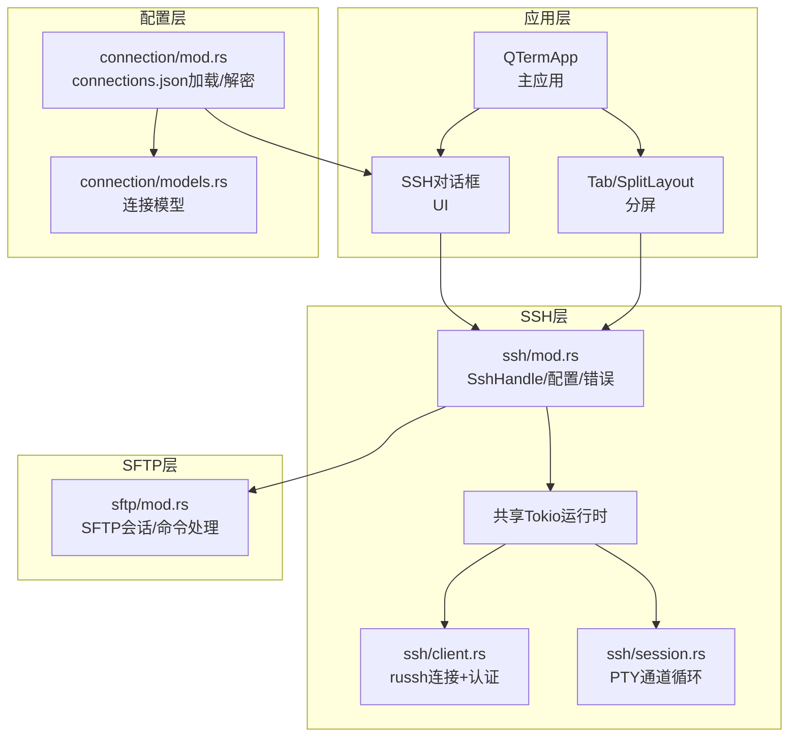
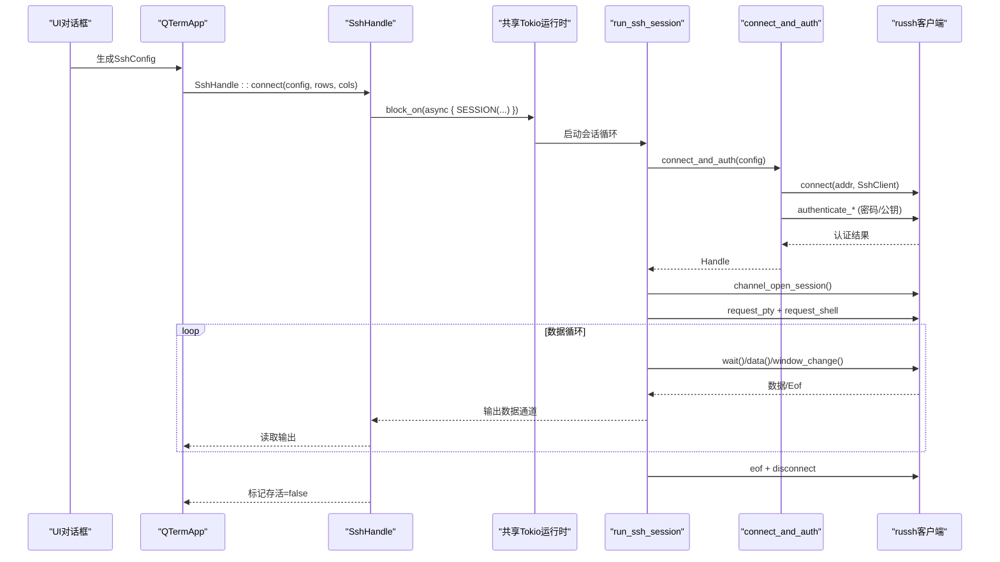
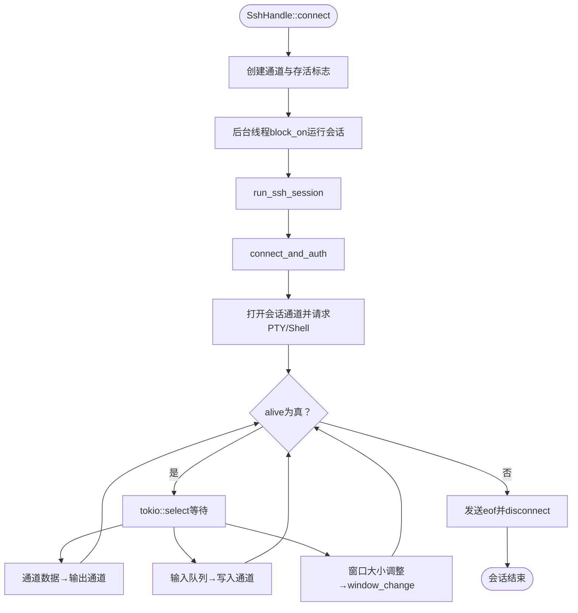
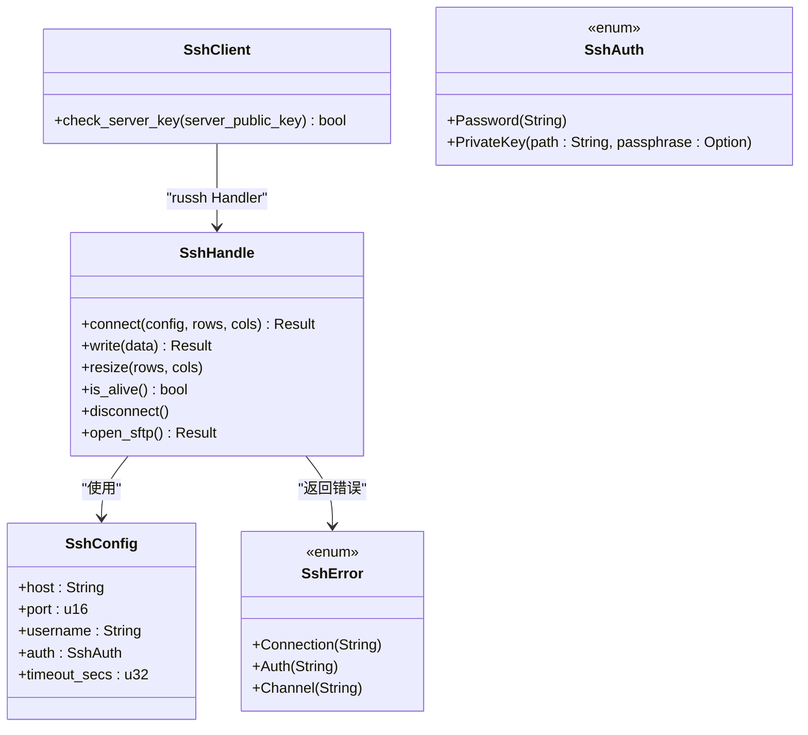
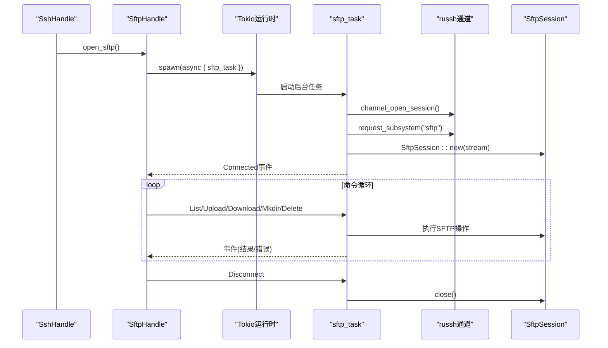
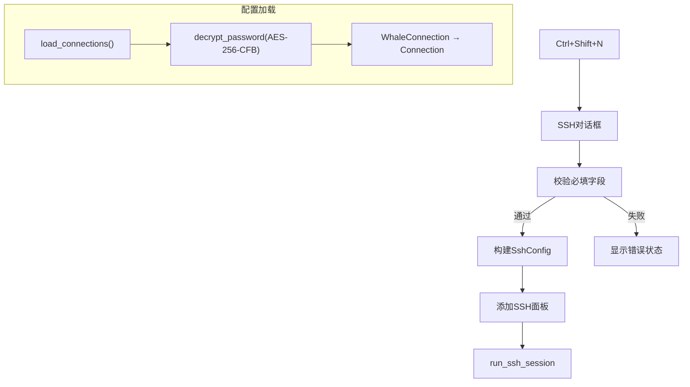
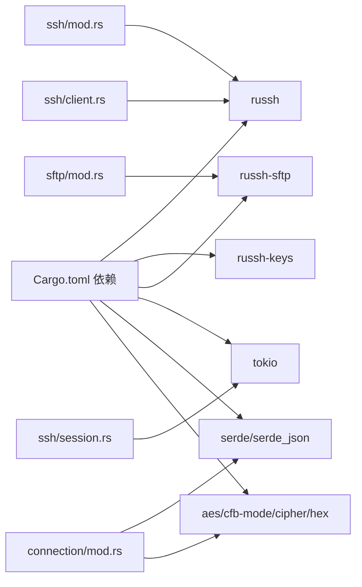

# SSH连接系统

<cite>
**本文档引用的文件**
- [src/ssh/mod.rs](file://src/ssh/mod.rs)
- [src/ssh/client.rs](file://src/ssh/client.rs)
- [src/ssh/session.rs](file://src/ssh/session.rs)
- [src/sftp/mod.rs](file://src/sftp/mod.rs)
- [src/ui/ssh_dialog.rs](file://src/ui/ssh_dialog.rs)
- [src/connection/mod.rs](file://src/connection/mod.rs)
- [src/connection/models.rs](file://src/connection/models.rs)
- [src/app.rs](file://src/app.rs)
- [Cargo.toml](file://Cargo.toml)
- [docs/specs/2026-05-30-phase2-ssh-split-design.md](file://docs/specs/2026-05-30-phase2-ssh-split-design.md)
- [docs/plans/2026-05-30-phase2-ssh-split.md](file://docs/plans/2026-05-30-phase2-ssh-split.md)
</cite>

## 目录
1. [简介](#简介)
2. [项目结构](#项目结构)
3. [核心组件](#核心组件)
4. [架构总览](#架构总览)
5. [详细组件分析](#详细组件分析)
6. [依赖关系分析](#依赖关系分析)
7. [性能考量](#性能考量)
8. [故障排除指南](#故障排除指南)
9. [结论](#结论)
10. [附录](#附录)

## 简介
本文件为QTerm SSH连接系统的详细技术文档，聚焦于SSH客户端实现架构与russh协议栈的集成使用。文档深入解释SSH会话生命周期管理（从连接建立、认证验证到会话关闭）、多种认证方式（密码认证、公钥认证）与密钥交换机制、会话状态管理、错误处理与重连机制，并提供配置示例与最佳实践，涵盖安全性与性能优化建议。

## 项目结构
QTerm采用模块化组织，SSH相关代码集中在src/ssh目录，UI层通过对话框收集连接参数，连接配置来自WhaleTerm的connections.json文件并通过AES-256-CFB解密存储的密码。SFTP功能作为SSH子系统复用russh-sftp实现。

**图表来源**
- [src/app.rs:540-551](file://src/app.rs#L540-L551)
- [src/ui/ssh_dialog.rs:115-146](file://src/ui/ssh_dialog.rs#L115-L146)
- [src/ssh/mod.rs:8-16](file://src/ssh/mod.rs#L8-L16)
- [src/ssh/client.rs:25-63](file://src/ssh/client.rs#L25-L63)
- [src/ssh/session.rs:11-90](file://src/ssh/session.rs#L11-L90)
- [src/sftp/mod.rs:46-115](file://src/sftp/mod.rs#L46-L115)
- [src/connection/mod.rs:28-59](file://src/connection/mod.rs#L28-L59)
- [src/connection/models.rs:1-43](file://src/connection/models.rs#L1-L43)

**章节来源**
- [src/ssh/mod.rs:1-136](file://src/ssh/mod.rs#L1-L136)
- [src/ssh/client.rs:1-63](file://src/ssh/client.rs#L1-L63)
- [src/ssh/session.rs:1-90](file://src/ssh/session.rs#L1-L90)
- [src/sftp/mod.rs:1-238](file://src/sftp/mod.rs#L1-L238)
- [src/ui/ssh_dialog.rs:1-147](file://src/ui/ssh_dialog.rs#L1-L147)
- [src/connection/mod.rs:1-148](file://src/connection/mod.rs#L1-L148)
- [src/connection/models.rs:1-43](file://src/connection/models.rs#L1-L43)
- [src/app.rs:540-551](file://src/app.rs#L540-L551)
- [Cargo.toml:1-30](file://Cargo.toml#L1-L30)

## 核心组件
- SSH配置与错误类型：定义SshConfig、SshAuth（密码/私钥）与SshError（连接/认证/通道）。
- SSH句柄SshHandle：封装读写通道、终端大小调整通道、存活标志与russh客户端句柄，提供connect/write/resize/is_alive/disconnect/open_sftp等接口。
- 客户端处理器SshClient：实现russh Handler接口，当前自动接受服务器密钥。
- 连接与认证connect_and_auth：基于russh建立TCP连接，根据SshAuth选择密码或公钥认证。
- 会话循环run_ssh_session：打开PTY通道、请求Shell，通过tokio::select处理数据读取、输入写入与窗口大小调整。
- 共享Tokio运行时：全局OnceLock懒初始化，供SSH模块内部异步任务使用。
- SFTP子系统：通过现有SSH通道打开sftp子系统，提供目录列表、上传、下载、创建目录、删除等操作。
- UI对话框：收集主机、端口、用户名、认证模式（密码/私钥）与密钥参数，生成SshConfig并触发连接。
- 连接配置加载：从WhaleTerm配置文件connections.json加载连接列表，解密存储的密码。

**章节来源**
- [src/ssh/mod.rs:18-136](file://src/ssh/mod.rs#L18-L136)
- [src/ssh/client.rs:6-63](file://src/ssh/client.rs#L6-L63)
- [src/ssh/session.rs:9-90](file://src/ssh/session.rs#L9-L90)
- [src/sftp/mod.rs:7-115](file://src/sftp/mod.rs#L7-L115)
- [src/ui/ssh_dialog.rs:11-147](file://src/ui/ssh_dialog.rs#L11-L147)
- [src/connection/mod.rs:28-148](file://src/connection/mod.rs#L28-L148)
- [src/connection/models.rs:1-43](file://src/connection/models.rs#L1-L43)

## 架构总览
SSH模块采用“GUI线程+共享Tokio运行时”的异步架构：GUI线程负责UI与数据通道，Tokio运行时承载russh异步任务；SshHandle.connect在后台线程中block_on运行会话循环，通过mpsc通道与主线程通信。SFTP通过现有SSH通道复用russh-sftp实现。

**图表来源**
- [src/ui/ssh_dialog.rs:115-146](file://src/ui/ssh_dialog.rs#L115-L146)
- [src/ssh/mod.rs:71-109](file://src/ssh/mod.rs#L71-L109)
- [src/ssh/session.rs:21-89](file://src/ssh/session.rs#L21-L89)
- [src/ssh/client.rs:25-63](file://src/ssh/client.rs#L25-L63)

## 详细组件分析

### SSH句柄与会话生命周期
- 连接建立：SshHandle::connect创建输出、输入、大小调整通道与存活标志，调用get_runtime获取共享Tokio运行时，在后台线程中block_on运行run_ssh_session。
- 会话循环：run_ssh_session内先connect_and_auth，再打开会话通道、请求PTY与Shell；通过tokio::select并发处理通道消息、输入队列与大小调整请求；收到EOF或alive=false时结束循环并发送eof与disconnect。
- 生命周期管理：alive标志在会话开始时true，后台线程退出时设为false；SshHandle提供is_alive与disconnect接口；open_sftp复用russh客户端句柄。

**图表来源**
- [src/ssh/mod.rs:71-109](file://src/ssh/mod.rs#L71-L109)
- [src/ssh/session.rs:11-90](file://src/ssh/session.rs#L11-L90)

**章节来源**
- [src/ssh/mod.rs:68-136](file://src/ssh/mod.rs#L68-L136)
- [src/ssh/session.rs:9-90](file://src/ssh/session.rs#L9-L90)

### 认证方式与密钥交换
- 密码认证：connect_and_auth调用authenticate_password(username, password)，返回认证结果。
- 公钥认证：connect_and_auth加载私钥文件（russh-keys），构造key pair后调用authenticate_publickey。
- 密钥交换：russh内部完成密钥交换与加密协商，对外通过Handler接口暴露check_server_key（当前自动接受）。
- 认证失败处理：若认证未成功，返回SshError::Auth。

**图表来源**
- [src/ssh/client.rs:6-21](file://src/ssh/client.rs#L6-L21)
- [src/ssh/mod.rs:18-66](file://src/ssh/mod.rs#L18-L66)

**章节来源**
- [src/ssh/client.rs:23-63](file://src/ssh/client.rs#L23-L63)
- [src/ssh/mod.rs:28-41](file://src/ssh/mod.rs#L28-L41)

### SFTP子系统与通道复用
- SFTP会话：SftpHandle::new通过现有SSH通道打开sftp子系统，创建SftpSession；后台任务循环处理命令（列表、上传、下载、创建目录、删除）。
- 事件与命令：通过事件通道向主线程报告结果，通过命令通道接收操作请求；alive标志控制循环终止。
- 与SSH复用：open_sftp直接复用SshHandle持有的russh客户端句柄，避免重复握手。

**图表来源**
- [src/ssh/mod.rs:132-136](file://src/ssh/mod.rs#L132-L136)
- [src/sftp/mod.rs:46-167](file://src/sftp/mod.rs#L46-L167)

**章节来源**
- [src/sftp/mod.rs:7-238](file://src/sftp/mod.rs#L7-L238)

### UI对话框与连接配置
- SSH对话框：支持主机、端口、用户名输入，认证模式切换（密码/私钥），生成SshConfig并返回给主逻辑。
- 连接配置加载：从WhaleTerm配置文件加载连接列表，解密存储的AES-256-CFB密码，生成简化连接结构体供UI展示与双击打开。
- 主应用集成：监听OpenSshDialog快捷键，显示对话框；收到SshConfig后添加SSH面板。

**图表来源**
- [src/ui/ssh_dialog.rs:115-147](file://src/ui/ssh_dialog.rs#L115-L147)
- [src/connection/mod.rs:28-98](file://src/connection/mod.rs#L28-L98)
- [src/connection/models.rs:17-43](file://src/connection/models.rs#L17-L43)
- [src/app.rs:368-551](file://src/app.rs#L368-L551)

**章节来源**
- [src/ui/ssh_dialog.rs:11-147](file://src/ui/ssh_dialog.rs#L11-L147)
- [src/connection/mod.rs:28-148](file://src/connection/mod.rs#L28-L148)
- [src/connection/models.rs:1-43](file://src/connection/models.rs#L1-L43)
- [src/app.rs:368-551](file://src/app.rs#L368-L551)

## 依赖关系分析
- russh/russh-keys：SSH协议栈与密钥解析，提供连接、认证、通道与子系统能力。
- russh-sftp：基于russh通道的SFTP实现。
- tokio：rt-multi-thread特性用于SSH模块内部异步运行。
- async-trait：为russh Handler提供异步trait实现。
- serde/serde_json：连接配置文件的序列化与反序列化。
- aes/cfb-mode/cipher/hex：WhaleTerm配置文件中密码的解密与十六进制编码。

**图表来源**
- [Cargo.toml:8-25](file://Cargo.toml#L8-L25)
- [src/ssh/mod.rs:1-16](file://src/ssh/mod.rs#L1-L16)
- [src/ssh/client.rs:1-4](file://src/ssh/client.rs#L1-L4)
- [src/sftp/mod.rs:1-3](file://src/sftp/mod.rs#L1-L3)
- [src/connection/mod.rs:64-148](file://src/connection/mod.rs#L64-L148)

**章节来源**
- [Cargo.toml:8-25](file://Cargo.toml#L8-L25)

## 性能考量
- 异步运行时：SSH模块使用共享Tokio运行时，避免每连接创建独立运行时带来的额外开销。
- 通道缓冲：输入与大小调整通道设置合理容量（writer通道256，resize通道16），平衡吞吐与内存占用。
- 事件驱动：通过tokio::select并发处理读写与调整，减少阻塞。
- 资源复用：SFTP直接复用SSH通道，避免重复握手与加密协商。
- UI与网络分离：GUI线程只负责UI与通道调度，网络I/O在Tokio运行时中执行，降低UI卡顿风险。

[本节为通用性能讨论，无需特定文件来源]

## 故障排除指南
- 连接失败：检查主机、端口与网络可达性；查看SshError::Connection错误信息。
- 认证失败：核对用户名与密码/私钥路径及密码；确认私钥格式与passphrase正确；查看SshError::Auth。
- 通道错误：如PTY请求或Shell启动失败，检查远端权限与shell配置；查看SshError::Channel。
- SFTP错误：检查SFTP子系统是否启用、权限与路径；查看SftpEvent::Error。
- UI状态：SSH对话框显示错误状态时，修正输入后重新连接。
- 配置解密：WhaleTerm配置文件中密码解密失败时，确认密钥派生逻辑与硬件环境（主板序列号）。

**章节来源**
- [src/ssh/mod.rs:35-53](file://src/ssh/mod.rs#L35-L53)
- [src/sftp/mod.rs:23-33](file://src/sftp/mod.rs#L23-L33)
- [src/ui/ssh_dialog.rs:96-100](file://src/ui/ssh_dialog.rs#L96-L100)
- [src/connection/mod.rs:64-148](file://src/connection/mod.rs#L64-L148)

## 结论
QTerm的SSH连接系统以russh为核心，结合共享Tokio运行时与通道通信机制，实现了稳定的远程终端会话与SFTP子系统复用。系统支持密码与公钥两种认证方式，具备良好的扩展性与性能表现。未来可在安全方面引入known_hosts与更严格的密钥校验，在可靠性方面增加重连与心跳机制。

[本节为总结性内容，无需特定文件来源]

## 附录

### SSH连接配置示例与最佳实践
- 基本配置：主机、端口、用户名、认证方式（密码或私钥路径+可选passphrase）。
- 安全建议：
  - 优先使用公钥认证，避免弱密码。
  - 私钥文件权限严格限制（仅所有者可读）。
  - 使用强passphrase保护私钥。
  - 保持russh版本更新，关注安全补丁。
- 性能优化：
  - 合理设置通道缓冲大小，避免过大内存占用。
  - 使用SFTP复用现有SSH通道，减少握手次数。
  - 在UI层避免频繁resize请求，合并调整频率。
- 错误处理：
  - 认证失败时提示具体原因，引导用户检查凭据。
  - 通道异常时主动发送eof并断开，确保资源释放。
  - SFTP操作失败时记录详细错误，便于排查。

[本节为通用指导，无需特定文件来源]