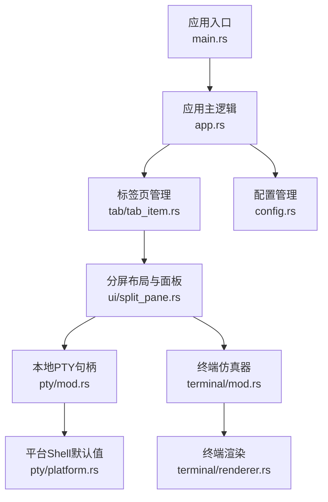
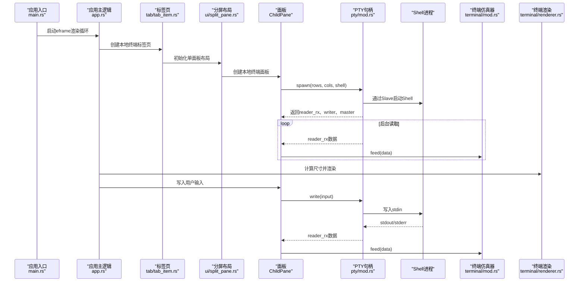
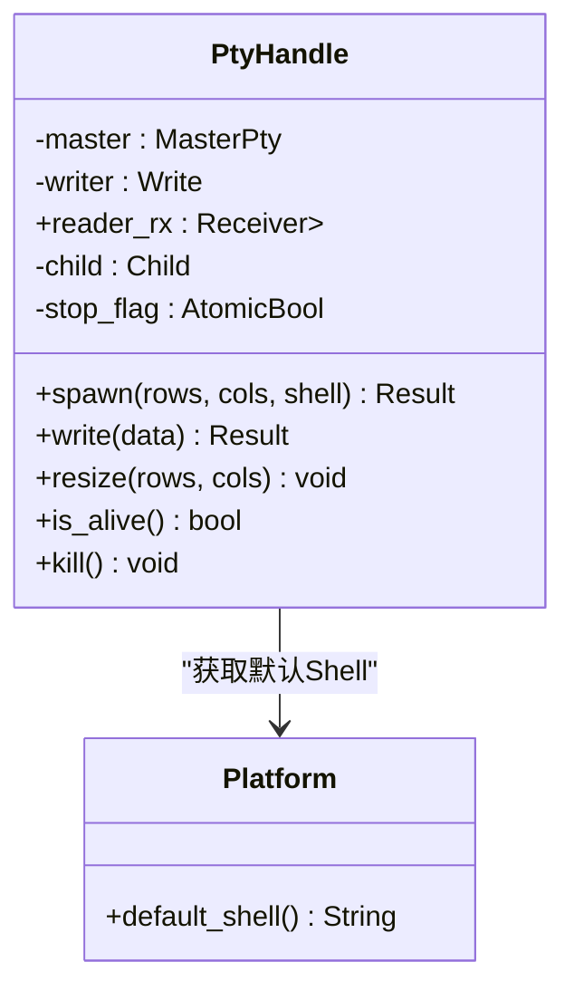
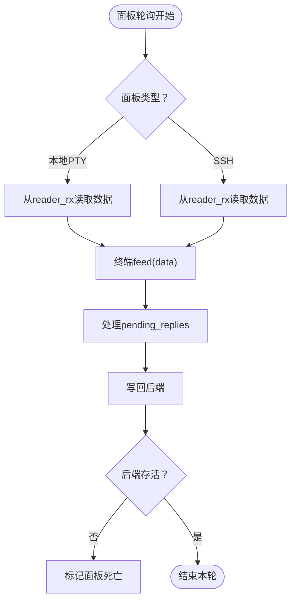
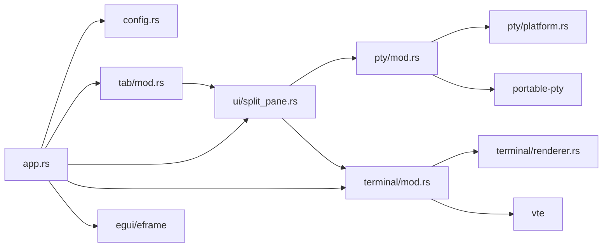

# 本地终端支持

<cite>
**本文档引用的文件**
- [main.rs](file://src/main.rs)
- [app.rs](file://src/app.rs)
- [pty/mod.rs](file://src/pty/mod.rs)
- [pty/platform.rs](file://src/pty/platform.rs)
- [config.rs](file://src/config.rs)
- [tab/mod.rs](file://src/tab/mod.rs)
- [tab/tab_item.rs](file://src/tab/tab_item.rs)
- [ui/split_pane.rs](file://src/ui/split_pane.rs)
- [terminal/mod.rs](file://src/terminal/mod.rs)
- [terminal/renderer.rs](file://src/terminal/renderer.rs)
- [Cargo.toml](file://Cargo.toml)
</cite>

## 目录
1. [简介](#简介)
2. [项目结构](#项目结构)
3. [核心组件](#核心组件)
4. [架构总览](#架构总览)
5. [详细组件分析](#详细组件分析)
6. [依赖关系分析](#依赖关系分析)
7. [性能考量](#性能考量)
8. [故障排查指南](#故障排查指南)
9. [结论](#结论)
10. [附录](#附录)

## 简介
本文件面向QTerm的“本地终端支持”能力，系统性说明跨平台PTY（伪终端）实现、本地进程创建与管理、进程间通信（IPC）、平台差异处理（Windows/Unix）、以及配置与性能优化建议。目标是帮助开发者快速理解并扩展本地终端功能，同时为非技术读者提供清晰的概念说明与使用指导。

## 项目结构
QTerm采用模块化组织，本地终端相关的关键模块如下：
- pty：跨平台PTY封装与Shell进程管理
- terminal：终端仿真器核心（网格、解析器、渲染）
- ui：UI层（分屏布局、面板、渲染）
- tab：标签页管理（聚合分屏布局）
- config：应用配置与偏好读取
- app：应用入口与生命周期管理

图表来源
- [main.rs:1-87](file://src/main.rs#L1-L87)
- [app.rs:1-1349](file://src/app.rs#L1-L1349)
- [pty/mod.rs:1-121](file://src/pty/mod.rs#L1-L121)
- [pty/platform.rs:1-21](file://src/pty/platform.rs#L1-L21)
- [tab/tab_item.rs:1-48](file://src/tab/tab_item.rs#L1-L48)
- [ui/split_pane.rs:1-238](file://src/ui/split_pane.rs#L1-L238)
- [terminal/mod.rs:1-200](file://src/terminal/mod.rs#L1-L200)
- [terminal/renderer.rs:1-198](file://src/terminal/renderer.rs#L1-L198)
- [config.rs:1-281](file://src/config.rs#L1-L281)

章节来源
- [main.rs:1-87](file://src/main.rs#L1-L87)
- [app.rs:1-1349](file://src/app.rs#L1-L1349)
- [config.rs:1-281](file://src/config.rs#L1-L281)

## 核心组件
- 本地PTY句柄（PtyHandle）：负责打开PTY、启动Shell子进程、读写数据、调整终端大小、进程生命周期管理
- 平台Shell默认值：根据操作系统选择默认Shell路径
- 分屏布局与面板（SplitLayout/ChildPane）：管理本地/远程终端面板、轮询数据、写入数据、调整大小
- 终端仿真器（Terminal）：维护字符网格、光标、颜色、滚动区域、ANSI解析与回滚缓冲
- 终端渲染（renderer）：基于egui绘制字符、选区、光标，并计算行列数与单元格尺寸
- 标签页（Tab）：聚合分屏布局，提供轮询与存活检查
- 应用入口与配置（app.rs/config.rs）：初始化UI、字体、主题，创建本地终端标签页，持久化窗口与终端配置

章节来源
- [pty/mod.rs:9-121](file://src/pty/mod.rs#L9-L121)
- [pty/platform.rs:1-21](file://src/pty/platform.rs#L1-L21)
- [ui/split_pane.rs:13-149](file://src/ui/split_pane.rs#L13-L149)
- [terminal/mod.rs:24-200](file://src/terminal/mod.rs#L24-L200)
- [terminal/renderer.rs:7-198](file://src/terminal/renderer.rs#L7-L198)
- [tab/tab_item.rs:3-48](file://src/tab/tab_item.rs#L3-L48)
- [app.rs:57-206](file://src/app.rs#L57-L206)
- [config.rs:37-127](file://src/config.rs#L37-L127)

## 架构总览
本地终端支持的端到端流程：
- 应用启动后，根据配置创建本地终端标签页
- 标签页内部创建分屏布局，生成本地终端面板
- 面板启动PTY句柄，打开PTY并以Slave身份启动Shell
- 后台线程持续从PTY主端读取数据，通过通道传递给终端仿真器
- 终端解析ANSI序列，渲染到egui画布；用户输入通过面板写入PTY
- 尺寸变化时，面板调用PTY调整大小，同步终端网格尺寸

图表来源
- [main.rs:51-87](file://src/main.rs#L51-L87)
- [app.rs:178-194](file://src/app.rs#L178-L194)
- [tab/tab_item.rs:12-21](file://src/tab/tab_item.rs#L12-L21)
- [ui/split_pane.rs:33-45](file://src/ui/split_pane.rs#L33-L45)
- [pty/mod.rs:19-85](file://src/pty/mod.rs#L19-L85)
- [terminal/mod.rs:65-74](file://src/terminal/mod.rs#L65-L74)
- [terminal/renderer.rs:25-40](file://src/terminal/renderer.rs#L25-L40)

## 详细组件分析

### 组件A：本地PTY句柄（PtyHandle）
- 职责
  - 打开平台原生PTY对（主端/从端）
  - 构建并启动Shell子进程（Slave端）
  - 提供读写接口、尺寸调整、存活检测、进程终止
  - 后台线程异步读取子进程输出并通过通道传递
- 关键实现要点
  - 使用portable-pty抽象跨平台PTY系统
  - 通过CommandBuilder设置TERM、LANG（Windows）等环境变量
  - 从主端克隆reader并转移writer，避免所有权问题
  - 使用原子布尔标志与通道安全停止后台读取线程
  - 终止时自动kill子进程，防止僵尸进程
- 平台差异
  - Windows：默认Shell优先COMSPEC，否则PowerShell；设置LANG为UTF-8
  - Unix：优先SHELL环境变量，否则bash/zsh
- 数据结构与复杂度
  - reader_rx为有界通道，读取线程阻塞于主端fd，写入为同步flush
  - resize为O(1)，is_alive为O(1)尝试等待
- 错误处理
  - 读取0字节或错误即视为进程退出
  - 通道发送失败表示主线程退出，读取线程优雅退出

图表来源
- [pty/mod.rs:9-121](file://src/pty/mod.rs#L9-L121)
- [pty/platform.rs:1-21](file://src/pty/platform.rs#L1-L21)

章节来源
- [pty/mod.rs:9-121](file://src/pty/mod.rs#L9-L121)
- [pty/platform.rs:1-21](file://src/pty/platform.rs#L1-L21)

### 组件B：分屏布局与面板（SplitLayout/ChildPane）
- 职责
  - 管理多个面板（最多6个），支持水平/垂直分屏
  - 为本地/远程终端面板提供统一接口：轮询、写入、调整大小、关闭
  - 生命周期管理：面板存活检测、关闭清理
- 关键实现要点
  - ChildPane::poll：从本地PTY读取数据，注入终端仿真器；处理待回复ANSI响应；检查存活
  - ChildPane::write：将用户输入写入本地PTY或SSH后端
  - ChildPane::resize：同步终端网格与后端PTY/SSH尺寸
  - SplitLayout::add_local_pane/add_ssh_pane：创建新面板并设置活动面板
- 与PTY的交互
  - 本地面板直接持有PtyHandle，通过reader_rx与writer进行双向通信
  - 远程面板持有SshHandle，行为类似但后端不同

图表来源
- [ui/split_pane.rs:70-113](file://src/ui/split_pane.rs#L70-L113)

章节来源
- [ui/split_pane.rs:13-149](file://src/ui/split_pane.rs#L13-L149)

### 组件C：终端仿真器（Terminal）
- 职责
  - 维护字符网格（含回滚缓冲）、光标、颜色、滚动区域、选择
  - 解析ANSI转义序列，驱动状态机更新网格与属性
  - 提供选中文本提取、单词/行选择辅助方法
- 关键实现要点
  - feed通过VTE解析器逐字节推进，保持解析状态
  - resize重设网格尺寸并校正光标位置
  - 备用屏幕模式（alt screen）用于全屏应用（如vim）
- 性能特性
  - 解析过程按字节推进，避免额外拷贝
  - 渲染阶段按颜色分段绘制，减少绘制调用次数

章节来源
- [terminal/mod.rs:24-200](file://src/terminal/mod.rs#L24-L200)

### 组件D：终端渲染（renderer）
- 职责
  - 基于egui绘制字符、选区高亮、光标
  - 计算可用空间内的行列数与单元格尺寸
- 关键实现要点
  - calculate_size：以' M '宽度为基准估算单元格宽度，行高为字体大小的1.4倍
  - render：分配绘制区域，按颜色分段绘制文本，绘制选区背景与光标
  - 返回RenderResult，包含鼠标响应与渲染参数，供上层交互处理

章节来源
- [terminal/renderer.rs:7-198](file://src/terminal/renderer.rs#L7-L198)

### 组件E：标签页与应用入口
- 标签页（Tab）
  - 聚合SplitLayout，提供轮询、存活检查、关闭
  - 从终端OSC标题动态更新标签页标题
- 应用入口（main.rs）
  - 加载配置，构建窗口视口，启动eframe渲染循环
  - 平台差异：Windows使用Win32 API检测窗口位置可见性，其他平台使用简单坐标范围判断
- 配置（config.rs）
  - AppConfig：窗口位置/尺寸、主题、字体大小、回滚行数、自定义Shell路径
  - Preferences：从WhaleTerm preferences.json读取字体与主题偏好

章节来源
- [tab/tab_item.rs:3-48](file://src/tab/tab_item.rs#L3-L48)
- [app.rs:17-206](file://src/app.rs#L17-L206)
- [config.rs:37-127](file://src/config.rs#L37-L127)

## 依赖关系分析
- 外部依赖
  - portable-pty：跨平台PTY系统抽象
  - vte：ANSI转义序列解析
  - egui/eframe：UI框架与渲染
  - russh/russh-keys/russh-sftp：SSH/SFTP功能（与本地终端并存）
  - serde/serde_json：配置文件解析
- 内部模块耦合
  - app.rs依赖config.rs、tab/mod.rs、ui/split_pane.rs、terminal/mod.rs
  - tab/tab_item.rs依赖ui/split_pane.rs
  - ui/split_pane.rs依赖pty/mod.rs、terminal/mod.rs
  - pty/mod.rs依赖pty/platform.rs与portable-pty
  - terminal/mod.rs依赖terminal/renderer.rs

图表来源
- [app.rs:1-1349](file://src/app.rs#L1-L1349)
- [tab/mod.rs:1-3](file://src/tab/mod.rs#L1-L3)
- [ui/split_pane.rs:1-238](file://src/ui/split_pane.rs#L1-L238)
- [pty/mod.rs:1-121](file://src/pty/mod.rs#L1-L121)
- [pty/platform.rs:1-21](file://src/pty/platform.rs#L1-L21)
- [terminal/mod.rs:1-200](file://src/terminal/mod.rs#L1-L200)
- [terminal/renderer.rs:1-198](file://src/terminal/renderer.rs#L1-L198)
- [Cargo.toml:8-25](file://Cargo.toml#L8-L25)

章节来源
- [Cargo.toml:8-25](file://Cargo.toml#L8-L25)

## 性能考量
- I/O与线程
  - 后台读取线程阻塞于主端fd，缓冲区大小为4096字节；可根据实际吞吐调整
  - 使用原子布尔标志与通道配合，保证优雅停止
- 渲染优化
  - 终端渲染按颜色分段绘制文本，减少绘制调用
  - 计算尺寸时以' M '为宽度基准，行高系数1.4平衡视觉与性能
- 内存使用
  - 终端网格含回滚缓冲，可通过配置调整scrollback_lines降低内存占用
  - 字体与主题缓存由egui管理，避免重复加载
- 进程池管理策略
  - 当前实现为每个面板独立启动一个Shell进程，便于隔离与资源控制
  - 若需共享Shell，可在面板间复用PtyHandle（需谨慎处理并发写入与ANSI状态）
- 并发与锁
  - 读取线程与主线程通过通道解耦，避免直接共享可变状态
  - 如需进一步优化，可考虑无锁通道或批量读取

[本节为通用性能建议，不直接分析具体文件]

## 故障排查指南
- 无法启动Shell
  - 检查自定义shell_path是否正确；若为空，确认平台默认Shell路径（Windows COMSPEC/Powershell，Unix SHELL）
  - 章节来源
    - [config.rs:49](file://src/config.rs#L49)
    - [pty/platform.rs:5-21](file://src/pty/platform.rs#L5-L21)
- 终端无输出或卡死
  - 检查reader_rx是否被消费；确认后台读取线程未因通道关闭而提前退出
  - 章节来源
    - [pty/mod.rs:59-85](file://src/pty/mod.rs#L59-L85)
- 输入无效
  - 确认面板类型为本地PTY且writer有效；检查面板是否仍存活
  - 章节来源
    - [ui/split_pane.rs:115-123](file://src/ui/split_pane.rs#L115-L123)
- 尺寸异常
  - 检查SplitLayout::resize调用链是否正确传递至PtyHandle::resize
  - 章节来源
    - [ui/split_pane.rs:125-134](file://src/ui/split_pane.rs#L125-L134)
- 进程未终止
  - 确认Drop实现中调用了kill；检查stop_flag是否被设置
  - 章节来源
    - [pty/mod.rs:116-121](file://src/pty/mod.rs#L116-L121)

## 结论
QTerm的本地终端支持以portable-pty为核心，结合分屏布局、终端仿真器与egui渲染，实现了跨平台的本地Shell体验。其设计强调模块化与解耦：PTY句柄负责底层进程与I/O，面板层负责生命周期与后端抽象，终端仿真器专注ANSI解析与状态管理，UI层专注于渲染与交互。通过合理的配置与性能优化策略，可在多平台下获得稳定、高效的本地终端体验。

[本节为总结性内容，不直接分析具体文件]

## 附录

### 本地终端配置示例
- 应用配置（config.ini）
  - 窗口位置与尺寸：window_x、window_y、window_width、window_height
  - 窗口状态：maximized
  - 字体与主题：font_size、theme
  - 回滚缓冲：scrollback_lines
  - 自定义Shell：shell_path
- 偏好设置（WhaleTerm preferences.json）
  - 字体家族与大小：config/general/shell区域
  - 主题：general.theme
- 读取与保存
  - AppConfig.load/save：INI格式
  - Preferences.load：JSON格式
- 章节来源
  - [config.rs:68-127](file://src/config.rs#L68-L127)
  - [config.rs:239-281](file://src/config.rs#L239-L281)

### 平台特定实现差异
- 默认Shell
  - Windows：优先COMSPEC，否则PowerShell
  - macOS/Linux：优先SHELL，否则bash/zsh
- 环境变量
  - TERM固定为xterm-256color
  - Windows额外设置LANG为UTF-8
- 章节来源
  - [pty/platform.rs:5-21](file://src/pty/platform.rs#L5-L21)
  - [pty/mod.rs:38-44](file://src/pty/mod.rs#L38-L44)

### 进程间通信与信号处理
- 通信方式
  - 主端fd读取子进程输出，通过通道传递给终端仿真器
  - 用户输入通过writer写入子进程stdin
- 信号处理
  - 当前实现未显式处理SIGINT/SIGTERM；终止时通过kill触发
- 章节来源
  - [pty/mod.rs:59-113](file://src/pty/mod.rs#L59-L113)

### 性能优化建议
- I/O缓冲与批处理
  - 调整后台读取缓冲大小，平衡延迟与CPU占用
- 渲染优化
  - 控制字体大小与主题复杂度，减少绘制调用
- 内存管理
  - 合理设置回滚行数，避免过大导致内存压力
- 进程池
  - 在需要时考虑共享Shell进程，但需注意ANSI状态一致性与并发写入保护
- 章节来源
  - [terminal/renderer.rs:25-40](file://src/terminal/renderer.rs#L25-L40)
  - [config.rs:47](file://src/config.rs#L47)