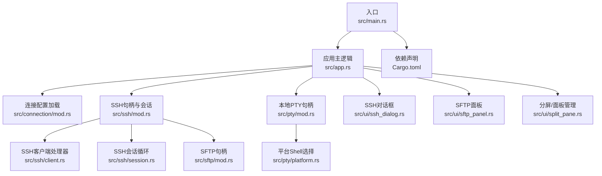
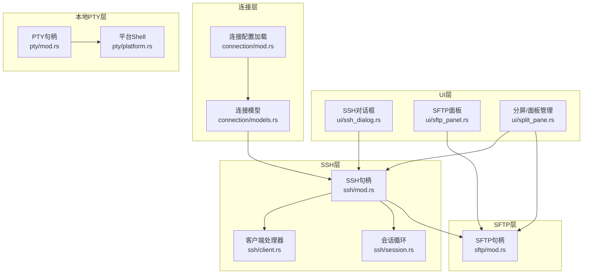
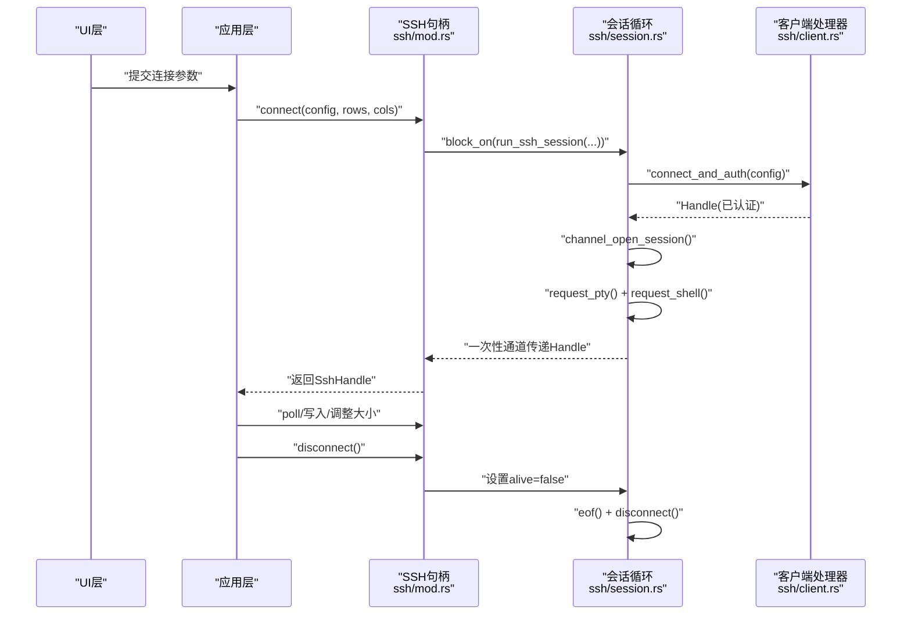
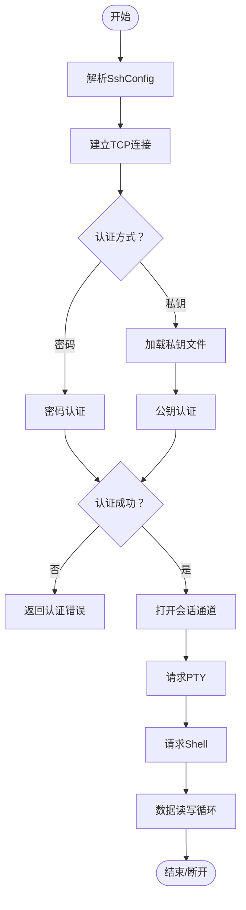
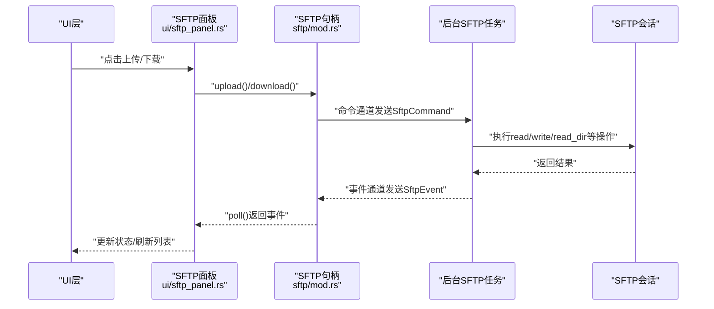
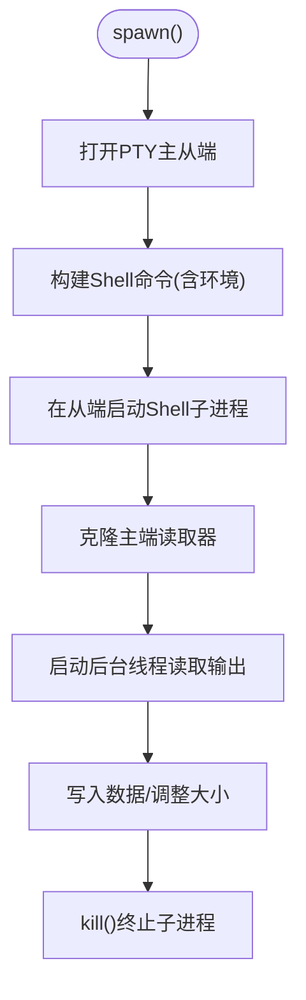
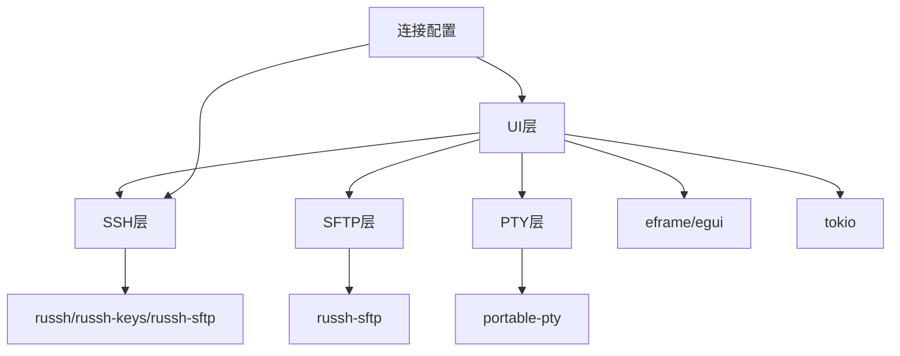

# 连接模块

<cite>
**本文引用的文件**
- [src/main.rs](file://src/main.rs)
- [src/app.rs](file://src/app.rs)
- [src/connection/mod.rs](file://src/connection/mod.rs)
- [src/connection/models.rs](file://src/connection/models.rs)
- [src/ssh/mod.rs](file://src/ssh/mod.rs)
- [src/ssh/client.rs](file://src/ssh/client.rs)
- [src/ssh/session.rs](file://src/ssh/session.rs)
- [src/sftp/mod.rs](file://src/sftp/mod.rs)
- [src/pty/mod.rs](file://src/pty/mod.rs)
- [src/pty/platform.rs](file://src/pty/platform.rs)
- [src/ui/ssh_dialog.rs](file://src/ui/ssh_dialog.rs)
- [src/ui/sftp_panel.rs](file://src/ui/sftp_panel.rs)
- [src/ui/split_pane.rs](file://src/ui/split_pane.rs)
- [Cargo.toml](file://Cargo.toml)
</cite>

## 目录
1. [简介](#简介)
2. [项目结构](#项目结构)
3. [核心组件](#核心组件)
4. [架构总览](#架构总览)
5. [详细组件分析](#详细组件分析)
6. [依赖关系分析](#依赖关系分析)
7. [性能考量](#性能考量)
8. [故障排查指南](#故障排查指南)
9. [结论](#结论)
10. [附录](#附录)

## 简介
本文件面向QTerm的“连接模块”，系统性梳理其架构设计与实现要点，涵盖：
- SSH客户端实现与会话生命周期管理
- SFTP文件传输协议的双向实现与事件驱动模型
- 本地PTY终端支持与跨平台Shell集成
- 连接扩展指南：新增连接类型与认证方法的实践路径

目标是帮助开发者快速理解代码结构、掌握关键流程，并安全地进行扩展。

## 项目结构
连接模块相关的核心文件组织如下：
- 入口与应用层：main.rs、app.rs
- 连接配置与解密：connection/mod.rs、connection/models.rs
- SSH协议栈：ssh/mod.rs、ssh/client.rs、ssh/session.rs
- SFTP文件传输：sftp/mod.rs
- 本地PTY终端：pty/mod.rs、pty/platform.rs
- UI交互：ui/ssh_dialog.rs、ui/sftp_panel.rs、ui/split_pane.rs
- 依赖声明：Cargo.toml

**图表来源**
- [src/main.rs:1-87](file://src/main.rs#L1-L87)
- [src/app.rs:1-120](file://src/app.rs#L1-L120)
- [src/connection/mod.rs:1-148](file://src/connection/mod.rs#L1-L148)
- [src/ssh/mod.rs:1-136](file://src/ssh/mod.rs#L1-L136)
- [src/ssh/client.rs:1-63](file://src/ssh/client.rs#L1-L63)
- [src/ssh/session.rs:1-90](file://src/ssh/session.rs#L1-L90)
- [src/sftp/mod.rs:1-238](file://src/sftp/mod.rs#L1-L238)
- [src/pty/mod.rs:1-121](file://src/pty/mod.rs#L1-L121)
- [src/pty/platform.rs:1-21](file://src/pty/platform.rs#L1-L21)
- [src/ui/ssh_dialog.rs:1-147](file://src/ui/ssh_dialog.rs#L1-L147)
- [src/ui/sftp_panel.rs:1-387](file://src/ui/sftp_panel.rs#L1-L387)
- [src/ui/split_pane.rs:47-68](file://src/ui/split_pane.rs#L47-L68)
- [Cargo.toml:1-30](file://Cargo.toml#L1-L30)

**章节来源**
- [src/main.rs:1-87](file://src/main.rs#L1-L87)
- [src/app.rs:1-120](file://src/app.rs#L1-L120)
- [Cargo.toml:1-30](file://Cargo.toml#L1-L30)

## 核心组件
- 连接配置与解密
  - 从WhaleTerm配置文件加载连接分组与连接项，解密存储的密码，输出简化后的连接结构体供后续使用。
  - 关键点：AES-256-CFB解密、基于主板序列号派生密钥、Windows PowerShell读取主板序列号。
- SSH客户端与会话
  - 提供全局Tokio运行时、SSH配置与认证方式（密码/私钥）、会话句柄封装、终端数据读写与大小调整、SFTP复用能力。
  - 关键点：russh客户端处理器、会话通道打开、PTY请求与Shell启动、后台线程+异步运行时协作。
- SFTP文件传输
  - 事件驱动的SFTP句柄，通过命令通道与后台任务通信，支持目录浏览、上传/下载、创建目录、删除文件/目录。
  - 关键点：命令-事件模型、后台SFTP任务、russh-sftp会话封装。
- 本地PTY终端
  - 通过portable-pty在各平台创建伪终端，启动Shell进程，提供读写与大小调整接口。
  - 关键点：平台Shell路径解析、环境变量设置、后台线程读取输出。
- UI交互
  - SSH连接对话框收集参数并生成SshConfig；SFTP面板双栏浏览、上传/下载、状态反馈；分屏/面板管理负责创建SSH/SFTP面板。

**章节来源**
- [src/connection/mod.rs:1-148](file://src/connection/mod.rs#L1-L148)
- [src/connection/models.rs:1-43](file://src/connection/models.rs#L1-L43)
- [src/ssh/mod.rs:1-136](file://src/ssh/mod.rs#L1-L136)
- [src/ssh/client.rs:1-63](file://src/ssh/client.rs#L1-L63)
- [src/ssh/session.rs:1-90](file://src/ssh/session.rs#L1-L90)
- [src/sftp/mod.rs:1-238](file://src/sftp/mod.rs#L1-L238)
- [src/pty/mod.rs:1-121](file://src/pty/mod.rs#L1-L121)
- [src/pty/platform.rs:1-21](file://src/pty/platform.rs#L1-L21)
- [src/ui/ssh_dialog.rs:1-147](file://src/ui/ssh_dialog.rs#L1-L147)
- [src/ui/sftp_panel.rs:1-387](file://src/ui/sftp_panel.rs#L1-L387)
- [src/ui/split_pane.rs:47-68](file://src/ui/split_pane.rs#L47-L68)

## 架构总览
连接模块采用“事件驱动 + 异步运行时”的架构：
- UI层触发连接建立与文件传输请求
- SSH层负责TCP连接、密钥交换、认证、PTY与Shell通道
- SFTP层复用SSH通道，提供文件操作命令与事件通知
- 本地PTY层负责本机Shell进程与终端仿真
- 应用层统一调度与状态管理

**图表来源**
- [src/ui/ssh_dialog.rs:1-147](file://src/ui/ssh_dialog.rs#L1-L147)
- [src/ui/sftp_panel.rs:1-387](file://src/ui/sftp_panel.rs#L1-L387)
- [src/ui/split_pane.rs:47-68](file://src/ui/split_pane.rs#L47-L68)
- [src/connection/mod.rs:1-148](file://src/connection/mod.rs#L1-L148)
- [src/connection/models.rs:1-43](file://src/connection/models.rs#L1-L43)
- [src/ssh/mod.rs:1-136](file://src/ssh/mod.rs#L1-L136)
- [src/ssh/client.rs:1-63](file://src/ssh/client.rs#L1-L63)
- [src/ssh/session.rs:1-90](file://src/ssh/session.rs#L1-L90)
- [src/sftp/mod.rs:1-238](file://src/sftp/mod.rs#L1-L238)
- [src/pty/mod.rs:1-121](file://src/pty/mod.rs#L1-L121)
- [src/pty/platform.rs:1-21](file://src/pty/platform.rs#L1-L21)

## 详细组件分析

### SSH客户端与会话生命周期
- 生命周期阶段
  - 参数校验与配置生成（UI对话框或连接列表）
  - 建立TCP连接并进行密钥交换与服务器公钥校验
  - 认证（密码或私钥）
  - 打开会话通道、请求PTY、启动Shell
  - 数据读写循环、窗口大小调整、会话关闭与资源清理
- 关键实现要点
  - 全局Tokio运行时懒加载，避免阻塞主线程
  - 会话在后台线程中运行，通过通道与主线程通信
  - 通过一次性通道传递russh客户端句柄，供SFTP复用
  - 通过原子布尔位控制会话存活，优雅退出

**图表来源**
- [src/ssh/mod.rs:68-136](file://src/ssh/mod.rs#L68-L136)
- [src/ssh/session.rs:11-90](file://src/ssh/session.rs#L11-L90)
- [src/ssh/client.rs:25-63](file://src/ssh/client.rs#L25-L63)

**章节来源**
- [src/ssh/mod.rs:1-136](file://src/ssh/mod.rs#L1-L136)
- [src/ssh/session.rs:1-90](file://src/ssh/session.rs#L1-L90)
- [src/ssh/client.rs:1-63](file://src/ssh/client.rs#L1-L63)

### SSH协议栈：认证与密钥交换
- 认证方式
  - 密码认证：直接调用认证接口
  - 私钥认证：加载私钥文件与可选密码短语，发起公钥认证
- 密钥交换与服务器校验
  - 客户端处理器实现服务器公钥校验回调，默认接受所有密钥（可扩展）
- 会话通道
  - 打开会话通道，请求PTY与Shell，进入数据读写循环

**图表来源**
- [src/ssh/client.rs:25-63](file://src/ssh/client.rs#L25-L63)
- [src/ssh/session.rs:28-46](file://src/ssh/session.rs#L28-L46)

**章节来源**
- [src/ssh/client.rs:1-63](file://src/ssh/client.rs#L1-L63)
- [src/ssh/session.rs:1-90](file://src/ssh/session.rs#L1-L90)

### SFTP协议：双向文件传输与事件驱动
- 设计要点
  - SftpHandle封装命令通道与事件通道，后台任务负责实际SFTP操作
  - 事件类型覆盖连接成功、目录列表、上传/下载/创建目录/删除完成、错误
  - 支持同步轮询事件与异步命令发送
- 双向传输流程
  - 上传：本地读取文件 → 远程写入
  - 下载：远程读取文件 → 本地写入
  - 目录浏览：请求目录 → 解析entries → 事件通知
- 并发与健壮性
  - 后台任务在独立Tokio任务中运行，避免阻塞UI
  - 通过alive标志与一次性命令实现优雅关闭

**图表来源**
- [src/ui/sftp_panel.rs:51-110](file://src/ui/sftp_panel.rs#L51-L110)
- [src/sftp/mod.rs:46-115](file://src/sftp/mod.rs#L46-L115)
- [src/sftp/mod.rs:119-167](file://src/sftp/mod.rs#L119-L167)
- [src/sftp/mod.rs:170-238](file://src/sftp/mod.rs#L170-L238)

**章节来源**
- [src/sftp/mod.rs:1-238](file://src/sftp/mod.rs#L1-L238)
- [src/ui/sftp_panel.rs:1-387](file://src/ui/sftp_panel.rs#L1-L387)

### 本地PTY终端支持
- 能力概述
  - 跨平台创建PTY，启动Shell进程，提供读写与大小调整
  - 默认Shell路径按平台策略选择，设置TERM与语言环境
  - 后台线程持续读取Shell输出，通过通道传回主线程
- 关键点
  - 通过portable-pty抽象不同平台差异
  - 终止时自动kill子进程，防止僵尸进程

**图表来源**
- [src/pty/mod.rs:22-85](file://src/pty/mod.rs#L22-L85)
- [src/pty/platform.rs:5-21](file://src/pty/platform.rs#L5-L21)

**章节来源**
- [src/pty/mod.rs:1-121](file://src/pty/mod.rs#L1-L121)
- [src/pty/platform.rs:1-21](file://src/pty/platform.rs#L1-L21)

### 连接扩展指南：新增连接类型与认证方法
- 新增连接类型（如Telnet、Serial）
  - 在连接配置模块增加新模型与解析逻辑
  - 在应用层或UI层新增对话框/面板，生成对应配置
  - 在面板管理中新增创建该类型面板的方法
- 新增认证方法（如证书/因子认证）
  - 在SSH认证枚举中扩展分支
  - 在客户端处理器中实现相应的认证流程
  - 在UI层新增参数输入与配置生成
- 安全与健壮性建议
  - 服务器公钥校验逻辑需严格实现，避免默认接受
  - 对私钥与密码等敏感信息进行最小暴露与及时清理
  - 为新协议实现独立的错误类型与事件通知

[本节为概念性指导，不直接分析具体文件，故不附“章节来源”]

## 依赖关系分析
- 外部库
  - eframe/egui：UI框架与渲染
  - russh/russh-keys/russh-sftp：SSH协议栈与SFTP
  - portable-pty：本地PTY
  - tokio：异步运行时
  - serde/json：配置序列化
  - aes/cfb-mode/cipher/hex：连接密码解密
- 模块耦合
  - UI层通过SshConfig/SftpHandle与连接层解耦
  - SSH层通过共享Handle复用到SFTP，降低连接成本
  - 本地PTY与SSH/TUI相对独立，便于替换

**图表来源**
- [Cargo.toml:8-25](file://Cargo.toml#L8-L25)
- [src/ui/ssh_dialog.rs:1-147](file://src/ui/ssh_dialog.rs#L1-L147)
- [src/ui/sftp_panel.rs:1-387](file://src/ui/sftp_panel.rs#L1-L387)
- [src/pty/mod.rs:1-121](file://src/pty/mod.rs#L1-L121)
- [src/ssh/mod.rs:1-136](file://src/ssh/mod.rs#L1-L136)
- [src/sftp/mod.rs:1-238](file://src/sftp/mod.rs#L1-L238)

**章节来源**
- [Cargo.toml:1-30](file://Cargo.toml#L1-L30)

## 性能考量
- 运行时与并发
  - 使用全局Tokio运行时减少线程创建开销
  - SSH会话与SFTP后台任务分离，避免阻塞UI
- I/O与缓冲
  - 会话输出通过通道批量发送，避免频繁锁竞争
  - SFTP命令通道设置合理容量，平衡吞吐与内存占用
- 资源管理
  - 会话与SFTP均通过alive标志与一次性通道优雅关闭
  - 本地PTY在Drop中自动终止子进程

[本节提供一般性建议，不直接分析具体文件，故不附“章节来源”]

## 故障排查指南
- SSH连接失败
  - 检查主机、端口、用户名是否为空或非法
  - 查看认证方式与凭据是否匹配（密码/私钥路径与密码短语）
  - 观察会话日志与错误类型（连接/认证/通道）
- SFTP操作异常
  - 确认SSH会话已建立且SFTP通道打开成功
  - 检查命令通道是否被消费（poll事件）
  - 关注错误事件中的具体错误信息
- 本地PTY问题
  - 检查默认Shell路径与环境变量设置
  - 确认后台读取线程未被提前中断

**章节来源**
- [src/ssh/mod.rs:35-53](file://src/ssh/mod.rs#L35-L53)
- [src/sftp/mod.rs:23-44](file://src/sftp/mod.rs#L23-L44)
- [src/ui/ssh_dialog.rs:115-147](file://src/ui/ssh_dialog.rs#L115-L147)

## 结论
QTerm连接模块以清晰的分层与事件驱动设计实现了SSH、SFTP与本地PTY的统一接入。通过全局运行时与句柄复用，既保证了性能也提升了可维护性。建议在扩展新连接类型与认证方法时，遵循现有错误类型与事件模型，确保一致的用户体验与安全性。

## 附录
- 连接配置文件格式
  - 分组与连接项，包含主机、端口、用户名、加密密码、认证模型、私钥路径等字段
  - 加载后解密密码并输出简化结构体
- UI快捷键与交互
  - Ctrl+Shift+F打开SFTP（需要SSH标签）
  - 左侧图标栏切换功能区，连接列表双击打开SSH标签

**章节来源**
- [src/connection/models.rs:17-43](file://src/connection/models.rs#L17-L43)
- [src/app.rs:300-393](file://src/app.rs#L300-L393)
- [src/ui/sftp_panel.rs:112-152](file://src/ui/sftp_panel.rs#L112-L152)