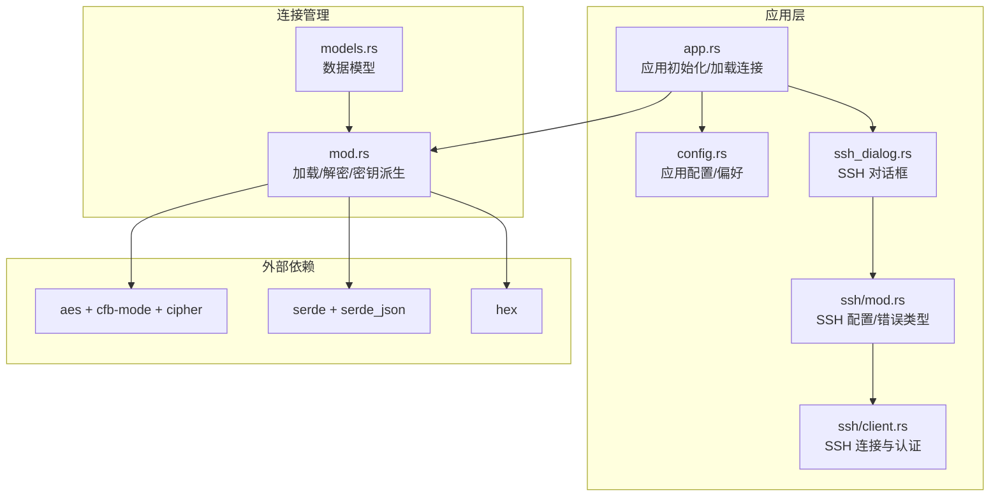
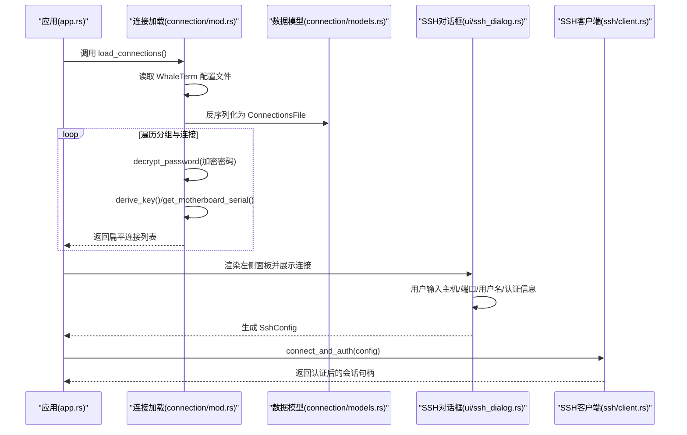
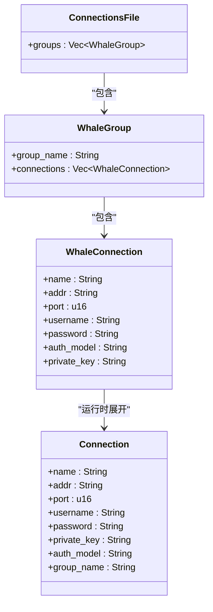
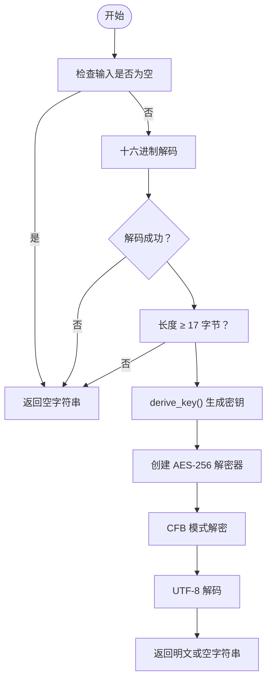
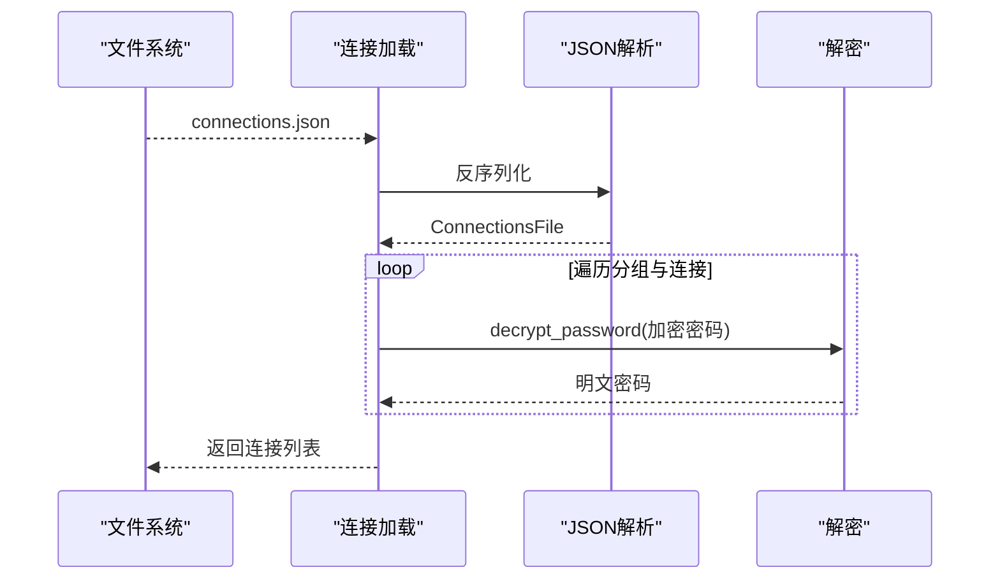
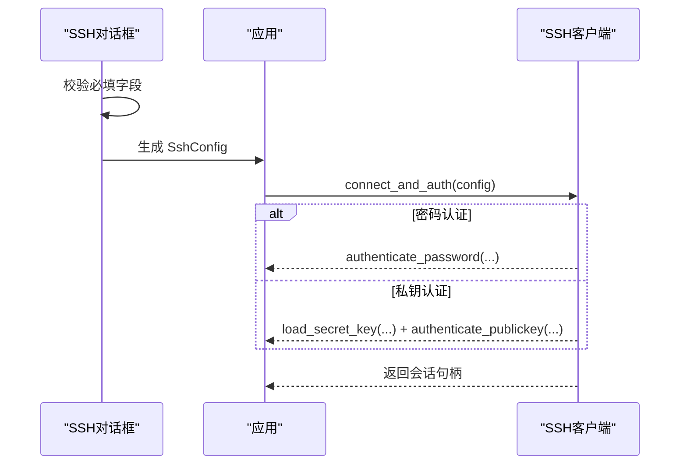
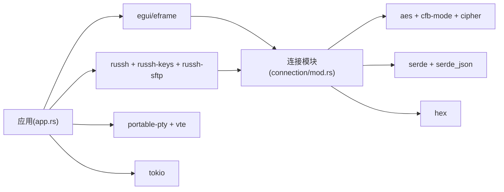

# 连接管理

<cite>
**本文引用的文件**
- [src/connection/models.rs](file://src/connection/models.rs)
- [src/connection/mod.rs](file://src/connection/mod.rs)
- [src/config.rs](file://src/config.rs)
- [src/app.rs](file://src/app.rs)
- [src/ui/ssh_dialog.rs](file://src/ui/ssh_dialog.rs)
- [src/ssh/client.rs](file://src/ssh/client.rs)
- [src/ssh/mod.rs](file://src/ssh/mod.rs)
- [Cargo.toml](file://Cargo.toml)
</cite>

## 目录
1. [简介](#简介)
2. [项目结构](#项目结构)
3. [核心组件](#核心组件)
4. [架构总览](#架构总览)
5. [详细组件分析](#详细组件分析)
6. [依赖关系分析](#依赖关系分析)
7. [性能考量](#性能考量)
8. [故障排查指南](#故障排查指南)
9. [结论](#结论)
10. [附录](#附录)

## 简介
本文件面向 QTerm 连接管理系统，系统性梳理连接配置文件结构与管理机制、加密存储实现（AES-256-CFB 与主板序列号派生密钥）、连接树结构设计（分组与连接组织）、加载与保存流程（含错误恢复），并提供配置示例与安全最佳实践，帮助开发者与运维人员正确理解与使用连接管理功能。

## 项目结构
连接管理相关代码主要分布在以下模块：
- 连接数据模型与加载：src/connection
- 应用配置与偏好：src/config
- 应用入口与 UI 集成：src/app.rs
- SSH 对话框与认证：src/ui/ssh_dialog.rs、src/ssh
- 依赖声明：Cargo.toml

图表来源
- [src/connection/models.rs:1-43](file://src/connection/models.rs#L1-L43)
- [src/connection/mod.rs:1-148](file://src/connection/mod.rs#L1-L148)
- [src/app.rs:1-120](file://src/app.rs#L1-L120)
- [src/config.rs:1-143](file://src/config.rs#L1-L143)
- [src/ui/ssh_dialog.rs:1-147](file://src/ui/ssh_dialog.rs#L1-L147)
- [src/ssh/client.rs:1-63](file://src/ssh/client.rs#L1-L63)
- [src/ssh/mod.rs:1-41](file://src/ssh/mod.rs#L1-L41)
- [Cargo.toml:8-25](file://Cargo.toml#L8-L25)

章节来源
- [src/connection/models.rs:1-43](file://src/connection/models.rs#L1-L43)
- [src/connection/mod.rs:1-148](file://src/connection/mod.rs#L1-L148)
- [src/app.rs:1-120](file://src/app.rs#L1-L120)
- [src/config.rs:1-143](file://src/config.rs#L1-L143)
- [src/ui/ssh_dialog.rs:1-147](file://src/ui/ssh_dialog.rs#L1-L147)
- [src/ssh/client.rs:1-63](file://src/ssh/client.rs#L1-L63)
- [src/ssh/mod.rs:1-41](file://src/ssh/mod.rs#L1-L41)
- [Cargo.toml:8-25](file://Cargo.toml#L8-L25)

## 核心组件
- 连接数据模型
  - 顶层容器：包含分组列表
  - 分组：包含分组名与连接列表
  - 连接：包含主机、端口、用户名、加密密码、认证模型、私钥路径等
- 连接实体（运行时）
  - 在加载时将分组内的连接展开为扁平列表，并解密密码，补充所属分组名
- 加载与解密
  - 从 WhaleTerm 配置路径读取 JSON，反序列化为顶层容器
  - 对每个连接执行 AES-256-CFB 解密，格式为十六进制编码的“IV + 密文”
  - 密钥由主板序列号派生，若不可用则回退到硬编码密钥
- SSH 对话框与认证
  - 提供主机、端口、用户名、认证模式（密码/私钥）输入
  - 生成 SshConfig 并交由 SSH 客户端处理完成连接与认证

章节来源
- [src/connection/models.rs:3-43](file://src/connection/models.rs#L3-L43)
- [src/connection/mod.rs:28-98](file://src/connection/mod.rs#L28-L98)
- [src/ui/ssh_dialog.rs:11-147](file://src/ui/ssh_dialog.rs#L11-L147)
- [src/ssh/client.rs:23-63](file://src/ssh/client.rs#L23-L63)

## 架构总览
下图展示连接管理在应用生命周期中的关键交互：应用启动时加载连接配置，UI 展示连接列表；用户通过 SSH 对话框发起连接，SSH 客户端完成认证并建立会话。

图表来源
- [src/app.rs:80-95](file://src/app.rs#L80-L95)
- [src/connection/mod.rs:28-98](file://src/connection/mod.rs#L28-L98)
- [src/connection/models.rs:3-43](file://src/connection/models.rs#L3-L43)
- [src/ui/ssh_dialog.rs:115-147](file://src/ui/ssh_dialog.rs#L115-L147)
- [src/ssh/client.rs:23-63](file://src/ssh/client.rs#L23-L63)

## 详细组件分析

### 数据模型与 JSON 结构
- 顶层结构
  - groups: 分组数组
- 分组结构
  - groupName: 分组名称
  - connections: 连接数组
- 连接结构
  - name: 显示名称
  - addr: 主机地址
  - port: 端口
  - username: 用户名
  - password: 加密密码（AES-256-CFB 十六进制编码）
  - authModel: 认证模型（password/key）
  - privateKey: 私钥文件路径（可选）

图表来源
- [src/connection/models.rs:3-43](file://src/connection/models.rs#L3-L43)

章节来源
- [src/connection/models.rs:3-43](file://src/connection/models.rs#L3-L43)

### 连接树结构设计与组织
- 分组管理
  - 以 groupName 作为分组标识，同一分组内的连接共享该名称
  - UI 展示时按分组名分段显示，便于组织与浏览
- 连接组织
  - 加载阶段将嵌套的分组-连接结构展开为扁平列表，便于 UI 与后续处理
  - 运行时连接实体包含 group_name 字段，确保 UI 可按分组筛选或排序

章节来源
- [src/connection/mod.rs:28-59](file://src/connection/mod.rs#L28-L59)
- [src/app.rs:758-800](file://src/app.rs#L758-L800)

### 加密存储与密钥派生
- 加密算法与格式
  - AES-256-CFB
  - 密文格式：hex(IV[16字节] + ciphertext)
- 密钥来源
  - 优先从主板序列号派生 32 字节密钥
  - 若无法获取有效序列号，则使用硬编码回退密钥
- 解密流程
  - 输入：十六进制字符串
  - 输出：明文密码（UTF-8）
- 错误处理
  - 输入为空、长度不足、解码失败、密钥构造失败、解密失败均返回空字符串，保证加载流程不中断

图表来源
- [src/connection/mod.rs:61-98](file://src/connection/mod.rs#L61-L98)
- [src/connection/mod.rs:100-137](file://src/connection/mod.rs#L100-L137)

章节来源
- [src/connection/mod.rs:61-148](file://src/connection/mod.rs#L61-L148)

### 连接加载与保存流程
- 加载流程
  - 定位 WhaleTerm 配置路径（Windows/非 Windows 两套回退策略）
  - 读取并解析 JSON 为顶层容器
  - 展开分组-连接为扁平列表
  - 对每个连接调用解密函数，得到明文密码
  - 返回连接列表供 UI 使用
- 保存流程（应用配置）
  - 应用配置采用 INI 格式保存至 config.ini
  - 偏好设置从 WhaleTerm preferences.json 读取（字体、主题）
- 错误恢复
  - 文件不存在或解析失败时返回空列表或默认值，避免崩溃

图表来源
- [src/connection/mod.rs:7-26](file://src/connection/mod.rs#L7-L26)
- [src/connection/mod.rs:28-59](file://src/connection/mod.rs#L28-L59)
- [src/connection/mod.rs:61-98](file://src/connection/mod.rs#L61-L98)

章节来源
- [src/connection/mod.rs:7-59](file://src/connection/mod.rs#L7-L59)
- [src/config.rs:68-127](file://src/config.rs#L68-L127)

### SSH 对话框与认证流程
- 对话框输入
  - 主机、端口、用户名（必填）
  - 认证模式：密码或私钥
  - 私钥模式支持密钥文件与可选的密钥密码
- 认证流程
  - 生成 SshConfig
  - 通过 connect_and_auth 完成 TCP 连接与认证
  - 支持密码认证与私钥认证两种方式

图表来源
- [src/ui/ssh_dialog.rs:115-147](file://src/ui/ssh_dialog.rs#L115-L147)
- [src/ssh/client.rs:23-63](file://src/ssh/client.rs#L23-L63)
- [src/ssh/mod.rs:18-41](file://src/ssh/mod.rs#L18-L41)

章节来源
- [src/ui/ssh_dialog.rs:1-147](file://src/ui/ssh_dialog.rs#L1-L147)
- [src/ssh/client.rs:1-63](file://src/ssh/client.rs#L1-L63)
- [src/ssh/mod.rs:1-41](file://src/ssh/mod.rs#L1-L41)

## 依赖关系分析
- 连接管理依赖
  - aes、cfb-mode、cipher：AES-256-CFB 解密
  - serde、serde_json：JSON 解析
  - hex：十六进制编解码
- 应用层依赖
  - eframe/egui：UI 渲染
  - russh、russh-keys、russh-sftp：SSH 连接与 SFTP
  - portable-pty、vte：本地终端仿真
  - tokio：异步运行时

图表来源
- [src/connection/mod.rs:61-98](file://src/connection/mod.rs#L61-L98)
- [src/app.rs:1-120](file://src/app.rs#L1-L120)
- [Cargo.toml:8-25](file://Cargo.toml#L8-L25)

章节来源
- [Cargo.toml:8-25](file://Cargo.toml#L8-L25)
- [src/connection/mod.rs:61-98](file://src/connection/mod.rs#L61-L98)
- [src/app.rs:1-120](file://src/app.rs#L1-L120)

## 性能考量
- 解密成本
  - AES-256-CFB 解密为 CPU 密集型操作，但仅在应用启动时执行一次
  - 连接数量较多时建议限制分组规模，避免 UI 渲染压力
- I/O 与解析
  - JSON 解析与文件读取为轻量级操作，通常不影响整体性能
- 异步与并发
  - SSH 连接与认证使用 tokio 运行时，避免阻塞 UI 线程
- 内存占用
  - 连接列表在内存中常驻，注意避免重复克隆与不必要的拷贝

## 故障排查指南
- 无法加载连接
  - 检查 WhaleTerm 配置路径是否存在且可读
  - 确认 JSON 格式合法，字段齐全
  - 若解密失败，确认加密密码格式为 hex(IV[16字节] + ciphertext)，且密钥派生可用
- 解密异常
  - 输入为空或长度不足会返回空字符串，需检查原始数据
  - 十六进制解码失败或密钥构造失败也会返回空字符串
- 密钥派生问题
  - Windows 下通过 PowerShell 获取主板序列号，若命令失败或返回空串，将回退到硬编码密钥
  - 无主板序列号时，硬编码密钥将被使用，存在安全风险
- SSH 连接失败
  - 检查主机、端口、用户名是否正确
  - 密码认证失败时确认密码正确；私钥认证需确认密钥文件路径与可访问性
  - 认证失败时查看错误信息并重试

章节来源
- [src/connection/mod.rs:30-98](file://src/connection/mod.rs#L30-L98)
- [src/ui/ssh_dialog.rs:115-147](file://src/ui/ssh_dialog.rs#L115-L147)
- [src/ssh/client.rs:23-63](file://src/ssh/client.rs#L23-L63)

## 结论
QTerm 的连接管理以 WhaleTerm 兼容的 JSON 结构为基础，通过 AES-256-CFB 与主板序列号派生密钥实现密码加密存储，并在应用启动时一次性解密加载。连接树采用分组-连接两级结构，UI 展示清晰有序。SSH 对话框与客户端封装了认证细节，配合异步运行时保障了良好的用户体验。建议在生产环境中完善密钥派生策略与安全审计，确保敏感信息的安全性。

## 附录

### 配置文件示例（概念性说明）
- connections.json（顶层）
  - groups: [{ groupName: "...", connections: [...] }, ...]
- 连接项（字段）
  - name、addr、port、username、password（加密）、authModel、privateKey（可选）

章节来源
- [src/connection/models.rs:3-29](file://src/connection/models.rs#L3-L29)

### 安全最佳实践
- 密钥派生
  - 优先使用主板序列号派生密钥；若不可用，应提示用户更换设备或采用更安全的密钥管理方案
  - 硬编码密钥仅用于兼容旧版本，不应用于生产环境
- 密码保护
  - 仅在必要时解密密码，避免长期驻留明文
  - 建议在用户交互时才进行解密，或采用临时缓存策略
- 敏感信息处理
  - 私钥文件路径与内容应严格权限控制
  - 日志与转储文件不应包含明文密码
- 错误恢复
  - 解析失败与解密失败应记录日志并优雅降级，避免影响其他功能

章节来源
- [src/connection/mod.rs:61-148](file://src/connection/mod.rs#L61-L148)
- [src/ui/ssh_dialog.rs:115-147](file://src/ui/ssh_dialog.rs#L115-L147)