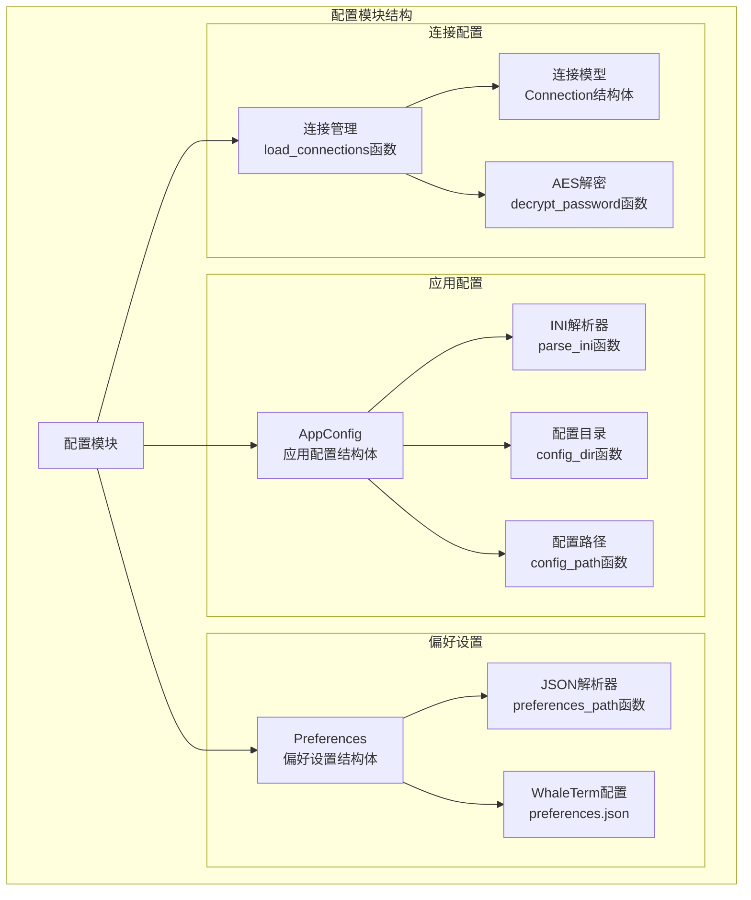
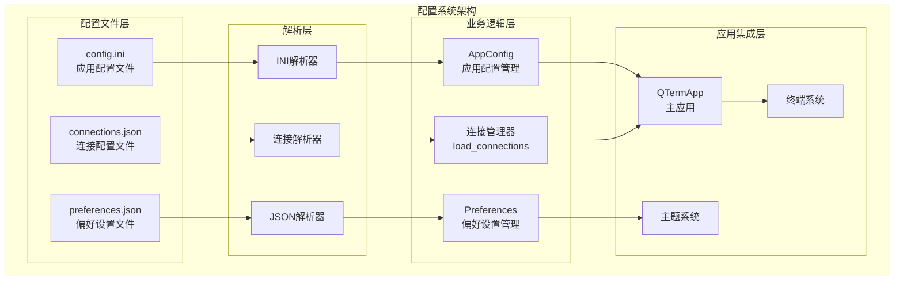
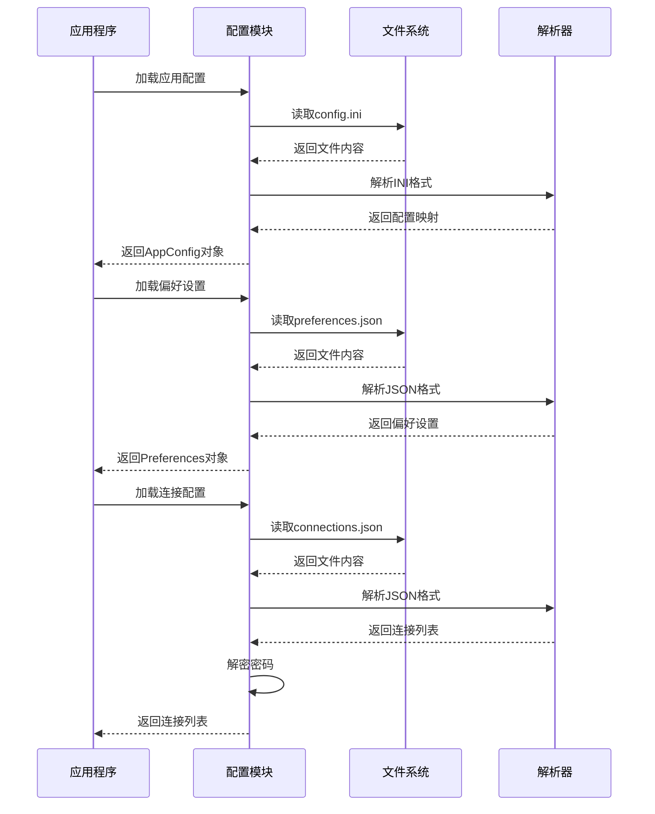
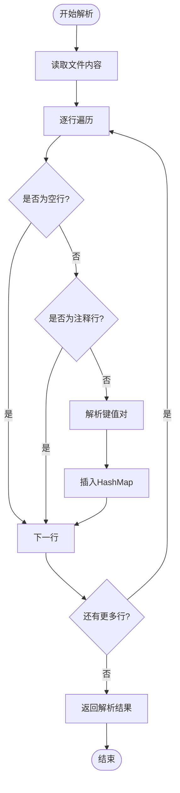
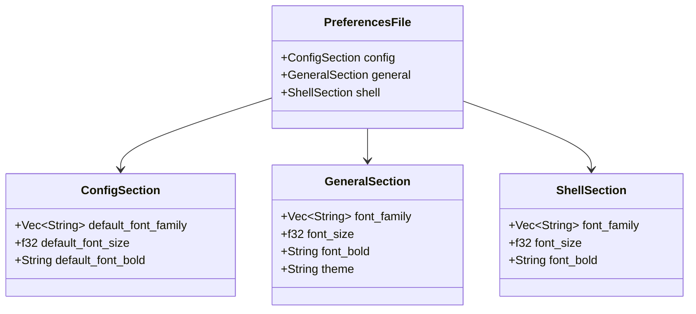
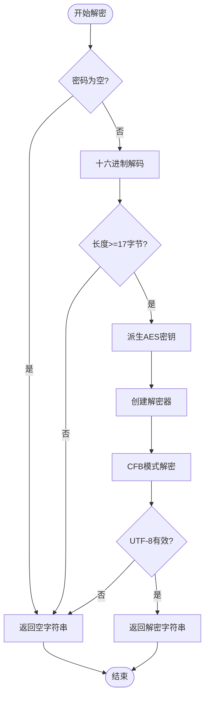
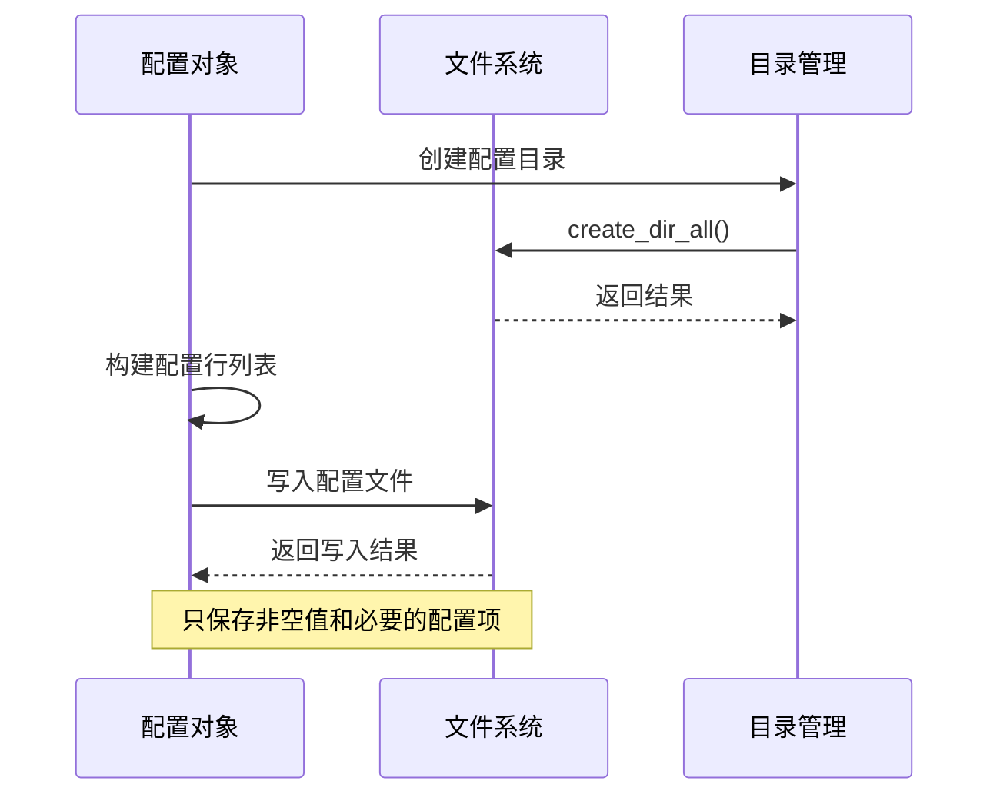
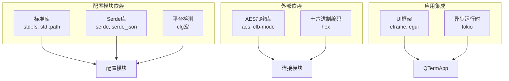

# 配置模块

<cite>
**本文档引用的文件**
- [config.rs](file://src/config.rs)
- [app.rs](file://src/app.rs)
- [main.rs](file://src/main.rs)
- [models.rs](file://src/connection/models.rs)
- [mod.rs](file://src/connection/mod.rs)
- [Cargo.toml](file://Cargo.toml)
</cite>

## 目录
1. [简介](#简介)
2. [项目结构](#项目结构)
3. [核心组件](#核心组件)
4. [架构概览](#架构概览)
5. [详细组件分析](#详细组件分析)
6. [依赖关系分析](#依赖关系分析)
7. [性能考虑](#性能考虑)
8. [故障排除指南](#故障排除指南)
9. [结论](#结论)

## 简介

QTerm配置模块是一个轻量级的跨平台配置管理系统，负责管理应用程序的各种配置需求。该模块支持多种配置格式，包括INI格式的应用配置和JSON格式的偏好设置，并提供了完整的配置加载、保存和验证机制。

配置模块主要包含三个核心功能：
- **应用配置管理**：管理窗口位置、尺寸、主题、字体大小等运行时配置
- **偏好设置管理**：从WhaleTerm导入字体和主题配置
- **连接配置管理**：从WhaleTerm导入SSH连接配置并进行安全解密

## 项目结构

配置模块位于src/config.rs文件中，采用模块化设计，清晰分离了不同类型的配置管理功能：

**图表来源**
- [config.rs:1-281](file://src/config.rs#L1-L281)
- [mod.rs:1-148](file://src/connection/mod.rs#L1-L148)

**章节来源**
- [config.rs:1-281](file://src/config.rs#L1-L281)
- [mod.rs:1-148](file://src/connection/mod.rs#L1-L148)

## 核心组件

### 应用配置结构体（AppConfig）

AppConfig是配置模块的核心数据结构，用于存储应用程序的运行时配置信息：

| 配置项 | 类型 | 默认值 | 描述 |
|--------|------|--------|------|
| window_x | Option<f32> | None | 窗口X坐标 |
| window_y | Option<f32> | None | 窗口Y坐标 |
| window_width | Option<f32> | None | 窗口宽度 |
| window_height | Option<f32> | None | 窗口高度 |
| maximized | bool | false | 是否最大化 |
| font_size | f32 | 14.0 | 终端字体大小 |
| scrollback_lines | usize | 1000 | 回滚缓冲区行数 |
| theme | String | "dark" | 主题名称（dark/light） |
| shell_path | String | "" | 自定义Shell路径 |

### 偏好设置结构体（Preferences）

Preferences结构体从WhaleTerm的preferences.json文件中读取字体和主题配置：

| 配置项 | 类型 | 默认值 | 描述 |
|--------|------|--------|------|
| config_font_family | Vec<String> | [] | 配置区字体族 |
| config_font_size | f32 | 14.0 | 配置区字体大小 |
| config_font_bold | bool | false | 配置区是否粗体 |
| general_font_family | Vec<String> | [] | 通用区字体族 |
| general_font_size | f32 | 14.0 | 通用区字体大小 |
| general_font_bold | bool | false | 通用区是否粗体 |
| shell_font_family | Vec<String> | [] | 终端字体族 |
| shell_font_size | f32 | 14.0 | 终端字体大小 |
| shell_font_bold | bool | false | 终端是否粗体 |
| theme | String | "dark" | 主题名称 |

### 连接配置结构体（Connection）

Connection结构体表示简化后的SSH连接配置，包含解密后的敏感信息：

| 配置项 | 类型 | 描述 |
|--------|------|------|
| name | String | 连接显示名称 |
| addr | String | 主机地址 |
| port | u16 | SSH端口 |
| username | String | 用户名 |
| password | String | 解密后的密码 |
| private_key | String | 私钥文件路径 |
| auth_model | String | 认证模型（password/key） |
| group_name | String | 所属分组名称 |

**章节来源**
- [config.rs:37-127](file://src/config.rs#L37-L127)
- [config.rs:206-281](file://src/config.rs#L206-L281)
- [models.rs:31-43](file://src/connection/models.rs#L31-L43)

## 架构概览

配置模块采用分层架构设计，实现了配置的独立管理和相互协作：

**图表来源**
- [config.rs:68-127](file://src/config.rs#L68-L127)
- [config.rs:239-281](file://src/config.rs#L239-L281)
- [mod.rs:28-59](file://src/connection/mod.rs#L28-L59)

### 配置加载流程

配置模块实现了完整的配置生命周期管理：

**图表来源**
- [config.rs:71-98](file://src/config.rs#L71-L98)
- [config.rs:242-281](file://src/config.rs#L242-L281)
- [mod.rs:30-59](file://src/connection/mod.rs#L30-L59)

**章节来源**
- [config.rs:68-127](file://src/config.rs#L68-L127)
- [config.rs:239-281](file://src/config.rs#L239-L281)
- [mod.rs:28-59](file://src/connection/mod.rs#L28-L59)

## 详细组件分析

### INI配置格式解析器

INI解析器实现了简单的键值对格式解析，支持注释行和空行过滤：

**图表来源**
- [config.rs:129-143](file://src/config.rs#L129-L143)

#### INI格式规范

配置文件采用标准的INI格式，支持以下特性：
- 键值对格式：`key=value`
- 注释行：以`#`开头的行被忽略
- 空行：自动跳过
- 键值去空白：键和值都会去除首尾空白字符

**章节来源**
- [config.rs:129-143](file://src/config.rs#L129-L143)

### JSON配置格式解析器

JSON解析器使用Serde库实现强类型解析，支持复杂的嵌套结构：

**图表来源**
- [config.rs:147-183](file://src/config.rs#L147-L183)

#### JSON格式验证规则

解析器实现了严格的类型检查和默认值处理：
- 字体大小必须大于0，否则使用默认值14.0
- 字体粗体字段需要精确匹配"bold"字符串
- 主题名称为空时使用默认"dark"主题
- 缺失的配置项使用Serde的默认值

**章节来源**
- [config.rs:239-281](file://src/config.rs#L239-L281)

### 连接配置加密解密

连接配置采用了AES-256-CFB加密算法，确保敏感信息的安全存储：

**图表来源**
- [mod.rs:61-98](file://src/connection/mod.rs#L61-L98)

#### 加密算法实现

解密过程遵循以下步骤：
1. **密钥派生**：从主板序列号派生32字节AES密钥
2. **格式验证**：检查十六进制字符串的有效性和长度
3. **解密处理**：使用AES-256-CFB模式解密数据
4. **结果验证**：确保解密结果为有效的UTF-8字符串

**章节来源**
- [mod.rs:61-148](file://src/connection/mod.rs#L61-L148)

### 配置持久化机制

配置模块实现了完整的配置持久化功能，包括文件创建、写入和错误处理：

**图表来源**
- [config.rs:100-126](file://src/config.rs#L100-L126)

#### 保存策略

保存机制采用选择性保存策略：
- **条件保存**：只有非None的Option值才会被保存
- **空值处理**：空字符串的shell_path不会被保存
- **错误容忍**：文件写入失败会被静默忽略，不影响应用运行

**章节来源**
- [config.rs:100-126](file://src/config.rs#L100-L126)

## 依赖关系分析

配置模块的依赖关系相对简单，主要依赖于标准库和Serde生态系统的几个关键组件：

**图表来源**
- [Cargo.toml:8-25](file://Cargo.toml#L8-L25)
- [config.rs:1-5](file://src/config.rs#L1-L5)

### 外部依赖分析

配置模块的主要外部依赖包括：

| 依赖包 | 版本 | 用途 | 安全性 |
|--------|------|------|--------|
| serde | ^1 | JSON序列化/反序列化 | 高 |
| serde_json | 1 | JSON解析 | 高 |
| aes | 0.9 | AES-256加密 | 高 |
| cfb-mode | 0.9 | CFB模式实现 | 高 |
| hex | 0.4 | 十六进制编码 | 高 |

**章节来源**
- [Cargo.toml:8-25](file://Cargo.toml#L8-L25)

## 性能考虑

配置模块在设计时充分考虑了性能和资源使用效率：

### 内存使用优化

- **惰性加载**：配置文件只在需要时才被读取和解析
- **选择性保存**：只保存必要的配置项，减少磁盘空间占用
- **字符串复用**：使用clone()进行浅拷贝，避免不必要的内存分配

### I/O性能优化

- **单次读取**：配置文件采用一次性读取方式，避免多次文件访问
- **批量写入**：配置保存时使用批量写入，减少文件系统调用次数
- **错误容忍**：文件操作失败不会阻塞应用启动，提高可用性

### 平台兼容性

- **条件编译**：使用cfg宏实现平台特定的路径处理
- **回退机制**：当环境变量不可用时提供合理的默认值
- **异常处理**：对平台API调用进行错误处理和回退

## 故障排除指南

### 常见配置问题

#### INI文件解析失败

**症状**：应用无法正确加载窗口位置和尺寸配置

**可能原因**：
- INI文件格式不正确
- 文件权限不足
- 文件编码问题

**解决方案**：
1. 检查config.ini文件格式是否符合标准INI格式
2. 确认应用程序有读取配置文件的权限
3. 验证文件编码为UTF-8

#### JSON文件解析失败

**症状**：偏好设置无法正确加载

**可能原因**：
- preferences.json格式不正确
- 字段类型不匹配
- 文件损坏

**解决方案**：
1. 验证JSON格式的有效性
2. 检查字段类型是否与预期一致
3. 重新生成或修复配置文件

#### 连接配置解密失败

**症状**：SSH连接列表为空或密码显示为乱码

**可能原因**：
- 密码加密格式不正确
- 主板序列号获取失败
- AES密钥派生错误

**解决方案**：
1. 验证密码的十六进制格式
2. 检查系统权限以获取硬件信息
3. 重新生成连接配置

### 配置验证和调试

#### 配置验证方法

1. **手动检查**：直接查看配置文件内容确认格式正确
2. **日志输出**：在应用启动时打印配置加载状态
3. **单元测试**：为配置解析器编写测试用例

#### 调试技巧

- 使用`AppConfig::load()`和`Preferences::load()`方法单独测试配置加载
- 检查返回的默认值以确认配置文件是否被正确读取
- 监控文件系统权限和路径有效性

**章节来源**
- [config.rs:71-98](file://src/config.rs#L71-L98)
- [config.rs:242-281](file://src/config.rs#L242-L281)
- [mod.rs:30-59](file://src/connection/mod.rs#L30-L59)

## 结论

QTerm配置模块展现了优秀的软件工程实践，实现了以下关键特性：

### 设计优势

1. **模块化设计**：清晰分离不同类型配置的管理职责
2. **类型安全**：使用Serde实现强类型解析，避免运行时错误
3. **错误容忍**：配置加载失败时提供合理的默认值
4. **平台兼容**：支持Windows、macOS和Linux平台的配置管理

### 扩展性考虑

配置模块为未来的功能扩展预留了良好的接口：
- 支持新的配置格式和解析器
- 易于添加新的配置项和验证规则
- 可以扩展到其他配置存储后端

### 安全性保障

- 敏感信息采用AES-256-CFB加密存储
- 密钥派生基于硬件信息，提高安全性
- 解密过程包含完整的错误检查和验证

配置模块为QTerm提供了稳定可靠的配置管理基础，为应用程序的持续发展奠定了坚实的技术基础。