# VTE解析器集成

<cite>
**本文档引用的文件**
- [parser.rs](file://src/terminal/parser.rs)
- [mod.rs](file://src/terminal/mod.rs)
- [grid.rs](file://src/terminal/grid.rs)
- [cell.rs](file://src/terminal/cell.rs)
- [renderer.rs](file://src/terminal/renderer.rs)
- [Cargo.toml](file://Cargo.toml)
- [main.rs](file://src/main.rs)
- [app.rs](file://src/app.rs)
- [terminal.rs](file://src/theme/terminal.rs)
</cite>

## 目录
1. [简介](#简介)
2. [项目结构](#项目结构)
3. [核心组件](#核心组件)
4. [架构概览](#架构概览)
5. [详细组件分析](#详细组件分析)
6. [依赖关系分析](#依赖关系分析)
7. [性能考虑](#性能考虑)
8. [故障排除指南](#故障排除指南)
9. [结论](#结论)

## 简介

QTerm是一个轻量级的跨平台终端模拟器，采用Rust语言开发。本文档深入分析了QTerm中VTE（VTE Terminal Emulator）解析器的集成实现，详细解释了控制序列识别、ANSI转义码处理和终端协议实现的工作原理。

该解析器实现了完整的ANSI转义序列处理，包括：
- 控制序列识别（CSI - 控制序列引入器）
- ESC序列处理（转义序列）
- OSC序列处理（操作系统命令）
- 文本属性设置（颜色、样式）
- 光标移动和屏幕操作
- 设备控制和报告

## 项目结构

QTerm的终端子系统采用模块化设计，主要包含以下关键模块：

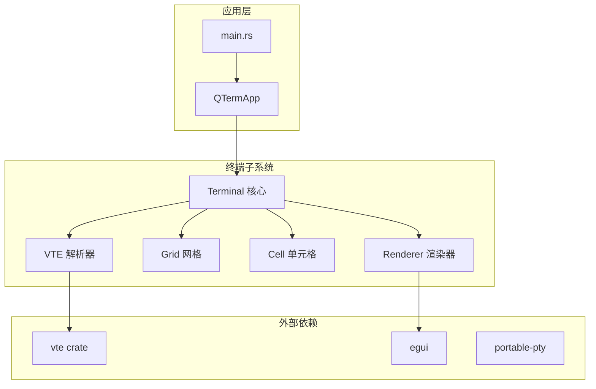

**图表来源**
- [mod.rs:24-41](file://src/terminal/mod.rs#L24-L41)
- [Cargo.toml:8-12](file://Cargo.toml#L8-L12)

**章节来源**
- [mod.rs:1-200](file://src/terminal/mod.rs#L1-L200)
- [Cargo.toml:1-30](file://Cargo.toml#L1-L30)

## 核心组件

### Terminal 结构体

Terminal是终端模拟器的核心结构体，负责管理整个终端状态：

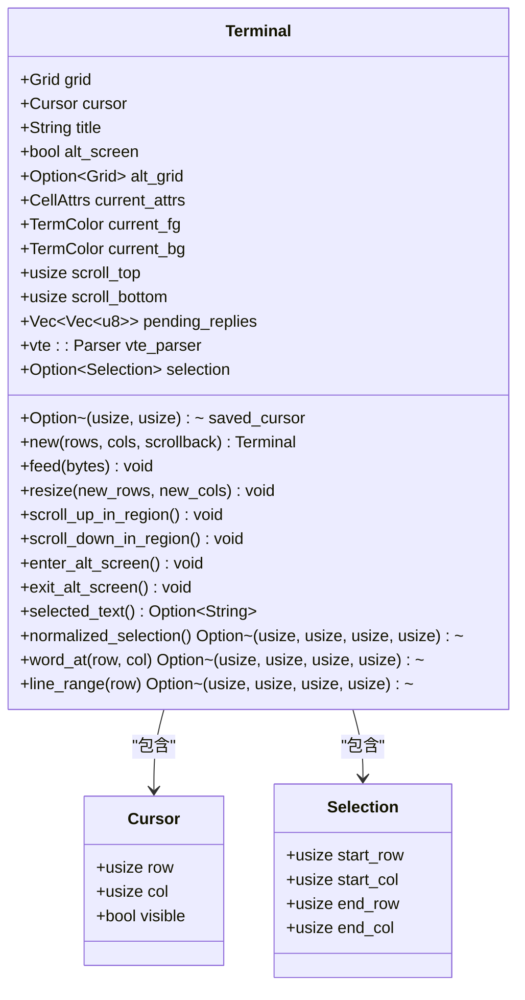

**图表来源**
- [mod.rs:26-41](file://src/terminal/mod.rs#L26-L41)
- [mod.rs:9-22](file://src/terminal/mod.rs#L9-L22)

### Performer 结构体

Performer是VTE解析器的执行器，实现了vte::Perform trait：

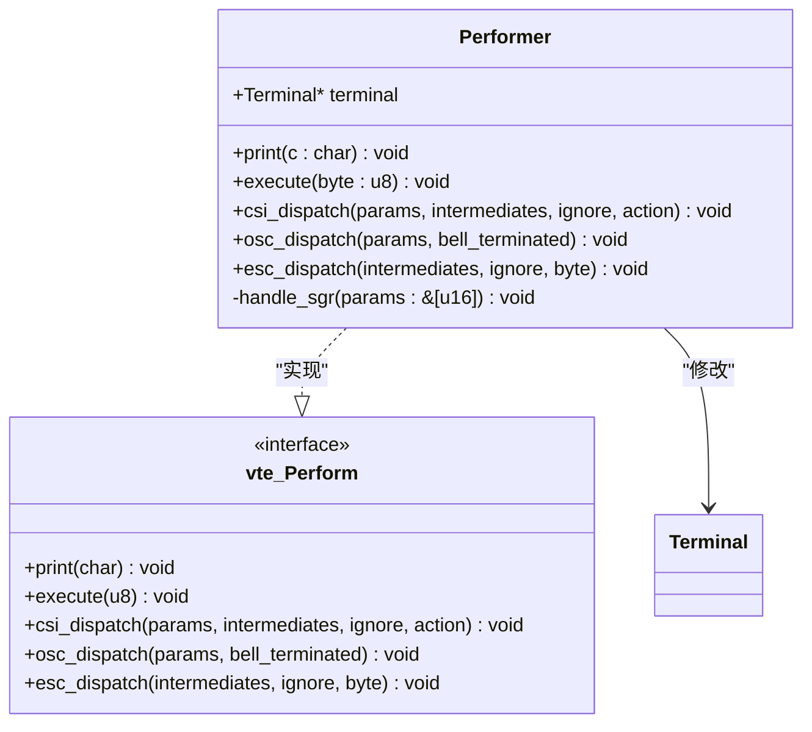

**图表来源**
- [parser.rs:6-8](file://src/terminal/parser.rs#L6-L8)
- [parser.rs:10-231](file://src/terminal/parser.rs#L10-L231)

**章节来源**
- [parser.rs:4-307](file://src/terminal/parser.rs#L4-L307)
- [mod.rs:24-200](file://src/terminal/mod.rs#L24-L200)

## 架构概览

QTerm的VTE解析器采用分层架构设计，实现了完整的ANSI转义序列处理流程：

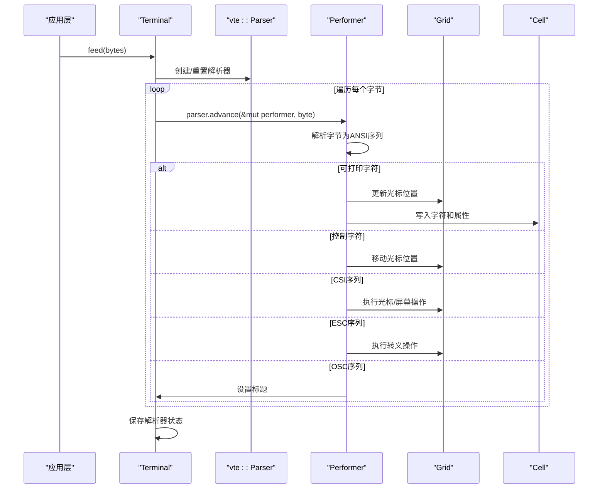

**图表来源**
- [mod.rs:67-74](file://src/terminal/mod.rs#L67-L74)
- [parser.rs:10-231](file://src/terminal/parser.rs#L10-L231)

## 详细组件分析

### VTE解析器状态机

解析器实现了完整的状态机，能够处理各种ANSI转义序列：

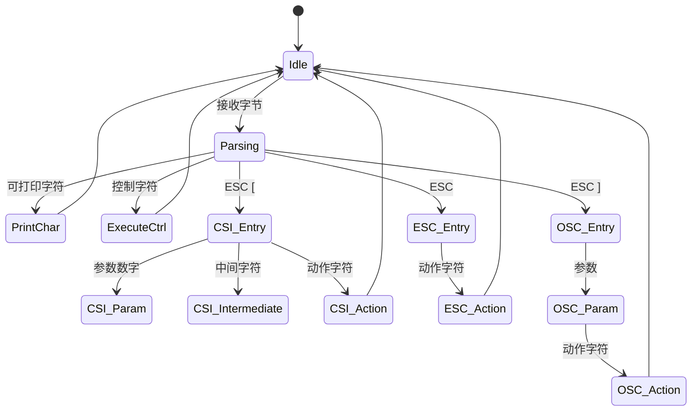

**图表来源**
- [parser.rs:10-231](file://src/terminal/parser.rs#L10-L231)

#### 可打印字符处理

可打印字符处理是最基础的功能，负责在当前位置写入字符并移动光标：

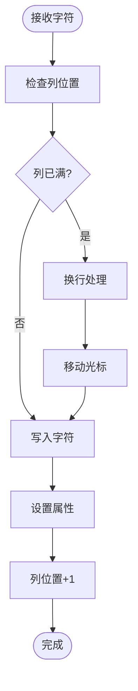

**图表来源**
- [parser.rs:12-32](file://src/terminal/parser.rs#L12-L32)

#### 控制字符执行

控制字符处理包括退格、制表、换行和回车等标准控制序列：

| 字符代码 | 名称 | 功能 |
|---------|------|------|
| 0x08 | Backspace | 光标左移一位 |
| 0x09 | Tab | 移动到下一个制表位 |
| 0x0A | Line Feed | 光标下移一行 |
| 0x0B | Vertical Tab | 光标下移一行 |
| 0x0C | Form Feed | 光标下移一行 |
| 0x0D | Carriage Return | 光标回到行首 |

**章节来源**
- [parser.rs:35-61](file://src/terminal/parser.rs#L35-L61)

### CSI序列处理

CSI（控制序列引入器）序列是最复杂的ANSI序列类型，支持多种终端操作：

#### 光标移动操作

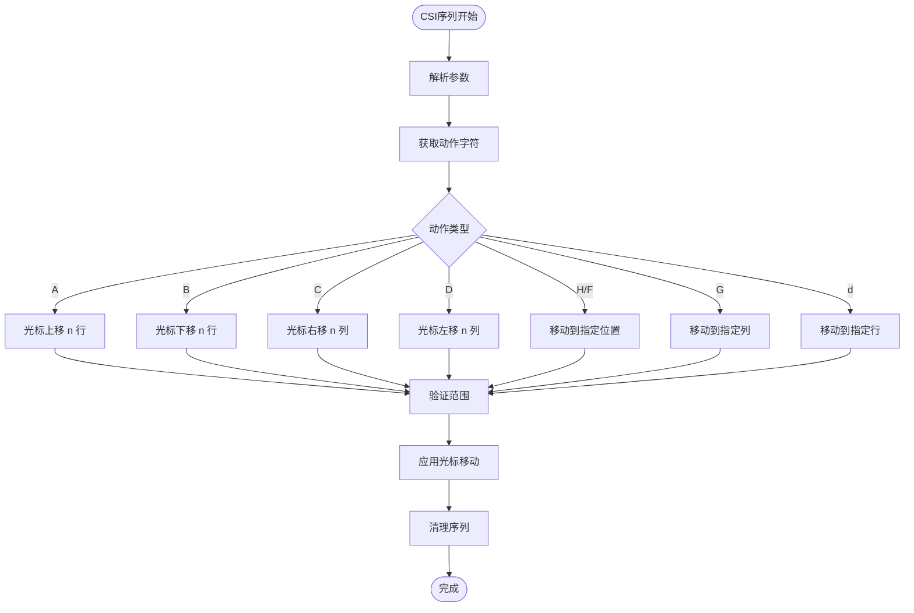

**图表来源**
- [parser.rs:78-86](file://src/terminal/parser.rs#L78-L86)

#### 屏幕操作序列

CSI序列支持多种屏幕操作，包括清屏、滚动和区域设置：

| 序列 | 动作 | 描述 |
|------|------|------|
| `J` | 清屏 | 0: 清除从光标到行尾 1: 清除从行首到光标 2: 清除整个屏幕 |
| `K` | 清行 | 0: 清除从光标到行尾 1: 清除从行首到光标 2: 清除整行 |
| `L` | 插入行 | 在光标位置插入n行 |
| `M` | 删除行 | 从光标位置删除n行 |
| `S` | 向上滚动 | 在滚动区域内向上滚动n行 |
| `T` | 向下滚动 | 在滚动区域内向下滚动n行 |
| `r` | 设置滚动区域 | 设置顶部和底部滚动边界 |

**章节来源**
- [parser.rs:87-132](file://src/terminal/parser.rs#L87-L132)

### ESC序列处理

ESC序列处理包括光标保存/恢复、滚动和设备复位等功能：

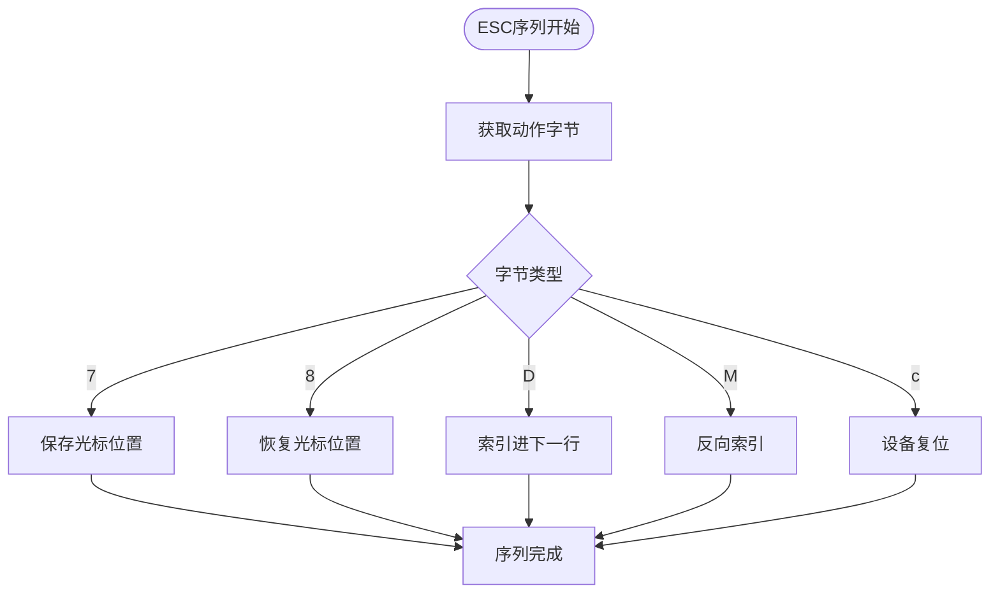

**图表来源**
- [parser.rs:197-225](file://src/terminal/parser.rs#L197-L225)

### OSC序列处理

OSC（操作系统命令）序列主要用于设置终端标题和状态：

| 序列 | 动作 | 描述 |
|------|------|------|
| `0` | 设置图标和标题 | 设置窗口图标和标题 |
| `1` | 设置图标 | 仅设置窗口图标 |
| `2` | 设置标题 | 仅设置窗口标题 |

**章节来源**
- [parser.rs:177-193](file://src/terminal/parser.rs#L177-L193)

### 文本属性处理

SGR（Set Graphics Rendition）序列处理文本属性设置：

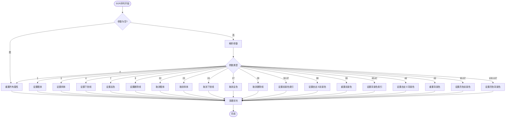

**图表来源**
- [parser.rs:234-306](file://src/terminal/parser.rs#L234-L306)

**章节来源**
- [parser.rs:233-307](file://src/terminal/parser.rs#L233-L307)

### 终端状态管理

终端状态管理包括光标位置、颜色属性、滚动区域和备用屏幕模式：

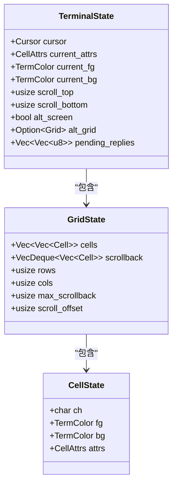

**图表来源**
- [mod.rs:26-41](file://src/terminal/mod.rs#L26-L41)
- [grid.rs:7-14](file://src/terminal/grid.rs#L7-L14)
- [cell.rs:57-75](file://src/terminal/cell.rs#L57-L75)

**章节来源**
- [mod.rs:24-200](file://src/terminal/mod.rs#L24-L200)
- [grid.rs:1-148](file://src/terminal/grid.rs#L1-148)
- [cell.rs:1-75](file://src/terminal/cell.rs#L1-75)

## 依赖关系分析

QTerm的VTE解析器依赖于多个外部库和内部模块：

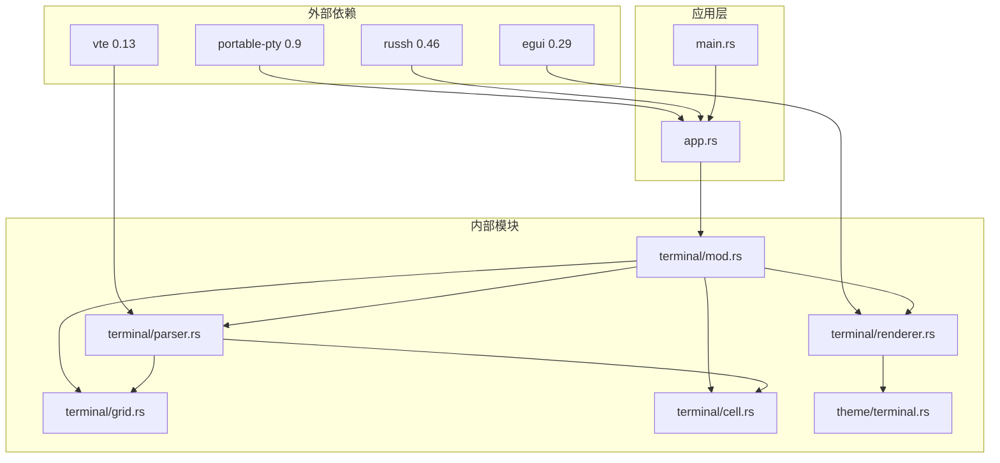

**图表来源**
- [Cargo.toml:8-25](file://Cargo.toml#L8-L25)
- [parser.rs:1-2](file://src/terminal/parser.rs#L1-L2)

**章节来源**
- [Cargo.toml:1-30](file://Cargo.toml#L1-L30)

### 性能特性

QTerm的VTE解析器具有以下性能特点：

1. **零拷贝设计**：使用引用传递避免不必要的数据复制
2. **增量解析**：逐字节解析，减少内存占用
3. **批量更新**：渲染时使用批量绘制优化
4. **缓存机制**：使用VecDeque管理滚动缓冲区

## 性能考虑

### 解析器性能优化

1. **字节级解析**：逐字节处理，避免字符串解析开销
2. **参数预处理**：将vte::Params转换为Vec<u16>便于快速访问
3. **条件分支优化**：使用match语句进行快速分支选择
4. **边界检查**：在循环前进行必要的边界检查

### 渲染性能优化

1. **批量绘制**：使用文本运行（runs）批量绘制相同颜色的文本
2. **增量更新**：只更新发生变化的单元格
3. **字体缓存**：利用egui的字体缓存机制
4. **选择高亮**：使用矩形填充而非逐字符绘制

### 内存管理

1. **回滚缓冲区**：限制最大回滚行数防止内存泄漏
2. **智能重分配**：根据需要动态调整网格大小
3. **引用计数**：使用共享引用避免数据复制

## 故障排除指南

### 常见问题诊断

1. **光标位置异常**
   - 检查CSI序列参数解析
   - 验证边界条件处理
   - 确认滚动区域设置

2. **颜色显示错误**
   - 验证TermColor转换逻辑
   - 检查主题配置
   - 确认SGR序列处理

3. **渲染性能问题**
   - 分析文本运行数量
   - 检查批量绘制效率
   - 优化字体渲染

### 调试方法

1. **日志记录**：在关键路径添加调试信息
2. **单元测试**：为每个ANSI序列编写测试用例
3. **性能分析**：使用Rust的perf工具分析热点
4. **内存分析**：监控回滚缓冲区大小

**章节来源**
- [parser.rs:10-307](file://src/terminal/parser.rs#L10-L307)
- [mod.rs:65-200](file://src/terminal/mod.rs#L65-L200)

## 结论

QTerm的VTE解析器集成了完整的ANSI转义序列处理能力，实现了：

1. **完整的ANSI支持**：支持主要的CSI、ESC、OSC序列
2. **高性能实现**：采用零拷贝和增量解析设计
3. **良好的扩展性**：清晰的接口设计便于添加新功能
4. **稳定的渲染**：基于egui的高效渲染系统

该解析器为QTerm提供了可靠的终端模拟基础，支持各种Unix/Linux环境下的标准终端行为。通过模块化的架构设计和完善的错误处理机制，确保了系统的稳定性和可维护性。

未来可以考虑的改进方向包括：
- 添加更多ANSI序列的支持
- 实现终端能力查询
- 优化内存使用
- 增强调试和性能分析工具