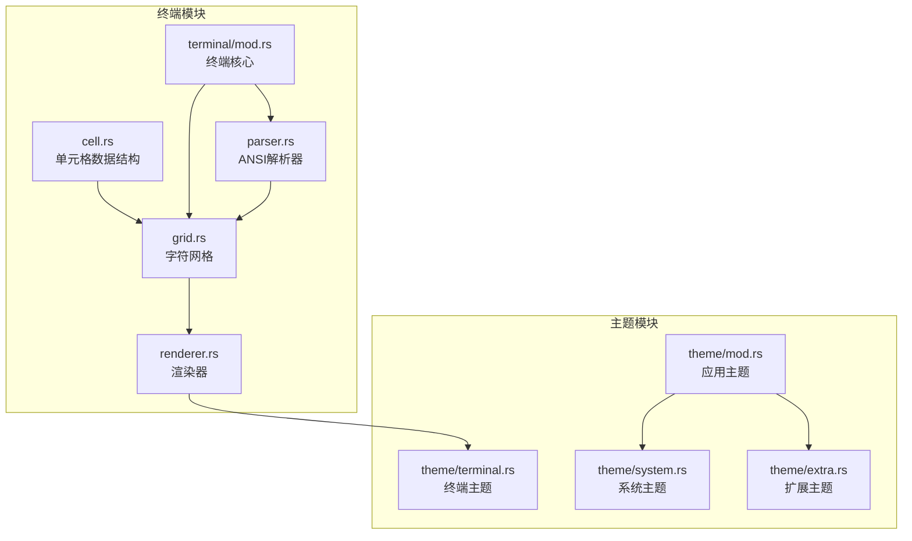
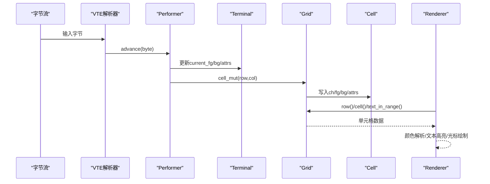
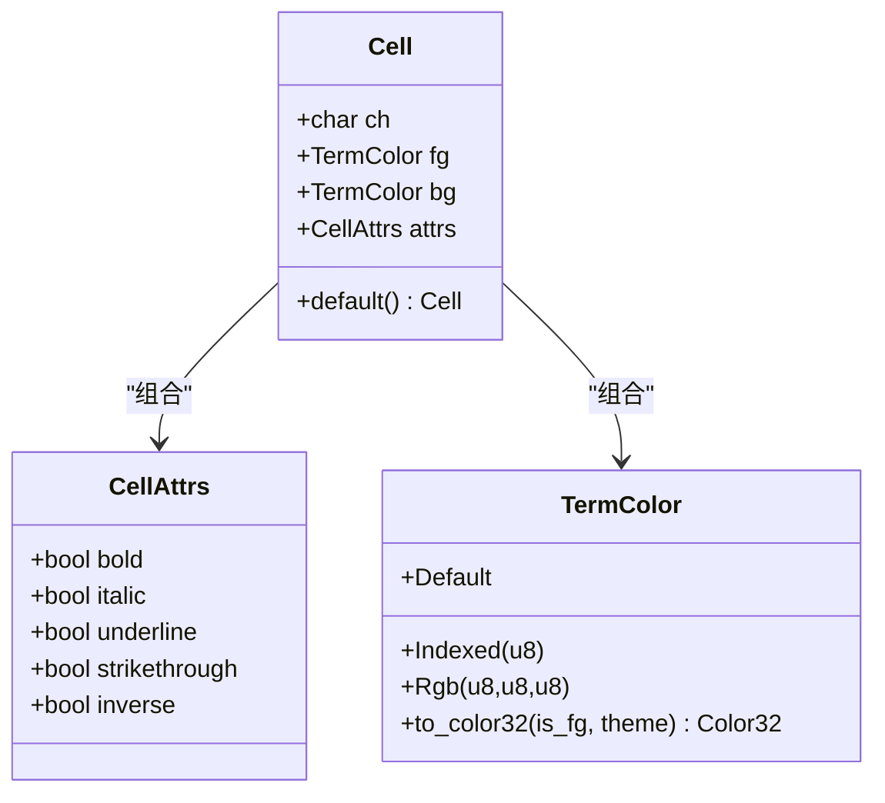
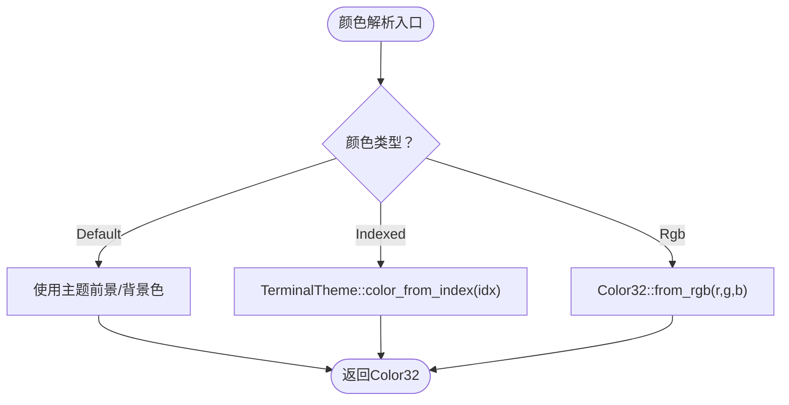
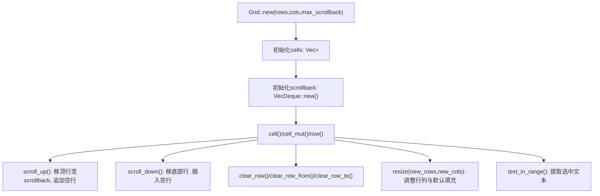
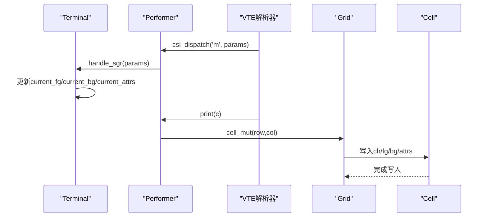
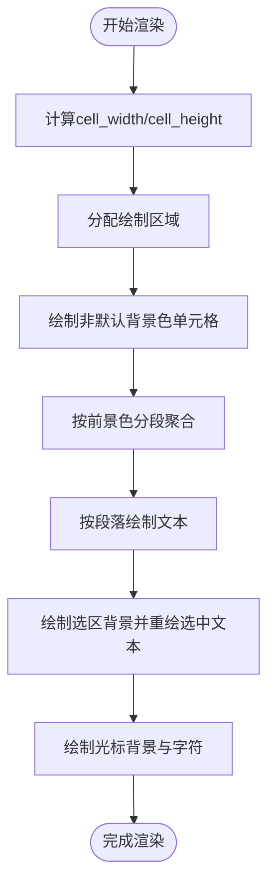
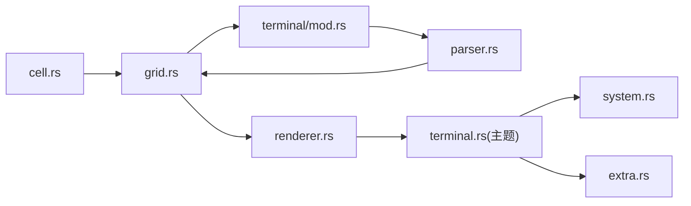

# 单元格数据结构

<cite>
**本文档引用的文件**
- [cell.rs](file://src/terminal/cell.rs)
- [grid.rs](file://src/terminal/grid.rs)
- [terminal.rs](file://src/terminal/mod.rs)
- [parser.rs](file://src/terminal/parser.rs)
- [renderer.rs](file://src/terminal/renderer.rs)
- [terminal_theme.rs](file://src/theme/terminal.rs)
- [app_theme.rs](file://src/theme/mod.rs)
- [system_theme.rs](file://src/theme/system.rs)
- [extra_theme.rs](file://src/theme/extra.rs)
</cite>

## 目录
1. [简介](#简介)
2. [项目结构](#项目结构)
3. [核心组件](#核心组件)
4. [架构总览](#架构总览)
5. [详细组件分析](#详细组件分析)
6. [依赖关系分析](#依赖关系分析)
7. [性能考量](#性能考量)
8. [故障排查指南](#故障排查指南)
9. [结论](#结论)
10. [附录](#附录)

## 简介
本文件面向QTerm的单元格数据结构，系统性阐述Cell结构体的设计与实现，包括字符存储、颜色属性与文本属性的组合方式；详解CellAttrs与TermColor的设计理念、颜色模式、文本样式与属性继承机制；说明单元格状态管理（属性合并、颜色解析、默认值处理）；分析单元格在网格中的存储与访问模式（内存布局优化与缓存策略）；并提供单元格操作API示例，展示如何实现文本高亮、颜色主题与属性定制功能，最后给出扩展指南与性能优化建议。

## 项目结构
QTerm采用模块化设计，终端相关的核心位于src/terminal目录，主题系统位于src/theme目录。单元格数据结构主要分布在cell.rs中，并被grid.rs、parser.rs、renderer.rs等模块广泛使用。

图表来源
- [cell.rs:1-75](file://src/terminal/cell.rs#L1-L75)
- [grid.rs:1-148](file://src/terminal/grid.rs#L1-L148)
- [terminal.rs:1-200](file://src/terminal/mod.rs#L1-L200)
- [parser.rs:1-311](file://src/terminal/parser.rs#L1-L311)
- [renderer.rs:1-198](file://src/terminal/renderer.rs#L1-L198)
- [terminal_theme.rs:1-102](file://src/theme/terminal.rs#L1-L102)
- [app_theme.rs:1-81](file://src/theme/mod.rs#L1-L81)
- [system_theme.rs:1-292](file://src/theme/system.rs#L1-L292)
- [extra_theme.rs:1-66](file://src/theme/extra.rs#L1-L66)

章节来源
- [cell.rs:1-75](file://src/terminal/cell.rs#L1-L75)
- [grid.rs:1-148](file://src/terminal/grid.rs#L1-L148)
- [terminal.rs:1-200](file://src/terminal/mod.rs#L1-L200)
- [parser.rs:1-311](file://src/terminal/parser.rs#L1-L311)
- [renderer.rs:1-198](file://src/terminal/renderer.rs#L1-L198)
- [terminal_theme.rs:1-102](file://src/theme/terminal.rs#L1-L102)
- [app_theme.rs:1-81](file://src/theme/mod.rs#L1-L81)
- [system_theme.rs:1-292](file://src/theme/system.rs#L1-L292)
- [extra_theme.rs:1-66](file://src/theme/extra.rs#L1-L66)

## 核心组件
- Cell：每个单元格存储一个字符及其前景色、背景色与显示属性。
- CellAttrs：文本样式属性集合（粗体、斜体、下划线、删除线、反色）。
- TermColor：颜色类型，支持Default、Indexed（ANSI 256色索引）、Rgb（自定义RGB）三种模式。
- Grid：字符网格，管理屏幕单元格矩阵、回滚缓冲区与滚动偏移。
- Terminal：终端仿真器核心，维护Grid、光标、颜色属性、滚动区域、选择等状态。
- TerminalTheme：终端主题，包含前景/背景、光标、选区、ANSI颜色映射等。
- Parser：VTE解析器的执行器，将ANSI序列应用到终端状态，写入Cell。
- Renderer：渲染器，将Grid中的Cell渲染到egui画布，支持颜色解析与文本高亮。

章节来源
- [cell.rs:5-75](file://src/terminal/cell.rs#L5-L75)
- [grid.rs:5-148](file://src/terminal/grid.rs#L5-L148)
- [terminal.rs:24-63](file://src/terminal/mod.rs#L24-L63)
- [parser.rs:6-311](file://src/terminal/parser.rs#L6-L311)
- [renderer.rs:7-198](file://src/terminal/renderer.rs#L7-L198)
- [terminal_theme.rs:5-102](file://src/theme/terminal.rs#L5-L102)

## 架构总览
单元格数据结构贯穿解析、存储与渲染三大阶段：
- 解析阶段：Parser接收字节流，调用performer将字符与当前颜色/属性写入Grid.cell_mut。
- 存储阶段：Grid以二维Vec<Cell>存储当前屏幕，配合VecDeque作为回滚缓冲区。
- 渲染阶段：Renderer遍历Grid，按颜色分段绘制文本，处理选区高亮与光标绘制。

图表来源
- [parser.rs:10-32](file://src/terminal/parser.rs#L10-L32)
- [parser.rs:235-311](file://src/terminal/parser.rs#L235-L311)
- [grid.rs:31-44](file://src/terminal/grid.rs#L31-L44)
- [renderer.rs:63-107](file://src/terminal/renderer.rs#L63-L107)

## 详细组件分析

### Cell结构体与属性组合
- 字段设计
  - ch：字符内容，支持任意Unicode字符。
  - fg/bg：TermColor，分别表示前景色与背景色。
  - attrs：CellAttrs，表示文本样式属性。
- 默认行为
  - Cell::default()：空格字符、默认颜色、无属性，便于清屏与初始化。
- 属性继承
  - Parser在print时将当前Terminal的current_fg/current_bg/current_attrs写入Cell，形成“属性继承”机制。
  - SGR序列可重置或修改current_fg/current_bg/current_attrs，影响后续写入的Cell。

图表来源
- [cell.rs:5-75](file://src/terminal/cell.rs#L5-L75)

章节来源
- [cell.rs:5-75](file://src/terminal/cell.rs#L5-L75)
- [parser.rs:10-32](file://src/terminal/parser.rs#L10-L32)
- [parser.rs:235-311](file://src/terminal/parser.rs#L235-L311)

### CellAttrs与文本样式
- 设计理念
  - 粗体、斜体、下划线、删除线、反色五种基础样式，满足常见终端显示需求。
  - inverse属性在渲染时触发前景/背景色交换，实现反色高亮。
- 默认值
  - CellAttrs::default()返回全部false，保证默认无样式。
- 与渲染的关系
  - Renderer在resolve_fg/resolve_bg时考虑inverse，实现反色效果。
  - 文本绘制按颜色分段，避免频繁颜色切换导致的绘制开销。

章节来源
- [cell.rs:5-25](file://src/terminal/cell.rs#L5-L25)
- [renderer.rs:182-198](file://src/terminal/renderer.rs#L182-L198)

### TermColor与颜色模式
- 颜色类型
  - Default：使用主题提供的前景/背景色。
  - Indexed(u8)：支持ANSI 16色或256色索引，TerminalTheme提供索引到Color32的映射。
  - Rgb(u8,u8,u8)：自定义RGB颜色。
- 颜色解析
  - TermColor::to_color32根据is_fg区分前景/背景，并委托TerminalTheme解析。
  - TerminalTheme::color_from_index实现标准16色、216色立方体与24灰阶映射。
- 默认值
  - Cell::default()使用TermColor::Default，确保与主题一致。
  - Terminal::new()初始化current_fg/current_bg为TermColor::Default。

图表来源
- [cell.rs:36-53](file://src/terminal/cell.rs#L36-L53)
- [terminal_theme.rs:84-100](file://src/theme/terminal.rs#L84-L100)

章节来源
- [cell.rs:27-53](file://src/terminal/cell.rs#L27-L53)
- [terminal_theme.rs:5-102](file://src/theme/terminal.rs#L5-L102)
- [terminal.rs:44-63](file://src/terminal/mod.rs#L44-L63)

### Grid网格存储与访问模式
- 数据结构
  - cells: Vec<Vec<Cell>>：当前屏幕的二维单元格矩阵。
  - scrollback: VecDeque<Vec<Cell>>：回滚缓冲区，存储滚出屏幕的历史行。
  - scroll_offset：当前滚动偏移（0表示不滚动）。
- 访问接口
  - cell(row,col)/cell_mut(row,col)：直接索引访问。
  - row(row)：按行切片访问，便于按行渲染与文本提取。
  - text_in_range(start_row..=end_row, start_col..=end_col)：复制选中文本。
- 滚动与清屏
  - scroll_up/scroll_down：向上/向下滚动一行，维护回滚缓冲区。
  - clear_row/clear_row_from/clear_row_to：按需清屏，保持历史可追溯。
- 内存布局优化
  - 以行优先的二维数组存储，局部性良好；回滚缓冲区采用双端队列，便于在两端高效插入/删除。
  - 渲染时按颜色分段绘制文本，减少绘制调用次数。

图表来源
- [grid.rs:16-114](file://src/terminal/grid.rs#L16-L114)
- [grid.rs:126-147](file://src/terminal/grid.rs#L126-L147)

章节来源
- [grid.rs:5-148](file://src/terminal/grid.rs#L5-L148)

### Terminal状态管理与属性合并
- 当前状态
  - current_attrs/current_fg/current_bg：当前生效的颜色与样式。
  - scroll_top/scroll_bottom：滚动区域边界，影响scroll_up_in_region/scroll_down_in_region的行为。
- 属性合并
  - Parser::print在写入Cell时，直接采用Terminal的current_*，实现“即时合并”。
  - SGR序列通过handle_sgr更新current_*，支持SGR重置与组合。
- 默认值处理
  - Cell::default()与Terminal::new()均使用TermColor::Default，确保与主题一致。
  - SGR 0重置为默认值，保证属性不会无限累积。

图表来源
- [parser.rs:63-173](file://src/terminal/parser.rs#L63-L173)
- [parser.rs:235-311](file://src/terminal/parser.rs#L235-L311)
- [terminal.rs:43-63](file://src/terminal/mod.rs#L43-L63)

章节来源
- [parser.rs:63-173](file://src/terminal/parser.rs#L63-L173)
- [parser.rs:235-311](file://src/terminal/parser.rs#L235-L311)
- [terminal.rs:24-63](file://src/terminal/mod.rs#L24-L63)

### 渲染流程与文本高亮
- 渲染步骤
  - 计算单元格尺寸，分配绘制区域。
  - 绘制背景：仅对非默认背景色的单元格绘制背景矩形。
  - 文本绘制：按颜色分段，连续相同前景色的单元格合并为一次绘制，提升性能。
  - 选区高亮：先绘制选区背景，再在选区内按主题前景色重绘文本。
  - 光标绘制：绘制光标背景色方块，并在其中绘制当前字符。
- 颜色解析
  - resolve_fg/resolve_bg根据inverse决定交换前景/背景色。
- 文本高亮
  - 通过Cell.attrs.inverse实现反色高亮；通过Cell.bg/fg实现背景/前景高亮。

图表来源
- [renderer.rs:25-107](file://src/terminal/renderer.rs#L25-L107)
- [renderer.rs:109-172](file://src/terminal/renderer.rs#L109-L172)
- [renderer.rs:182-198](file://src/terminal/renderer.rs#L182-L198)

章节来源
- [renderer.rs:7-198](file://src/terminal/renderer.rs#L7-L198)

### 单元格操作API示例（概念性说明）
以下为基于现有代码的使用思路，展示如何实现常见功能（不包含具体代码片段）：
- 文本高亮
  - 设置Cell.bg或Cell.fg为高亮颜色，或通过Cell.attrs.inverse实现反色高亮。
  - 在渲染阶段，resolve_fg/resolve_bg会自动处理反色逻辑。
- 颜色主题
  - 通过TerminalTheme配置前景/背景与ANSI颜色映射，TermColor::Default自动解析为主题色。
  - AppTheme组合SystemTheme与TerminalTheme，统一应用到egui与终端。
- 属性定制
  - 使用SGR序列（如粗体、下划线、反色）修改current_attrs，随后写入的Cell将继承这些属性。
  - 通过Parser的handle_sgr实现属性组合与重置。

章节来源
- [parser.rs:235-311](file://src/terminal/parser.rs#L235-L311)
- [renderer.rs:182-198](file://src/terminal/renderer.rs#L182-L198)
- [terminal_theme.rs:5-102](file://src/theme/terminal.rs#L5-L102)
- [app_theme.rs:14-71](file://src/theme/mod.rs#L14-L71)

## 依赖关系分析
- 模块耦合
  - cell.rs被grid.rs、parser.rs、renderer.rs直接依赖，是核心数据载体。
  - grid.rs被renderer.rs依赖，同时被terminal.rs的Terminal持有。
  - parser.rs依赖terminal.rs中的Terminal状态，间接影响cell.rs。
  - renderer.rs依赖terminal_theme.rs进行颜色解析。
  - theme模块独立于终端核心，通过TerminalTheme注入到渲染流程。
- 外部依赖
  - 使用egui进行渲染，Color32用于颜色表示。
  - 使用vte进行ANSI序列解析，Performer将解析结果应用到Terminal状态。

图表来源
- [cell.rs:1-75](file://src/terminal/cell.rs#L1-L75)
- [grid.rs:1-148](file://src/terminal/grid.rs#L1-L148)
- [terminal.rs:1-200](file://src/terminal/mod.rs#L1-L200)
- [parser.rs:1-311](file://src/terminal/parser.rs#L1-L311)
- [renderer.rs:1-198](file://src/terminal/renderer.rs#L1-L198)
- [terminal_theme.rs:1-102](file://src/theme/terminal.rs#L1-L102)
- [system_theme.rs:1-292](file://src/theme/system.rs#L1-L292)
- [extra_theme.rs:1-66](file://src/theme/extra.rs#L1-L66)

章节来源
- [cell.rs:1-75](file://src/terminal/cell.rs#L1-L75)
- [grid.rs:1-148](file://src/terminal/grid.rs#L1-L148)
- [terminal.rs:1-200](file://src/terminal/mod.rs#L1-L200)
- [parser.rs:1-311](file://src/terminal/parser.rs#L1-L311)
- [renderer.rs:1-198](file://src/terminal/renderer.rs#L1-L198)
- [terminal_theme.rs:1-102](file://src/theme/terminal.rs#L1-L102)
- [system_theme.rs:1-292](file://src/theme/system.rs#L1-L292)
- [extra_theme.rs:1-66](file://src/theme/extra.rs#L1-L66)

## 性能考量
- 绘制优化
  - 按颜色分段绘制文本，减少绘制调用次数，提升渲染效率。
  - 仅对非默认背景色单元格绘制背景矩形，降低不必要的绘制。
- 内存布局
  - 二维Vec<Cell>提供良好的局部性；回滚缓冲区使用VecDeque，两端高效插入/删除。
- 颜色解析
  - TermColor::to_color32与TerminalTheme::color_from_index均为常数时间操作，避免重复计算。
- 文本提取
  - text_in_range按行扫描并trim尾随空格，适合复制选中文本场景。

章节来源
- [renderer.rs:63-107](file://src/terminal/renderer.rs#L63-L107)
- [grid.rs:126-147](file://src/terminal/grid.rs#L126-L147)

## 故障排查指南
- 颜色异常
  - 检查TermColor::Default是否正确绑定到TerminalTheme的foreground/background。
  - 确认SGR序列是否正确重置current_fg/current_bg/current_attrs。
- 反色无效
  - 确认Cell.attrs.inverse为true，且resolve_fg/resolve_bg在渲染时被调用。
- 文本高亮不生效
  - 检查Cell.bg/fg是否被覆盖（例如后续写入的字符可能重置属性）。
  - 确认渲染阶段未被其他绘制逻辑覆盖（如选区背景）。
- 滚动异常
  - 检查scroll_top/scroll_bottom与scroll_up_in_region/scroll_down_in_region的调用时机。
  - 确认max_scrollback限制是否合理，避免历史丢失。

章节来源
- [cell.rs:36-53](file://src/terminal/cell.rs#L36-L53)
- [parser.rs:235-311](file://src/terminal/parser.rs#L235-L311)
- [renderer.rs:182-198](file://src/terminal/renderer.rs#L182-L198)
- [grid.rs:46-114](file://src/terminal/grid.rs#L46-L114)

## 结论
QTerm的单元格数据结构以简洁、明确为核心设计原则：Cell承载字符与属性，CellAttrs与TermColor分别负责文本样式与颜色表达，Grid提供高效的二维存储与滚动能力，Parser与Renderer分别完成属性继承与渲染优化。该设计既满足终端仿真所需的复杂文本呈现，又通过颜色分段绘制与默认值策略实现了良好的性能与可维护性。

## 附录

### 扩展指南
- 新增颜色模式
  - 在TermColor中新增枚举变体，并在TermColor::to_color32中添加解析分支。
  - 在TerminalTheme中补充相应映射或生成逻辑。
- 新增文本样式
  - 在CellAttrs中增加布尔字段，并在Parser的handle_sgr中支持对应的SGR码。
  - 在Renderer中根据新样式进行绘制（如虚线下划线）。
- 自定义渲染策略
  - 在renderer.rs中扩展绘制逻辑，如支持闪烁、高亮范围等。

### 性能优化建议
- 减少颜色解析开销
  - 对频繁使用的颜色进行缓存（如颜色索引到Color32的映射）。
- 批量绘制
  - 在渲染阶段进一步聚合相同样式的连续单元格，减少绘制调用。
- 内存池
  - 对频繁创建/销毁的Cell进行内存池管理，降低分配成本。