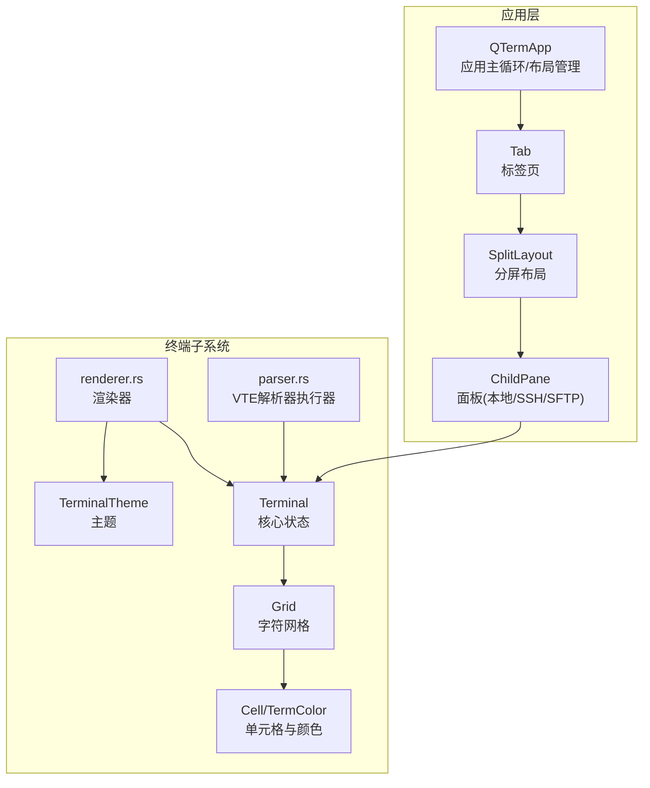
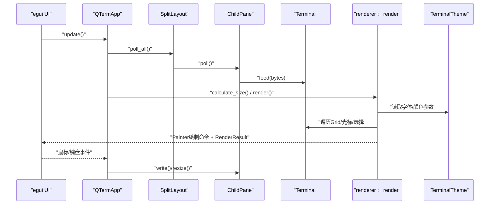
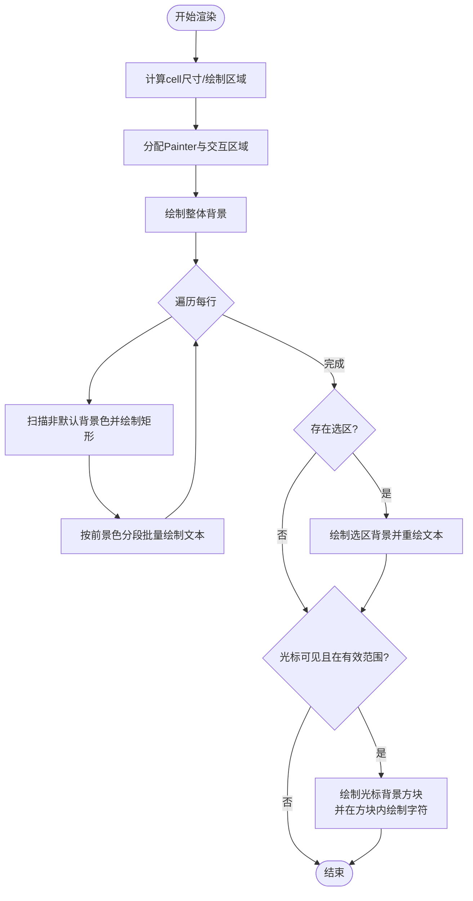
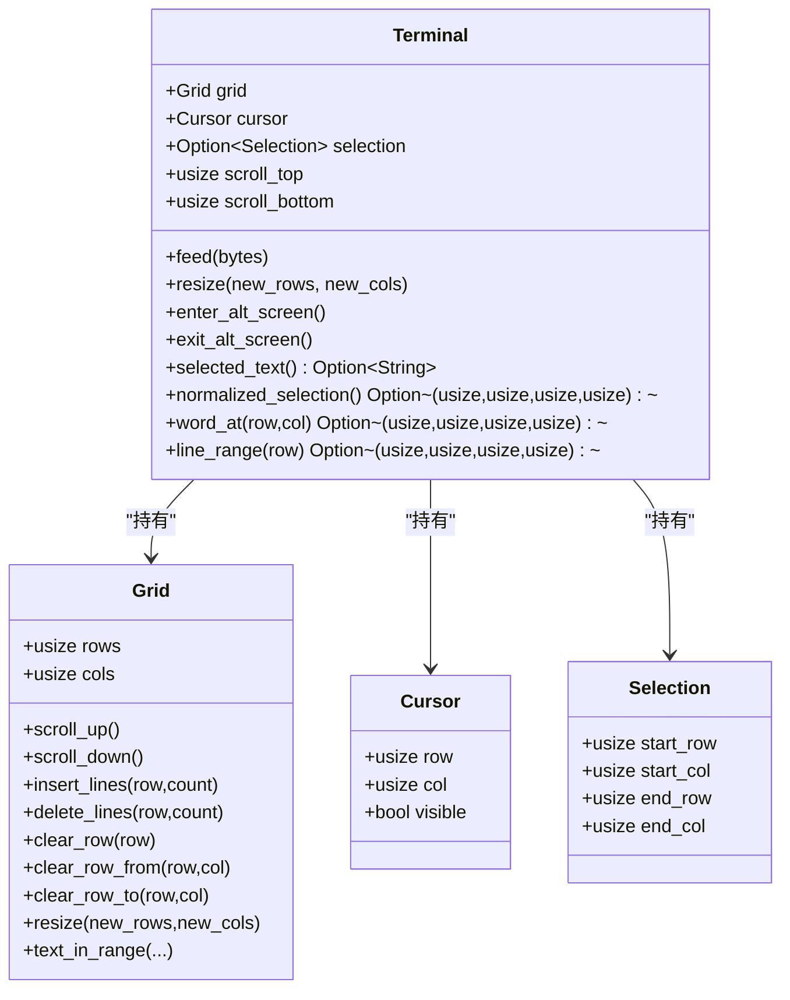
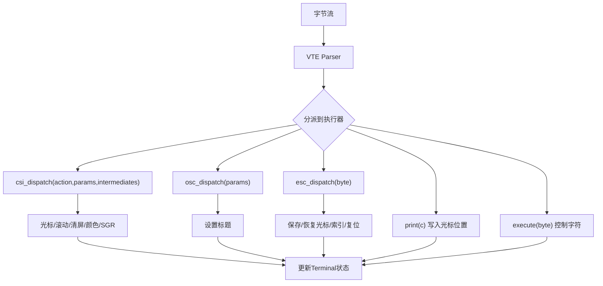
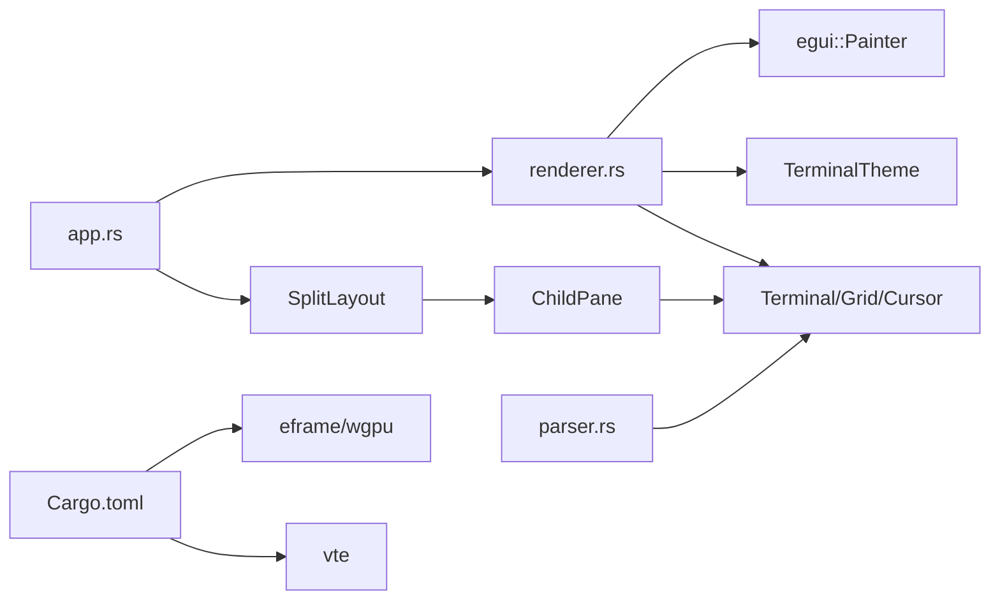

# 渲染引擎

<cite>
**本文档引用的文件**
- [renderer.rs](file://src/terminal/renderer.rs)
- [mod.rs](file://src/terminal/mod.rs)
- [cell.rs](file://src/terminal/cell.rs)
- [grid.rs](file://src/terminal/grid.rs)
- [parser.rs](file://src/terminal/parser.rs)
- [terminal.rs](file://src/theme/terminal.rs)
- [app.rs](file://src/app.rs)
- [split_pane.rs](file://src/ui/split_pane.rs)
- [tab_item.rs](file://src/tab/tab_item.rs)
- [Cargo.toml](file://Cargo.toml)
- [main.rs](file://src/main.rs)
</cite>

## 目录
1. [简介](#简介)
2. [项目结构](#项目结构)
3. [核心组件](#核心组件)
4. [架构总览](#架构总览)
5. [详细组件分析](#详细组件分析)
6. [依赖关系分析](#依赖关系分析)
7. [性能考量](#性能考量)
8. [故障排查指南](#故障排查指南)
9. [结论](#结论)
10. [附录](#附录)

## 简介
本文件面向QTerm的渲染引擎，系统性阐述其工作原理与实现细节，覆盖以下方面：
- 字符绘制与文本渲染管线
- 光标渲染（形状、闪烁、可见性控制）
- 屏幕刷新与交互响应
- 渲染管线设计（数据准备、绘制命令生成、GPU加速策略）
- 增量渲染与重绘优化（基于颜色分段与选区高亮）
- 扩展指南（自定义字体、特效、性能优化）
- 渲染调试与性能分析方法

## 项目结构
渲染引擎位于终端模块内部，围绕终端仿真器核心结构，结合主题系统与egui绘制接口完成最终呈现。关键文件职责如下：
- 终端渲染器：负责将终端网格内容绘制到egui画布，生成绘制命令并处理交互响应
- 终端核心：维护网格、光标、颜色属性、滚动区域、选择等状态，并通过解析器更新状态
- 主题系统：提供字体、颜色、光标样式等主题参数
- 应用层：协调多面板布局、尺寸计算与渲染调用

**图表来源**
- [app.rs:436-575](file://src/app.rs#L436-L575)
- [split_pane.rs:151-238](file://src/ui/split_pane.rs#L151-L238)
- [tab_item.rs:11-48](file://src/tab/tab_item.rs#L11-L48)
- [renderer.rs:44-180](file://src/terminal/renderer.rs#L44-L180)
- [mod.rs:24-41](file://src/terminal/mod.rs#L24-L41)
- [grid.rs:5-14](file://src/terminal/grid.rs#L5-L14)
- [cell.rs:55-75](file://src/terminal/cell.rs#L55-L75)
- [terminal.rs:5-17](file://src/theme/terminal.rs#L5-L17)
- [parser.rs:4-8](file://src/terminal/parser.rs#L4-L8)

**章节来源**
- [app.rs:436-575](file://src/app.rs#L436-L575)
- [split_pane.rs:151-238](file://src/ui/split_pane.rs#L151-L238)
- [tab_item.rs:11-48](file://src/tab/tab_item.rs#L11-L48)
- [renderer.rs:44-180](file://src/terminal/renderer.rs#L44-L180)
- [mod.rs:24-41](file://src/terminal/mod.rs#L24-L41)
- [grid.rs:5-14](file://src/terminal/grid.rs#L5-L14)
- [cell.rs:55-75](file://src/terminal/cell.rs#L55-L75)
- [terminal.rs:5-17](file://src/theme/terminal.rs#L5-L17)
- [parser.rs:4-8](file://src/terminal/parser.rs#L4-L8)

## 核心组件
- 终端渲染器（renderer.rs）
  - 计算终端尺寸、分配绘制区域、绘制背景、逐行绘制字符、绘制选区高亮、绘制光标
  - 提供RenderResult，包含鼠标交互响应与单元格尺寸、原点等参数
- 终端核心（mod.rs）
  - 维护Grid、Cursor、Selection、滚动区域、颜色属性、待回复ANSI响应等
  - 提供feed输入、resize调整、进入/退出备用屏幕、选择文本等能力
- 字符网格与单元格（grid.rs、cell.rs）
  - Grid管理屏幕单元格矩阵与回滚缓冲区，支持滚动、插入/删除行、清屏等
  - Cell封装字符、前景/背景色、属性（粗体、斜体、下划线、删除线、反色）
- 主题系统（terminal.rs）
  - 提供字体大小、背景/前景、光标颜色、选区颜色、ANSI颜色映射等
- 解析器（parser.rs）
  - 将VTE解析的ANSI序列应用到终端状态，驱动光标移动、颜色设置、滚动、清屏等

**章节来源**
- [renderer.rs:16-180](file://src/terminal/renderer.rs#L16-L180)
- [mod.rs:9-200](file://src/terminal/mod.rs#L9-L200)
- [grid.rs:1-148](file://src/terminal/grid.rs#L1-L148)
- [cell.rs:1-75](file://src/terminal/cell.rs#L1-L75)
- [terminal.rs:1-102](file://src/theme/terminal.rs#L1-L102)
- [parser.rs:1-311](file://src/terminal/parser.rs#L1-L311)

## 架构总览
渲染引擎采用“状态驱动 + egui绘制”的架构：
- 数据准备阶段：解析器将字节流转换为终端状态（光标、颜色、网格内容），应用层根据可用空间计算目标行列数并调整终端尺寸
- 绘制命令生成阶段：渲染器遍历网格，按颜色分段批量生成文本绘制命令；绘制选区高亮与光标
- GPU加速策略：基于egui/wgpu的绘制后端，渲染器通过Painter接口提交绘制命令，由底层GPU驱动执行
- 交互响应：渲染器返回egui响应对象，应用层收集鼠标事件并进行拖拽选择、双击选词、三击选行等

**图表来源**
- [app.rs:284-575](file://src/app.rs#L284-L575)
- [split_pane.rs:180-238](file://src/ui/split_pane.rs#L180-L238)
- [renderer.rs:25-180](file://src/terminal/renderer.rs#L25-L180)
- [parser.rs:67-74](file://src/terminal/parser.rs#L67-L74)

**章节来源**
- [app.rs:284-575](file://src/app.rs#L284-L575)
- [renderer.rs:25-180](file://src/terminal/renderer.rs#L25-L180)
- [parser.rs:67-74](file://src/terminal/parser.rs#L67-L74)

## 详细组件分析

### 组件A：渲染器（renderer.rs）
- 尺寸计算
  - 基于等宽字体“M”字符宽度与主题字体大小，计算cell_width/cell_height
  - 根据可用空间与目标行列数，确定绘制区域尺寸
- 背景与字符绘制
  - 先绘制整体背景，再逐行绘制非默认背景色单元格背景
  - 按连续相同前景色分段，减少文本绘制调用次数，提升性能
- 选区高亮
  - 计算选区矩形区域，先绘制选区背景，再在背景上重绘文本（使用选区前景色）
- 光标渲染
  - 绘制光标背景方块，若光标处字符非空格，则在方块内绘制该字符（使用光标强调色）
  - 光标的可见性与位置由终端状态控制
- 返回交互响应
  - 返回egui响应对象与单元格尺寸、原点，供应用层处理鼠标拖拽选择等

**图表来源**
- [renderer.rs:44-180](file://src/terminal/renderer.rs#L44-L180)

**章节来源**
- [renderer.rs:25-180](file://src/terminal/renderer.rs#L25-L180)

### 组件B：终端核心（mod.rs）
- 状态管理
  - Grid：屏幕网格、回滚缓冲区、滚动偏移
  - Cursor：行、列、可见性
  - Selection：标准化选择范围、单词/行选词辅助
  - 滚动区域：scroll_top、scroll_bottom，限定滚动行为
- 输入处理
  - feed：通过VTE解析器将字节流转换为终端状态变更
  - resize：调整网格尺寸并约束光标位置
  - 进入/退出备用屏幕：切换Grid与alt_grid
- 选择与文本提取
  - normalized_selection：保证起止点顺序
  - selected_text：按选择范围提取文本
  - word_at、line_range：双击/三击选择辅助

**图表来源**
- [mod.rs:24-200](file://src/terminal/mod.rs#L24-L200)
- [grid.rs:5-148](file://src/terminal/grid.rs#L5-L148)
- [cell.rs:5-75](file://src/terminal/cell.rs#L5-L75)

**章节来源**
- [mod.rs:24-200](file://src/terminal/mod.rs#L24-L200)
- [grid.rs:1-148](file://src/terminal/grid.rs#L1-L148)
- [cell.rs:1-75](file://src/terminal/cell.rs#L1-L75)

### 组件C：解析器（parser.rs）
- 可打印字符：在光标位置写入字符，更新颜色与属性，光标右移并处理换行/滚动
- 控制字符：退格、制表、换行、回车等行为
- CSI序列：光标移动、清屏、滚动、颜色设置、私有模式（如光标可见性、备用屏幕）
- OSC序列：设置终端标题（OSC 0/1/2）
- ESC序列：保存/恢复光标、索引/反向索引、全复位等
- SGR处理：设置/清除字符属性（粗体、斜体、下划线、删除线、反色）与前景/背景色（含256色索引与RGB）

**图表来源**
- [parser.rs:10-233](file://src/terminal/parser.rs#L10-L233)

**章节来源**
- [parser.rs:10-311](file://src/terminal/parser.rs#L10-L311)

### 组件D：主题系统（terminal.rs）
- 字体与颜色
  - font_size、background、foreground、cursor、cursor_accent、selection_bg、selection_fg
  - ansi_colors：标准16色映射
- 颜色索引解析
  - 0-15：标准16色
  - 16-231：6×6×6立方体（RGB分量映射）
  - 232-255：24级灰度
- 颜色转换
  - TermColor::to_color32：根据前景/背景与反色标志转换为Color32

**章节来源**
- [terminal.rs:5-102](file://src/theme/terminal.rs#L5-L102)
- [cell.rs:36-53](file://src/terminal/cell.rs#L36-L53)

### 组件E：应用层与面板（app.rs、split_pane.rs、tab_item.rs）
- 应用主循环
  - 计算目标行列数，按分屏方向分配面板尺寸，调用渲染器绘制
  - 处理全局快捷键（新建/关闭标签页、分屏、字体缩放等）
  - 收集鼠标事件，构建PendingMouse用于后续选择交互
- 分屏布局
  - SplitLayout管理面板数量、方向与活动面板
  - ChildPane封装Terminal与后端（本地PTY/SSH），负责轮询、写入、调整大小、关闭
- 标签页
  - Tab聚合SplitLayout，轮询更新标题（来自终端OSC）

**章节来源**
- [app.rs:436-575](file://src/app.rs#L436-L575)
- [split_pane.rs:151-238](file://src/ui/split_pane.rs#L151-L238)
- [tab_item.rs:11-48](file://src/tab/tab_item.rs#L11-L48)

## 依赖关系分析
- 渲染引擎依赖
  - egui：Painter接口、字体度量、颜色、交互响应
  - 主题系统：字体大小、颜色方案
  - 终端核心：Grid、Cursor、Selection、颜色属性
- 外部依赖
  - eframe/wgpu：底层GPU后端与窗口系统
  - vte：ANSI转义序列解析

**图表来源**
- [renderer.rs:1-6](file://src/terminal/renderer.rs#L1-L6)
- [app.rs:436-575](file://src/app.rs#L436-L575)
- [split_pane.rs:1-238](file://src/ui/split_pane.rs#L1-L238)
- [parser.rs:1-8](file://src/terminal/parser.rs#L1-L8)
- [Cargo.toml:8-25](file://Cargo.toml#L8-L25)

**章节来源**
- [renderer.rs:1-6](file://src/terminal/renderer.rs#L1-L6)
- [app.rs:436-575](file://src/app.rs#L436-L575)
- [split_pane.rs:1-238](file://src/ui/split_pane.rs#L1-L238)
- [parser.rs:1-8](file://src/terminal/parser.rs#L1-L8)
- [Cargo.toml:8-25](file://Cargo.toml#L8-L25)

## 性能考量
- 绘制优化
  - 颜色分段绘制：连续相同前景色的单元格合并为一次绘制，降低绘制调用次数
  - 仅绘制非默认背景色单元格的背景矩形，避免全行背景填充
- 文本测量
  - 使用“M”字符宽度作为等宽单元格宽度基准，避免逐字符测量带来的开销
- 交互与重绘
  - 应用层在每次update中请求repaint，渲染器仅在必要时生成绘制命令
- GPU加速
  - 通过eframe/wgpu后端，渲染器提交的绘制命令由GPU驱动执行，适合高频重绘场景

[本节为通用性能讨论，不直接分析具体文件]

## 故障排查指南
- 光标不可见
  - 检查终端状态中的光标可见性标志与滚动区域边界
  - 确认CSI私有模式（如光标可见性）是否被正确处理
- 文本颜色异常
  - 核对TermColor转换逻辑与反色标志，确认前景/背景映射
  - 检查SGR序列处理是否正确设置前景/背景色（含RGB与256色索引）
- 选区高亮错位
  - 确认选区标准化过程与矩形计算，检查列宽/行高一致性
- 终端尺寸不正确
  - 检查calculate_size的字体度量与可用空间计算，确认面板分屏时的尺寸分配
- 输入无响应
  - 确认ChildPane轮询逻辑与后端（PTY/SSH）数据通道正常，检查pending_replies发送

**章节来源**
- [parser.rs:133-150](file://src/terminal/parser.rs#L133-L150)
- [cell.rs:36-53](file://src/terminal/cell.rs#L36-L53)
- [renderer.rs:109-147](file://src/terminal/renderer.rs#L109-L147)
- [app.rs:436-575](file://src/app.rs#L436-L575)
- [split_pane.rs:70-113](file://src/ui/split_pane.rs#L70-L113)

## 结论
QTerm渲染引擎以“状态驱动 + egui绘制”为核心，通过解析器将ANSI序列转化为终端状态，渲染器据此生成高效绘制命令并完成字符、选区与光标的呈现。主题系统提供统一的颜色与字体参数，应用层负责多面板布局与交互事件处理。整体设计清晰、模块职责明确，具备良好的扩展性与性能基础。

[本节为总结性内容，不直接分析具体文件]

## 附录

### 渲染扩展指南
- 自定义字体渲染
  - 在应用层配置字体系统，加载用户字体与系统回退字体，确保等宽字体可用
  - 调整TerminalTheme.font_size以适配不同分辨率与DPI
- 特效支持
  - 可在渲染器中增加对下划线、删除线、高亮等属性的绘制
  - 通过Painter接口扩展绘制命令，注意与现有颜色分段策略协同
- 性能优化建议
  - 增加脏区域检测：记录最近更新的行/列范围，仅重绘受影响区域
  - 批量绘制：合并相邻同色文本段，减少绘制调用
  - 字体缓存：复用FontId与glyph宽度查询结果
  - 后端优化：启用eframe的wgpu特性，利用GPU加速

**章节来源**
- [app.rs:108-171](file://src/app.rs#L108-L171)
- [terminal.rs:5-17](file://src/theme/terminal.rs#L5-L17)
- [renderer.rs:80-106](file://src/terminal/renderer.rs#L80-L106)

### 渲染调试与性能分析
- 调试工具
  - 使用egui的调试面板观察绘制命令数量与交互响应
  - 在渲染器中临时输出单元格尺寸、原点与选区范围，验证计算正确性
- 性能分析
  - 关注颜色分段与文本绘制调用次数
  - 监控面板轮询频率与终端输入吞吐
  - 在release配置下评估wgpu后端的GPU利用率

**章节来源**
- [app.rs:572-575](file://src/app.rs#L572-L575)
- [renderer.rs:44-180](file://src/terminal/renderer.rs#L44-L180)