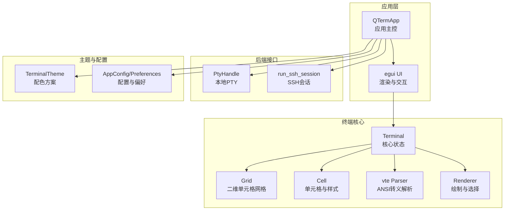
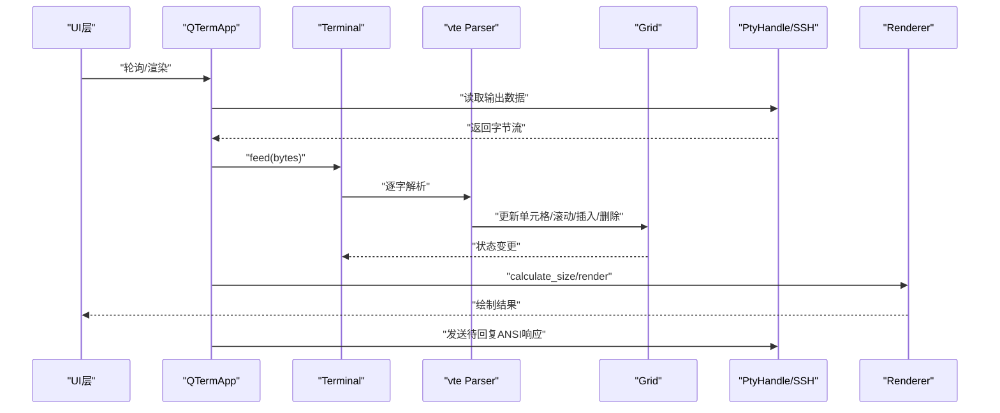
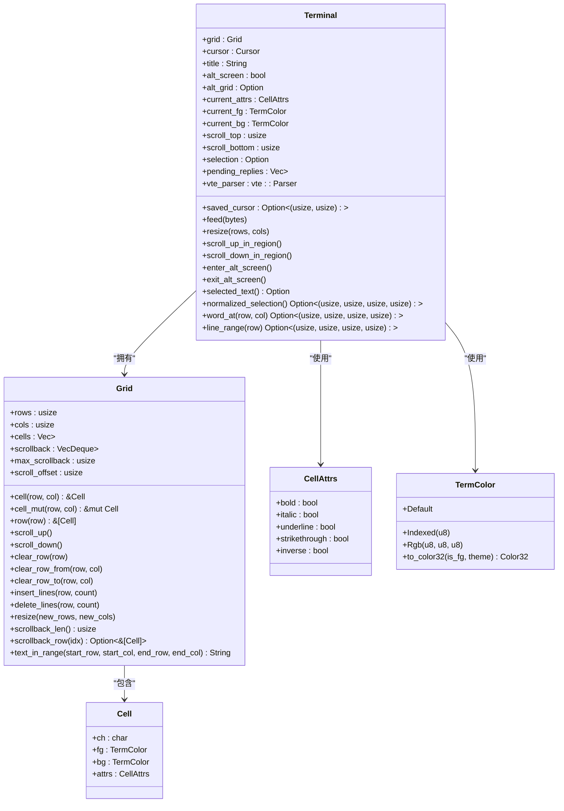
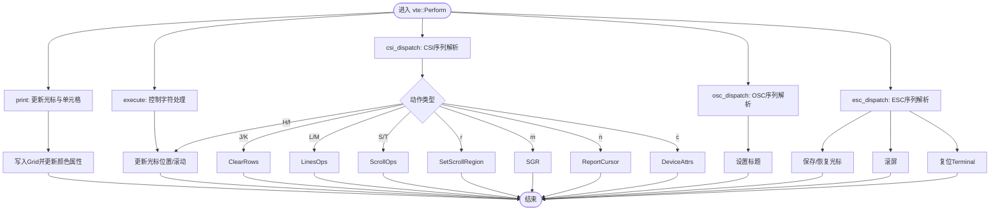
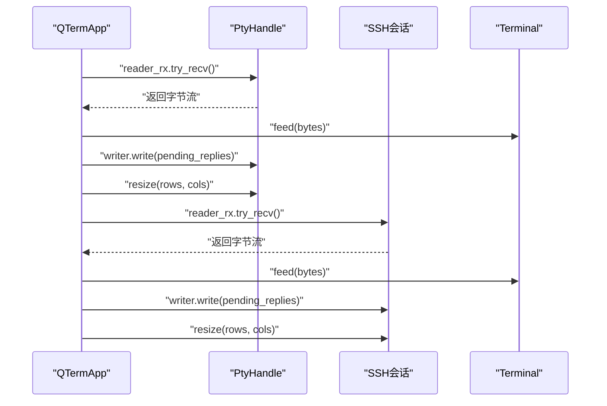
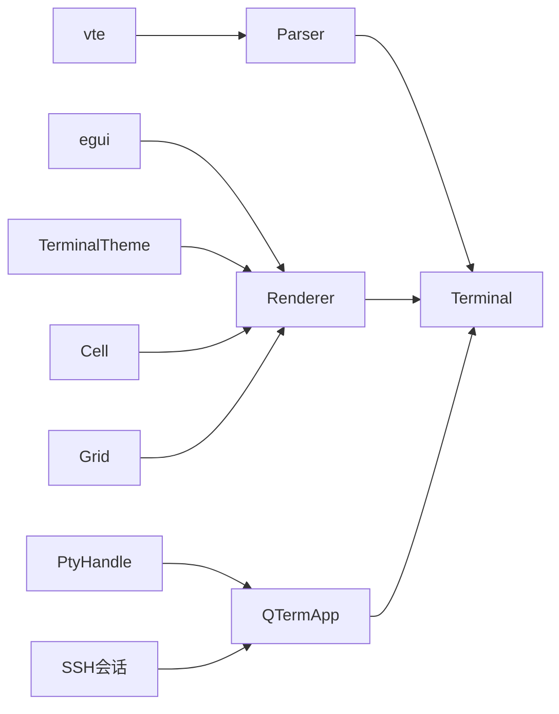

# 终端核心实现

<cite>
**本文档引用的文件**
- [src/terminal/mod.rs](file://src/terminal/mod.rs)
- [src/terminal/grid.rs](file://src/terminal/grid.rs)
- [src/terminal/cell.rs](file://src/terminal/cell.rs)
- [src/terminal/parser.rs](file://src/terminal/parser.rs)
- [src/terminal/renderer.rs](file://src/terminal/renderer.rs)
- [src/pty/mod.rs](file://src/pty/mod.rs)
- [src/ssh/session.rs](file://src/ssh/session.rs)
- [src/app.rs](file://src/app.rs)
- [src/main.rs](file://src/main.rs)
- [src/theme/terminal.rs](file://src/theme/terminal.rs)
- [src/config.rs](file://src/config.rs)
- [Cargo.toml](file://Cargo.toml)
</cite>

## 目录
1. [简介](#简介)
2. [项目结构](#项目结构)
3. [核心组件](#核心组件)
4. [架构总览](#架构总览)
5. [详细组件分析](#详细组件分析)
6. [依赖关系分析](#依赖关系分析)
7. [性能考虑](#性能考虑)
8. [故障排查指南](#故障排查指南)
9. [结论](#结论)
10. [附录](#附录)

## 简介
本文件面向QTerm的终端核心实现，系统性阐述Terminal结构体的设计理念与实现细节，覆盖光标管理、标题存储、备用屏幕模式、选择区域、状态管理、状态同步机制、生命周期管理以及API扩展与性能优化策略。文档同时结合与本地PTY和SSH会话的数据交换协议，帮助开发者快速理解并扩展终端功能。

## 项目结构
QTerm采用模块化组织，终端核心位于src/terminal，与UI层(src/app.rs)、PTY(src/pty)、SSH(src/ssh)、主题与配置(src/theme, src/config)协同工作。

图表来源
- [src/app.rs:18-36](file://src/app.rs#L18-L36)
- [src/terminal/mod.rs:22-37](file://src/terminal/mod.rs#L22-L37)
- [src/pty/mod.rs:9-15](file://src/pty/mod.rs#L9-L15)
- [src/ssh/session.rs:9-18](file://src/ssh/session.rs#L9-L18)
- [src/theme/terminal.rs:5-15](file://src/theme/terminal.rs#L5-L15)
- [src/config.rs:40-66](file://src/config.rs#L40-L66)

章节来源
- [src/app.rs:18-36](file://src/app.rs#L18-L36)
- [src/main.rs:1-14](file://src/main.rs#L1-L14)

## 核心组件
- Terminal：终端核心状态容器，包含Grid、光标、标题、备用屏幕、颜色属性、滚动区域、选择区域、VTE解析器与待回复队列。
- Grid：二维单元格矩阵与回滚缓冲区，提供滚动、插入/删除行、文本提取等能力。
- Cell：单元格数据结构，包含字符、前景/背景色、属性（粗体、斜体、下划线、删除线、反显）。
- Parser：基于vte的ANSI转义序列解析器，驱动Terminal状态变更。
- Renderer：基于egui的绘制器，负责渲染文本、背景色、选择高亮与光标。
- PtyHandle/SSH会话：与本地Shell或远程主机进行双向数据交换的后端抽象。

章节来源
- [src/terminal/mod.rs:22-37](file://src/terminal/mod.rs#L22-L37)
- [src/terminal/grid.rs:5-12](file://src/terminal/grid.rs#L5-L12)
- [src/terminal/cell.rs:49-66](file://src/terminal/cell.rs#L49-L66)
- [src/terminal/parser.rs:4-6](file://src/terminal/parser.rs#L4-L6)
- [src/terminal/renderer.rs:36-167](file://src/terminal/renderer.rs#L36-L167)
- [src/pty/mod.rs:9-15](file://src/pty/mod.rs#L9-L15)
- [src/ssh/session.rs:9-18](file://src/ssh/session.rs#L9-L18)

## 架构总览
终端核心通过Parser接收字节流，逐字推进光标并写入Grid；Renderer根据Terminal状态与主题进行绘制；应用层在UI轮询中从后端读取数据喂给Terminal，并将Terminal的待回复ANSI响应写回后端。

图表来源
- [src/app.rs:284-575](file://src/app.rs#L284-L575)
- [src/terminal/mod.rs:59-66](file://src/terminal/mod.rs#L59-L66)
- [src/terminal/parser.rs:8-223](file://src/terminal/parser.rs#L8-L223)
- [src/terminal/renderer.rs:36-167](file://src/terminal/renderer.rs#L36-L167)
- [src/pty/mod.rs:76-79](file://src/pty/mod.rs#L76-L79)
- [src/ssh/session.rs:40-76](file://src/ssh/session.rs#L40-L76)

## 详细组件分析

### Terminal结构体与设计理念
- 数据组织：Terminal聚合Grid、Cursor、Title、SavedCursor、AltScreen标志与备用Grid、颜色属性、滚动区域、选择区域、VTE解析器与待回复队列。
- 设计要点：
  - 光标管理：独立的Cursor结构，包含行列与可见性，配合滚动区域限制移动范围。
  - 标题存储：通过OSC标题序列更新Terminal.title。
  - 备用屏幕：alt_screen标志与alt_grid备份，enter/exit切换时在主屏与备用屏间无缝切换。
  - 选择区域：Selection结构与normalized_selection/word_at/line_range辅助选择与复制。
  - 颜色属性：current_fg/current_bg/current_attrs统一管理SGR序列解析后的样式。
  - 滚动区域：scroll_top/scroll_bottom限定滚动范围，scroll_up_in_region/scroll_down_in_region在区域边界执行不同策略。
  - 待回复队列：pending_replies收集需要立即回写的ANSI响应（如DSR/CPR）。

章节来源
- [src/terminal/mod.rs:9-37](file://src/terminal/mod.rs#L9-L37)
- [src/terminal/parser.rs:169-185](file://src/terminal/parser.rs#L169-L185)
- [src/terminal/parser.rs:109-144](file://src/terminal/parser.rs#L109-L144)
- [src/terminal/parser.rs:151-164](file://src/terminal/parser.rs#L151-L164)

### Grid与Cell模型
- Grid：rows/cols构成的cells二维数组，配合固定容量的scrollback回滚缓冲区；提供scroll_up/scroll_down、insert_lines/delete_lines、clear_row系列、resize、text_in_range等方法。
- Cell：包含ch、fg、bg、attrs；CellAttrs支持bold/italic/underline/strikethrough/inverse；TermColor支持Default/Indexed/Rgb三种来源，并可映射到egui::Color32。
- 性能特性：VecDeque回滚缓冲区限制最大容量，避免无限增长；滚动时按需推入/弹出行，减少全表拷贝。

图表来源
- [src/terminal/mod.rs:22-37](file://src/terminal/mod.rs#L22-L37)
- [src/terminal/grid.rs:5-12](file://src/terminal/grid.rs#L5-L12)
- [src/terminal/cell.rs:5-66](file://src/terminal/cell.rs#L5-L66)

章节来源
- [src/terminal/grid.rs:14-125](file://src/terminal/grid.rs#L14-L125)
- [src/terminal/cell.rs:5-66](file://src/terminal/cell.rs#L5-L66)

### Parser与ANSI转义序列处理
- vte::Perform实现：print/execute/csi_dispatch/osc_dispatch/esc_dispatch分别处理打印字符、控制字符、CSI序列、OSC序列与ESC序列。
- 关键行为：
  - 光标移动与换行：print中在列超界时自动换行并按滚动区域触发滚动；execute处理退格、制表、换行、回车等。
  - CSI序列：光标移动(H/f)、清屏(J/K)、插入/删除行(L/M)、滚动(S/T)、设置滚动区域(r)、SGR颜色/属性(m)、报告光标位置(n)、设备属性(c)等。
  - ESC序列：保存/恢复光标(7/8)、滚屏(D/M)、复位(c)。
  - OSC序列：标题设置(0/1/2)。
  - SGR解析：handle_sgr按参数组合设置current_fg/current_bg/current_attrs，支持索引色与RGB色。
- 与Terminal状态联动：所有解析动作直接修改Terminal的cursor、grid、title、alt_screen、pending_replies等字段。

图表来源
- [src/terminal/parser.rs:8-223](file://src/terminal/parser.rs#L8-L223)

章节来源
- [src/terminal/parser.rs:8-299](file://src/terminal/parser.rs#L8-L299)

### Renderer与绘制流程
- 计算尺寸：根据可用空间与字体度量计算rows/cols与cell宽高。
- 绘制顺序：先填充背景，再按颜色分组绘制文本，最后绘制选择高亮与光标。
- 选择高亮：根据normalized_selection计算矩形区域并绘制背景，随后重新绘制该区域文本以保证可见性。
- 光标绘制：在可见且在有效行列时绘制光标矩形，若当前单元格非空则叠加前景色字符。

章节来源
- [src/terminal/renderer.rs:21-184](file://src/terminal/renderer.rs#L21-L184)
- [src/theme/terminal.rs:5-15](file://src/theme/terminal.rs#L5-L15)

### 终端状态管理
- 光标位置跟踪：cursor.row/col随print与CSI/H/f等指令更新；在滚动区域边界触发滚动。
- 颜色属性管理：current_fg/current_bg/current_attrs由SGR序列维护；CellAttrs支持多种样式。
- 滚动区域设置：csi_dispatch中的r序列设置scroll_top/scroll_bottom并重置光标。
- 备用屏幕切换：私有模式1049启用/禁用备用屏幕，enter_alt_screen/exit_alt_screen在主屏与备用屏之间切换。
- 标题存储：OSC 0/1/2序列更新Terminal.title。
- 选择区域：Selection结构与normalized_selection/word_at/line_range辅助选择与复制。

章节来源
- [src/terminal/parser.rs:77-126](file://src/terminal/parser.rs#L77-L126)
- [src/terminal/parser.rs:133-139](file://src/terminal/parser.rs#L133-L139)
- [src/terminal/parser.rs:174-184](file://src/terminal/parser.rs#L174-L184)
- [src/terminal/mod.rs:104-119](file://src/terminal/mod.rs#L104-L119)
- [src/terminal/mod.rs:129-172](file://src/terminal/mod.rs#L129-L172)

### 终端状态同步机制（与PTY/SSH）
- 数据流向：后端(PTY/SSH)输出字节流经QTermApp.poll读取，调用Terminal.feed注入解析器；Terminal解析后更新内部状态。
- 待回复响应：Terminal.pending_replies收集ANSI响应（如DSR/CPR），在poll阶段统一写回后端。
- 尺寸同步：应用层根据UI计算目标rows/cols，调用Terminal.resize与后端resize，保持终端与Shell/SSH一致。
- 生命周期：后端提供is_alive/kill/disconnect等接口，应用层在标签页关闭或窗口退出时清理资源。

图表来源
- [src/app.rs:1414-1425](file://src/app.rs#L1414-L1425)
- [src/pty/mod.rs:76-89](file://src/pty/mod.rs#L76-L89)
- [src/ssh/session.rs:40-76](file://src/ssh/session.rs#L40-L76)

章节来源
- [src/app.rs:1414-1425](file://src/app.rs#L1414-L1425)
- [src/pty/mod.rs:76-89](file://src/pty/mod.rs#L76-L89)
- [src/ssh/session.rs:40-76](file://src/ssh/session.rs#L40-L76)

### 终端生命周期管理
- 初始化：Terminal::new创建Grid、默认光标、颜色属性、滚动区域与解析器；应用层在新建标签页时调用Tab::new_local传入rows/cols/scrollback。
- 重置：ESC c序列触发Terminal::new复位；应用层也可主动重建Terminal实例。
- 尺寸调整：Terminal::resize更新Grid尺寸与滚动区域边界；后端resize同步到PTY/SSH。
- 状态保存/恢复：当前代码未见持久化保存Terminal状态的实现；建议在扩展中增加序列化/反序列化以支持会话恢复。

章节来源
- [src/terminal/mod.rs:40-57](file://src/terminal/mod.rs#L40-L57)
- [src/terminal/parser.rs:211-215](file://src/terminal/parser.rs#L211-L215)
- [src/app.rs:448-456](file://src/app.rs#L448-L456)

### 终端核心API使用示例（扩展与自定义）
以下示例展示如何扩展Terminal功能（以伪代码形式描述关键步骤，避免直接粘贴源码）：
- 扩展颜色方案：在TerminalTheme中新增配色数组项，或通过外部配置动态替换；Cell::to_color32根据is_fg与theme决定前景/背景映射。
- 自定义选择行为：利用normalized_selection/word_at/line_range计算选择范围，结合Renderer的selection高亮绘制实现自定义复制/粘贴逻辑。
- 扩展ANSI序列：在parser.rs的csi_dispatch/osc_dispatch/esc_dispatch中添加新的序列分支，更新Terminal状态并触发相应副作用（如打开链接、切换主题等）。
- 与后端集成：在QTermApp.poll中对Terminal.pending_replies进行统一写回，确保ANSI响应及时送达。

章节来源
- [src/terminal/renderer.rs:99-136](file://src/terminal/renderer.rs#L99-L136)
- [src/terminal/parser.rs:59-167](file://src/terminal/parser.rs#L59-L167)
- [src/app.rs:1414-1425](file://src/app.rs#L1414-L1425)

## 依赖关系分析
- 内部依赖：Terminal依赖Grid/Cell/Parser/Renderer；Parser依赖Terminal；Renderer依赖Terminal与TerminalTheme。
- 外部依赖：vte用于ANSI解析；egui用于UI与绘制；portable-pty用于本地PTY；russh用于SSH会话。
- 平台差异：Windows下PTY环境变量LANG设置；SSH会话请求PTY与Shell。

图表来源
- [Cargo.toml:8-25](file://Cargo.toml#L8-L25)
- [src/terminal/parser.rs:1-3](file://src/terminal/parser.rs#L1-L3)
- [src/terminal/renderer.rs:1-6](file://src/terminal/renderer.rs#L1-L6)
- [src/pty/mod.rs:3-7](file://src/pty/mod.rs#L3-L7)
- [src/ssh/session.rs:1-7](file://src/ssh/session.rs#L1-L7)

章节来源
- [Cargo.toml:8-25](file://Cargo.toml#L8-L25)

## 性能考虑
- 渲染优化：
  - 文本绘制按颜色分组，减少绘制调用次数。
  - 仅在非默认背景色时绘制背景矩形，降低绘制开销。
  - 选择高亮先绘制背景再重绘文本，避免透明度带来的额外成本。
- 数据结构：
  - Grid使用VecDeque作为回滚缓冲，限制最大容量，避免内存无限增长。
  - 滚动时按需插入/移除行，避免整表拷贝。
- I/O与异步：
  - PTY使用线程+通道读取，避免阻塞UI线程。
  - SSH使用tokio异步运行时，select!并发处理数据、写入与窗口变化。
- 字体与布局：
  - 通过egui字体度量计算cell宽高，避免重复测量。
  - 尺寸变化时批量调整所有面板，减少多次重排。

章节来源
- [src/terminal/renderer.rs:54-97](file://src/terminal/renderer.rs#L54-L97)
- [src/terminal/grid.rs:39-51](file://src/terminal/grid.rs#L39-L51)
- [src/pty/mod.rs:49-65](file://src/pty/mod.rs#L49-L65)
- [src/ssh/session.rs:41-69](file://src/ssh/session.rs#L41-L69)

## 故障排查指南
- 终端无输出或卡死：
  - 检查后端is_alive状态；确认reader_rx通道正常读取与Terminal.feed被调用。
  - 确认Terminal.pending_replies在poll阶段被写回后端。
- 光标异常：
  - 检查CSI r序列是否正确设置scroll_top/scroll_bottom；确认print/execute路径下的光标边界处理。
- 备用屏幕切换无效：
  - 确认私有模式1049启用/禁用路径被触发；检查enter_alt_screen/exit_alt_screen的alt_grid切换逻辑。
- 选择区域错误：
  - 检查normalized_selection的起止点排序；确认word_at/line_range的边界条件。
- 尺寸不匹配：
  - 确认应用层calculate_size与后端resize调用顺序；确保Terminal.resize与后端resize一致。

章节来源
- [src/app.rs:1414-1425](file://src/app.rs#L1414-L1425)
- [src/terminal/parser.rs:119-144](file://src/terminal/parser.rs#L119-L144)
- [src/terminal/mod.rs:104-119](file://src/terminal/mod.rs#L104-L119)
- [src/terminal/mod.rs:129-172](file://src/terminal/mod.rs#L129-L172)
- [src/pty/mod.rs:81-89](file://src/pty/mod.rs#L81-L89)
- [src/ssh/session.rs:65-67](file://src/ssh/session.rs#L65-L67)

## 结论
QTerm的终端核心以清晰的状态机与模块化设计实现了对ANSI转义序列的完整支持，结合高效的Grid/Cell模型与轻量级渲染器，提供了良好的性能与可扩展性。通过Parser与Renderer的职责分离，开发者可以安全地扩展ANSI序列处理与绘制逻辑，同时借助PTY/SSH后端实现本地与远程终端的一致体验。

## 附录
- 配置与主题：
  - AppConfig/Preferences提供窗口尺寸、主题、字体大小等配置；TerminalTheme提供深色/浅色配色方案与索引色映射。
- 入口与运行：
  - main.rs构建窗口并启动eframe渲染循环；QTermApp::new初始化字体、主题与首个本地终端标签页。

章节来源
- [src/config.rs:40-127](file://src/config.rs#L40-L127)
- [src/theme/terminal.rs:17-97](file://src/theme/terminal.rs#L17-L97)
- [src/main.rs:51-87](file://src/main.rs#L51-L87)
- [src/app.rs:70-105](file://src/app.rs#L70-L105)