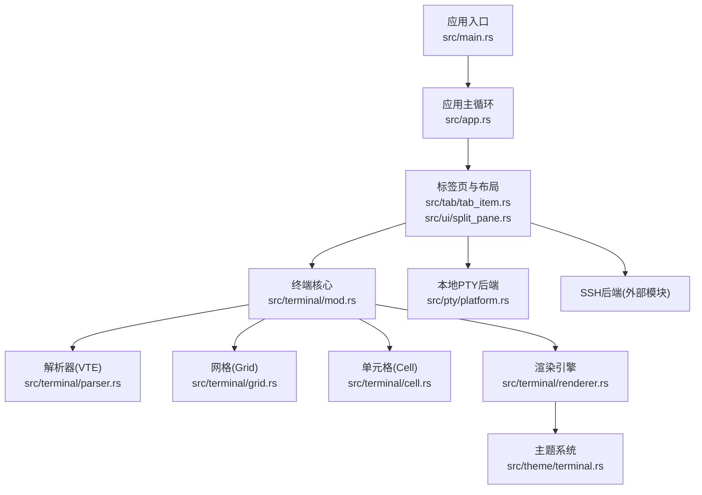
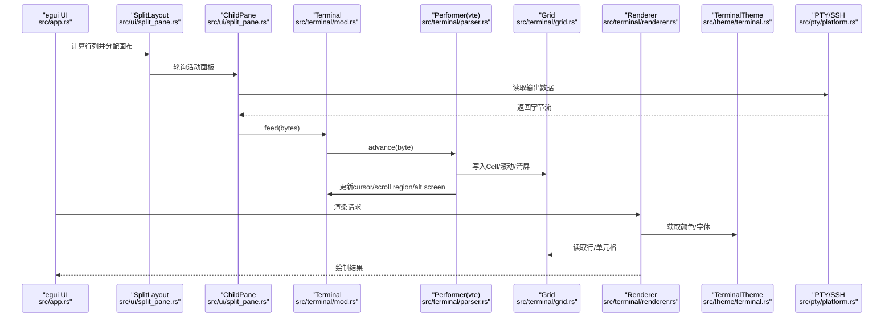
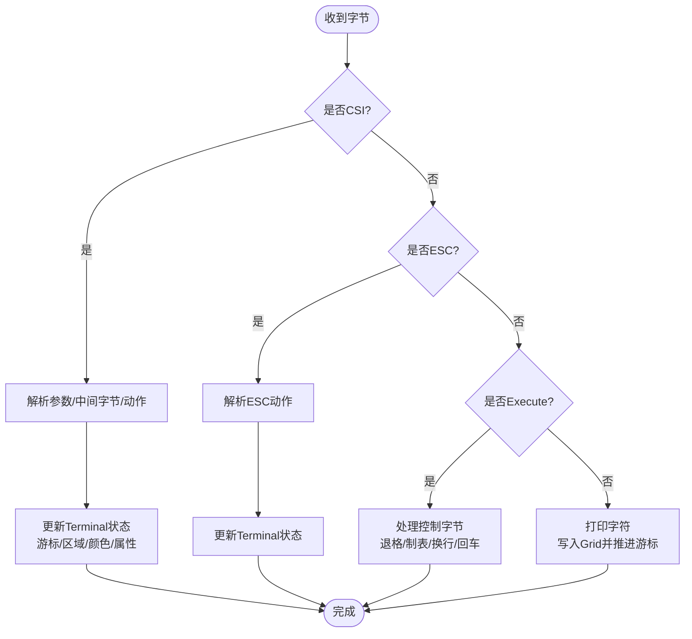
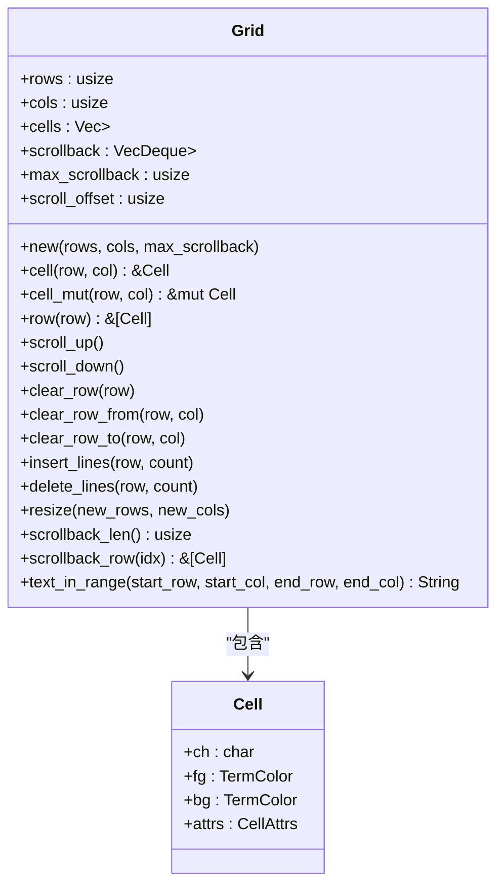
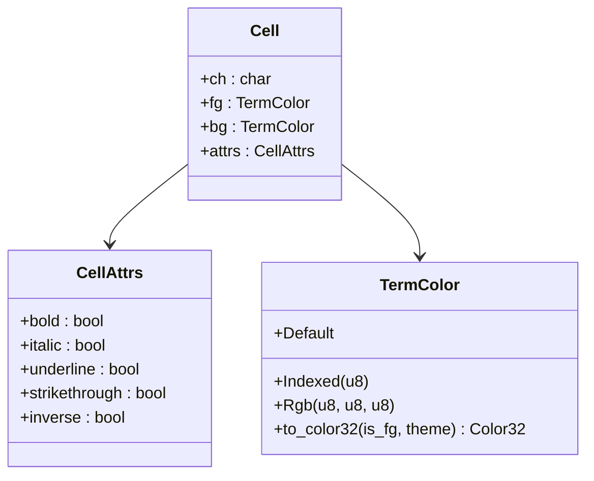
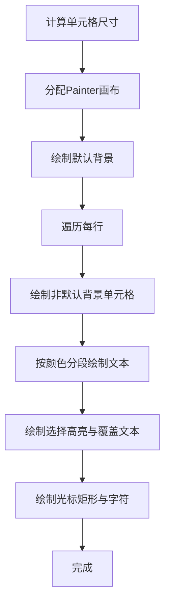
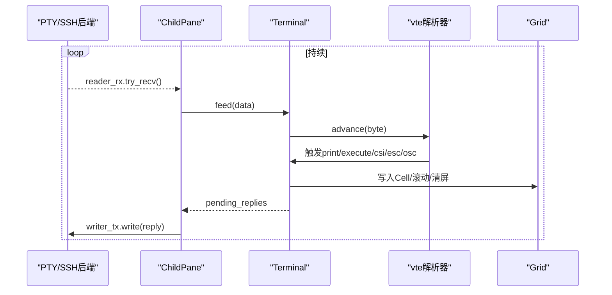
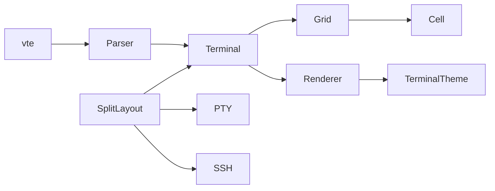

# 终端系统

<cite>
**本文引用的文件**
- [src/main.rs](file://src/main.rs)
- [src/app.rs](file://src/app.rs)
- [src/tab/tab_item.rs](file://src/tab/tab_item.rs)
- [src/ui/split_pane.rs](file://src/ui/split_pane.rs)
- [src/pty/platform.rs](file://src/pty/platform.rs)
- [src/connection/models.rs](file://src/connection/models.rs)
- [src/terminal/mod.rs](file://src/terminal/mod.rs)
- [src/terminal/parser.rs](file://src/terminal/parser.rs)
- [src/terminal/grid.rs](file://src/terminal/grid.rs)
- [src/terminal/cell.rs](file://src/terminal/cell.rs)
- [src/terminal/renderer.rs](file://src/terminal/renderer.rs)
- [src/theme/terminal.rs](file://src/theme/terminal.rs)
- [Cargo.toml](file://Cargo.toml)
</cite>

## 目录
1. [简介](#简介)
2. [项目结构](#项目结构)
3. [核心组件](#核心组件)
4. [架构总览](#架构总览)
5. [详细组件分析](#详细组件分析)
6. [依赖关系分析](#依赖关系分析)
7. [性能考量](#性能考量)
8. [故障排查指南](#故障排查指南)
9. [结论](#结论)
10. [附录](#附录)

## 简介
本文件面向QTerm的终端渲染系统，围绕基于VTE解析器的终端模拟实现进行深入技术说明。内容涵盖控制序列解析、ANSI转义码处理、终端状态管理；文本网格（Grid）的数据结构与滚动缓冲区；渲染引擎的绘制流程、光标与选择高亮、屏幕刷新；单元格（Cell）数据结构与颜色/属性组合；以及终端状态与本地PTY、SSH会话之间的数据交换机制。同时给出性能优化建议（增量渲染、内存复用、渲染缓存思路）与扩展实践路径。

## 项目结构
QTerm采用模块化组织，终端子系统位于src/terminal目录，UI与应用生命周期位于src/app.rs，标签页与分屏布局位于src/tab与src/ui，连接与后端（PTY/SSH）位于src/pty与src/ssh等。渲染通过egui集成，主题系统独立于终端模块。

图表来源
- [src/main.rs:1-87](file://src/main.rs#L1-L87)
- [src/app.rs:240-516](file://src/app.rs#L240-L516)
- [src/tab/tab_item.rs:1-40](file://src/tab/tab_item.rs#L1-L40)
- [src/ui/split_pane.rs:1-209](file://src/ui/split_pane.rs#L1-L209)
- [src/terminal/mod.rs:1-174](file://src/terminal/mod.rs#L1-L174)
- [src/terminal/parser.rs:1-299](file://src/terminal/parser.rs#L1-L299)
- [src/terminal/grid.rs:1-126](file://src/terminal/grid.rs#L1-L126)
- [src/terminal/cell.rs:1-67](file://src/terminal/cell.rs#L1-L67)
- [src/terminal/renderer.rs:1-184](file://src/terminal/renderer.rs#L1-L184)
- [src/theme/terminal.rs:1-98](file://src/theme/terminal.rs#L1-L98)
- [src/pty/platform.rs:1-18](file://src/pty/platform.rs#L1-L18)

章节来源
- [src/main.rs:1-87](file://src/main.rs#L1-L87)
- [src/app.rs:240-516](file://src/app.rs#L240-L516)
- [src/tab/tab_item.rs:1-40](file://src/tab/tab_item.rs#L1-L40)
- [src/ui/split_pane.rs:1-209](file://src/ui/split_pane.rs#L1-L209)

## 核心组件
- 终端（Terminal）：持有Grid、游标、选择区域、当前样式与颜色、滚动区域、待回复队列，并封装resize、alt screen切换、选择文本提取等能力。
- 解析器（vte + Performer）：将字节流转换为打印、执行、CSI/ESC/OSC等事件，驱动Terminal状态变更与Grid写入。
- 文本网格（Grid）：二维Cell矩阵与可选滚动缓冲区，支持清屏、插入/删除行、滚动、文本范围提取。
- 单元格（Cell）：字符、前景/背景色、属性集合，支持默认值与颜色解析。
- 渲染引擎（renderer）：计算单元格尺寸、批量绘制背景、按颜色分段绘制文本、绘制选择高亮与光标。
- 主题系统（TerminalTheme）：字体大小、颜色集与索引到RGB映射。
- 布局与后端（SplitLayout + Pty/Ssh）：多面板布局、PTY/SSH数据读写与终端状态同步。

章节来源
- [src/terminal/mod.rs:22-174](file://src/terminal/mod.rs#L22-L174)
- [src/terminal/parser.rs:4-299](file://src/terminal/parser.rs#L4-L299)
- [src/terminal/grid.rs:5-126](file://src/terminal/grid.rs#L5-L126)
- [src/terminal/cell.rs:5-67](file://src/terminal/cell.rs#L5-L67)
- [src/terminal/renderer.rs:7-184](file://src/terminal/renderer.rs#L7-L184)
- [src/theme/terminal.rs:5-98](file://src/theme/terminal.rs#L5-L98)
- [src/ui/split_pane.rs:12-130](file://src/ui/split_pane.rs#L12-L130)

## 架构总览
下图展示了从输入到渲染的端到端流程，以及与后端（PTY/SSH）的交互。

图表来源
- [src/app.rs:388-501](file://src/app.rs#L388-L501)
- [src/ui/split_pane.rs:62-97](file://src/ui/split_pane.rs#L62-L97)
- [src/terminal/mod.rs:59-66](file://src/terminal/mod.rs#L59-L66)
- [src/terminal/parser.rs:8-167](file://src/terminal/parser.rs#L8-L167)
- [src/terminal/grid.rs:27-97](file://src/terminal/grid.rs#L27-L97)
- [src/terminal/renderer.rs:36-167](file://src/terminal/renderer.rs#L36-L167)
- [src/theme/terminal.rs:17-98](file://src/theme/terminal.rs#L17-L98)

## 详细组件分析

### 控制序列解析与ANSI转义码处理
- 打印字符：更新游标所在Cell的字符与当前前景/背景/属性，游标前进或换行滚动。
- 执行指令（Execute）：处理退格、制表、换行、回车等控制字节。
- CSI（Control Sequence Introducer）：解析参数与私有前缀，支持光标移动、定位、清屏、插入/删除行、滚动、保存/恢复光标、进入/退出备用屏、颜色/属性设置（SGR）、设备状态报告（DSR）、设备属性（DA1）等。
- ESC：保存/恢复光标、滚屏、重置终端。
- OSC：标题设置（如图标名/窗口标题）。

图表来源
- [src/terminal/parser.rs:8-218](file://src/terminal/parser.rs#L8-L218)

章节来源
- [src/terminal/parser.rs:8-299](file://src/terminal/parser.rs#L8-L299)

### 文本网格（Grid）数据结构与滚动缓冲区
- 结构：二维Cell数组与可选滚动缓冲区（VecDeque），记录最大滚动行数与当前滚动偏移。
- 关键操作：
  - scroll_up/scroll_down：整屏滚动，顶部移出至滚动缓冲，底部补充空行；或相反。
  - clear_row/clear_row_from/clear_row_to：清空指定行或区间。
  - insert_lines/delete_lines：在指定行插入/删除空行。
  - resize：调整行列并清零新空间。
  - text_in_range：按行列范围提取文本，自动trim行尾空白。
- 滚动缓冲区：上限受max_scrollback限制，超过则丢弃最旧行。

图表来源
- [src/terminal/grid.rs:5-126](file://src/terminal/grid.rs#L5-L126)
- [src/terminal/cell.rs:49-67](file://src/terminal/cell.rs#L49-L67)

章节来源
- [src/terminal/grid.rs:14-126](file://src/terminal/grid.rs#L14-L126)

### 单元格（Cell）数据结构设计
- 属性（CellAttrs）：粗体、斜体、下划线、删除线、反显。
- 颜色（TermColor）：默认、索引色（0–255）、RGB三通道。
- 颜色解析：TermColor::to_color32根据前景/背景与主题索引映射，支持256色调色板与灰度渐变。
- 默认值：空格字符、默认前景/背景、无属性。

图表来源
- [src/terminal/cell.rs:5-67](file://src/terminal/cell.rs#L5-L67)
- [src/theme/terminal.rs:82-96](file://src/theme/terminal.rs#L82-L96)

章节来源
- [src/terminal/cell.rs:5-67](file://src/terminal/cell.rs#L5-L67)
- [src/theme/terminal.rs:17-98](file://src/theme/terminal.rs#L17-L98)

### 渲染引擎工作原理
- 尺寸计算：根据可用空间与字体宽度估算行列数，确定单元格宽高。
- 绘制顺序：
  - 先绘制背景（仅非默认背景单元格，减少绘制次数）。
  - 按颜色分段绘制文本（同色连续段合并，提升效率）。
  - 绘制选择高亮与覆盖文本（保证选中文本可读性）。
  - 绘制光标矩形与光标字符（若非空格）。
- 颜色解析：根据反显标志交换前景/背景色。

图表来源
- [src/terminal/renderer.rs:21-167](file://src/terminal/renderer.rs#L21-L167)

章节来源
- [src/terminal/renderer.rs:21-184](file://src/terminal/renderer.rs#L21-L184)

### 终端状态管理与同步机制
- 终端状态：游标位置、可见性、标题、保存游标、备用屏、当前属性与颜色、滚动区域、待回复队列。
- 同步流程：
  - 后端（PTY/SSH）持续读取输出并喂给Terminal.feed。
  - Terminal.feed使用vte解析器逐字节推进，触发Performer回调更新Grid与状态。
  - Terminal收集需要回显的“待回复”数据（如DSR/DA1），由SplitLayout在poll阶段写回后端。
  - 分屏布局中，每个ChildPane独立维护Terminal与后端句柄，统一在SplitLayout::poll_all中轮询。

图表来源
- [src/ui/split_pane.rs:62-97](file://src/ui/split_pane.rs#L62-L97)
- [src/terminal/mod.rs:59-66](file://src/terminal/mod.rs#L59-L66)
- [src/terminal/parser.rs:8-167](file://src/terminal/parser.rs#L8-L167)
- [src/terminal/grid.rs:27-97](file://src/terminal/grid.rs#L27-L97)

章节来源
- [src/ui/split_pane.rs:62-97](file://src/ui/split_pane.rs#L62-L97)
- [src/terminal/mod.rs:39-174](file://src/terminal/mod.rs#L39-L174)

### 选择与单词/行范围提取
- 选择范围归一化：确保起止点满足顺序关系。
- 单词提取：从游标出发向左右扩展，跳过空白与控制字符。
- 行范围：从首列到行尾最后一个非空格字符。

章节来源
- [src/terminal/mod.rs:121-172](file://src/terminal/mod.rs#L121-L172)

## 依赖关系分析
- 外部库：vte用于解析ANSI控制序列；egui/wgpu用于渲染；portable-pty用于本地PTY；russh用于SSH；tokio异步运行时。
- 模块耦合：
  - terminal模块内部高内聚（Terminal/Parser/Grid/Cell/Renderer）。
  - app与ui层通过SplitLayout桥接后端与终端，避免直接耦合具体协议。
  - theme独立，便于主题切换与颜色解析。

图表来源
- [Cargo.toml:8-25](file://Cargo.toml#L8-L25)
- [src/terminal/parser.rs:1-3](file://src/terminal/parser.rs#L1-L3)
- [src/ui/split_pane.rs:1-5](file://src/ui/split_pane.rs#L1-L5)

章节来源
- [Cargo.toml:8-25](file://Cargo.toml#L8-L25)

## 性能考量
- 增量渲染（建议）：当前渲染按行遍历绘制所有非默认背景与文本。可引入脏区域标记（dirty rects）与按需重绘，仅对变化区域重绘，减少绘制调用。
- 文本绘制优化（建议）：按颜色分段绘制已实现，可进一步按“前景色+属性”聚合，减少painter调用次数。
- 内存复用（建议）：重用字符串缓冲与临时Vec，避免频繁分配；在resize时尽量复用现有Vec容量。
- 渲染缓存（建议）：对“相同字体+字号+主题”的文本行进行纹理缓存，结合脏区域与滚动偏移，减少重复绘制。
- 字体度量（现状）：当前使用egui字体度量计算单元格尺寸，建议在窗口尺寸稳定时缓存度量结果，避免每帧重复查询。
- 滚动缓冲区（现状）：使用VecDeque，上限受max_scrollback限制；在高负载场景下注意内存占用，必要时降低上限或启用懒加载。

## 故障排查指南
- 输入无显示：检查SplitLayout::poll是否正确从reader_rx读取并调用Terminal.feed；确认pending_replies是否被写回后端。
- 光标不闪烁或位置异常：核对CSI H/f、SGR参数与ESC D/M处理；检查scroll_top/scroll_bottom与游标边界。
- 清屏无效：确认CSI J/K参数解析与Grid::clear_*实现一致。
- 颜色错乱：检查TermColor::to_color32与主题索引映射；注意反显（inverse）对前景/背景的影响。
- 选择文本为空：确认Selection归一化与text_in_range边界处理；注意行尾空白裁剪。
- 字体/尺寸异常：检查renderer::calculate_size与可用空间；确认egui字体注册与monospace设置。

章节来源
- [src/ui/split_pane.rs:62-97](file://src/ui/split_pane.rs#L62-L97)
- [src/terminal/parser.rs:59-167](file://src/terminal/parser.rs#L59-L167)
- [src/terminal/grid.rs:53-124](file://src/terminal/grid.rs#L53-L124)
- [src/terminal/renderer.rs:21-184](file://src/terminal/renderer.rs#L21-L184)

## 结论
QTerm的终端系统以vte为核心，将ANSI控制序列解析与文本网格渲染解耦，配合SplitLayout实现多面板与后端抽象。渲染引擎通过颜色分段与背景批处理提升了绘制效率。未来可在增量渲染、文本缓存与内存复用方面进一步优化，以适配更高分辨率与更复杂主题场景。

## 附录

### 实际代码示例（路径指引）
- 新增SGR子集支持：参考[Sgr处理函数路径:226-299](file://src/terminal/parser.rs#L226-L299)，在handle_sgr中添加新的参数分支。
- 自定义颜色映射：参考[颜色解析实现路径:34-46](file://src/terminal/cell.rs#L34-L46)，在TermColor::to_color32中加入自定义规则。
- 扩展CSI命令：参考[CSI分发路径:59-167](file://src/terminal/parser.rs#L59-L167)，在csi_dispatch中新增action分支并调用Grid/终端方法。
- 渲染优化入口：参考[渲染主流程路径:36-167](file://src/terminal/renderer.rs#L36-L167)，在背景绘制与文本绘制处增加脏区域与缓存逻辑。
- 终端初始化与尺寸：参考[Terminal构造与resize路径:40-86](file://src/terminal/mod.rs#L40-L86)，在应用层调用以适配窗口变化。
- 后端同步：参考[后端轮询与写回路径:62-97](file://src/ui/split_pane.rs#L62-97)，确保feed与pending_replies的双向流动。