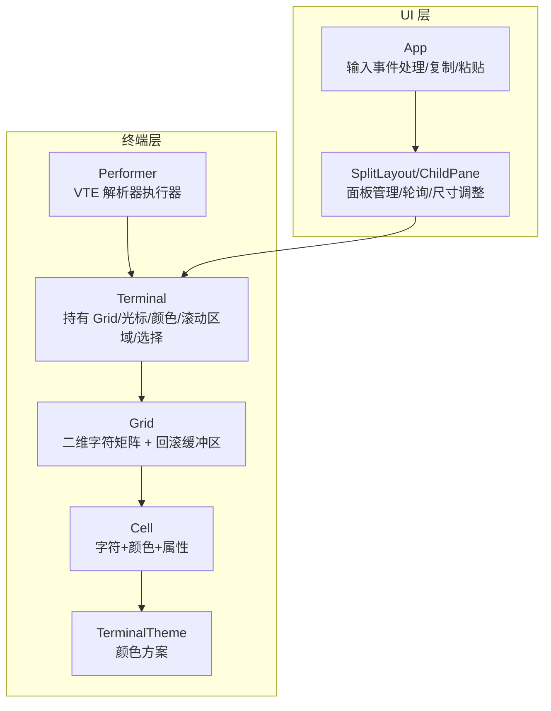
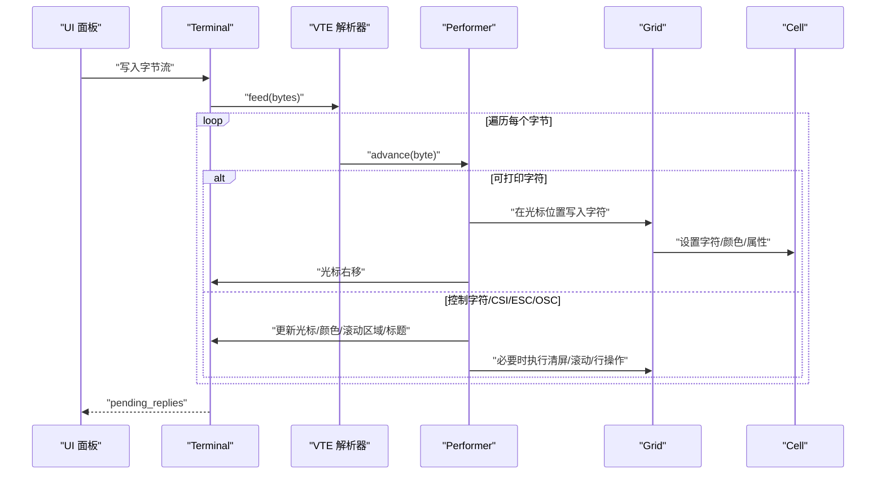
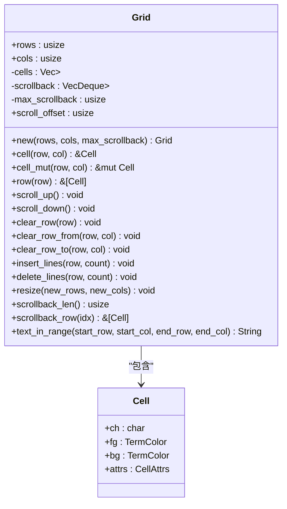
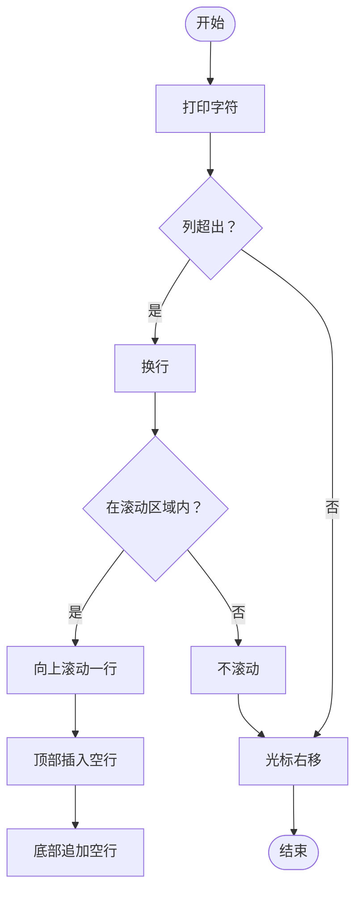
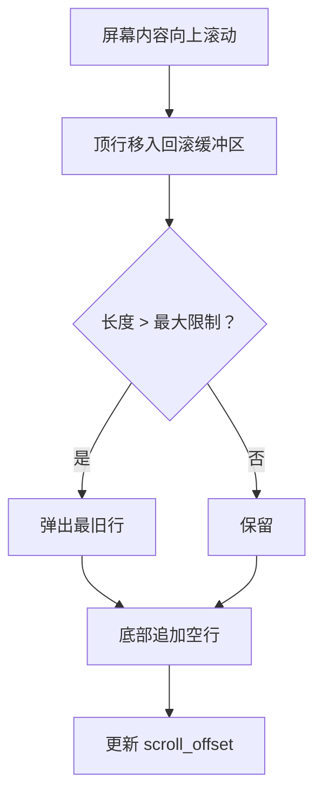
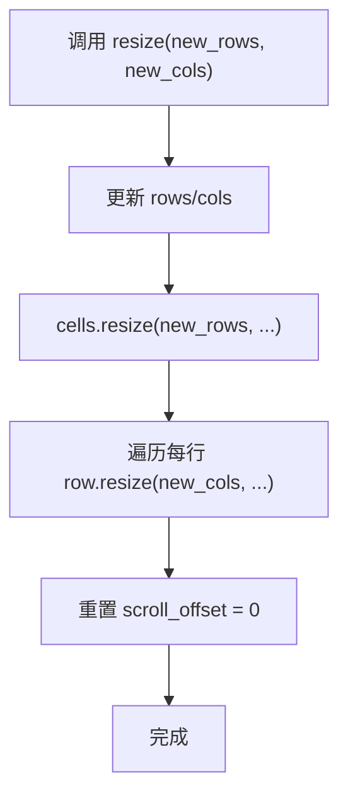
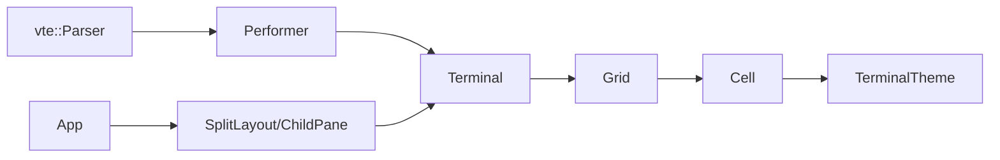

# 网格系统

<cite>
**本文引用的文件**
- [grid.rs](file://src/terminal/grid.rs)
- [cell.rs](file://src/terminal/cell.rs)
- [mod.rs](file://src/terminal/mod.rs)
- [parser.rs](file://src/terminal/parser.rs)
- [terminal.rs](file://src/theme/terminal.rs)
- [split_pane.rs](file://src/ui/split_pane.rs)
- [app.rs](file://src/app.rs)
- [Cargo.toml](file://Cargo.toml)
</cite>

## 目录
1. [简介](#简介)
2. [项目结构](#项目结构)
3. [核心组件](#核心组件)
4. [架构总览](#架构总览)
5. [详细组件分析](#详细组件分析)
6. [依赖关系分析](#依赖关系分析)
7. [性能考量](#性能考量)
8. [故障排查指南](#故障排查指南)
9. [结论](#结论)
10. [附录](#附录)

## 简介
本技术文档围绕 QTerm 的网格系统进行深入剖析，重点解释 Grid 数据结构的设计理念与实现细节，涵盖二维字符数组、滚动缓冲区与内存管理策略；梳理网格操作（字符插入、删除、移动、滚动）的实现机制；阐述滚动缓冲区的工作原理（历史数据存储、内存上限与回收策略）；分析网格尺寸调整算法（动态扩容、数据迁移与性能优化）；并提供网格 API 的使用示例（文本选择、范围查询与数据导出），最后给出扩展点与自定义实现建议。

## 项目结构
网格系统位于终端子模块中，与单元格模型、解析器、主题系统以及 UI 面板紧密协作：
- 终端核心：Terminal 结构体持有 Grid，并协调光标、颜色属性、滚动区域与选择。
- 网格：Grid 管理二维字符矩阵与回滚缓冲区，提供滚动、清屏、行操作与范围查询。
- 单元格：Cell 表示单个字符及其前景/背景色与显示属性。
- 主题：TerminalTheme 提供颜色映射，Cell 的颜色枚举 TermColor 与之配合。
- 解析器：VTE 解析器将字节流转换为 ANSI 序列，Performer 将其应用到 Terminal/Grid。
- UI 面板：SplitLayout/ChildPane 管理终端面板生命周期、尺寸调整与数据轮询。

图表来源
- [mod.rs:24-63](file://src/terminal/mod.rs#L24-L63)
- [grid.rs:7-14](file://src/terminal/grid.rs#L7-L14)
- [cell.rs:55-75](file://src/terminal/cell.rs#L55-L75)
- [terminal.rs:5-17](file://src/theme/terminal.rs#L5-L17)
- [parser.rs:6-8](file://src/terminal/parser.rs#L6-L8)
- [split_pane.rs:19-31](file://src/ui/split_pane.rs#L19-L31)
- [app.rs:1327-1425](file://src/app.rs#L1327-L1425)

章节来源
- [mod.rs:1-200](file://src/terminal/mod.rs#L1-L200)
- [grid.rs:1-148](file://src/terminal/grid.rs#L1-L148)
- [cell.rs:1-75](file://src/terminal/cell.rs#L1-L75)
- [terminal.rs:1-102](file://src/theme/terminal.rs#L1-L102)
- [parser.rs:1-311](file://src/terminal/parser.rs#L1-L311)
- [split_pane.rs:1-238](file://src/ui/split_pane.rs#L1-L238)
- [app.rs:1300-1465](file://src/app.rs#L1300-L1465)

## 核心组件
- Grid：二维字符矩阵与回滚缓冲区的统一抽象，提供滚动、清屏、行操作与范围查询。
- Cell：字符单元格，包含字符、前景/背景色与显示属性。
- Terminal：终端仿真器核心，持有 Grid 并协调 ANSI 解析、滚动区域、选择与备用屏幕。
- Performer：VTE 解析器的执行器，将 ANSI 序列应用到 Terminal/Grid。
- TerminalTheme：终端主题，提供颜色映射与颜色索引转换。

章节来源
- [grid.rs:7-14](file://src/terminal/grid.rs#L7-L14)
- [cell.rs:55-75](file://src/terminal/cell.rs#L55-L75)
- [mod.rs:24-63](file://src/terminal/mod.rs#L24-L63)
- [parser.rs:6-8](file://src/terminal/parser.rs#L6-L8)
- [terminal.rs:5-17](file://src/theme/terminal.rs#L5-L17)

## 架构总览
网格系统与解析器、主题、UI 面板的交互如下：
- 输入字节流经 VTE 解析器进入 Performer，Performer 更新 Terminal 状态（光标、颜色、滚动区域）并写入 Grid。
- Terminal 提供滚动区域内的滚动、清屏、行插入/删除等操作。
- UI 面板负责尺寸调整、轮询输出、事件处理与复制粘贴。
- 主题系统为 Cell 颜色提供映射。

图表来源
- [parser.rs:10-32](file://src/terminal/parser.rs#L10-L32)
- [parser.rs:63-173](file://src/terminal/parser.rs#L63-L173)
- [parser.rs:175-228](file://src/terminal/parser.rs#L175-L228)
- [mod.rs:65-74](file://src/terminal/mod.rs#L65-L74)
- [grid.rs:31-39](file://src/terminal/grid.rs#L31-L39)

章节来源
- [parser.rs:1-311](file://src/terminal/parser.rs#L1-L311)
- [mod.rs:65-74](file://src/terminal/mod.rs#L65-L74)
- [grid.rs:31-39](file://src/terminal/grid.rs#L31-L39)

## 详细组件分析

### Grid 数据结构与设计理念
- 二维字符矩阵：cells 为二维 Vec<Vec<Cell>>，按行存储当前屏幕可见内容。
- 回滚缓冲区：scrollback 使用 VecDeque<Vec<Cell>>，存储滚出屏幕的历史行，支持上限控制。
- 滚动偏移：scroll_offset 记录当前可视窗口在回滚缓冲区中的偏移（便于向上滚动查看历史）。
- 内存管理策略：
  - 回滚缓冲区有最大行数限制（max_scrollback）。超过上限时，最旧行被弹出（先进先出）。
  - resize 时会重置 scroll_offset，避免越界访问。
  - 行操作（insert/delete/scroll）直接修改 cells 与 scrollback，保持 O(行数) 的时间复杂度。

图表来源
- [grid.rs:7-14](file://src/terminal/grid.rs#L7-L14)
- [grid.rs:16-148](file://src/terminal/grid.rs#L16-L148)
- [cell.rs:55-75](file://src/terminal/cell.rs#L55-L75)

章节来源
- [grid.rs:7-148](file://src/terminal/grid.rs#L7-L148)
- [cell.rs:55-75](file://src/terminal/cell.rs#L55-L75)

### 网格操作实现机制
- 字符插入与光标推进：解析器在 print 中检查列边界，必要时换行并触发滚动（滚动区域边界内）。
- 清屏与行清理：支持清空当前行、从某列开始到行尾、到某列为止，以及整行清空。
- 行插入/删除：在滚动区域内，向上滚动等价于删除行（底部补空行），向下滚动等价于插入行（顶部补空行）。
- 滚动：scroll_up 将顶行移入回滚缓冲区，底部追加空行；scroll_down 移除底部行并在顶部插入空行。
- 尺寸调整：resize 重设行列数并对每行进行 resize，同时重置 scroll_offset。

图表来源
- [parser.rs:10-32](file://src/terminal/parser.rs#L10-L32)
- [parser.rs:107-114](file://src/terminal/parser.rs#L107-L114)
- [grid.rs:46-61](file://src/terminal/grid.rs#L46-L61)

章节来源
- [parser.rs:10-32](file://src/terminal/parser.rs#L10-L32)
- [parser.rs:107-114](file://src/terminal/parser.rs#L107-L114)
- [grid.rs:46-61](file://src/terminal/grid.rs#L46-L61)

### 滚动缓冲区工作原理
- 历史数据存储：当屏幕内容向上滚动时，顶行被移入 scrollback，形成历史记录。
- 内存限制：max_scrollback 控制回滚缓冲区的最大行数，超过上限时自动弹出最旧行。
- 偏移与查看：scroll_offset 记录当前可视窗口在历史中的偏移，结合 scrollback_len 实现向上滚动查看历史。
- 垃圾回收策略：基于 VecDeque 的 FIFO 行为，无需额外 GC；当 max_scrollback 为 0 时，相当于禁用回滚缓冲区。

图表来源
- [grid.rs:46-55](file://src/terminal/grid.rs#L46-L55)
- [grid.rs:117-124](file://src/terminal/grid.rs#L117-L124)

章节来源
- [grid.rs:46-55](file://src/terminal/grid.rs#L46-L55)
- [grid.rs:117-124](file://src/terminal/grid.rs#L117-L124)

### 网格尺寸调整算法
- 动态扩容/缩容：resize 重设 rows/cols，并对 cells 与每行进行 resize，保证新尺寸下的内存一致性。
- 数据迁移：resize 会重置 scroll_offset，避免历史偏移导致的越界访问。
- 性能优化：逐行 resize 与整体 resize 的组合，避免频繁分配；滚动区域外的清屏/滚动操作采用原地修改，时间复杂度 O(行数)。

图表来源
- [grid.rs:104-114](file://src/terminal/grid.rs#L104-L114)

章节来源
- [grid.rs:104-114](file://src/terminal/grid.rs#L104-L114)

### 网格 API 使用示例
以下示例展示如何使用网格 API 实现常见功能（以路径代替具体代码）：
- 文本选择与导出
  - 获取标准化选择范围：[normalized_selection:147-155](file://src/terminal/mod.rs#L147-L155)
  - 导出选中文本：[selected_text:137-145](file://src/terminal/mod.rs#L137-L145)，内部调用 [text_in_range:126-147](file://src/terminal/grid.rs#L126-L147)
- 范围查询与数据导出
  - 按行范围查询：[row:41-44](file://src/terminal/grid.rs#L41-L44)
  - 回滚缓冲区行访问：[scrollback_row:121-124](file://src/terminal/grid.rs#L121-L124)
- 清屏与行清理
  - 清空整屏：[do_clear_screen:1300-1325](file://src/app.rs#L1300-L1325) 中对每行调用 [clear_row:63-68](file://src/terminal/grid.rs#L63-L68)
  - 清空当前行至末尾：[clear_row_from:70-75](file://src/terminal/grid.rs#L70-L75)
  - 清空当前行至某列：[clear_row_to:77-82](file://src/terminal/grid.rs#L77-L82)
- 滚动与行操作
  - 向上滚动一行：[scroll_up:46-55](file://src/terminal/grid.rs#L46-L55)
  - 向下滚动一行：[scroll_down:57-61](file://src/terminal/grid.rs#L57-L61)
  - 插入/删除行：[insert_lines:84-92](file://src/terminal/grid.rs#L84-L92)、[delete_lines:94-102](file://src/terminal/grid.rs#L94-L102)
- 尺寸调整
  - 调整终端大小：[resize:86-98](file://src/terminal/mod.rs#L86-L98)，内部调用 [Grid::resize:104-114](file://src/terminal/grid.rs#L104-L114)

章节来源
- [mod.rs:137-155](file://src/terminal/mod.rs#L137-L155)
- [grid.rs:126-147](file://src/terminal/grid.rs#L126-L147)
- [app.rs:1300-1325](file://src/app.rs#L1300-L1325)
- [grid.rs:63-102](file://src/terminal/grid.rs#L63-L102)
- [grid.rs:104-114](file://src/terminal/grid.rs#L104-L114)

### 扩展点与自定义实现指南
- 自定义滚动策略
  - 可在 [scroll_up:46-55](file://src/terminal/grid.rs#L46-L55) 与 [scroll_down:57-61](file://src/terminal/grid.rs#L57-L61) 中扩展：例如支持“历史页”翻动、按行数批量滚动。
- 自定义清屏行为
  - 可在 [clear_row:63-68](file://src/terminal/grid.rs#L63-L68)、[clear_row_from:70-75](file://src/terminal/grid.rs#L70-L75)、[clear_row_to:77-82](file://src/terminal/grid.rs#L77-L82) 中加入条件清屏（如仅清空特定属性的单元格）。
- 自定义行操作
  - 可在 [insert_lines:84-92](file://src/terminal/grid.rs#L84-L92)、[delete_lines:94-102](file://src/terminal/grid.rs#L94-L102) 中加入“段落折叠/展开”逻辑。
- 自定义范围查询
  - 可在 [text_in_range:126-147](file://src/terminal/grid.rs#L126-L147) 中扩展：支持按属性过滤（如仅导出粗体文本）、按列宽截断等。
- 自定义颜色映射
  - 可在 [TermColor::to_color32:36-53](file://src/terminal/cell.rs#L36-L53) 与 [TerminalTheme::color_from_index:84-100](file://src/theme/terminal.rs#L84-L100) 中扩展：支持自定义配色方案或动态主题切换。
- UI 集成
  - 在 [SplitLayout/ChildPane:125-134](file://src/ui/split_pane.rs#L125-L134) 中调用终端 resize，确保面板尺寸变化时同步更新 Grid。
  - 在 [App::handle_input:1327-1425](file://src/app.rs#L1327-L1425) 中处理复制/粘贴与 ANSI 响应，确保与 Grid 的文本选择一致。

章节来源
- [grid.rs:46-147](file://src/terminal/grid.rs#L46-L147)
- [cell.rs:36-53](file://src/terminal/cell.rs#L36-L53)
- [terminal.rs:84-100](file://src/theme/terminal.rs#L84-L100)
- [split_pane.rs:125-134](file://src/ui/split_pane.rs#L125-L134)
- [app.rs:1327-1425](file://src/app.rs#L1327-L1425)

## 依赖关系分析
- 组件耦合
  - Terminal 依赖 Grid、Performer、VTE 解析器与主题系统。
  - Grid 仅依赖 Cell，耦合度低，便于独立测试与扩展。
  - Parser 通过 Performer 间接作用于 Terminal/Grid，职责清晰。
- 外部依赖
  - vte：ANSI 序列解析。
  - egui/eframe：UI 渲染与事件处理。
  - portable-pty、russh 等：后端交互（与网格系统解耦）。

图表来源
- [parser.rs:6-8](file://src/terminal/parser.rs#L6-L8)
- [mod.rs:24-63](file://src/terminal/mod.rs#L24-L63)
- [grid.rs:7-14](file://src/terminal/grid.rs#L7-L14)
- [cell.rs:55-75](file://src/terminal/cell.rs#L55-L75)
- [terminal.rs:5-17](file://src/theme/terminal.rs#L5-L17)
- [split_pane.rs:19-31](file://src/ui/split_pane.rs#L19-L31)
- [app.rs:1327-1425](file://src/app.rs#L1327-L1425)

章节来源
- [parser.rs:1-311](file://src/terminal/parser.rs#L1-L311)
- [mod.rs:1-200](file://src/terminal/mod.rs#L1-L200)
- [grid.rs:1-148](file://src/terminal/grid.rs#L1-L148)
- [cell.rs:1-75](file://src/terminal/cell.rs#L1-L75)
- [terminal.rs:1-102](file://src/theme/terminal.rs#L1-L102)
- [split_pane.rs:1-238](file://src/ui/split_pane.rs#L1-L238)
- [app.rs:1300-1465](file://src/app.rs#L1300-L1465)
- [Cargo.toml:8-25](file://Cargo.toml#L8-L25)

## 性能考量
- 时间复杂度
  - 滚动：scroll_up/scroll_down 为 O(行数)，涉及 Vec 的头部/尾部操作。
  - 行插入/删除：insert_lines/delete_lines 为 O(行数)，受滚动区域影响。
  - 清屏：clear_row 系列为 O(列数)，逐行清空为 O(行×列)。
  - 范围查询：text_in_range 为 O(行×列)，注意按需限制范围。
- 空间复杂度
  - Grid 的空间主要由 cells 与 scrollback 决定，最大约为 rows×cols + max_scrollback×cols。
- 优化建议
  - 合理设置 max_scrollback，避免无限增长导致内存压力。
  - 在高频清屏场景，优先使用按行清空而非整屏清空。
  - 使用 scroll_offset 与 scrollback_len 控制历史查看范围，减少不必要的字符串拼接。

[本节为通用性能讨论，不直接分析具体文件]

## 故障排查指南
- 文本选择为空
  - 检查选择范围是否为空：[normalized_selection:147-155](file://src/terminal/mod.rs#L147-L155)
  - 确认坐标未越界：[selected_text:137-145](file://src/terminal/mod.rs#L137-L145) 调用 [text_in_range:126-147](file://src/terminal/grid.rs#L126-L147)
- 滚动后历史丢失
  - 检查 max_scrollback 是否为 0 或过小：[Grid::new:19-29](file://src/terminal/grid.rs#L19-L29)
  - 确认 resize 后 scroll_offset 是否被重置：[Grid::resize:104-114](file://src/terminal/grid.rs#L104-L114)
- 清屏无效
  - 确认调用的是整行清空而非部分清空：[clear_row:63-68](file://src/terminal/grid.rs#L63-L68)
  - 检查 UI 是否也发送了 ANSI 清屏指令：[do_clear_screen:1300-1325](file://src/app.rs#L1300-L1325)
- 尺寸调整异常
  - 检查 Terminal::resize 是否正确更新滚动区域与光标：[Terminal::resize:86-98](file://src/terminal/mod.rs#L86-L98)
  - 确认 UI 层是否同步调用了面板 resize：[ChildPane::resize:125-134](file://src/ui/split_pane.rs#L125-L134)

章节来源
- [mod.rs:137-155](file://src/terminal/mod.rs#L137-L155)
- [grid.rs:126-147](file://src/terminal/grid.rs#L126-L147)
- [grid.rs:19-29](file://src/terminal/grid.rs#L19-L29)
- [grid.rs:104-114](file://src/terminal/grid.rs#L104-L114)
- [grid.rs:63-68](file://src/terminal/grid.rs#L63-L68)
- [app.rs:1300-1325](file://src/app.rs#L1300-L1325)
- [mod.rs:86-98](file://src/terminal/mod.rs#L86-L98)
- [split_pane.rs:125-134](file://src/ui/split_pane.rs#L125-L134)

## 结论
QTerm 的网格系统以简洁的二维字符矩阵为核心，结合回滚缓冲区与滚动偏移，实现了高效的终端显示与历史查看能力。通过 VTE 解析器与 Performer 的解耦设计，网格操作与渲染逻辑分离，便于扩展与维护。在性能方面，网格操作的时间复杂度可控，内存管理通过 max_scrollback 与 VecDeque 的 FIFO 机制实现，满足大多数终端使用场景。通过本文提供的 API 使用示例与扩展指南，开发者可以快速实现文本选择、范围查询与数据导出等功能，并在此基础上进行定制化开发。

[本节为总结性内容，不直接分析具体文件]

## 附录
- 相关文件清单
  - [grid.rs](file://src/terminal/grid.rs)：网格数据结构与操作
  - [cell.rs](file://src/terminal/cell.rs)：单元格模型与颜色
  - [mod.rs](file://src/terminal/mod.rs)：终端核心与滚动区域
  - [parser.rs](file://src/terminal/parser.rs)：VTE 解析器与执行器
  - [terminal.rs](file://src/theme/terminal.rs)：主题与颜色映射
  - [split_pane.rs](file://src/ui/split_pane.rs)：面板管理与尺寸调整
  - [app.rs](file://src/app.rs)：输入事件与复制粘贴
  - [Cargo.toml](file://Cargo.toml)：外部依赖

[本节为概览性内容，不直接分析具体文件]