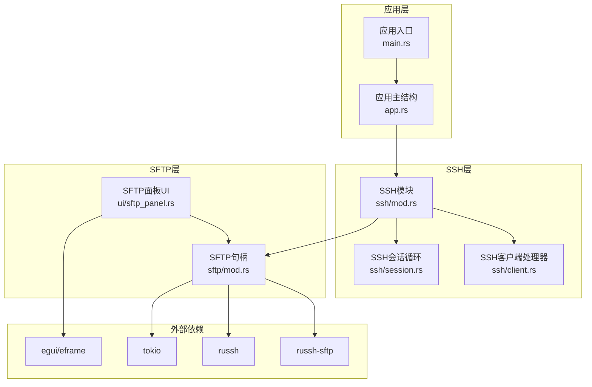
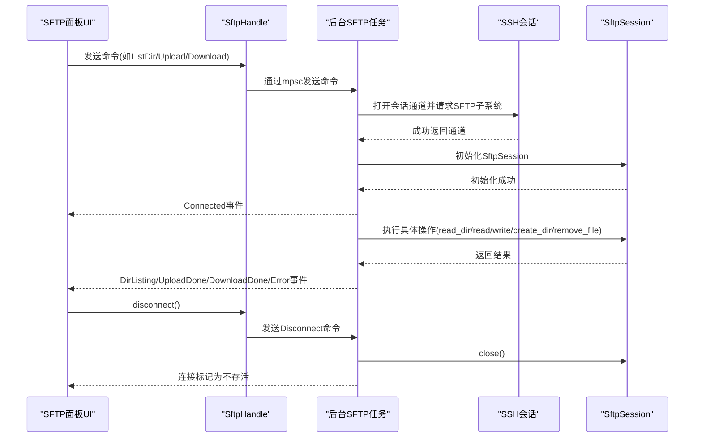
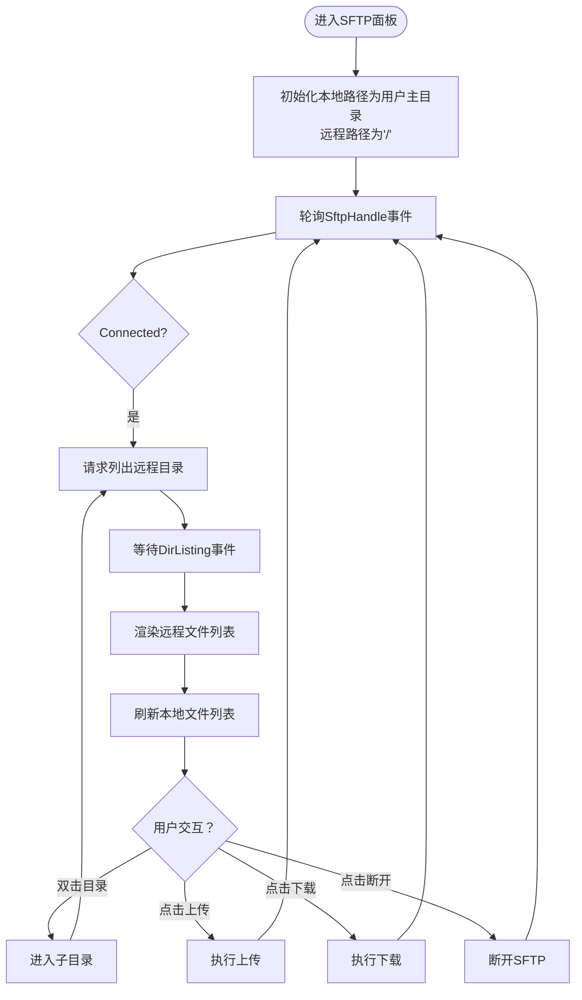
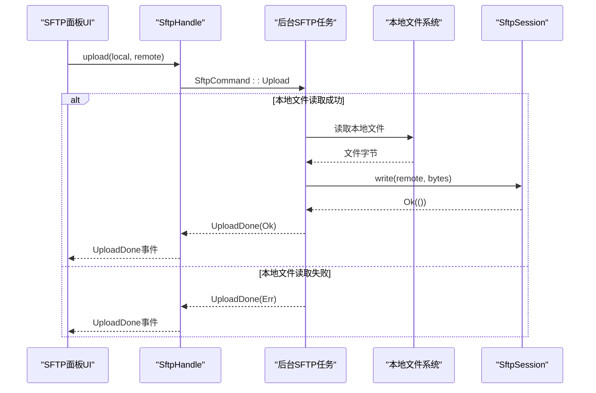
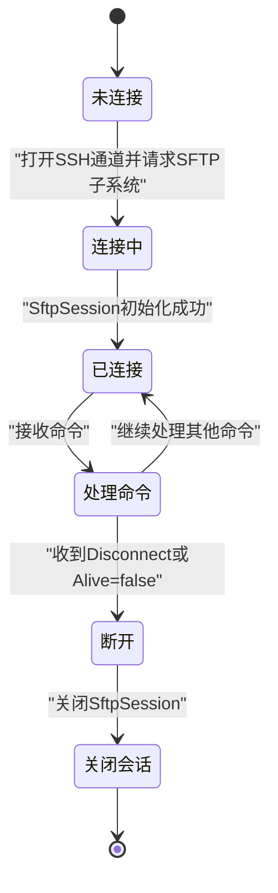
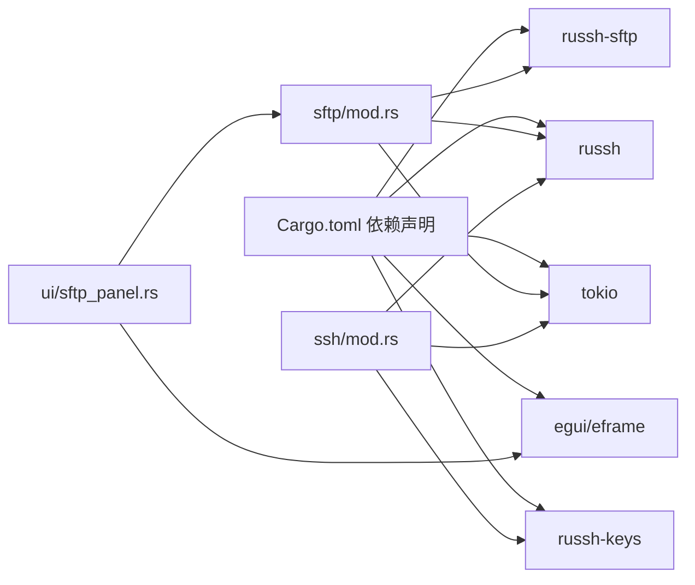

# SFTP文件传输

<cite>
**本文引用的文件**
- [sftp/mod.rs](file://src/sftp/mod.rs)
- [ui/sftp_panel.rs](file://src/ui/sftp_panel.rs)
- [ssh/mod.rs](file://src/ssh/mod.rs)
- [ssh/client.rs](file://src/ssh/client.rs)
- [ssh/session.rs](file://src/ssh/session.rs)
- [connection/models.rs](file://src/connection/models.rs)
- [Cargo.toml](file://Cargo.toml)
- [docs/specs/2026-05-30-phase3-sftp-design.md](file://docs/specs/2026-05-30-phase3-sftp-design.md)
- [app.rs](file://src/app.rs)
- [main.rs](file://src/main.rs)
</cite>

## 目录
1. [简介](#简介)
2. [项目结构](#项目结构)
3. [核心组件](#核心组件)
4. [架构总览](#架构总览)
5. [详细组件分析](#详细组件分析)
6. [依赖关系分析](#依赖关系分析)
7. [性能考量](#性能考量)
8. [故障排除指南](#故障排除指南)
9. [结论](#结论)
10. [附录](#附录)

## 简介
本文件面向QTerm的SFTP文件传输功能，系统性阐述基于russh-sftp库的实现方式、文件浏览与操作流程、UI交互、会话生命周期管理、安全性考虑以及性能优化策略，并提供故障排除指南。文档同时结合设计规范文档，对当前实现与预期设计进行对比说明。

## 项目结构
QTerm采用模块化组织，SFTP相关代码集中在以下模块：
- sftp：SFTP客户端句柄、事件与命令定义、后台任务与具体操作
- ssh：SSH连接、认证、会话生命周期与共享句柄
- ui：SFTP面板UI，双栏文件浏览与操作
- docs/specs：SFTP设计规范（包含预期的进度与传输增强）



图表来源
- [main.rs:1-87](file://src/main.rs#L1-L87)
- [app.rs:1-1465](file://src/app.rs#L1-L1465)
- [ssh/mod.rs:1-136](file://src/ssh/mod.rs#L1-L136)
- [ssh/client.rs:1-63](file://src/ssh/client.rs#L1-L63)
- [ssh/session.rs:1-90](file://src/ssh/session.rs#L1-L90)
- [sftp/mod.rs:1-238](file://src/sftp/mod.rs#L1-L238)
- [ui/sftp_panel.rs:1-387](file://src/ui/sftp_panel.rs#L1-L387)

章节来源
- [main.rs:1-87](file://src/main.rs#L1-L87)
- [app.rs:1-1465](file://src/app.rs#L1-L1465)
- [ssh/mod.rs:1-136](file://src/ssh/mod.rs#L1-L136)
- [sftp/mod.rs:1-238](file://src/sftp/mod.rs#L1-L238)

## 核心组件
- SftpHandle：对外暴露的SFTP客户端句柄，负责命令发送、事件轮询、连接存活检测与断开
- FileEntry：远程文件条目，包含名称、是否目录、大小等
- SftpEvent/SftpCommand：事件与命令枚举，承载UI与后台任务之间的异步通信
- SFTP后台任务：在独立Tokio任务中打开SFTP子系统通道，初始化SftpSession，循环处理命令
- SFTP面板UI：双栏本地/远程文件浏览，支持上传/下载、目录导航、状态反馈

章节来源
- [sftp/mod.rs:9-115](file://src/sftp/mod.rs#L9-L115)
- [sftp/mod.rs:16-33](file://src/sftp/mod.rs#L16-L33)
- [sftp/mod.rs:37-44](file://src/sftp/mod.rs#L37-L44)
- [sftp/mod.rs:119-167](file://src/sftp/mod.rs#L119-L167)
- [sftp/mod.rs:169-238](file://src/sftp/mod.rs#L169-L238)
- [ui/sftp_panel.rs:14-25](file://src/ui/sftp_panel.rs#L14-L25)

## 架构总览
SFTP复用现有SSH连接，通过SFTP子系统建立通道；UI通过SftpHandle发送命令，后台任务执行实际操作并通过事件回调驱动UI刷新。



图表来源
- [sftp/mod.rs:119-167](file://src/sftp/mod.rs#L119-L167)
- [sftp/mod.rs:169-238](file://src/sftp/mod.rs#L169-L238)
- [ssh/session.rs:28-46](file://src/ssh/session.rs#L28-L46)

## 详细组件分析

### SFTP客户端句柄与后台任务
- SftpHandle封装事件通道与命令通道，提供非阻塞poll、连接存活检测、目录/上传/下载/新建目录/删除等操作接口
- 后台任务在Tokio运行时中启动，打开SSH通道并请求SFTP子系统，初始化SftpSession，循环接收命令并处理
- 任务在收到Alive标志为false或命令通道关闭时退出，并关闭SftpSession

```mermaid
classDiagram
class SftpHandle {
+events_rx : Receiver<SftpEvent>
+cmd_tx : Sender<SftpCommand>
+alive : AtomicBool
+poll() Vec<SftpEvent>
+is_alive() bool
+list_dir(path)
+upload(local, remote)
+download(remote, local)
+mkdir(path)
+delete(path, is_dir)
+disconnect()
}
class SftpEvent {
<<enum>>
+Connected
+DirListing(Vec<FileEntry>)
+UploadDone(Result)
+DownloadDone(Result)
+MkdirDone(Result)
+DeleteDone(Result)
+Error(String)
}
class SftpCommand {
<<enum>>
+ListDir(String)
+Upload { local_path, remote_path }
+Download { remote_path, local_path }
+Mkdir(String)
+Delete { path, is_dir }
+Disconnect
}
class SftpSession {
+read_dir(path) Stream
+read(path) Bytes
+write(path, bytes)
+create_dir(path)
+remove_dir(path)
+remove_file(path)
+close()
}
SftpHandle --> SftpEvent : "发送"
SftpHandle --> SftpCommand : "接收"
SftpHandle --> SftpSession : "复用SSH通道"
```

图表来源
- [sftp/mod.rs:9-115](file://src/sftp/mod.rs#L9-L115)
- [sftp/mod.rs:25-33](file://src/sftp/mod.rs#L25-L33)
- [sftp/mod.rs:37-44](file://src/sftp/mod.rs#L37-L44)
- [sftp/mod.rs:119-167](file://src/sftp/mod.rs#L119-L167)

章节来源
- [sftp/mod.rs:9-115](file://src/sftp/mod.rs#L9-L115)
- [sftp/mod.rs:119-167](file://src/sftp/mod.rs#L119-L167)

### 文件浏览与UI交互
- SFTP面板UI维护本地与远程两个文件列表，支持双击进入子目录、选择文件、上传/下载按钮
- 本地列表过滤隐藏文件，按目录优先排序；远程列表由后台任务填充
- UI根据事件更新状态、刷新列表、触发目录导航



图表来源
- [ui/sftp_panel.rs:27-110](file://src/ui/sftp_panel.rs#L27-L110)
- [ui/sftp_panel.rs:164-246](file://src/ui/sftp_panel.rs#L164-L246)
- [ui/sftp_panel.rs:248-324](file://src/ui/sftp_panel.rs#L248-L324)
- [ui/sftp_panel.rs:326-356](file://src/ui/sftp_panel.rs#L326-L356)

章节来源
- [ui/sftp_panel.rs:14-25](file://src/ui/sftp_panel.rs#L14-L25)
- [ui/sftp_panel.rs:27-110](file://src/ui/sftp_panel.rs#L27-L110)
- [ui/sftp_panel.rs:164-246](file://src/ui/sftp_panel.rs#L164-L246)
- [ui/sftp_panel.rs:248-324](file://src/ui/sftp_panel.rs#L248-L324)
- [ui/sftp_panel.rs:326-356](file://src/ui/sftp_panel.rs#L326-L356)

### 文件上传与下载实现机制
- 上传：UI选择本地文件，构造远程路径，后台任务读取本地文件字节，调用SftpSession.write写入远程
- 下载：UI选择远程文件，构造本地路径，后台任务调用SftpSession.read读取远程字节，写入本地文件
- 当前实现未包含断点续传与进度监控，但事件模型已预留扩展空间



图表来源
- [sftp/mod.rs:198-208](file://src/sftp/mod.rs#L198-L208)
- [ui/sftp_panel.rs:326-339](file://src/ui/sftp_panel.rs#L326-L339)

章节来源
- [sftp/mod.rs:198-208](file://src/sftp/mod.rs#L198-L208)
- [sftp/mod.rs:209-219](file://src/sftp/mod.rs#L209-L219)
- [ui/sftp_panel.rs:326-356](file://src/ui/sftp_panel.rs#L326-L356)

### SFTP会话生命周期管理
- 复用SSH会话：SftpHandle::new接收SharedSshHandle，后台任务通过该句柄打开SFTP子系统通道
- 生命周期：连接建立后发送Connected事件；命令通道关闭或Alive标志为false时退出；最后关闭SftpSession
- 断开：UI调用disconnect，设置Alive标志并发送Disconnect命令，后台任务清理资源



图表来源
- [sftp/mod.rs:119-167](file://src/sftp/mod.rs#L119-L167)
- [ssh/mod.rs:132-136](file://src/ssh/mod.rs#L132-L136)

章节来源
- [sftp/mod.rs:119-167](file://src/sftp/mod.rs#L119-L167)
- [ssh/mod.rs:55-66](file://src/ssh/mod.rs#L55-L66)
- [ssh/mod.rs:132-136](file://src/ssh/mod.rs#L132-L136)

### 安全性考虑
- 路径遍历防护：当前UI在本地路径拼接时使用平台分隔符，远程路径拼接始终使用'/'，并在导航时使用Path::new与parent获取父路径，避免直接拼接导致越权访问
- 权限验证：SFTP操作直接复用SSH会话的权限上下文，无需额外权限检查；UI在上传/下载时对目录进行简单判断，防止目录被当作文件处理
- 认证与密钥：SSH层支持密码与私钥认证，密钥加载失败会返回认证错误，避免弱凭据导致的安全风险

章节来源
- [ui/sftp_panel.rs:275-297](file://src/ui/sftp_panel.rs#L275-L297)
- [ui/sftp_panel.rs:300-324](file://src/ui/sftp_panel.rs#L300-L324)
- [ui/sftp_panel.rs:378-387](file://src/ui/sftp_panel.rs#L378-L387)
- [ssh/client.rs:24-63](file://src/ssh/client.rs#L24-L63)

### 与设计规范的对比
- 当前实现：SFTP模块已具备基础的目录列举、上传/下载、新建目录、删除、事件驱动的UI交互
- 规划增强：设计规范中提到需要“文件传输（带进度）”、“右键菜单操作”、“传输列表”等，当前仓库未包含transfer.rs与右键菜单实现，但事件模型已为后续扩展打下基础

章节来源
- [docs/specs/2026-05-30-phase3-sftp-design.md:1-175](file://docs/specs/2026-05-30-phase3-sftp-design.md#L1-L175)
- [sftp/mod.rs:25-33](file://src/sftp/mod.rs#L25-L33)
- [sftp/mod.rs:37-44](file://src/sftp/mod.rs#L37-L44)

## 依赖关系分析
- 外部依赖：russh、russh-keys、russh-sftp、tokio、egui/eframe
- 内部依赖：sftp依赖ssh模块提供的SharedSshHandle；ui依赖sftp模块；app与main负责应用生命周期与窗口管理



图表来源
- [Cargo.toml:8-25](file://Cargo.toml#L8-L25)
- [sftp/mod.rs:1-5](file://src/sftp/mod.rs#L1-L5)
- [ssh/mod.rs:55-66](file://src/ssh/mod.rs#L55-L66)
- [ui/sftp_panel.rs:1-4](file://src/ui/sftp_panel.rs#L1-L4)

章节来源
- [Cargo.toml:8-25](file://Cargo.toml#L8-L25)
- [sftp/mod.rs:1-5](file://src/sftp/mod.rs#L1-L5)
- [ssh/mod.rs:55-66](file://src/ssh/mod.rs#L55-L66)
- [ui/sftp_panel.rs:1-4](file://src/ui/sftp_panel.rs#L1-L4)

## 性能考量
- 缓冲区大小：当前实现上传/下载直接读取整文件到内存，适合小文件；对于大文件建议改为分块读写，减少内存占用
- 并发传输控制：当前命令通道容量为256，建议引入队列与并发上限控制，避免过多并发导致资源争用
- 事件轮询：UI通过SftpHandle::poll非阻塞轮询事件，建议在渲染循环中定期调用，避免事件堆积
- 进度监控：可在后台任务中增加进度事件，通过事件通道向UI推送已传输字节数与总大小
- 断点续传：建议在SftpSession层面支持seek与resume，或在应用层记录已传输偏移，实现断点续传

章节来源
- [sftp/mod.rs:54](file://src/sftp/mod.rs#L54)
- [sftp/mod.rs:198-208](file://src/sftp/mod.rs#L198-L208)
- [sftp/mod.rs:209-219](file://src/sftp/mod.rs#L209-L219)
- [docs/specs/2026-05-30-phase3-sftp-design.md:11-22](file://docs/specs/2026-05-30-phase3-sftp-design.md#L11-L22)

## 故障排除指南
- SFTP子系统请求失败：检查SSH通道是否成功打开，确认服务端允许SFTP子系统
- SFTP会话初始化失败：确认通道流有效且SftpSession::new参数正确
- 打开SFTP通道失败：检查SSH会话状态与网络连通性
- 列出目录失败：检查远程路径是否存在、权限是否足够
- 读取本地文件失败：检查本地路径存在性与权限
- SFTP读取/写入失败：检查远程路径权限、磁盘空间与网络稳定性
- UI无响应：确认UI在渲染循环中调用SftpHandle::poll，避免事件堆积
- 断开后仍显示连接：确认Alive标志与命令通道关闭逻辑正确

章节来源
- [sftp/mod.rs:125-149](file://src/sftp/mod.rs#L125-L149)
- [sftp/mod.rs:178-196](file://src/sftp/mod.rs#L178-L196)
- [sftp/mod.rs:200-207](file://src/sftp/mod.rs#L200-L207)
- [sftp/mod.rs:211-218](file://src/sftp/mod.rs#L211-L218)

## 结论
QTerm的SFTP功能基于russh与russh-sftp实现了可靠的文件传输能力，通过事件驱动的UI与后台任务分离，保证了良好的用户体验与可维护性。当前实现满足基本的文件浏览与上传/下载需求，未来可按设计规范扩展为带进度与右键菜单的完整SFTP面板，并引入断点续传与并发控制等高级特性。

## 附录
- 连接配置模型：WhaleTerm连接配置与QTerm简化连接结构，用于SSH认证与会话建立
- 应用入口：eframe/egui渲染循环，窗口管理与应用生命周期

章节来源
- [connection/models.rs:3-43](file://src/connection/models.rs#L3-L43)
- [main.rs:49-87](file://src/main.rs#L49-L87)
- [app.rs:1-1465](file://src/app.rs#L1-L1465)