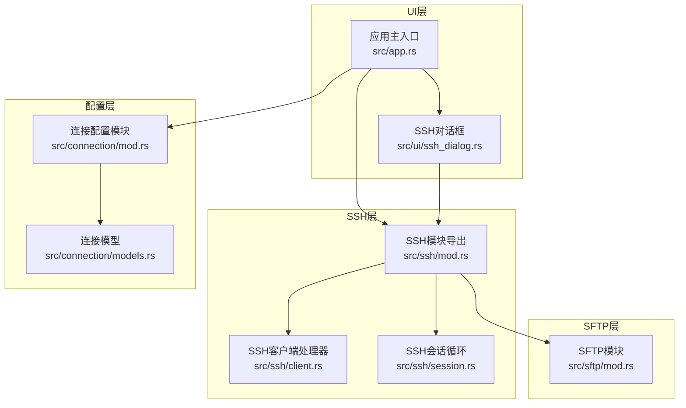
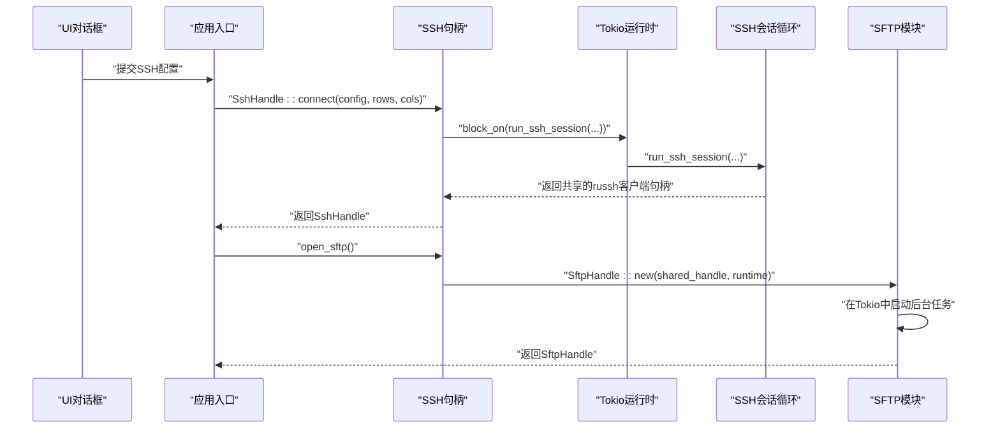
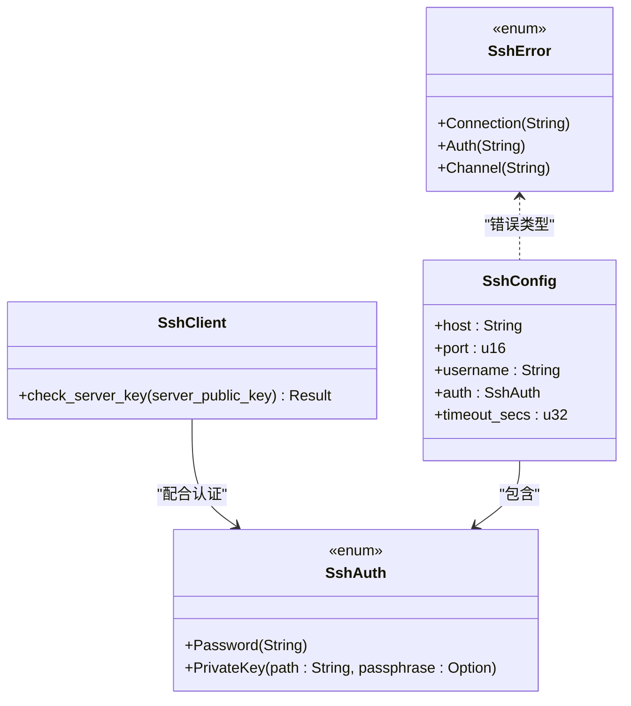
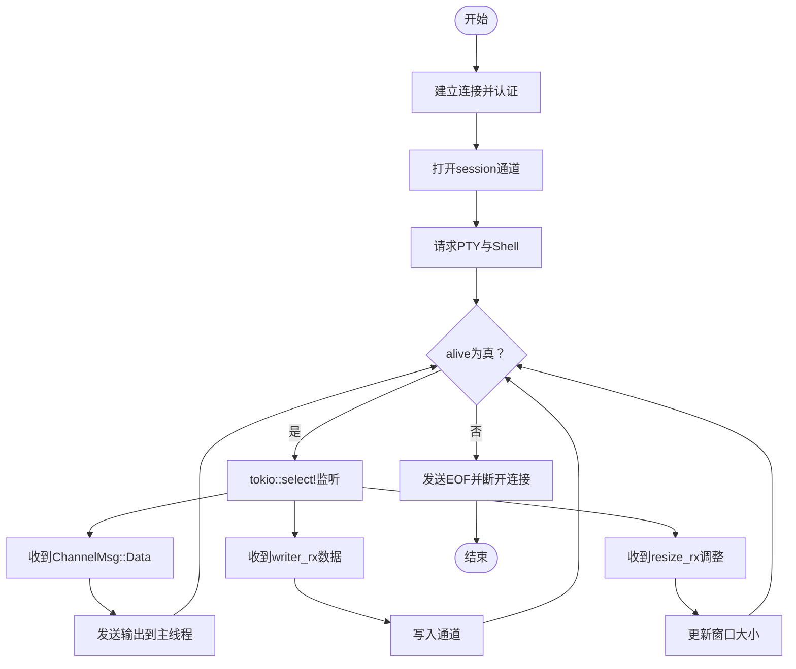
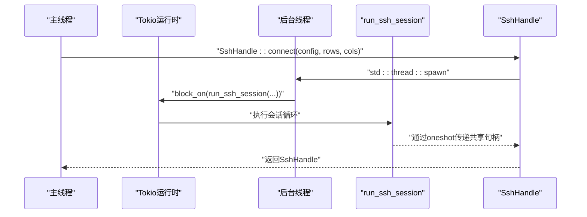
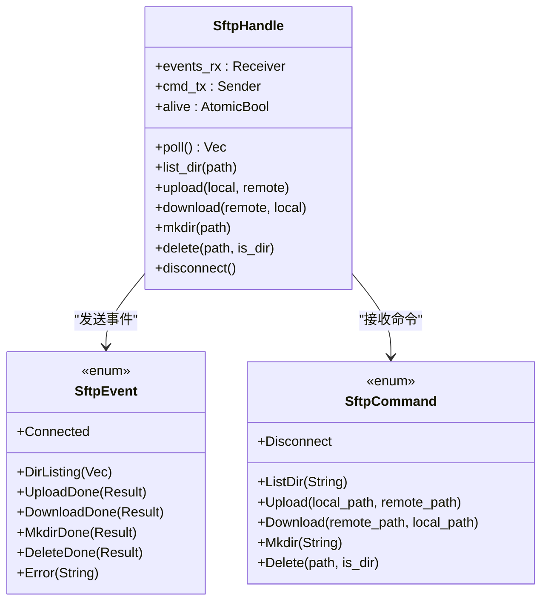
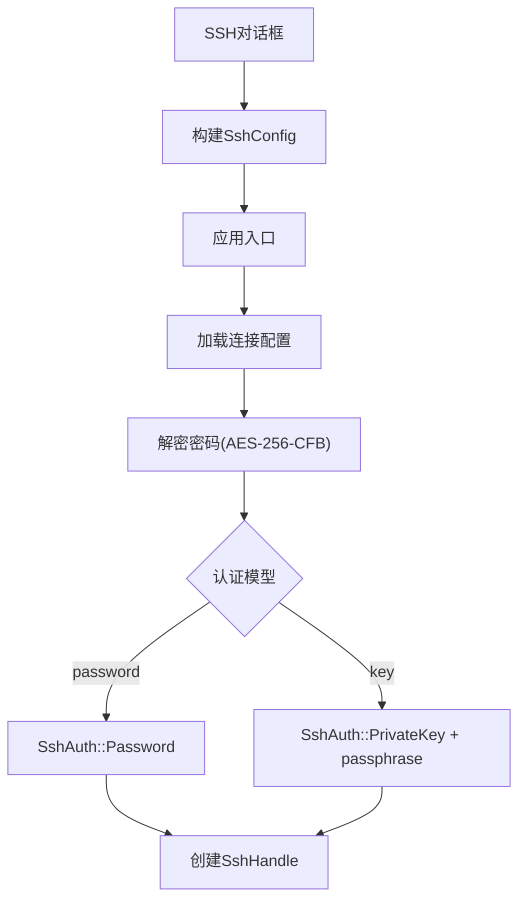
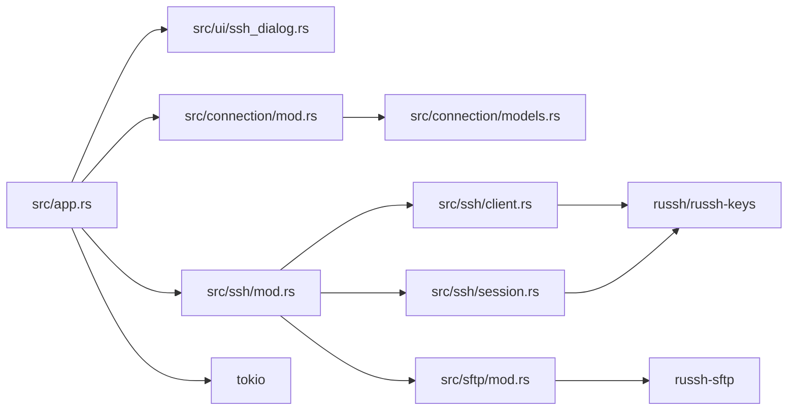

# SSH连接系统

<cite>
**本文档引用的文件**
- [src/ssh/mod.rs](file://src/ssh/mod.rs)
- [src/ssh/client.rs](file://src/ssh/client.rs)
- [src/ssh/session.rs](file://src/ssh/session.rs)
- [src/sftp/mod.rs](file://src/sftp/mod.rs)
- [src/ui/ssh_dialog.rs](file://src/ui/ssh_dialog.rs)
- [src/connection/mod.rs](file://src/connection/mod.rs)
- [src/connection/models.rs](file://src/connection/models.rs)
- [src/app.rs](file://src/app.rs)
- [Cargo.toml](file://Cargo.toml)
</cite>

## 目录
1. [简介](#简介)
2. [项目结构](#项目结构)
3. [核心组件](#核心组件)
4. [架构总览](#架构总览)
5. [详细组件分析](#详细组件分析)
6. [依赖关系分析](#依赖关系分析)
7. [性能考量](#性能考量)
8. [故障排查指南](#故障排查指南)
9. [结论](#结论)

## 简介
本文件为QTerm的SSH连接系统技术文档，聚焦于基于russh库的SSH客户端实现、会话管理、认证机制、异步处理架构、SFTP复用、错误处理与重连策略、安全考虑以及调试与性能优化建议。文档面向不同技术背景的读者，既提供高层架构概览，也包含代码级细节与可视化图示，帮助开发者快速理解并扩展该系统。

## 项目结构
QTerm的SSH相关模块主要分布在以下路径：
- src/ssh：SSH客户端、会话管理、错误类型与句柄
- src/sftp：SFTP客户端，复用SSH会话
- src/ui：SSH连接对话框，收集用户输入并生成配置
- src/connection：连接配置文件解析与密码解密
- src/app：应用入口，触发SSH连接与SFTP打开

图表来源
- [src/ssh/mod.rs:1-136](file://src/ssh/mod.rs#L1-L136)
- [src/ssh/client.rs:1-63](file://src/ssh/client.rs#L1-L63)
- [src/ssh/session.rs:1-90](file://src/ssh/session.rs#L1-L90)
- [src/sftp/mod.rs:1-238](file://src/sftp/mod.rs#L1-L238)
- [src/ui/ssh_dialog.rs:1-132](file://src/ui/ssh_dialog.rs#L1-L132)
- [src/connection/mod.rs:1-148](file://src/connection/mod.rs#L1-L148)
- [src/connection/models.rs:1-43](file://src/connection/models.rs#L1-L43)
- [src/app.rs:1-800](file://src/app.rs#L1-L800)

章节来源
- [src/ssh/mod.rs:1-136](file://src/ssh/mod.rs#L1-L136)
- [src/ssh/client.rs:1-63](file://src/ssh/client.rs#L1-L63)
- [src/ssh/session.rs:1-90](file://src/ssh/session.rs#L1-L90)
- [src/sftp/mod.rs:1-238](file://src/sftp/mod.rs#L1-L238)
- [src/ui/ssh_dialog.rs:1-132](file://src/ui/ssh_dialog.rs#L1-L132)
- [src/connection/mod.rs:1-148](file://src/connection/mod.rs#L1-L148)
- [src/connection/models.rs:1-43](file://src/connection/models.rs#L1-L43)
- [src/app.rs:1-800](file://src/app.rs#L1-L800)

## 核心组件
- SSH配置与错误类型：定义了SshConfig、SshAuth、SshError，并提供统一的错误显示与错误接口实现。
- SSH客户端处理器：实现russh的Handler接口，默认接受所有服务器密钥（安全风险见“安全考虑”）。
- SSH会话循环：负责建立连接、请求PTY与Shell、处理数据读写、窗口大小调整与通道关闭。
- SSH句柄：封装输出通道、输入发送端、大小调整发送端、存活标志与共享的russh客户端句柄，用于SFTP复用。
- SFTP模块：在现有SSH会话上打开SFTP子系统通道，提供目录列举、上传、下载、创建目录、删除等操作。
- UI对话框：收集主机、端口、用户名、认证方式（密码/私钥）等信息，生成SshConfig。
- 连接配置：解析WhaleTerm的connections.json，解密存储的密码，供应用直接使用。

章节来源
- [src/ssh/mod.rs:18-66](file://src/ssh/mod.rs#L18-L66)
- [src/ssh/client.rs:6-21](file://src/ssh/client.rs#L6-L21)
- [src/ssh/session.rs:9-90](file://src/ssh/session.rs#L9-L90)
- [src/sftp/mod.rs:7-115](file://src/sftp/mod.rs#L7-L115)
- [src/ui/ssh_dialog.rs:4-21](file://src/ui/ssh_dialog.rs#L4-L21)
- [src/connection/mod.rs:28-59](file://src/connection/mod.rs#L28-L59)

## 架构总览
QTerm采用“UI驱动 + 异步会话 + 共享句柄”的架构：
- UI层通过对话框收集配置，触发SSH连接。
- SSH层在独立Tokio运行时中执行会话循环，同时在后台线程中运行，通过多路复用通道与主线程通信。
- SFTP层复用同一SSH会话，通过子系统通道与远端SFTP服务交互。
- 连接配置层负责从磁盘加载并解密连接信息。

图表来源
- [src/ui/ssh_dialog.rs:104-131](file://src/ui/ssh_dialog.rs#L104-L131)
- [src/ssh/mod.rs:68-136](file://src/ssh/mod.rs#L68-L136)
- [src/ssh/session.rs:11-90](file://src/ssh/session.rs#L11-L90)
- [src/sftp/mod.rs:46-115](file://src/sftp/mod.rs#L46-L115)

## 详细组件分析

### SSH客户端处理器与认证
- 处理器实现：SshClient实现了russh的Handler接口，check_server_key默认返回true，表示自动接受所有服务器密钥。此行为存在安全风险，建议后续实现主机密钥校验与缓存。
- 认证流程：
  - 密码认证：调用authenticate_password(username, password)。
  - 私钥认证：加载私钥文件（支持passphrase），调用authenticate_publickey(username, key_pair)。
- 错误处理：连接错误、认证错误、通道错误分别映射到SshError的不同变体。

图表来源
- [src/ssh/client.rs:6-21](file://src/ssh/client.rs#L6-L21)
- [src/ssh/mod.rs:18-41](file://src/ssh/mod.rs#L18-L41)

章节来源
- [src/ssh/client.rs:23-63](file://src/ssh/client.rs#L23-L63)
- [src/ssh/mod.rs:18-41](file://src/ssh/mod.rs#L18-L41)

### SSH会话管理与生命周期
- 会话建立：connect_and_auth建立TCP连接并进行认证，返回russh客户端句柄。
- 通道与PTY：打开session通道，请求PTY（xterm-256color），请求shell。
- 主循环：使用tokio::select!监听三类事件：
  - 远程输出数据：ChannelMsg::Data，通过mpsc发送到主线程。
  - 用户输入：从tokio mpsc接收数据并写入通道。
  - 终端大小调整：从tokio mpsc接收(rows, cols)，调用window_change。
- 生命周期：alive标志控制循环；会话结束时发送EOF、断开连接并标记不存活。

图表来源
- [src/ssh/session.rs:9-90](file://src/ssh/session.rs#L9-L90)

章节来源
- [src/ssh/session.rs:9-90](file://src/ssh/session.rs#L9-L90)

### SSH句柄与Tokio运行时
- 全局运行时：get_runtime提供懒初始化的Tokio运行时，确保SSH专用线程池与异步任务隔离。
- 会话句柄：SshHandle封装mpsc输出通道、tokio mpsc输入通道、大小调整通道、alive标志与共享的russh客户端句柄。
- 连接流程：在后台线程中block_on运行run_ssh_session，等待共享句柄传递，然后返回SshHandle供UI与SFTP使用。
- SFTP复用：SshHandle::open_sftp通过共享句柄在Tokio运行时上启动SFTP任务。

图表来源
- [src/ssh/mod.rs:68-136](file://src/ssh/mod.rs#L68-L136)
- [src/ssh/session.rs:11-26](file://src/ssh/session.rs#L11-L26)

章节来源
- [src/ssh/mod.rs:68-136](file://src/ssh/mod.rs#L68-L136)

### SFTP模块与并发控制
- SftpHandle：封装事件通道与命令通道，维护alive标志。
- 后台任务：在Tokio运行时上启动sftp_task，打开SFTP子系统通道，初始化SftpSession，循环处理命令。
- 并发控制：命令通道容量为256，事件通道为mpsc，poll非阻塞轮询事件。
- 操作类型：目录列举、上传、下载、创建目录、删除、断开连接。

图表来源
- [src/sftp/mod.rs:7-115](file://src/sftp/mod.rs#L7-L115)
- [src/sftp/mod.rs:117-167](file://src/sftp/mod.rs#L117-L167)

章节来源
- [src/sftp/mod.rs:1-238](file://src/sftp/mod.rs#L1-L238)

### UI与连接配置
- SSH对话框：收集主机、端口、用户名、认证方式（密码/私钥），生成SshConfig。
- 应用入口：根据WhaleTerm连接配置生成SshAuth（密码或私钥+passphrase），创建SshHandle并加入分屏布局。
- 连接配置：解析connections.json，解密AES-256-CFB格式的密码，兼容主板序列号派生密钥。

图表来源
- [src/ui/ssh_dialog.rs:104-131](file://src/ui/ssh_dialog.rs#L104-L131)
- [src/app.rs:930-957](file://src/app.rs#L930-L957)
- [src/connection/mod.rs:28-98](file://src/connection/mod.rs#L28-L98)
- [src/connection/models.rs:17-43](file://src/connection/models.rs#L17-L43)

章节来源
- [src/ui/ssh_dialog.rs:1-132](file://src/ui/ssh_dialog.rs#L1-L132)
- [src/app.rs:930-957](file://src/app.rs#L930-L957)
- [src/connection/mod.rs:28-98](file://src/connection/mod.rs#L28-L98)
- [src/connection/models.rs:17-43](file://src/connection/models.rs#L17-L43)

## 依赖关系分析
- 外部依赖：russh、russh-keys、russh-sftp、tokio、async-trait、serde、serde_json、aes、cfb-mode、cipher、hex等。
- 内部耦合：ssh模块依赖russh与russh-keys；session依赖client；sftp依赖ssh的共享句柄；ui依赖ssh配置；app依赖ui与connection。

图表来源
- [Cargo.toml:8-25](file://Cargo.toml#L8-L25)
- [src/app.rs:1-800](file://src/app.rs#L1-L800)
- [src/ssh/mod.rs:1-136](file://src/ssh/mod.rs#L1-L136)
- [src/sftp/mod.rs:1-238](file://src/sftp/mod.rs#L1-L238)

章节来源
- [Cargo.toml:8-25](file://Cargo.toml#L8-L25)

## 性能考量
- 运行时隔离：SSH专用Tokio运行时避免与UI线程竞争，提升稳定性与吞吐。
- 通道容量：writer通道容量256，resize通道容量16，适合一般交互场景；可根据高延迟网络适当增大。
- 事件轮询：SFTP的poll非阻塞轮询，避免阻塞UI线程；建议在UI每帧调用一次以保持响应性。
- 资源释放：会话结束时主动发送EOF并断开连接，减少资源泄漏风险。
- 并发限制：当前未实现连接池；若需要多连接并发，建议引入连接池与限流策略。

## 故障排查指南
- 连接失败：检查主机、端口、用户名与认证信息；查看SshError::Connection的具体错误信息。
- 认证失败：确认密码或私钥路径与passphrase正确；私钥加载失败会返回SshError::Auth。
- 通道异常：SshError::Channel通常发生在数据读写或窗口调整阶段，检查通道是否已关闭。
- SFTP错误：SftpEvent::Error包含具体错误信息，常见于子系统请求失败、会话初始化失败或命令执行失败。
- UI无响应：确认SFTP的poll调用频率，避免长时间阻塞；检查Tokio运行时是否正常工作。

章节来源
- [src/ssh/mod.rs:35-53](file://src/ssh/mod.rs#L35-L53)
- [src/sftp/mod.rs:23-33](file://src/sftp/mod.rs#L23-L33)

## 结论
QTerm的SSH连接系统以russh为核心，结合Tokio异步运行时与多通道通信，实现了稳定的SSH会话与SFTP复用。系统具备清晰的模块划分与生命周期管理，但在主机密钥校验、连接池与重连机制方面仍有改进空间。建议后续增强安全策略（主机密钥检查）、完善错误恢复与重连逻辑，并引入连接池以支持更高并发场景。