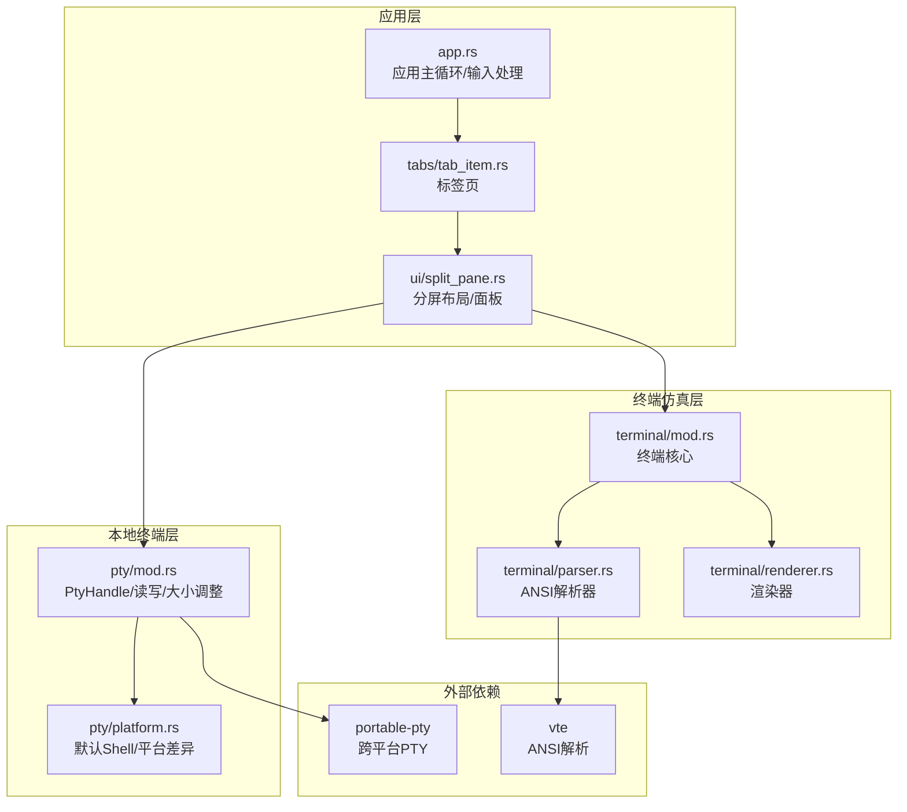
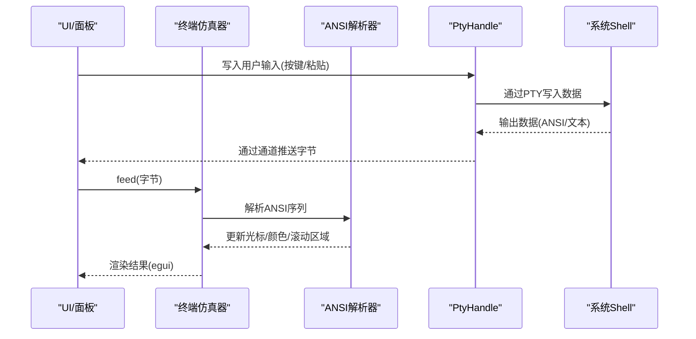
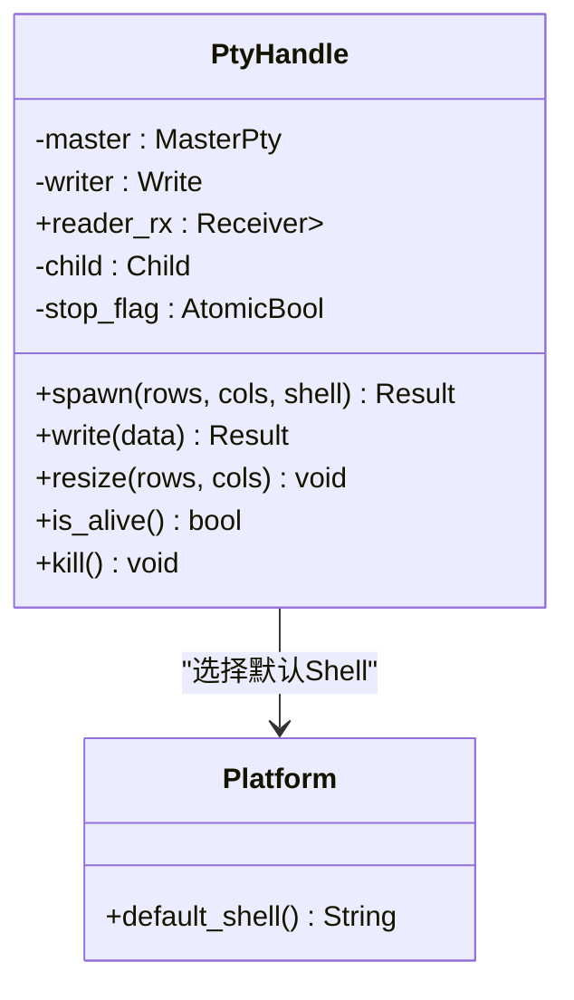
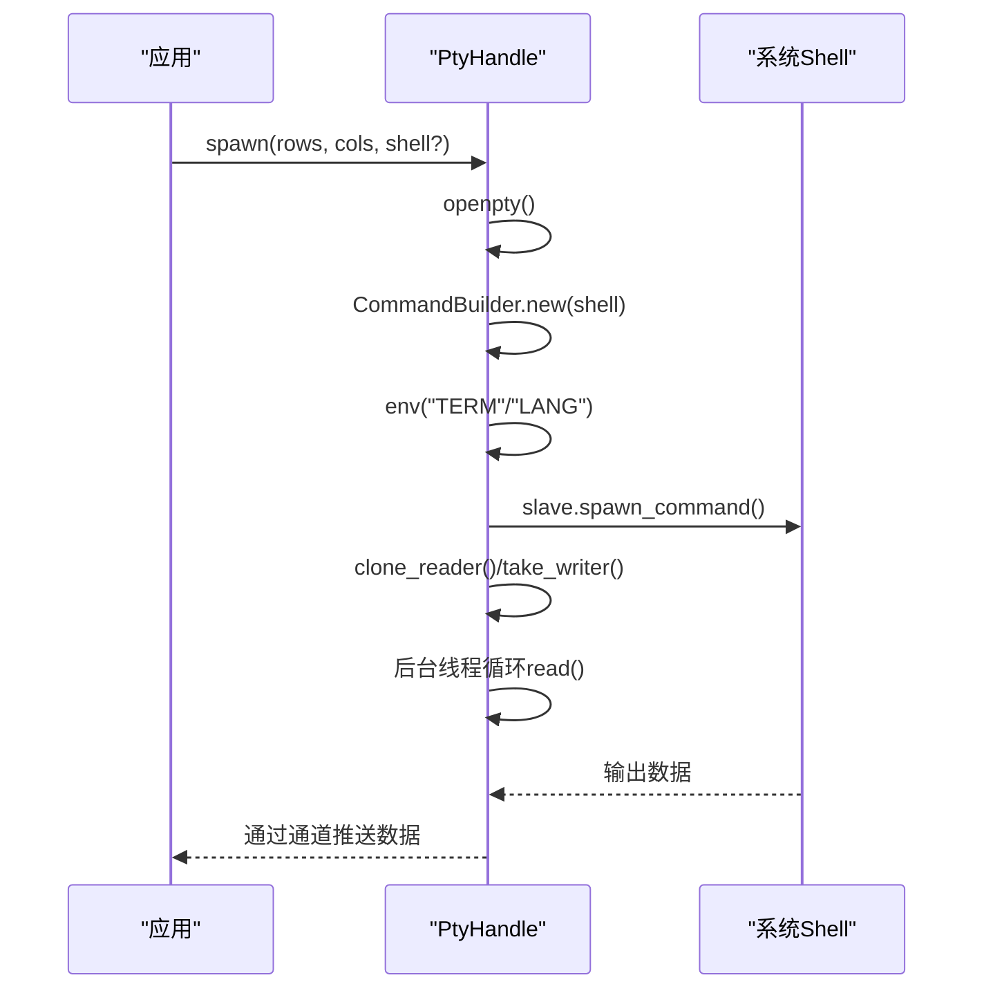
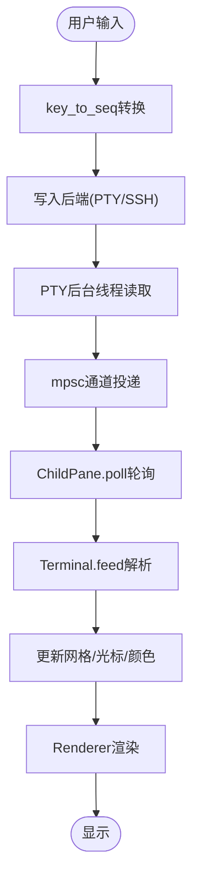
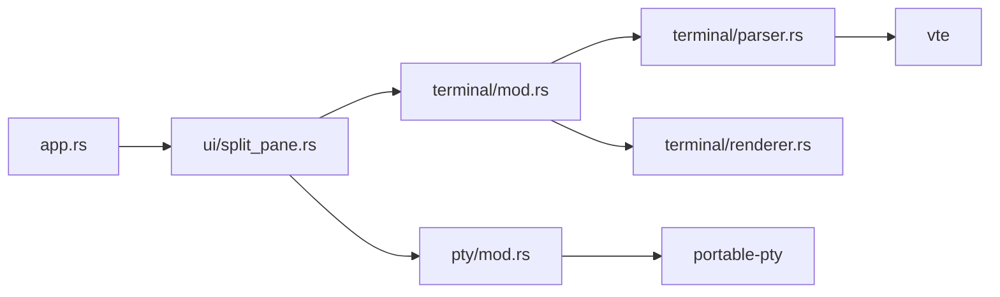
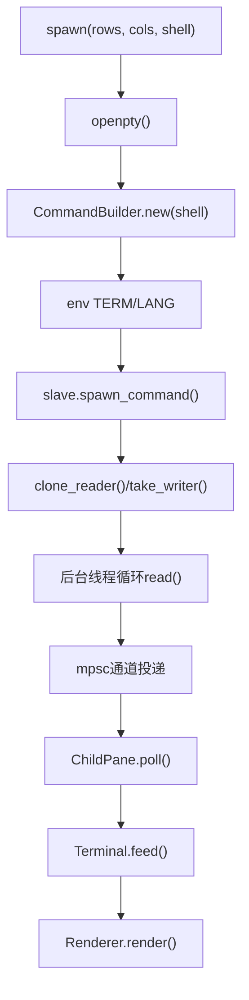

# 本地终端支持

<cite>
**本文档引用的文件**
- [src/pty/mod.rs](file://src/pty/mod.rs)
- [src/pty/platform.rs](file://src/pty/platform.rs)
- [src/ui/split_pane.rs](file://src/ui/split_pane.rs)
- [src/tabs/tab_item.rs](file://src/tabs/tab_item.rs)
- [src/app.rs](file://src/app.rs)
- [src/terminal/mod.rs](file://src/terminal/mod.rs)
- [src/terminal/parser.rs](file://src/terminal/parser.rs)
- [src/terminal/renderer.rs](file://src/terminal/renderer.rs)
- [src/config.rs](file://src/config.rs)
- [Cargo.toml](file://Cargo.toml)
</cite>

## 目录
1. [简介](#简介)
2. [项目结构](#项目结构)
3. [核心组件](#核心组件)
4. [架构总览](#架构总览)
5. [详细组件分析](#详细组件分析)
6. [依赖关系分析](#依赖关系分析)
7. [性能考量](#性能考量)
8. [故障排查指南](#故障排查指南)
9. [结论](#结论)
10. [附录](#附录)

## 简介
本文件面向QTerm的本地终端支持系统，围绕PTY（伪终端）实现、跨平台兼容策略、portable-pty集成、本地进程管理、终端仿真器交互以及性能优化进行系统化技术说明。重点覆盖以下方面：
- 本地Shell进程的创建、环境变量与工作目录配置
- PTY主从端的建立、数据读写与大小调整
- 不同平台（Windows/macOS/Linux）的默认Shell与环境差异
- 终端仿真器与本地进程的双向交互（输入输出、ANSI转义序列处理）
- 性能优化建议（缓冲区管理、I/O效率、渲染优化）

## 项目结构
本地终端支持主要分布在以下模块：
- pty：封装portable-pty，负责本地Shell进程的启动、数据读写与大小调整
- ui：分屏布局与面板管理，承载本地/远程终端面板
- terminal：终端仿真器核心（网格、光标、颜色、选择、解析器）
- app：应用主循环，调度标签页、面板轮询与输入事件处理
- config：应用配置与偏好设置（窗口、主题、字体、Shell路径）

**图表来源**
- [src/app.rs:189-575](file://src/app.rs#L189-L575)
- [src/tabs/tab_item.rs:11-48](file://src/tabs/tab_item.rs#L11-L48)
- [src/ui/split_pane.rs:1-238](file://src/ui/split_pane.rs#L1-L238)
- [src/terminal/mod.rs:24-200](file://src/terminal/mod.rs#L24-L200)
- [src/terminal/parser.rs:1-311](file://src/terminal/parser.rs#L1-L311)
- [src/terminal/renderer.rs:25-198](file://src/terminal/renderer.rs#L25-L198)
- [src/pty/mod.rs:1-121](file://src/pty/mod.rs#L1-L121)
- [src/pty/platform.rs:1-21](file://src/pty/platform.rs#L1-L21)

**章节来源**
- [src/app.rs:189-575](file://src/app.rs#L189-L575)
- [src/ui/split_pane.rs:1-238](file://src/ui/split_pane.rs#L1-L238)
- [src/pty/mod.rs:1-121](file://src/pty/mod.rs#L1-L121)
- [src/pty/platform.rs:1-21](file://src/pty/platform.rs#L1-L21)
- [src/terminal/mod.rs:24-200](file://src/terminal/mod.rs#L24-L200)
- [src/terminal/parser.rs:1-311](file://src/terminal/parser.rs#L1-L311)
- [src/terminal/renderer.rs:25-198](file://src/terminal/renderer.rs#L25-L198)

## 核心组件
- PtyHandle：封装portable-pty的MasterPty、子进程、读写器与数据通道，提供spawn、write、resize、is_alive、kill等能力
- 默认Shell选择：根据平台选择COMSPEC/PowerShell、$SHELL或系统默认Shell
- 分屏布局与面板：ChildPane统一管理本地/远程终端面板，负责轮询、写入、大小调整与关闭
- 终端仿真器：Terminal维护网格、光标、颜色、滚动区域、选择；Parser解析ANSI序列；Renderer渲染到egui
- 应用主循环：轮询标签页，处理输入事件，动态计算面板尺寸并触发渲染

**章节来源**
- [src/pty/mod.rs:11-121](file://src/pty/mod.rs#L11-L121)
- [src/pty/platform.rs:5-21](file://src/pty/platform.rs#L5-L21)
- [src/ui/split_pane.rs:25-149](file://src/ui/split_pane.rs#L25-L149)
- [src/terminal/mod.rs:24-200](file://src/terminal/mod.rs#L24-L200)
- [src/app.rs:282-575](file://src/app.rs#L282-L575)

## 架构总览
本地终端支持采用“应用层-面板层-仿真层-本地终端层”的分层设计。应用层负责UI与事件，面板层负责多面板编排与数据轮询，仿真层负责ANSI解析与渲染，本地终端层负责与系统Shell进程的桥接。

**图表来源**
- [src/ui/split_pane.rs:70-123](file://src/ui/split_pane.rs#L70-L123)
- [src/terminal/mod.rs:65-74](file://src/terminal/mod.rs#L65-L74)
- [src/terminal/parser.rs:10-233](file://src/terminal/parser.rs#L10-L233)
- [src/pty/mod.rs:87-91](file://src/pty/mod.rs#L87-L91)

## 详细组件分析

### PTY实现与跨平台兼容
- 进程创建与PTY建立
  - 使用native_pty_system打开PTY主从对，构建CommandBuilder，设置TERM与语言环境，从从端spawn子进程
  - Windows下额外设置LANG以改善编码行为
- 数据通道与读线程
  - 克隆master reader，创建mpsc通道，后台线程循环读取并投递到通道
  - 通过stop_flag与Drop保证资源回收
- 终端大小调整
  - 通过MasterPty::resize传递rows/cols，像素宽高为0（由上层计算）
- 子进程生命周期
  - is_alive基于try_wait检测，kill调用子进程kill并设置停止标志

**图表来源**
- [src/pty/mod.rs:11-121](file://src/pty/mod.rs#L11-L121)
- [src/pty/platform.rs:5-21](file://src/pty/platform.rs#L5-L21)

**章节来源**
- [src/pty/mod.rs:19-121](file://src/pty/mod.rs#L19-L121)
- [src/pty/platform.rs:5-21](file://src/pty/platform.rs#L5-L21)

### portable-pty集成流程
- 打开PTY主从端
- 构建CommandBuilder，设置TERM与LANG（Windows），spawn从端子进程
- 克隆reader与take writer，启动后台读线程
- 通过mpsc通道将输出数据传给上层终端仿真器

**图表来源**
- [src/pty/mod.rs:22-85](file://src/pty/mod.rs#L22-L85)

**章节来源**
- [src/pty/mod.rs:22-85](file://src/pty/mod.rs#L22-L85)

### 平台差异与适配策略
- 默认Shell
  - Windows：优先COMSPEC，否则PowerShell
  - macOS/Linux：优先$SHELL，否则系统默认Shell
- 语言环境
  - Windows设置LANG=en_US.UTF-8，提升编码一致性
- Shell路径来源
  - 优先使用配置中的shell_path，否则走平台默认

**章节来源**
- [src/pty/platform.rs:5-21](file://src/pty/platform.rs#L5-L21)
- [src/config.rs:37-97](file://src/config.rs#L37-L97)
- [src/app.rs:189-205](file://src/app.rs#L189-L205)

### 本地进程管理机制
- 进程启动
  - 通过portable-pty的slave端spawn_command，确保与PTY从端关联
- 环境变量
  - TERM=xterm-256color（统一颜色与特性）
  - LANG=en_US.UTF-8（Windows）
- 工作目录
  - 代码未显式设置工作目录，遵循portable-pty默认行为（通常继承父进程工作目录）

**章节来源**
- [src/pty/mod.rs:38-47](file://src/pty/mod.rs#L38-L47)

### 终端仿真器与本地进程交互
- 输入到后端
  - 用户输入经key_to_seq转换为ANSI序列，写入当前面板后端（Local/SSH）
- 后端到仿真器
  - ChildPane轮询PtyHandle.reader_rx，将字节feed到Terminal
  - Terminal通过vte解析ANSI，更新网格、光标、颜色与滚动区域
- 待回复ANSI响应
  - Terminal.pending_replies收集需要回发的响应（如DSR/CPR），在poll阶段写回后端

**图表来源**
- [src/ui/split_pane.rs:70-123](file://src/ui/split_pane.rs#L70-L123)
- [src/terminal/mod.rs:65-74](file://src/terminal/mod.rs#L65-L74)
- [src/terminal/parser.rs:10-233](file://src/terminal/parser.rs#L10-L233)
- [src/app.rs:1327-1425](file://src/app.rs#L1327-L1425)

**章节来源**
- [src/ui/split_pane.rs:70-123](file://src/ui/split_pane.rs#L70-L123)
- [src/terminal/mod.rs:65-74](file://src/terminal/mod.rs#L65-L74)
- [src/terminal/parser.rs:10-233](file://src/terminal/parser.rs#L10-L233)
- [src/app.rs:1327-1425](file://src/app.rs#L1327-L1425)

### 终端仿真器核心
- Terminal结构
  - 管理Grid、Cursor、颜色属性、滚动区域、选择、待回复ANSI响应
- ANSI解析
  - vte::Parser驱动，Performer实现具体动作（打印、执行、CSI、OSC、ESC）
- 渲染
  - Renderer根据字体度量计算行列数，绘制背景、文本、选区与光标

**章节来源**
- [src/terminal/mod.rs:24-200](file://src/terminal/mod.rs#L24-L200)
- [src/terminal/parser.rs:1-311](file://src/terminal/parser.rs#L1-L311)
- [src/terminal/renderer.rs:25-198](file://src/terminal/renderer.rs#L25-L198)

### 分屏与标签页管理
- 标签页
  - Tab持有SplitLayout，初始化时创建单个本地终端面板
- 分屏布局
  - SplitLayout管理多个ChildPane，支持水平/垂直分屏，动态增删面板
- 面板生命周期
  - ChildPane.poll轮询后端输出，写入输入，resize同步到后端，close终止后端

**章节来源**
- [src/tabs/tab_item.rs:11-48](file://src/tabs/tab_item.rs#L11-L48)
- [src/ui/split_pane.rs:151-238](file://src/ui/split_pane.rs#L151-L238)

## 依赖关系分析
- 外部依赖
  - portable-pty：跨平台PTY主从端与子进程管理
  - vte：ANSI转义序列解析
- 内部模块耦合
  - ui/split_pane依赖pty与terminal
  - terminal依赖vte
  - app依赖ui与terminal

**图表来源**
- [Cargo.toml:8-25](file://Cargo.toml#L8-L25)
- [src/app.rs:189-575](file://src/app.rs#L189-L575)
- [src/ui/split_pane.rs:1-238](file://src/ui/split_pane.rs#L1-L238)
- [src/pty/mod.rs:1-121](file://src/pty/mod.rs#L1-L121)
- [src/terminal/mod.rs:1-200](file://src/terminal/mod.rs#L1-L200)

**章节来源**
- [Cargo.toml:8-25](file://Cargo.toml#L8-L25)

## 性能考量
- I/O与缓冲
  - 后台线程以固定缓冲区大小读取PTY输出，减少阻塞与系统调用次数
  - mpsc通道异步解耦读写，避免主线程阻塞
- 渲染优化
  - 按颜色分段批量绘制文本，减少Painter调用次数
  - 选区与光标绘制采用矩形填充与按需文本绘制
- 终端尺寸计算
  - 基于字体度量计算行列数，避免频繁重算
- ANSI解析
  - vte解析器增量处理字节流，降低内存拷贝与解析成本

**章节来源**
- [src/pty/mod.rs:60-76](file://src/pty/mod.rs#L60-L76)
- [src/terminal/renderer.rs:80-107](file://src/terminal/renderer.rs#L80-L107)
- [src/terminal/mod.rs:65-74](file://src/terminal/mod.rs#L65-L74)

## 故障排查指南
- Shell无法启动
  - 检查默认Shell路径与配置shell_path；Windows优先COMSPEC，否则PowerShell
  - 确认LANG设置（Windows）与TERM环境变量
- 终端无输出
  - 确认ChildPane.poll循环正常，reader_rx是否有数据
  - 检查后台读线程是否因stop_flag提前退出
- 终端不响应输入
  - 确认key_to_seq转换正确，面板后端为Local且PtyHandle.write成功
  - 检查pending_replies是否被及时发送回后端
- 终端大小调整无效
  - 确认ChildPane.resize调用PtyHandle.resize，并同步到Terminal.resize

**章节来源**
- [src/pty/platform.rs:5-21](file://src/pty/platform.rs#L5-L21)
- [src/config.rs:37-97](file://src/config.rs#L37-L97)
- [src/ui/split_pane.rs:70-134](file://src/ui/split_pane.rs#L70-L134)
- [src/app.rs:1327-1425](file://src/app.rs#L1327-L1425)

## 结论
QTerm的本地终端支持以portable-pty为核心，结合分屏布局与终端仿真器，实现了跨平台的本地Shell交互体验。通过平台化的默认Shell选择、环境变量配置与后台I/O线程，系统在保持简洁的同时具备良好的可维护性与扩展性。未来可在工作目录设置、信号处理与更精细的渲染优化方面进一步增强。

## 附录
- 关键流程图（PTY启动与数据流转）

**图表来源**
- [src/pty/mod.rs:22-85](file://src/pty/mod.rs#L22-L85)
- [src/ui/split_pane.rs:70-123](file://src/ui/split_pane.rs#L70-L123)
- [src/terminal/mod.rs:65-74](file://src/terminal/mod.rs#L65-L74)
- [src/terminal/renderer.rs:42-180](file://src/terminal/renderer.rs#L42-L180)