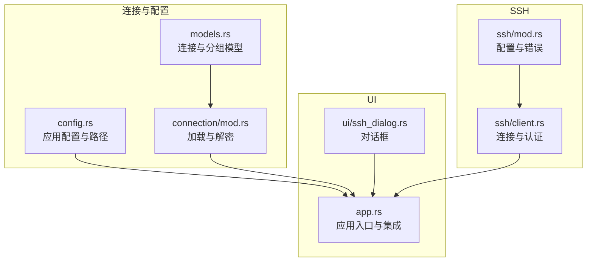
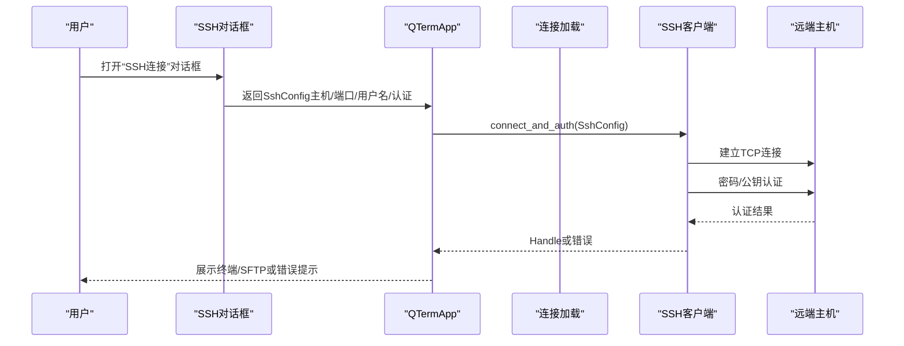
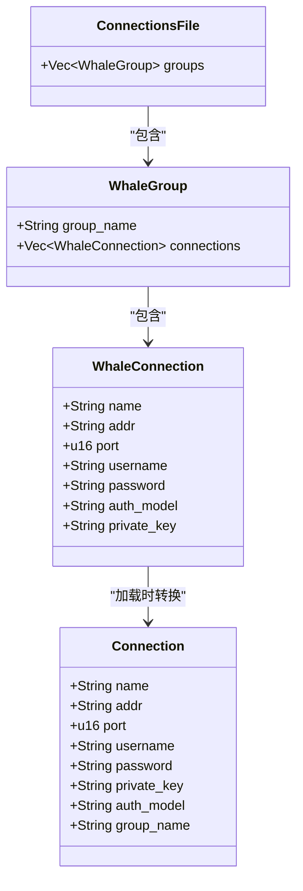
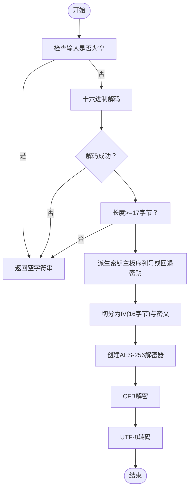
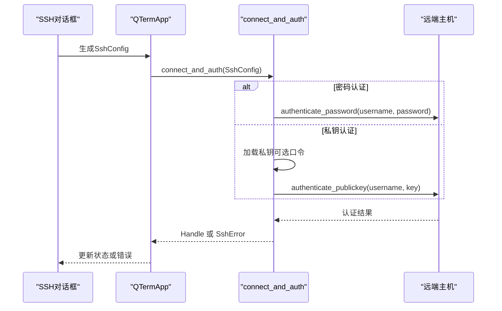
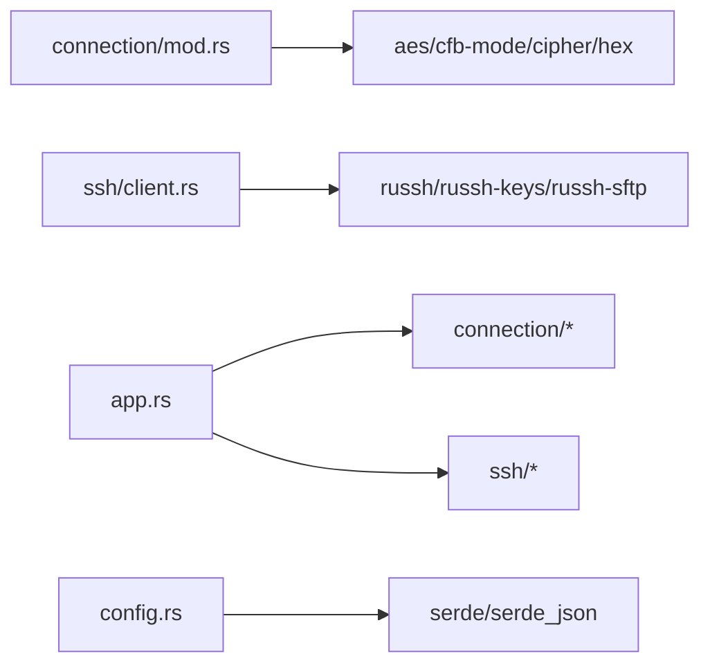

# 连接模型与配置

<cite>
**本文引用的文件**
- [src/connection/models.rs](file://src/connection/models.rs)
- [src/connection/mod.rs](file://src/connection/mod.rs)
- [src/config.rs](file://src/config.rs)
- [src/ssh/mod.rs](file://src/ssh/mod.rs)
- [src/ssh/client.rs](file://src/ssh/client.rs)
- [src/app.rs](file://src/app.rs)
- [src/ui/ssh_dialog.rs](file://src/ui/ssh_dialog.rs)
- [Cargo.toml](file://Cargo.toml)
</cite>

## 目录
1. [简介](#简介)
2. [项目结构](#项目结构)
3. [核心组件](#核心组件)
4. [架构总览](#架构总览)
5. [详细组件分析](#详细组件分析)
6. [依赖分析](#依赖分析)
7. [性能考量](#性能考量)
8. [故障排除指南](#故障排除指南)
9. [结论](#结论)
10. [附录](#附录)

## 简介
本文件面向QTerm的连接模型与配置系统，系统性阐述以下内容：
- Connection结构体的设计与字段语义（地址、端口、用户名、密码、私钥、认证模式、所属分组等）
- ConnectionsFile的数据结构与JSON配置文件格式（分组管理与连接树结构）
- 密码加密与解密机制（AES-256-CFB、密钥派生、主板序列号使用）
- 跨平台配置文件路径处理（Windows的APPDATA与Unix系的HOME）
- 连接配置最佳实践（安全与验证规则）
- 实际配置示例与故障排除建议

## 项目结构
围绕连接与配置的关键模块如下：
- 连接模型与加载：src/connection/models.rs、src/connection/mod.rs
- 应用配置与跨平台路径：src/config.rs
- SSH配置与认证：src/ssh/mod.rs、src/ssh/client.rs
- UI交互与连接发起：src/ui/ssh_dialog.rs、src/app.rs
- 依赖声明：Cargo.toml

图表来源
- [src/connection/models.rs:1-43](file://src/connection/models.rs#L1-L43)
- [src/connection/mod.rs:1-148](file://src/connection/mod.rs#L1-L148)
- [src/config.rs:1-281](file://src/config.rs#L1-L281)
- [src/ssh/mod.rs:1-50](file://src/ssh/mod.rs#L1-L50)
- [src/ssh/client.rs:1-54](file://src/ssh/client.rs#L1-L54)
- [src/ui/ssh_dialog.rs:1-131](file://src/ui/ssh_dialog.rs#L1-L131)
- [src/app.rs:1-1465](file://src/app.rs#L1-L1465)

章节来源
- [src/connection/models.rs:1-43](file://src/connection/models.rs#L1-L43)
- [src/connection/mod.rs:1-148](file://src/connection/mod.rs#L1-L148)
- [src/config.rs:1-281](file://src/config.rs#L1-L281)
- [src/ssh/mod.rs:1-50](file://src/ssh/mod.rs#L1-L50)
- [src/ssh/client.rs:1-54](file://src/ssh/client.rs#L1-L54)
- [src/ui/ssh_dialog.rs:1-131](file://src/ui/ssh_dialog.rs#L1-L131)
- [src/app.rs:1-1465](file://src/app.rs#L1-L1465)

## 核心组件
- 连接模型与分组
  - ConnectionsFile：顶层容器，包含多个分组
  - WhaleGroup：分组节点，包含分组名与连接列表
  - WhaleConnection：单个连接配置，包含主机、端口、用户名、加密密码、认证模型、私钥路径
  - Connection：QTerm内部使用的简化连接结构，包含解密后的密码与分组名
- 配置文件与路径
  - 应用配置（config.ini）：窗口位置、尺寸、主题、字体大小、回滚行数、Shell路径等
  - WhaleTerm连接配置（connections.json）：兼容WhaleTerm的连接树结构
  - 跨平台路径：Windows使用APPDATA，非Windows使用HOME/.config
- SSH配置与认证
  - SshConfig：主机、端口、用户名、认证方式、超时
  - SshAuth：密码认证或私钥认证（含可选口令）
  - 连接与认证流程：建立连接并进行密码或公钥认证

章节来源
- [src/connection/models.rs:3-43](file://src/connection/models.rs#L3-L43)
- [src/connection/mod.rs:28-59](file://src/connection/mod.rs#L28-L59)
- [src/config.rs:37-127](file://src/config.rs#L37-L127)
- [src/ssh/mod.rs:18-50](file://src/ssh/mod.rs#L18-L50)
- [src/ssh/client.rs:20-53](file://src/ssh/client.rs#L20-L53)

## 架构总览
下图展示从配置文件到UI交互再到SSH连接的整体流程。

图表来源
- [src/ui/ssh_dialog.rs:104-131](file://src/ui/ssh_dialog.rs#L104-L131)
- [src/app.rs:562-571](file://src/app.rs#L562-L571)
- [src/ssh/client.rs:20-53](file://src/ssh/client.rs#L20-L53)

## 详细组件分析

### 连接模型与分组结构
- 数据结构设计
  - ConnectionsFile：顶层数组groups
  - WhaleGroup：groupName、connections
  - WhaleConnection：name、addr、port、username、password（加密）、authModel、privateKey
  - Connection：name、addr、port、username、password（解密后）、private_key、auth_model、group_name
- JSON配置文件格式
  - 分组树：支持多层嵌套的分组结构，连接列表位于分组内
  - 字段映射：authModel与privateKey使用serde重命名
- 加载与展开
  - 从WhaleTerm connections.json读取
  - 展开为扁平列表，同时对password执行解密，并补充group_name

图表来源
- [src/connection/models.rs:3-43](file://src/connection/models.rs#L3-L43)

章节来源
- [src/connection/models.rs:3-43](file://src/connection/models.rs#L3-L43)
- [src/connection/mod.rs:28-59](file://src/connection/mod.rs#L28-L59)

### 密码加密与解密机制
- 加密算法与格式
  - AES-256-CFB
  - 密文格式：hex(IV[16字节] + ciphertext)
- 密钥派生
  - 来源：主板序列号（Win32_BaseBoard.SerialNumber）
  - 派生策略：取序列号字节，不足32字节用硬编码回退密钥填充
  - 无序列号时直接使用硬编码回退密钥
- 解密流程
  - 输入：十六进制字符串
  - 步骤：解码、长度校验、派生密钥、切分IV与密文、CFB解密、UTF-8转码
- 平台差异
  - Windows：通过PowerShell调用WMI获取主板序列号
  - 非Windows：未实现序列号获取，将回退到硬编码密钥

图表来源
- [src/connection/mod.rs:64-98](file://src/connection/mod.rs#L64-L98)
- [src/connection/mod.rs:100-137](file://src/connection/mod.rs#L100-L137)
- [src/connection/mod.rs:139-148](file://src/connection/mod.rs#L139-L148)

章节来源
- [src/connection/mod.rs:61-148](file://src/connection/mod.rs#L61-L148)

### 跨平台配置文件路径处理
- 应用配置（config.ini）
  - Windows：%APPDATA%\qterm\config.ini
  - 其他：~/.config/qterm/config.ini
- WhaleTerm连接配置（connections.json）
  - Windows：%APPDATA%\WhaleTerm\connections.json
  - 其他：~/.config/WhaleTerm/connections.json
- WhaleTerm偏好（preferences.json）
  - Windows：%APPDATA%\WhaleTerm\preferences.json
  - 其他：~/.config/WhaleTerm\preferences.json

章节来源
- [src/config.rs:6-28](file://src/config.rs#L6-L28)
- [src/config.rs:184-204](file://src/config.rs#L184-L204)
- [src/connection/mod.rs:7-26](file://src/connection/mod.rs#L7-L26)

### SSH配置与认证流程
- SshConfig
  - host、port、username、auth（密码或私钥）、timeout_secs
- SshAuth
  - Password：纯文本密码
  - PrivateKey：path + 可选passphrase
- 连接与认证
  - 建立连接后根据auth类型选择authenticate_password或authenticate_publickey
  - 认证失败抛出SshError::Auth
- UI交互
  - SSH对话框收集host/port/username与认证方式
  - 校验必填字段后生成SshConfig并交由应用创建SSH标签页

图表来源
- [src/ui/ssh_dialog.rs:104-131](file://src/ui/ssh_dialog.rs#L104-L131)
- [src/ssh/client.rs:20-53](file://src/ssh/client.rs#L20-L53)
- [src/ssh/mod.rs:18-50](file://src/ssh/mod.rs#L18-L50)

章节来源
- [src/ssh/mod.rs:18-50](file://src/ssh/mod.rs#L18-L50)
- [src/ssh/client.rs:20-53](file://src/ssh/client.rs#L20-L53)
- [src/ui/ssh_dialog.rs:104-131](file://src/ui/ssh_dialog.rs#L104-L131)

### 应用集成与连接树展示
- 应用启动时加载WhaleTerm连接列表并解密密码
- 左侧面板按分组展示连接，双击打开SSH标签页
- 根据auth_model与private_key决定使用密码还是私钥认证

章节来源
- [src/app.rs:96-96](file://src/app.rs#L96-L96)
- [src/app.rs:846-927](file://src/app.rs#L846-L927)
- [src/app.rs:929-957](file://src/app.rs#L929-L957)

## 依赖分析
- 外部库
  - aes、cfb-mode、cipher：AES-256-CFB解密
  - hex：十六进制编解码
  - russh、russh-keys、russh-sftp：SSH客户端、密钥加载、SFTP
  - serde、serde_json：JSON序列化与反序列化
  - tokio：异步运行时
- 内部模块耦合
  - connection/mod.rs依赖aes、cfb-mode、cipher、hex
  - ssh/client.rs依赖russh、russh-keys
  - app.rs依赖connection、ssh、ui模块
  - config.rs独立处理INI配置与路径

图表来源
- [src/connection/mod.rs:61-98](file://src/connection/mod.rs#L61-L98)
- [src/ssh/client.rs:1-54](file://src/ssh/client.rs#L1-L54)
- [src/app.rs:1-105](file://src/app.rs#L1-L105)
- [src/config.rs:1-281](file://src/config.rs#L1-L281)
- [Cargo.toml:8-25](file://Cargo.toml#L8-L25)

章节来源
- [Cargo.toml:8-25](file://Cargo.toml#L8-L25)

## 性能考量
- 解密成本
  - AES-256-CFB解密为CPU轻量级操作，但需要对每个连接执行一次
  - 建议在应用启动时一次性解密并缓存，避免重复解密
- 路径查询
  - Windows平台通过PowerShell调用WMI获取主板序列号，存在进程启动与IO开销
  - 若频繁访问，可考虑缓存序列号或在非Windows平台使用其他稳定标识
- 异步SSH
  - 使用tokio运行时与russh异步连接，避免阻塞UI线程

[本节为通用性能讨论，不直接分析具体文件]

## 故障排除指南
- 无法加载连接配置
  - 检查connections.json是否存在且格式正确
  - 确认路径：Windows为%APPDATA%\WhaleTerm\connections.json；非Windows为~/.config/WhaleTerm/connections.json
- 解密失败或密码为空
  - 确认password字段为合法的十六进制字符串
  - 确认主板序列号可获取（Windows），否则将回退到硬编码密钥
- SSH连接失败
  - 校验host/port/username
  - 密码认证：确认密码正确
  - 私钥认证：确认私钥路径与口令正确
- UI无连接列表
  - 确认WhaleTerm配置可用且已加载
  - 检查左侧面板是否开启

章节来源
- [src/connection/mod.rs:28-59](file://src/connection/mod.rs#L28-L59)
- [src/config.rs:6-28](file://src/config.rs#L6-L28)
- [src/ssh/client.rs:20-53](file://src/ssh/client.rs#L20-L53)
- [src/app.rs:846-927](file://src/app.rs#L846-L927)

## 结论
QTerm的连接模型与配置系统以WhaleTerm兼容的JSON结构为基础，结合AES-256-CFB加密与主板序列号派生密钥，实现了跨平台的连接配置与安全存储。通过清晰的模块划分与UI集成，用户可以便捷地管理连接并发起SSH会话。建议在生产环境中遵循安全最佳实践，谨慎处理私钥与口令，并定期验证配置文件的完整性与正确性。

[本节为总结性内容，不直接分析具体文件]

## 附录

### 配置文件格式与字段说明
- connections.json（顶层）
  - groups：分组数组
- 分组（WhaleGroup）
  - groupName：分组名称
  - connections：连接数组
- 连接（WhaleConnection）
  - name：显示名称
  - addr：主机地址
  - port：SSH端口
  - username：用户名
  - password：加密密码（十六进制，格式见“密码加密与解密机制”）
  - authModel：认证模型（password/key）
  - privateKey：私钥文件路径（可选）

章节来源
- [src/connection/models.rs:3-43](file://src/connection/models.rs#L3-L43)
- [src/connection/mod.rs:28-59](file://src/connection/mod.rs#L28-L59)

### 安全最佳实践
- 密钥与口令
  - 私钥文件权限应限制为仅所有者可读
  - 口令尽量使用短生命周期的临时值
- 配置验证
  - 必填字段：host、username、port
  - 认证方式：密码或私钥二选一
- 跨平台注意
  - Windows平台需确保PowerShell与WMI可用
  - 非Windows平台将回退到硬编码密钥，建议自行替换为更安全的密钥源

章节来源
- [src/ui/ssh_dialog.rs:104-131](file://src/ui/ssh_dialog.rs#L104-L131)
- [src/connection/mod.rs:100-137](file://src/connection/mod.rs#L100-L137)