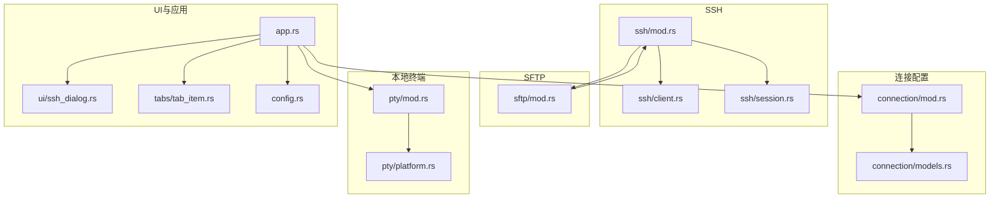
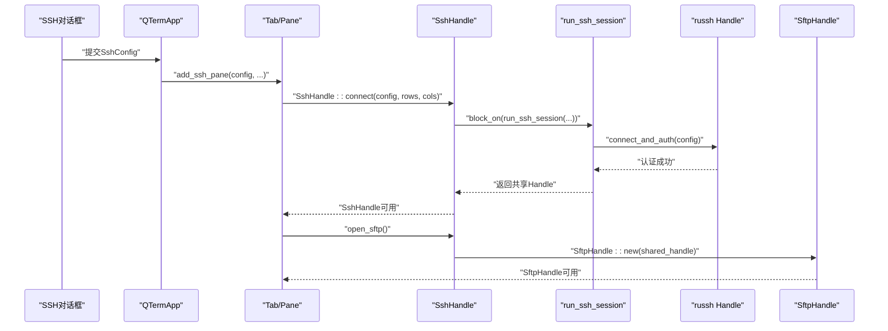
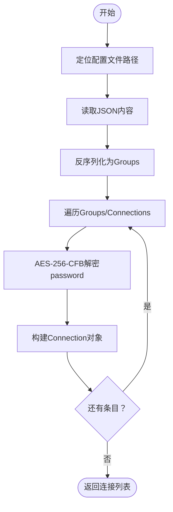
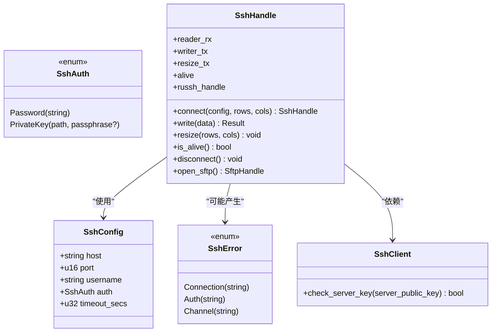
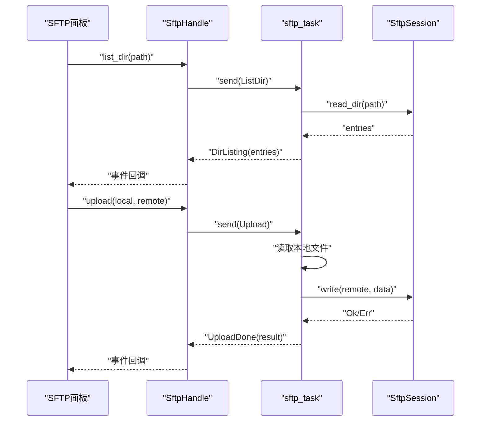
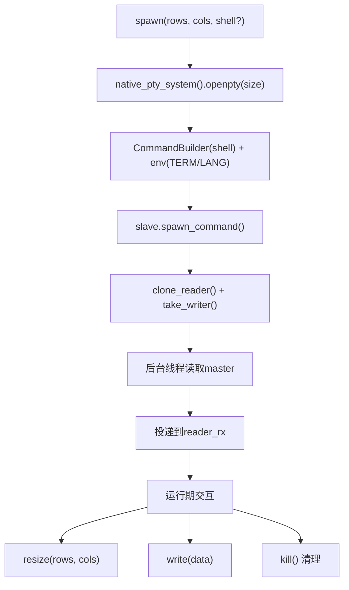
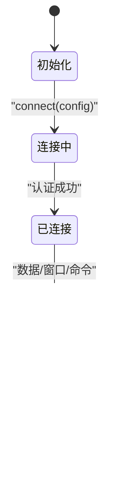
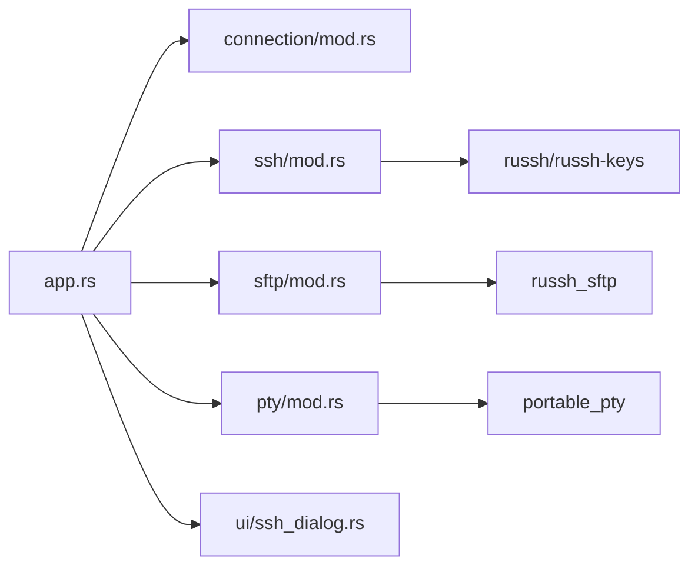

# 连接管理

<cite>
**本文引用的文件**
- [src/connection/mod.rs](file://src/connection/mod.rs)
- [src/connection/models.rs](file://src/connection/models.rs)
- [src/ssh/mod.rs](file://src/ssh/mod.rs)
- [src/ssh/client.rs](file://src/ssh/client.rs)
- [src/ssh/session.rs](file://src/ssh/session.rs)
- [src/sftp/mod.rs](file://src/sftp/mod.rs)
- [src/pty/mod.rs](file://src/pty/mod.rs)
- [src/pty/platform.rs](file://src/pty/platform.rs)
- [src/ui/ssh_dialog.rs](file://src/ui/ssh_dialog.rs)
- [src/app.rs](file://src/app.rs)
- [src/tabs/tab_item.rs](file://src/tabs/tab_item.rs)
- [src/config.rs](file://src/config.rs)
- [docs/plans/改造计划.md](file://docs/plans/改造计划.md)
- [docs/specs/2026-05-30-phase2-ssh-split-design.md](file://docs/specs/2026-05-30-phase2-ssh-split-design.md)
- [docs/specs/2026-05-30-phase3-sftp-design.md](file://docs/specs/2026-05-30-phase3-sftp-design.md)
</cite>

## 目录
1. [简介](#简介)
2. [项目结构](#项目结构)
3. [核心组件](#核心组件)
4. [架构总览](#架构总览)
5. [详细组件分析](#详细组件分析)
6. [依赖关系分析](#依赖关系分析)
7. [性能考量](#性能考量)
8. [故障排除指南](#故障排除指南)
9. [结论](#结论)
10. [附录](#附录)

## 简介
本文件面向QTerm的连接管理系统，系统性梳理连接配置与管理、SSH连接架构、SFTP文件传输、本地终端PTY实现、连接生命周期管理、错误处理与重连策略、安全与最佳实践等内容。目标是帮助开发者与运维人员快速理解并高效使用该系统。

## 项目结构
QTerm采用模块化组织，连接管理相关代码主要分布在以下模块：
- 连接配置与存储：connection 模块负责从WhaleTerm迁移的连接配置文件解析与解密，并提供扁平化的连接列表供UI使用。
- SSH连接：ssh 模块封装russh客户端、会话管理与错误类型，提供统一的连接句柄与SFTP打开能力。
- SFTP文件传输：sftp 模块基于SSH通道上的SFTP子系统，提供目录浏览、上传下载、事件回调与断开控制。
- 本地终端：pty 模块通过portable_pty在各平台创建伪终端，实现本地Shell进程与终端渲染的桥接。
- UI与应用：app.rs负责应用生命周期、窗口布局、快捷键与面板渲染；ssh_dialog.rs提供SSH连接对话框；tabs模块负责标签页与面板布局。

**图表来源**
- [src/connection/mod.rs:1-138](file://src/connection/mod.rs#L1-L138)
- [src/connection/models.rs:1-41](file://src/connection/models.rs#L1-L41)
- [src/ssh/mod.rs:1-118](file://src/ssh/mod.rs#L1-L118)
- [src/ssh/client.rs:1-54](file://src/ssh/client.rs#L1-L54)
- [src/ssh/session.rs:1-77](file://src/ssh/session.rs#L1-L77)
- [src/sftp/mod.rs:1-206](file://src/sftp/mod.rs#L1-L206)
- [src/pty/mod.rs:1-106](file://src/pty/mod.rs#L1-L106)
- [src/pty/platform.rs:1-18](file://src/pty/platform.rs#L1-L18)
- [src/ui/ssh_dialog.rs:1-132](file://src/ui/ssh_dialog.rs#L1-L132)
- [src/app.rs:1-1372](file://src/app.rs#L1-L1372)
- [src/tabs/tab_item.rs:1-40](file://src/tabs/tab_item.rs#L1-L40)
- [src/config.rs:1-281](file://src/config.rs#L1-L281)

**章节来源**
- [src/connection/mod.rs:1-138](file://src/connection/mod.rs#L1-L138)
- [src/ssh/mod.rs:1-118](file://src/ssh/mod.rs#L1-L118)
- [src/sftp/mod.rs:1-206](file://src/sftp/mod.rs#L1-L206)
- [src/pty/mod.rs:1-106](file://src/pty/mod.rs#L1-L106)
- [src/app.rs:1-1372](file://src/app.rs#L1-L1372)

## 核心组件
- 连接模型与配置存储
  - 连接文件结构：顶层groups数组，每组包含groupName与connections数组；每个连接包含name、addr、port、username、password、authModel、privateKey等字段。
  - 加载与解密：从WhaleTerm配置目录读取connections.json，逐条解密password后生成简化版Connection对象列表。
  - 密钥派生：基于主板序列号派生AES-256密钥，若不可用则回退固定字符串，确保跨平台兼容。
- SSH连接管理
  - 配置与认证：SshConfig包含host/port/username/auth/timeout；SshAuth支持密码与私钥两种模式；SshError统一错误分类。
  - 会话与线程：SshHandle在独立线程中阻塞运行Tokio事件循环，通过多路复用通道与会话交互，暴露写入、调整窗口大小、存活检测与断开能力。
  - SFTP集成：SshHandle可打开SftpHandle，基于同一SSH会话复用SFTP子系统通道。
- SFTP文件传输
  - 任务模型：SftpHandle内部异步任务监听命令队列，执行目录列举、上传、下载、创建目录、删除等操作，并通过事件通道上报结果。
  - 事件与命令：SftpEvent枚举涵盖连接成功、目录列表、上传/下载/创建/删除完成与错误；SftpCommand定义对应操作。
- 本地终端PTY
  - 平台抽象：portable_pty提供原生PTYSys，创建master/slave对；根据平台设置默认Shell与环境变量。
  - 生命周期：PtyHandle负责读写、窗口大小调整、进程存活检测与终止清理。
- UI与应用
  - SSH对话框：收集主机、端口、用户名与认证方式，生成SshConfig并交由应用创建SSH面板。
  - 应用主循环：处理快捷键、渲染标题栏、侧边栏、状态栏与中央面板；响应SSH/SFTP事件；持久化窗口状态。

**章节来源**
- [src/connection/models.rs:1-41](file://src/connection/models.rs#L1-L41)
- [src/connection/mod.rs:25-138](file://src/connection/mod.rs#L25-L138)
- [src/ssh/mod.rs:16-118](file://src/ssh/mod.rs#L16-L118)
- [src/ssh/client.rs:20-54](file://src/ssh/client.rs#L20-L54)
- [src/ssh/session.rs:9-77](file://src/ssh/session.rs#L9-L77)
- [src/sftp/mod.rs:7-206](file://src/sftp/mod.rs#L7-L206)
- [src/pty/mod.rs:17-106](file://src/pty/mod.rs#L17-L106)
- [src/pty/platform.rs:1-18](file://src/pty/platform.rs#L1-L18)
- [src/ui/ssh_dialog.rs:10-132](file://src/ui/ssh_dialog.rs#L10-L132)
- [src/app.rs:15-530](file://src/app.rs#L15-L530)

## 架构总览
下图展示了从UI到连接管理与传输的端到端调用链：

**图表来源**
- [src/ui/ssh_dialog.rs:104-132](file://src/ui/ssh_dialog.rs#L104-L132)
- [src/app.rs:505-512](file://src/app.rs#L505-L512)
- [src/ssh/mod.rs:61-118](file://src/ssh/mod.rs#L61-L118)
- [src/ssh/session.rs:9-77](file://src/ssh/session.rs#L9-L77)
- [src/ssh/client.rs:20-54](file://src/ssh/client.rs#L20-L54)
- [src/sftp/mod.rs:39-96](file://src/sftp/mod.rs#L39-L96)

## 详细组件分析

### 连接模型与配置存储
- 数据结构
  - ConnectionsFile：包含groups数组。
  - WhaleGroup：groupName与connections。
  - WhaleConnection：name、addr、port、username、password、authModel、privateKey。
  - Connection：简化后的QTerm使用版本，包含name、addr、port、username、password、private_key、auth_model、group_name。
- 加载流程
  - 定位WhaleTerm配置目录（Windows优先APPDATA，非Windows优先HOME/.config），读取connections.json。
  - 反序列化为ConnectionsFile，遍历groups/connections，对password进行AES-256-CFB解密，生成扁平的Connection列表。
- 密钥派生与解密
  - derive_key：优先使用主板序列号派生32字节密钥，不足32字节用固定回退串填充；无主板序列号时直接使用回退密钥。
  - decrypt_password：hex解码输入，前16字节为IV，剩余为密文；使用Aes256-CFB解密后转UTF-8字符串。

**图表来源**
- [src/connection/mod.rs:27-55](file://src/connection/mod.rs#L27-L55)
- [src/connection/mod.rs:59-89](file://src/connection/mod.rs#L59-L89)
- [src/connection/mod.rs:93-127](file://src/connection/mod.rs#L93-L127)

**章节来源**
- [src/connection/models.rs:3-41](file://src/connection/models.rs#L3-L41)
- [src/connection/mod.rs:25-138](file://src/connection/mod.rs#L25-L138)

### SSH连接系统
- 配置与认证
  - SshConfig：host、port、username、auth、timeout_secs。
  - SshAuth：Password或PrivateKey（含可选passphrase）。
  - connect_and_auth：建立russh连接，按auth类型选择密码或公钥认证，返回Handle。
- 会话管理
  - SshHandle：在独立线程中运行Tokio事件循环，创建输出通道、写入通道、窗口大小调整通道与存活标志。
  - run_ssh_session：打开会话通道、请求PTY与shell，使用tokio::select监听数据、写入与窗口变化；收到断开信号或EOF后清理并断开。
- 错误处理
  - SshError：Connection/Auth/Channel三类错误，统一显示格式便于UI提示。

**图表来源**
- [src/ssh/mod.rs:16-118](file://src/ssh/mod.rs#L16-L118)
- [src/ssh/client.rs:20-54](file://src/ssh/client.rs#L20-L54)
- [src/ssh/session.rs:9-77](file://src/ssh/session.rs#L9-L77)

**章节来源**
- [src/ssh/mod.rs:16-118](file://src/ssh/mod.rs#L16-L118)
- [src/ssh/client.rs:20-54](file://src/ssh/client.rs#L20-L54)
- [src/ssh/session.rs:9-77](file://src/ssh/session.rs#L9-L77)

### SFTP文件传输
- 任务与命令
  - SftpHandle：启动异步任务，监听命令队列，执行ListDir、Upload、Download、Mkdir、Delete、Disconnect。
  - 事件上报：DirListing、UploadDone、DownloadDone、MkdirDone、DeleteDone、Error。
- 通道与会话
  - 在现有SSH会话上打开会话通道，请求“sftp”子系统，初始化SftpSession；任务循环消费命令并上报事件。
- 上传/下载流程
  - 上传：读取本地文件，调用SFTP写入远程路径。
  - 下载：调用SFTP读取远程文件，写入本地路径。

**图表来源**
- [src/sftp/mod.rs:39-206](file://src/sftp/mod.rs#L39-L206)

**章节来源**
- [src/sftp/mod.rs:7-206](file://src/sftp/mod.rs#L7-L206)

### 本地终端PTY实现
- 平台兼容
  - native_pty_system创建原生PTYSys；根据平台设置默认Shell（Windows: COMSPEC或PowerShell；macOS/Linux: SHELL或默认）。
  - 设置TERM=xterm-256color，Windows额外设置LANG=en_US.UTF-8。
- 生命周期
  - spawn：创建PTY对，启动子Shell，克隆master reader与writer，启动后台线程读取master并投递到通道。
  - write/resize/is_alive/kill：提供写入、窗口调整、存活检测与终止清理。
- 跨平台注意
  - 环境变量与默认Shell差异；Windows下语言环境设置；终端类型与颜色支持。

**图表来源**
- [src/pty/mod.rs:17-106](file://src/pty/mod.rs#L17-L106)
- [src/pty/platform.rs:1-18](file://src/pty/platform.rs#L1-18)

**章节来源**
- [src/pty/mod.rs:17-106](file://src/pty/mod.rs#L17-L106)
- [src/pty/platform.rs:1-18](file://src/pty/platform.rs#L1-18)

### 连接生命周期管理
- 建立
  - UI触发：SSH对话框收集参数，生成SshConfig。
  - 应用层：在当前Tab添加SSH面板，内部创建SshHandle并启动会话。
- 维护
  - 会话线程持续监听数据、写入与窗口变化；Alive标志用于优雅退出。
  - SFTP复用同一SSH通道，独立任务处理文件操作。
- 断开
  - 用户主动断开或会话异常：设置alive=false，发送EOF，关闭SSH会话。
  - 本地PTY：kill终止子进程，Drop自动清理。

**图表来源**
- [src/ssh/mod.rs:61-118](file://src/ssh/mod.rs#L61-L118)
- [src/ssh/session.rs:41-77](file://src/ssh/session.rs#L41-L77)
- [src/sftp/mod.rs:98-140](file://src/sftp/mod.rs#L98-L140)
- [src/pty/mod.rs:95-106](file://src/pty/mod.rs#L95-L106)

**章节来源**
- [src/ssh/mod.rs:61-118](file://src/ssh/mod.rs#L61-L118)
- [src/ssh/session.rs:41-77](file://src/ssh/session.rs#L41-L77)
- [src/sftp/mod.rs:98-140](file://src/sftp/mod.rs#L98-L140)
- [src/pty/mod.rs:95-106](file://src/pty/mod.rs#L95-L106)

### 错误处理与重连机制
- 错误分类
  - SshError::Connection/Auth/Channel分别覆盖网络连接、认证与通道问题。
- 处理策略
  - UI层：在SSH对话框或SFTP面板显示错误信息，提示用户修正配置。
  - 会话层：捕获错误后设置alive=false并断开；SFTP任务收到断开命令后清理资源。
  - 重连建议：可在UI层提供“重试连接”按钮，重新发起SshHandle::connect；当前代码未内置自动重连逻辑，需在上层业务中实现指数退避与最大重试次数。

**章节来源**
- [src/ssh/mod.rs:31-48](file://src/ssh/mod.rs#L31-L48)
- [src/ssh/session.rs:41-77](file://src/ssh/session.rs#L41-L77)
- [src/sftp/mod.rs:129-140](file://src/sftp/mod.rs#L129-L140)

### 安全考虑
- 密钥管理
  - 密码存储：采用AES-256-CFB加密，格式为hex(IV[16字节] + ciphertext)，与WhaleTerm兼容。
  - 密钥派生：基于主板序列号派生密钥，无序列号时使用固定回退串，确保跨平台可用但安全性降低。
- 传输安全
  - SSH使用russh库，提供标准加密隧道；当前实现接受任意服务器密钥（check_server_key返回true），存在中间人风险，建议在生产环境改为严格校验。
- 最佳实践
  - 使用私钥+passphrase替代纯密码；定期轮换密钥；限制SSH访问源IP；启用双因素认证（如需）。

**章节来源**
- [src/connection/mod.rs:57-138](file://src/connection/mod.rs#L57-L138)
- [src/ssh/client.rs:12-18](file://src/ssh/client.rs#L12-L18)

## 依赖关系分析
- 模块耦合
  - connection依赖serde解析WhaleTerm配置；ssh依赖russh与russh-keys；sftp依赖russh_sftp；pty依赖portable_pty。
  - app.rs作为协调者，依赖ssh、sftp、pty、ui与tabs模块。
- 外部依赖
  - russh/russh-keys/russh_sftp：SSH/SFTP核心实现。
  - portable_pty：跨平台PTY实现。
  - egui：UI框架。

**图表来源**
- [src/app.rs:1-1372](file://src/app.rs#L1-L1372)
- [src/ssh/mod.rs:1-118](file://src/ssh/mod.rs#L1-L118)
- [src/sftp/mod.rs:1-206](file://src/sftp/mod.rs#L1-L206)
- [src/pty/mod.rs:1-106](file://src/pty/mod.rs#L1-L106)

**章节来源**
- [src/app.rs:1-1372](file://src/app.rs#L1-L1372)
- [src/ssh/mod.rs:1-118](file://src/ssh/mod.rs#L1-L118)
- [src/sftp/mod.rs:1-206](file://src/sftp/mod.rs#L1-L206)
- [src/pty/mod.rs:1-106](file://src/pty/mod.rs#L1-L106)

## 性能考量
- 异步与并发
  - SSH与SFTP均采用Tokio异步运行时，避免阻塞UI线程；SshHandle通过通道与会话隔离，减少锁竞争。
- 内存与带宽
  - SFTP上传/下载先读取本地文件再写入远端，大文件可能占用较多内存；建议在上层增加分块读取与进度回调。
- 线程与CPU
  - SshHandle在独立线程中运行事件循环，避免与主线程争用；PTY读线程采用固定缓冲区，避免频繁分配。
- I/O优化
  - 会话层使用tokio::select统一调度数据、写入与窗口变化，减少上下文切换。

[本节为通用性能讨论，不直接分析具体文件]

## 故障排除指南
- 无法连接SSH
  - 检查主机、端口与用户名；确认网络可达；查看SshError中的Connection/Auth/Channel错误详情。
  - 若为私钥认证，确认私钥路径与passphrase正确。
- SFTP功能异常
  - 确认SSH会话已建立且alive为true；检查SFTP事件回调中的Error消息；尝试重新打开SftpHandle。
- 本地终端无输出
  - 检查默认Shell设置与环境变量；确认PTY读线程正常工作；尝试调整窗口大小触发resize。
- 配置无法加载
  - 确认WhaleTerm配置文件路径存在且可读；检查JSON格式与字段命名；确认密码解密成功。

**章节来源**
- [src/ssh/mod.rs:31-48](file://src/ssh/mod.rs#L31-L48)
- [src/sftp/mod.rs:129-140](file://src/sftp/mod.rs#L129-L140)
- [src/pty/mod.rs:91-99](file://src/pty/mod.rs#L91-L99)
- [src/connection/mod.rs:27-55](file://src/connection/mod.rs#L27-L55)

## 结论
QTerm的连接管理系统以模块化设计为核心，实现了从配置解析、SSH会话、SFTP传输到本地PTY的完整链路。通过异步运行时与通道隔离，系统在保证UI流畅的同时提供了稳定的连接与传输能力。建议在生产环境中加强密钥校验与自动重连策略，并针对大文件传输引入分块与进度反馈机制。

[本节为总结性内容，不直接分析具体文件]

## 附录
- 设计文档参考
  - 连接管理改造计划：包含连接数据结构、分组管理、存储与左侧面板连接树的设计思路。
  - SSH拆分设计与SFTP设计：明确了SSH会话与SFTP集成的架构要点与接口契约。

**章节来源**
- [docs/plans/改造计划.md:325-392](file://docs/plans/改造计划.md#L325-L392)
- [docs/specs/2026-05-30-phase2-ssh-split-design.md](file://docs/specs/2026-05-30-phase2-ssh-split-design.md)
- [docs/specs/2026-05-30-phase3-sftp-design.md](file://docs/specs/2026-05-30-phase3-sftp-design.md)