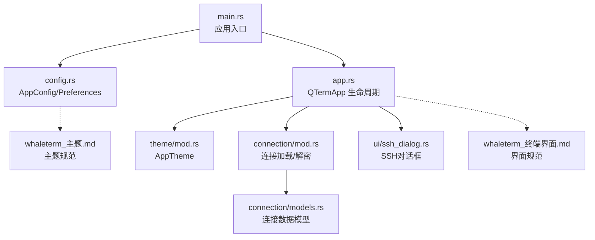
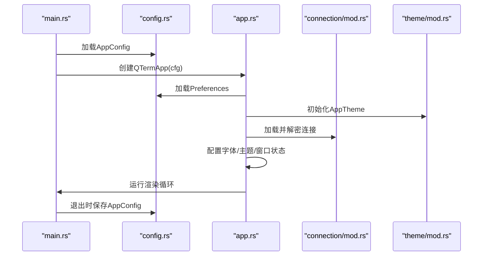
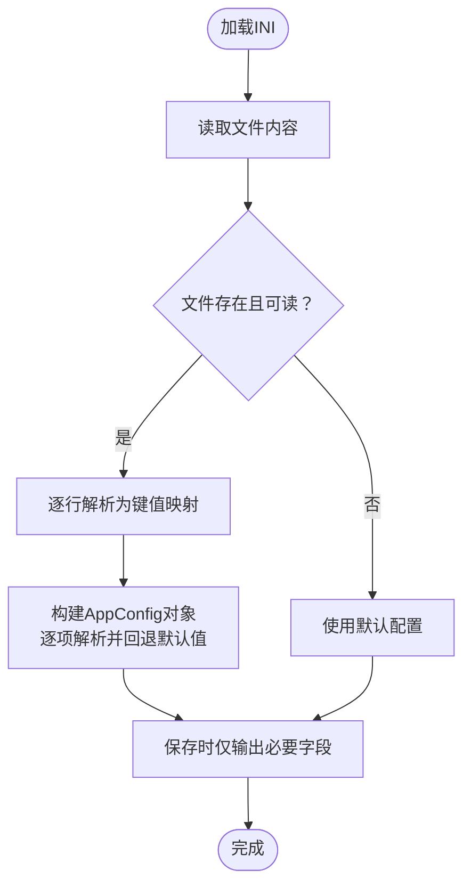
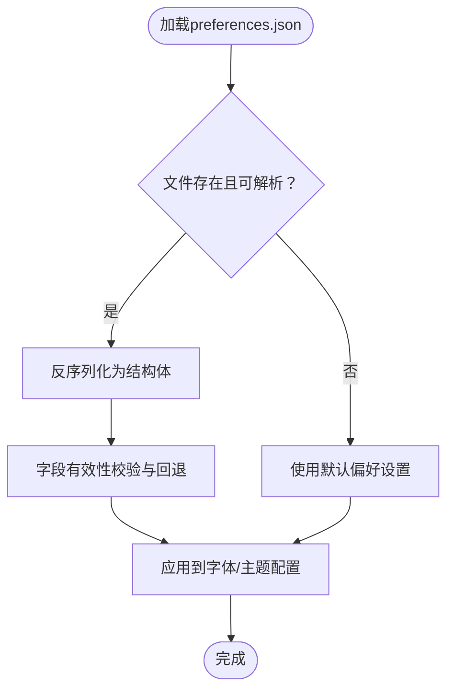
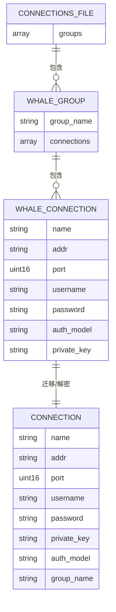
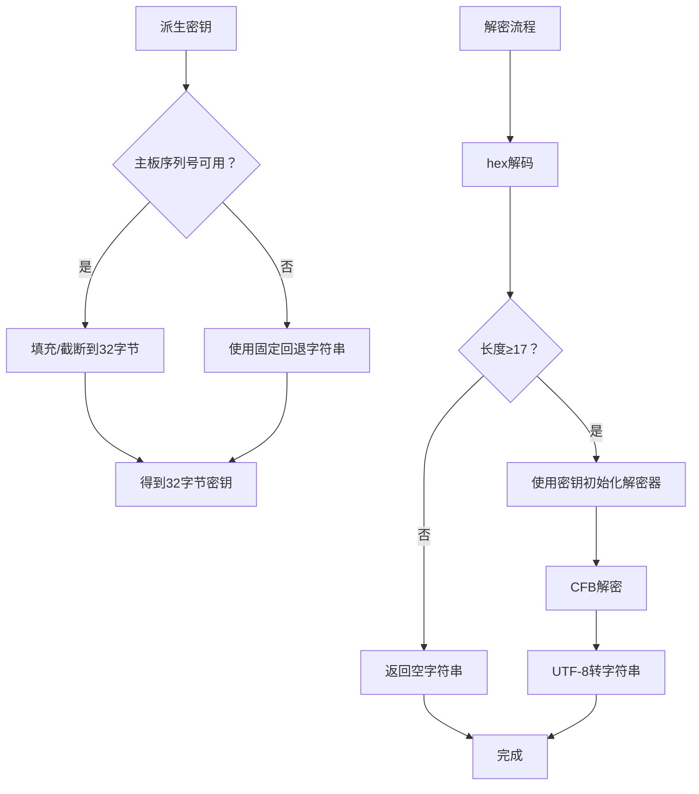
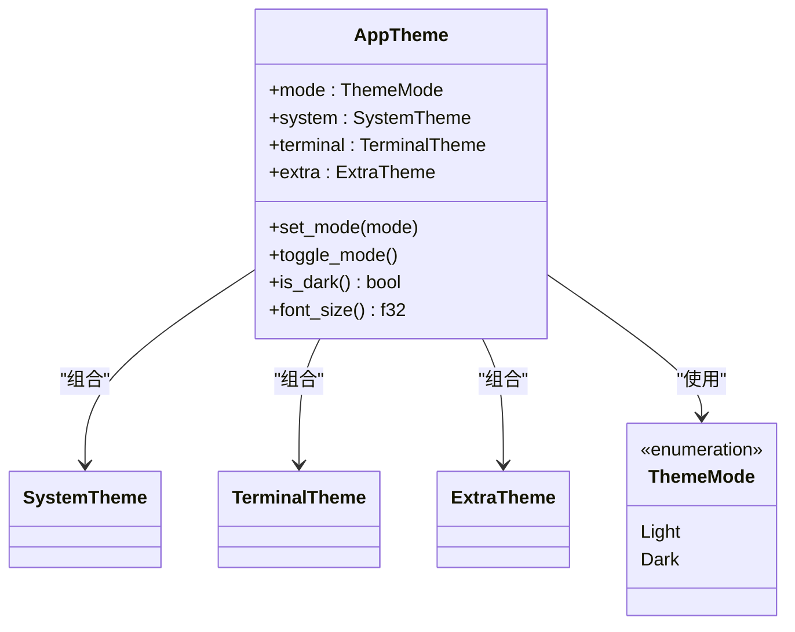
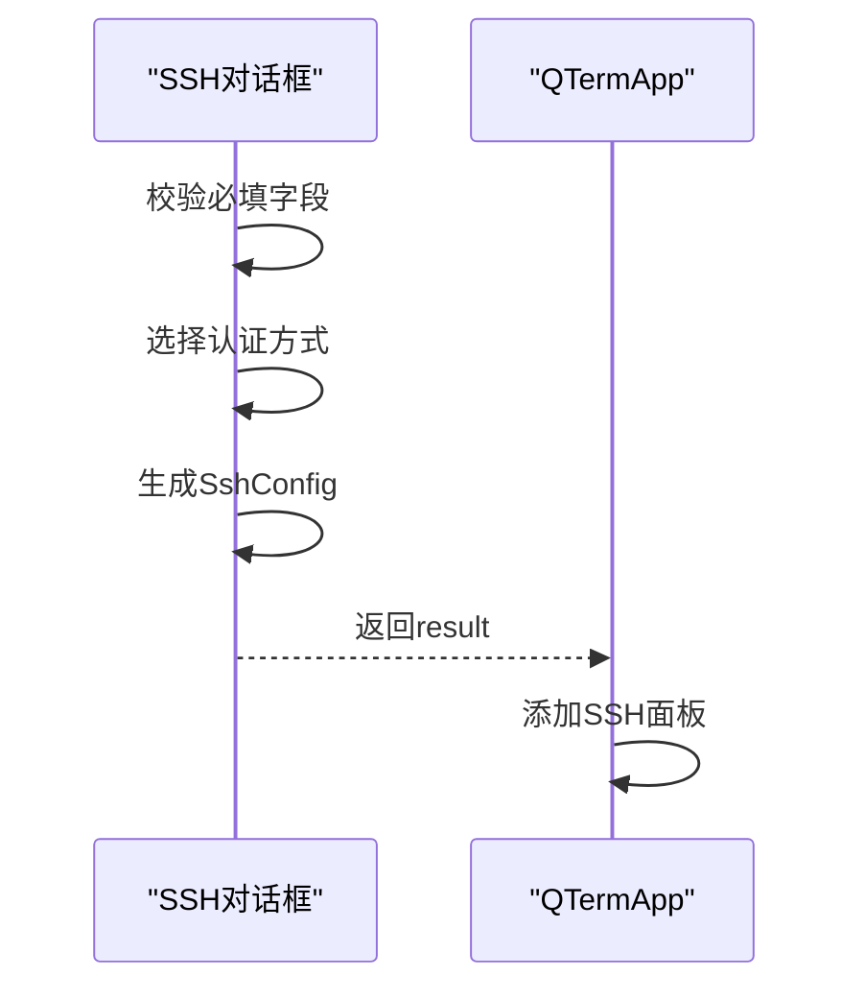
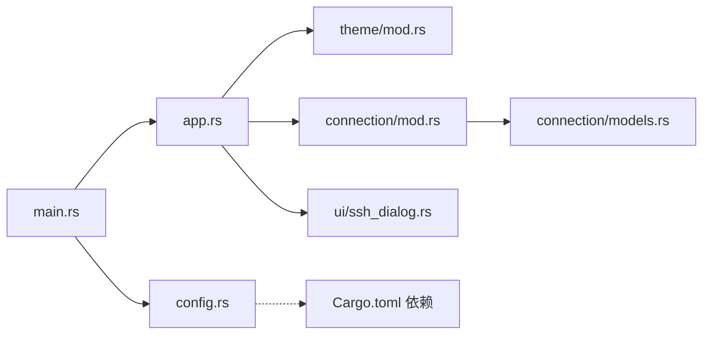

# 配置与数据管理

<cite>
**本文引用的文件**
- [config.rs](file://src/config.rs)
- [connection/mod.rs](file://src/connection/mod.rs)
- [connection/models.rs](file://src/connection/models.rs)
- [app.rs](file://src/app.rs)
- [main.rs](file://src/main.rs)
- [Cargo.toml](file://Cargo.toml)
- [theme/mod.rs](file://src/theme/mod.rs)
- [ui/ssh_dialog.rs](file://src/ui/ssh_dialog.rs)
- [whaleterm_主题.md](file://whaleterm_主题.md)
- [whaleterm_终端界面.md](file://whaleterm_终端界面.md)
</cite>

## 目录
1. [简介](#简介)
2. [项目结构](#项目结构)
3. [核心组件](#核心组件)
4. [架构总览](#架构总览)
5. [详细组件分析](#详细组件分析)
6. [依赖关系分析](#依赖关系分析)
7. [性能考量](#性能考量)
8. [故障排查指南](#故障排查指南)
9. [结论](#结论)
10. [附录](#附录)

## 简介
本文件面向QTerm的配置与数据管理系统，系统性阐述INI配置格式、用户偏好设置、连接配置数据模型、持久化策略、验证与错误处理、数据安全与访问控制、扩展指南以及最佳实践。文档同时结合UI与主题系统，帮助开发者与使用者理解配置如何驱动界面行为与连接管理。

## 项目结构
QTerm采用模块化组织，配置与数据管理主要涉及以下模块：
- 配置管理：负责应用运行时配置（INI）与偏好设置（WhaleTerm preferences.json）的读取与保存
- 连接管理：负责从WhaleTerm迁移连接配置（connections.json），并进行敏感信息解密
- 主题系统：提供主题模式与颜色体系，与偏好设置协同影响UI渲染
- 应用入口与生命周期：在启动时加载配置，在退出时保存配置

图表来源
- [main.rs:51-87](file://src/main.rs#L51-L87)
- [config.rs:37-127](file://src/config.rs#L37-L127)
- [app.rs:15-93](file://src/app.rs#L15-L93)
- [theme/mod.rs:13-62](file://src/theme/mod.rs#L13-L62)
- [connection/mod.rs:25-55](file://src/connection/mod.rs#L25-L55)
- [connection/models.rs:3-41](file://src/connection/models.rs#L3-L41)
- [ui/ssh_dialog.rs:10-37](file://src/ui/ssh_dialog.rs#L10-L37)

章节来源
- [main.rs:51-87](file://src/main.rs#L51-L87)
- [config.rs:37-127](file://src/config.rs#L37-L127)
- [app.rs:15-93](file://src/app.rs#L15-L93)

## 核心组件
- 应用配置（INI）：窗口位置、尺寸、主题、字体大小、回滚行数、Shell路径等
- 用户偏好（JSON）：来自WhaleTerm的preferences.json，包含字体家族、字号、粗细与主题
- 连接配置（JSON）：来自WhaleTerm的connections.json，包含连接树、认证信息与私钥
- 主题系统：系统主题、终端主题、扩展色，支持亮/暗模式切换
- SSH对话框：用于建立新的SSH连接配置

章节来源
- [config.rs:37-127](file://src/config.rs#L37-L127)
- [config.rs:206-281](file://src/config.rs#L206-L281)
- [connection/models.rs:3-41](file://src/connection/models.rs#L3-L41)
- [theme/mod.rs:13-62](file://src/theme/mod.rs#L13-L62)
- [ui/ssh_dialog.rs:10-37](file://src/ui/ssh_dialog.rs#L10-L37)

## 架构总览
配置与数据管理贯穿应用启动、运行与退出阶段：
- 启动阶段：读取INI配置恢复窗口状态；读取WhaleTerm偏好设置加载字体与主题；加载连接配置并解密敏感信息
- 运行阶段：根据偏好设置动态配置字体；根据主题切换更新UI颜色；根据配置调整终端行为
- 退出阶段：保存窗口位置、尺寸、主题等运行时配置

图表来源
- [main.rs:51-87](file://src/main.rs#L51-L87)
- [config.rs:68-127](file://src/config.rs#L68-L127)
- [app.rs:61-93](file://src/app.rs#L61-L93)
- [connection/mod.rs:25-55](file://src/connection/mod.rs#L25-L55)
- [theme/mod.rs:20-62](file://src/theme/mod.rs#L20-L62)

## 详细组件分析

### INI配置格式与实现（AppConfig）
- 配置文件位置：跨平台路径规则，Windows与类Unix分别定位到各自配置目录下的qterm目录
- 文件名：config.ini
- 解析策略：简单key=value，忽略注释行（#开头）与空行
- 默认值：未提供时使用结构体默认值
- 保存策略：仅保存非None或非空字段，保证文件简洁

图表来源
- [config.rs:68-127](file://src/config.rs#L68-L127)
- [config.rs:129-143](file://src/config.rs#L129-L143)

章节来源
- [config.rs:68-127](file://src/config.rs#L68-L127)
- [config.rs:129-143](file://src/config.rs#L129-L143)

### 用户偏好设置（Preferences）
- 来源：WhaleTerm的preferences.json，包含config/general/shell三段字体与主题配置
- 解析策略：使用JSON反序列化，字段缺失或无效时回退默认值
- 应用：用于动态加载字体、设置终端字体大小与粗细、主题模式

图表来源
- [config.rs:240-281](file://src/config.rs#L240-L281)

章节来源
- [config.rs:240-281](file://src/config.rs#L240-L281)

### 连接配置数据模型与迁移（Connections）
- 来源：WhaleTerm的connections.json，包含分组与连接列表
- 数据模型：顶层groups数组，每个分组包含groupName与connections；连接包含name、addr、port、username、password、authModel、privateKey
- 迁移策略：扁平化为QTerm内部Connection结构，其中密码字段通过AES-256-CFB解密（兼容WhaleTerm格式）

图表来源
- [connection/models.rs:3-41](file://src/connection/models.rs#L3-L41)
- [connection/mod.rs:25-55](file://src/connection/mod.rs#L25-L55)

章节来源
- [connection/models.rs:3-41](file://src/connection/models.rs#L3-L41)
- [connection/mod.rs:25-55](file://src/connection/mod.rs#L25-L55)

### 敏感信息加密与访问控制
- 密码解密：采用AES-256-CFB，格式为hex(IV[16字节] + ciphertext)，密钥派生自主板序列号（若不可用则使用固定回退字符串）
- 访问控制：解密过程在连接加载时进行，避免明文存储；解密失败时回退为空字符串，确保应用可用性

图表来源
- [connection/mod.rs:91-138](file://src/connection/mod.rs#L91-L138)
- [connection/mod.rs:57-89](file://src/connection/mod.rs#L57-L89)

章节来源
- [connection/mod.rs:91-138](file://src/connection/mod.rs#L91-L138)
- [connection/mod.rs:57-89](file://src/connection/mod.rs#L57-L89)

### 主题与字体配置
- 主题系统：AppTheme包含系统主题、终端主题与扩展色，支持亮/暗模式切换
- 字体加载：根据Preferences收集字体家族，尝试加载系统字体与回退字体，最终应用到egui上下文
- UI联动：标题栏、侧边栏、状态栏与终端区域的颜色随主题与连接类型动态变化

图表来源
- [theme/mod.rs:7-62](file://src/theme/mod.rs#L7-L62)

章节来源
- [theme/mod.rs:7-62](file://src/theme/mod.rs#L7-L62)
- [app.rs:95-155](file://src/app.rs#L95-L155)

### SSH对话框与连接配置
- 对话框：提供主机、端口、用户名、认证方式（密码/私钥）输入，支持口令与口令短语
- 配置生成：校验必填字段后生成SshConfig，交由应用创建SSH面板

图表来源
- [ui/ssh_dialog.rs:104-131](file://src/ui/ssh_dialog.rs#L104-L131)
- [app.rs:505-512](file://src/app.rs#L505-L512)

章节来源
- [ui/ssh_dialog.rs:104-131](file://src/ui/ssh_dialog.rs#L104-L131)
- [app.rs:505-512](file://src/app.rs#L505-L512)

## 依赖关系分析
- 外部依赖：eframe/egui用于UI渲染；russh/russh-keys/russh-sftp用于SSH/SFTP；vte用于终端仿真；tokio异步运行时
- 内部依赖：config.rs被main.rs与app.rs依赖；connection/mod.rs被app.rs依赖；theme/mod.rs被app.rs依赖

图表来源
- [main.rs:51-87](file://src/main.rs#L51-L87)
- [config.rs:68-127](file://src/config.rs#L68-L127)
- [app.rs:15-93](file://src/app.rs#L15-L93)
- [theme/mod.rs:13-62](file://src/theme/mod.rs#L13-L62)
- [connection/mod.rs:25-55](file://src/connection/mod.rs#L25-L55)
- [connection/models.rs:3-41](file://src/connection/models.rs#L3-L41)
- [ui/ssh_dialog.rs:10-37](file://src/ui/ssh_dialog.rs#L10-L37)
- [Cargo.toml:8-25](file://Cargo.toml#L8-L25)

章节来源
- [Cargo.toml:8-25](file://Cargo.toml#L8-L25)

## 性能考量
- 配置读写：INI与JSON均为轻量文件，读写开销低；建议在应用退出时批量保存，避免频繁IO
- 字体加载：字体枚举与系统字体读取可能带来IO与内存占用，应避免重复加载；可缓存已加载字体路径
- 连接解密：AES解密为CPU密集型，建议在后台线程或异步任务中执行，避免阻塞UI
- 主题切换：颜色与字体变更应尽量批量更新，减少多次重绘

## 故障排查指南
- INI解析失败：检查文件是否存在、格式是否为key=value、是否包含非法字符；确认默认值回退逻辑是否生效
- preferences.json解析失败：检查JSON结构完整性与字段类型；确认默认值回退逻辑是否生效
- 连接无法解密：检查密码字段hex格式是否正确、IV长度是否为16字节、密钥派生是否成功；确认主板序列号可用性
- 字体加载失败：确认字体名称与系统字体路径匹配；检查回退字体是否存在
- 主题切换异常：确认主题模式切换逻辑与UI颜色应用链路；检查颜色字符串格式

章节来源
- [config.rs:129-143](file://src/config.rs#L129-L143)
- [config.rs:240-281](file://src/config.rs#L240-L281)
- [connection/mod.rs:57-89](file://src/connection/mod.rs#L57-L89)
- [app.rs:95-155](file://src/app.rs#L95-L155)

## 结论
QTerm的配置与数据管理以INI与JSON为核心，结合主题系统与连接迁移，实现了从窗口状态、字体主题到连接认证的全链路配置能力。通过默认值回退与错误处理，系统在配置缺失或损坏时仍能稳定运行；通过AES-256-CFB解密与密钥派生，保障了连接敏感信息的安全性。建议在后续版本中引入版本管理与迁移机制，以更好地支持配置演进与跨版本兼容。

## 附录

### 配置项定义与默认值清单
- AppConfig（INI）
  - 窗口位置：window_x、window_y（Option<f32>）
  - 窗口尺寸：window_width、window_height（Option<f32>）
  - 最大化：maximized（bool）
  - 字体大小：font_size（f32，默认14.0）
  - 回滚行数：scrollback_lines（usize，默认1000）
  - 主题：theme（String，默认"dark"）
  - Shell路径：shell_path（String，默认空）
- Preferences（preferences.json）
  - config段：default_font_family（Vec<String>）、default_font_size（f32，>0有效）、default_font_bold（String，"bold"视为粗体）
  - general段：font_family（Vec<String>）、font_size（f32，>0有效）、font_bold（String，"bold"视为粗体）、theme（String）
  - shell段：font_family（Vec<String>）、font_size（f32，>0有效）、font_bold（String，"bold"视为粗体）

章节来源
- [config.rs:37-127](file://src/config.rs#L37-L127)
- [config.rs:147-182](file://src/config.rs#L147-L182)
- [config.rs:206-281](file://src/config.rs#L206-L281)

### 配置验证与错误处理
- 参数校验：数值型字段进行范围校验（如字体大小范围），布尔字段进行字符串比较（"true"/"false"）
- 默认值回退：字段缺失或解析失败时使用结构体默认值
- 配置恢复：启动时根据INI恢复窗口位置与尺寸，确保在可见显示器范围内；最大化状态与主题随运行时变更

章节来源
- [config.rs:68-127](file://src/config.rs#L68-L127)
- [main.rs:60-75](file://src/main.rs#L60-L75)

### 配置扩展指南
- 新增INI配置项：在AppConfig中添加字段，提供Default实现；在load/save中处理读写
- 新增preferences.json字段：在PreferencesFile与对应Section中添加字段，提供Default实现；在load中处理回退
- 自定义配置文件格式：参考parse_ini与JSON解析模式，实现自定义解析器与默认值回退
- 迁移机制：建议引入版本号字段与迁移函数，按版本升级执行迁移脚本

章节来源
- [config.rs:37-127](file://src/config.rs#L37-L127)
- [config.rs:147-182](file://src/config.rs#L147-L182)
- [config.rs:129-143](file://src/config.rs#L129-L143)

### 数据安全与访问控制
- 敏感信息加密：连接密码采用AES-256-CFB，格式为hex(IV + ciphertext)
- 密钥派生：优先使用主板序列号，不可用时使用固定回退字符串，确保一致性
- 访问控制：解密在应用内部进行，避免明文落盘；解密失败回退为空字符串，保证可用性

章节来源
- [connection/mod.rs:57-89](file://src/connection/mod.rs#L57-L89)
- [connection/mod.rs:91-138](file://src/connection/mod.rs#L91-L138)

### 最佳实践
- 配置文件放置：遵循跨平台约定，Windows使用%APPDATA%\qterm，类Unix使用~/.config/qterm
- 配置备份：定期备份config.ini与preferences.json，便于回滚
- 字体选择：优先使用系统字体，确保跨平台一致性；提供回退字体
- 主题切换：在切换主题时批量更新UI，避免闪烁
- 连接管理：定期清理无效连接，确保connections.json结构清晰

章节来源
- [config.rs:9-35](file://src/config.rs#L9-L35)
- [app.rs:95-155](file://src/app.rs#L95-L155)
- [whaleterm_主题.md:674-712](file://whaleterm_主题.md#L674-L712)
- [whaleterm_终端界面.md:655-694](file://whaleterm_终端界面.md#L655-L694)