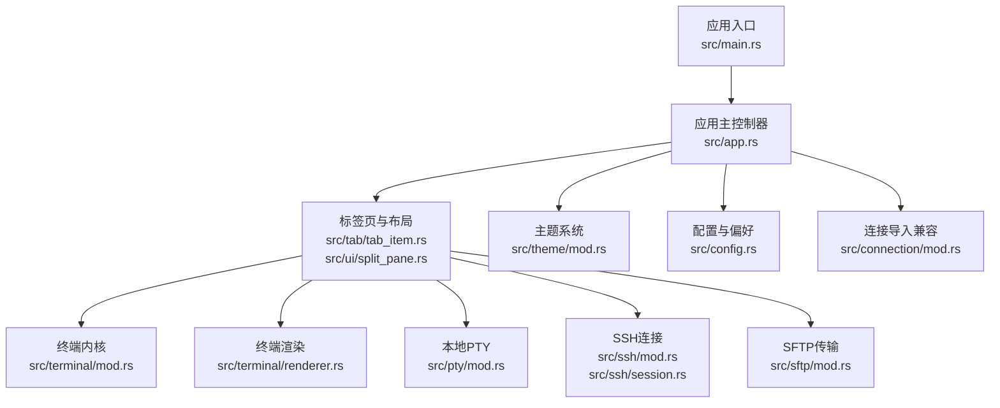
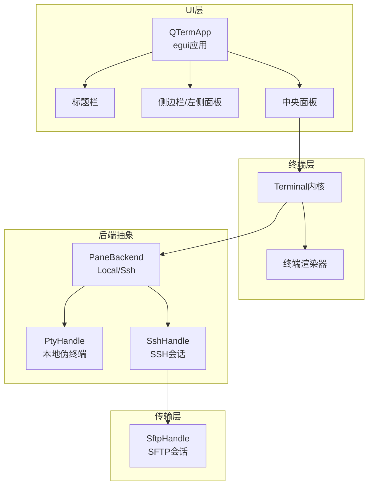
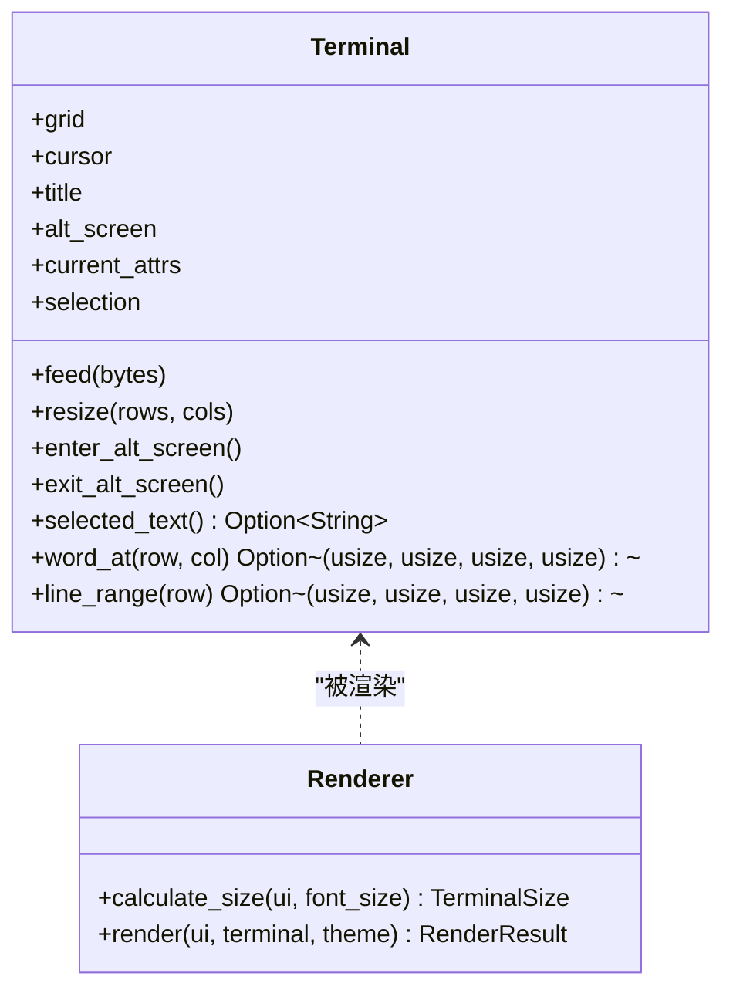
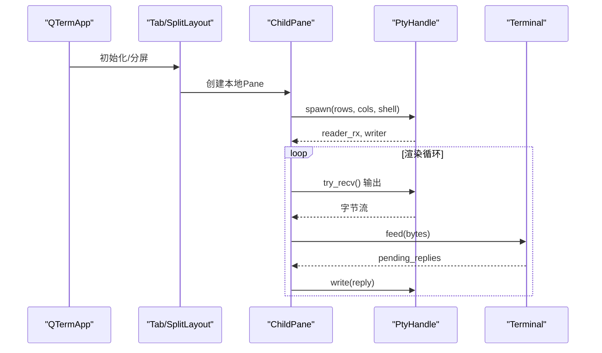
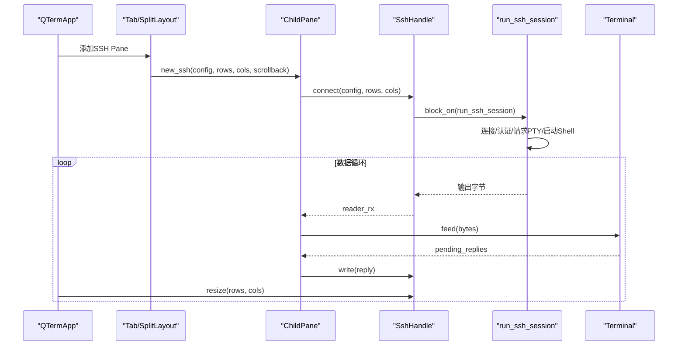
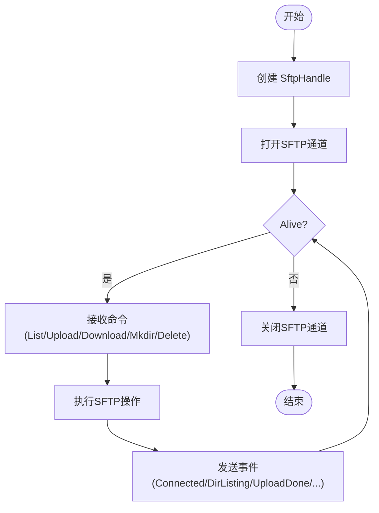
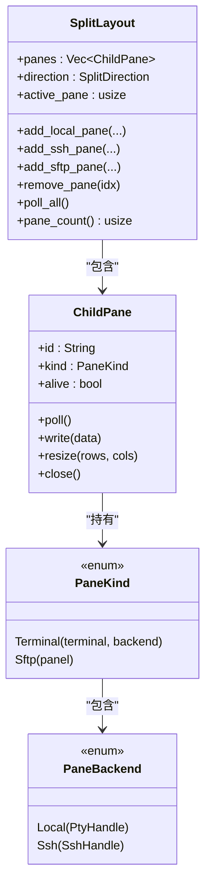
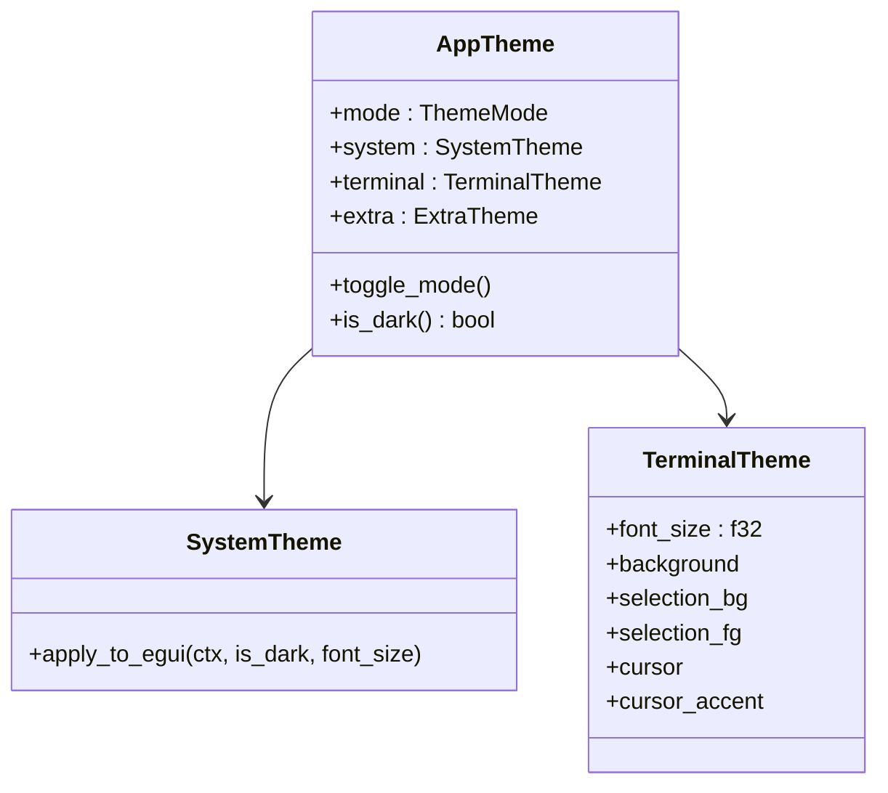
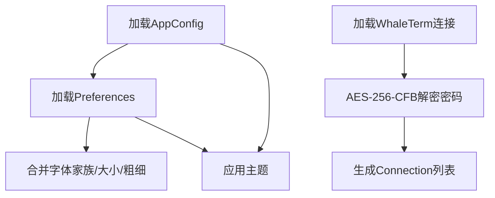
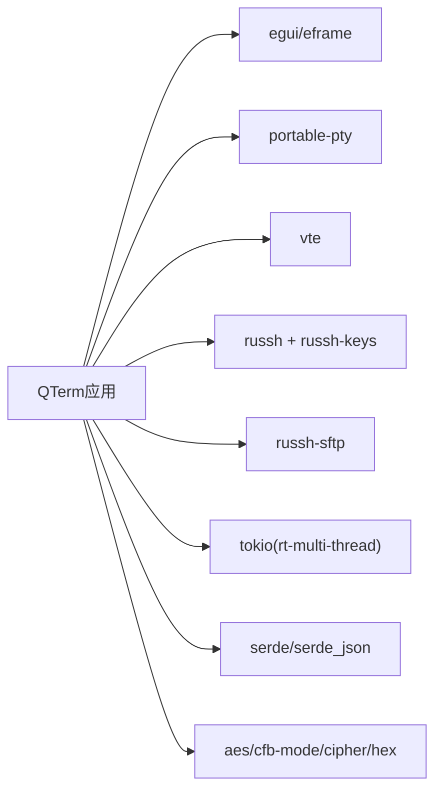

# 项目概述

<cite>
**本文引用的文件**
- [Cargo.toml](file://Cargo.toml)
- [main.rs](file://src/main.rs)
- [app.rs](file://src/app.rs)
- [config.rs](file://src/config.rs)
- [pty/mod.rs](file://src/pty/mod.rs)
- [terminal/mod.rs](file://src/terminal/mod.rs)
- [terminal/renderer.rs](file://src/terminal/renderer.rs)
- [ssh/mod.rs](file://src/ssh/mod.rs)
- [ssh/session.rs](file://src/ssh/session.rs)
- [sftp/mod.rs](file://src/sftp/mod.rs)
- [ui/mod.rs](file://src/ui/mod.rs)
- [ui/split_pane.rs](file://src/ui/split_pane.rs)
- [tab/tab_item.rs](file://src/tab/tab_item.rs)
- [theme/mod.rs](file://src/theme/mod.rs)
- [connection/mod.rs](file://src/connection/mod.rs)
- [2026-05-30-phase2-ssh-split-design.md](file://docs/specs/2026-05-30-phase2-ssh-split-design.md)
- [2026-05-30-phase3-sftp-design.md](file://docs/specs/2026-05-30-phase3-sftp-design.md)
</cite>

## 目录
1. [简介](#简介)
2. [项目结构](#项目结构)
3. [核心组件](#核心组件)
4. [架构总览](#架构总览)
5. [详细组件分析](#详细组件分析)
6. [依赖关系分析](#依赖关系分析)
7. [性能考量](#性能考量)
8. [故障排查指南](#故障排查指南)
9. [结论](#结论)
10. [附录](#附录)

## 简介
QTerm 是一个基于 Rust 的跨平台桌面终端模拟器，旨在为用户提供统一的本地终端、SSH 远程连接与 SFTP 文件传输体验。项目采用 eframe/egui 构建原生桌面 UI，结合 portable-pty 提供本地伪终端，使用 vte 解析终端控制序列，通过 russh/russh-sftp 实现安全的远程会话与文件传输，并以模块化设计将终端渲染、连接管理、UI 组件与主题系统解耦，便于扩展与维护。

本项目面向希望在 Windows、macOS 和 Linux 上获得一致、高性能、可定制终端体验的用户；同时为开发者提供清晰的架构与可演进的路线图（Phase 2/3 规格文档），帮助快速迭代新增能力（如 SSH 分屏、SFTP 面板）。

## 项目结构
项目采用按功能域划分的模块化组织方式，核心模块包括：
- 应用入口与生命周期：main.rs、app.rs
- 配置与偏好：config.rs
- 终端内核与渲染：terminal/*、terminal/renderer.rs
- 本地伪终端：pty/*
- 远程连接：ssh/*
- 文件传输：sftp/*
- UI 与布局：ui/*、tab/tab_item.rs、ui/split_pane.rs
- 主题系统：theme/*
- 连接导入兼容：connection/*

**图表来源**
- [main.rs:44-75](file://src/main.rs#L44-L75)
- [app.rs:60-93](file://src/app.rs#L60-L93)
- [tab/tab_item.rs:3-17](file://src/tab/tab_item.rs#L3-L17)
- [ui/split_pane.rs:132-136](file://src/ui/split_pane.rs#L132-L136)
- [terminal/mod.rs:22-37](file://src/terminal/mod.rs#L22-L37)
- [terminal/renderer.rs:36-167](file://src/terminal/renderer.rs#L36-L167)
- [pty/mod.rs:9-15](file://src/pty/mod.rs#L9-L15)
- [ssh/mod.rs:50-58](file://src/ssh/mod.rs#L50-L58)
- [sftp/mod.rs:7-11](file://src/sftp/mod.rs#L7-L11)
- [theme/mod.rs:13-18](file://src/theme/mod.rs#L13-L18)
- [config.rs:34-44](file://src/config.rs#L34-L44)
- [connection/mod.rs:27-55](file://src/connection/mod.rs#L27-L55)

**章节来源**
- [main.rs:44-75](file://src/main.rs#L44-L75)
- [app.rs:60-93](file://src/app.rs#L60-L93)
- [tab/tab_item.rs:3-17](file://src/tab/tab_item.rs#L3-L17)
- [ui/split_pane.rs:132-136](file://src/ui/split_pane.rs#L132-L136)
- [terminal/mod.rs:22-37](file://src/terminal/mod.rs#L22-L37)
- [terminal/renderer.rs:36-167](file://src/terminal/renderer.rs#L36-L167)
- [pty/mod.rs:9-15](file://src/pty/mod.rs#L9-L15)
- [ssh/mod.rs:50-58](file://src/ssh/mod.rs#L50-L58)
- [sftp/mod.rs:7-11](file://src/sftp/mod.rs#L7-L11)
- [theme/mod.rs:13-18](file://src/theme/mod.rs#L13-L18)
- [config.rs:34-44](file://src/config.rs#L34-L44)
- [connection/mod.rs:27-55](file://src/connection/mod.rs#L27-L55)

## 核心组件
- 应用主控制器（QTermApp）
  - 负责窗口初始化、标题栏、侧边栏、状态栏、全局快捷键与事件循环
  - 管理多个标签页（Tab），每个标签页包含可分屏的终端或 SFTP 面板
  - 集成主题系统与字体配置，动态应用到 egui 上下文
- 终端内核（Terminal）
  - 基于 vte 解析器处理控制序列，维护网格、光标、选择区与滚动区域
  - 支持主屏幕/备用屏幕切换、区域滚动、文本选择与单词/整行范围提取
- 终端渲染（renderer）
  - 将 Terminal 网格按字符与颜色绘制到 egui 画布，支持选择高亮与光标绘制
  - 动态计算单元格尺寸，适配不同字体与窗口大小
- 本地伪终端（PtyHandle）
  - 使用 portable-pty 创建本地子进程与伪终端，桥接终端输出与输入
  - 支持窗口大小调整与进程存活检测
- SSH 连接（SshHandle）
  - 基于 russh 的异步会话，提供统一的 reader/writer/resize 接口
  - 复用共享 Tokio 运行时，隔离 SSH 子任务与通道读写
- SFTP 文件传输（SftpHandle）
  - 复用现有 SSH 会话，通过 subsystem 打开 SFTP 通道
  - 提供目录列举、上传/下载、新建目录、删除等操作与事件回调
- UI 与布局（SplitLayout/ChildPane）
  - 支持水平/垂直分屏，最多 6 个 pane
  - 统一本地与远程终端后端，以及 SFTP 面板
- 主题系统（AppTheme/SystemTheme/TerminalTheme）
  - 支持明暗主题切换，动态应用到 egui 与终端渲染
- 配置与偏好（AppConfig/Preferences）
  - 窗口位置/尺寸、字体家族/大小、主题、滚动行数、Shell 路径等
  - 兼容 WhaleTerm 的连接配置与密码解密逻辑

**章节来源**
- [app.rs:15-93](file://src/app.rs#L15-L93)
- [terminal/mod.rs:22-174](file://src/terminal/mod.rs#L22-L174)
- [terminal/renderer.rs:7-184](file://src/terminal/renderer.rs#L7-L184)
- [pty/mod.rs:9-106](file://src/pty/mod.rs#L9-L106)
- [ssh/mod.rs:50-118](file://src/ssh/mod.rs#L50-L118)
- [ssh/session.rs:9-77](file://src/ssh/session.rs#L9-L77)
- [sftp/mod.rs:39-206](file://src/sftp/mod.rs#L39-L206)
- [ui/split_pane.rs:12-209](file://src/ui/split_pane.rs#L12-L209)
- [theme/mod.rs:13-71](file://src/theme/mod.rs#L13-L71)
- [config.rs:34-260](file://src/config.rs#L34-L260)
- [connection/mod.rs:27-138](file://src/connection/mod.rs#L27-L138)

## 架构总览
QTerm 采用“UI 层（egui）+ 渲染层（Terminal）+ 后端抽象（Pty/Ssh）+ 传输层（SFTP）”的分层设计。UI 层负责布局与交互，渲染层负责字符栅格绘制，后端抽象屏蔽本地与远程差异，传输层复用 SSH 会话实现文件操作。

**图表来源**
- [app.rs:348-516](file://src/app.rs#L348-L516)
- [terminal/mod.rs:22-37](file://src/terminal/mod.rs#L22-L37)
- [terminal/renderer.rs:36-167](file://src/terminal/renderer.rs#L36-L167)
- [ui/split_pane.rs:12-20](file://src/ui/split_pane.rs#L12-L20)
- [pty/mod.rs:9-15](file://src/pty/mod.rs#L9-L15)
- [ssh/mod.rs:50-58](file://src/ssh/mod.rs#L50-L58)
- [sftp/mod.rs:7-11](file://src/sftp/mod.rs#L7-L11)

## 详细组件分析

### 终端内核与渲染
- 终端内核负责解析 VTE 控制序列、维护网格与光标状态、处理选择与滚动区域
- 渲染器根据可用空间计算单元格尺寸，批量绘制字符与背景色，支持选择高亮与光标覆盖
- 支持主/备屏幕切换，用于全屏程序（如 vim/top）的体验

**图表来源**
- [terminal/mod.rs:22-174](file://src/terminal/mod.rs#L22-L174)
- [terminal/renderer.rs:7-184](file://src/terminal/renderer.rs#L7-L184)

**章节来源**
- [terminal/mod.rs:22-174](file://src/terminal/mod.rs#L22-L174)
- [terminal/renderer.rs:36-167](file://src/terminal/renderer.rs#L36-L167)

### 本地伪终端（PtyHandle）
- 使用 portable-pty 创建本地 PTY，启动指定 Shell 或默认 Shell
- 通过线程与通道将子进程输出转发至终端内核，支持窗口大小调整与进程存活检测

**图表来源**
- [pty/mod.rs:17-74](file://src/pty/mod.rs#L17-L74)
- [ui/split_pane.rs:29-51](file://src/ui/split_pane.rs#L29-L51)
- [terminal/mod.rs:59-66](file://src/terminal/mod.rs#L59-L66)

**章节来源**
- [pty/mod.rs:9-106](file://src/pty/mod.rs#L9-L106)
- [ui/split_pane.rs:29-51](file://src/ui/split_pane.rs#L29-L51)
- [terminal/mod.rs:59-66](file://src/terminal/mod.rs#L59-L66)

### SSH 连接与会话
- SshHandle 在共享 Tokio 运行时上启动异步会话，完成 TCP→握手→认证→PTY→Shell 的完整链路
- 会话内部分离 reader/writer 子任务与 resize 通道，保证稳定的数据流与窗口变化响应

**图表来源**
- [ssh/mod.rs:61-95](file://src/ssh/mod.rs#L61-L95)
- [ssh/session.rs:9-77](file://src/ssh/session.rs#L9-L77)
- [ui/split_pane.rs:41-51](file://src/ui/split_pane.rs#L41-L51)

**章节来源**
- [ssh/mod.rs:50-118](file://src/ssh/mod.rs#L50-L118)
- [ssh/session.rs:9-77](file://src/ssh/session.rs#L9-L77)
- [ui/split_pane.rs:41-51](file://src/ui/split_pane.rs#L41-L51)

### SFTP 文件传输
- SftpHandle 复用已有的 SSH 会话，通过 subsystem 打开 SFTP 通道
- 提供目录列举、上传/下载、新建目录、删除等命令与事件回调，支持并发命令队列

**图表来源**
- [sftp/mod.rs:39-206](file://src/sftp/mod.rs#L39-L206)

**章节来源**
- [sftp/mod.rs:39-206](file://src/sftp/mod.rs#L39-L206)

### UI 与布局（分屏）
- SplitLayout 支持水平/垂直分屏，最多 6 个 pane
- PaneKind 统一 Terminal 与 SFTP 两种类型，PaneBackend 抽象 Local/Ssh 差异
- 支持全局快捷键进行分屏、切换、关闭与打开 SSH/SFTP

**图表来源**
- [ui/split_pane.rs:12-209](file://src/ui/split_pane.rs#L12-L209)

**章节来源**
- [ui/split_pane.rs:12-209](file://src/ui/split_pane.rs#L12-L209)
- [app.rs:240-516](file://src/app.rs#L240-L516)

### 主题系统
- AppTheme 包含系统级与终端级主题，支持明暗模式切换与字体大小应用
- 渲染器根据主题颜色绘制字符、背景、选择与光标

**图表来源**
- [theme/mod.rs:13-71](file://src/theme/mod.rs#L13-L71)

**章节来源**
- [theme/mod.rs:13-71](file://src/theme/mod.rs#L13-L71)
- [terminal/renderer.rs:36-167](file://src/terminal/renderer.rs#L36-L167)

### 配置与偏好
- AppConfig 管理窗口位置/尺寸、主题、字体大小、滚动行数、Shell 路径等
- Preferences 兼容 WhaleTerm 的 preferences.json，加载字体家族/大小/粗细与主题设置
- 支持从 WhaleTerm connections.json 导入连接并解密密码

**图表来源**
- [config.rs:62-118](file://src/config.rs#L62-L118)
- [config.rs:219-259](file://src/config.rs#L219-L259)
- [connection/mod.rs:27-138](file://src/connection/mod.rs#L27-L138)

**章节来源**
- [config.rs:34-260](file://src/config.rs#L34-L260)
- [connection/mod.rs:27-138](file://src/connection/mod.rs#L27-L138)

## 依赖关系分析
- eframe/egui：桌面 UI 框架与渲染引擎
- portable-pty：跨平台本地伪终端
- vte：终端控制序列解析
- russh/russh-keys：SSH 安全连接与密钥处理
- russh-sftp：SFTP 文件传输
- tokio：异步运行时（仅 SSH 模块）
- serde/serde_json：配置与连接数据序列化
- aes/cfb-mode/cipher/hex：WhaleTerm 密码解密

**图表来源**
- [Cargo.toml:8-30](file://Cargo.toml#L8-L30)

**章节来源**
- [Cargo.toml:8-30](file://Cargo.toml#L8-L30)

## 性能考量
- 渲染优化：按颜色批处理文本绘制，减少绘制调用次数；仅在必要时重绘
- 事件驱动：使用通道与异步任务处理 I/O，避免阻塞 UI 线程
- 资源回收：Pane 关闭时释放 PTY/SSH/SFTP 资源，防止句柄泄漏
- 字体与尺寸：动态计算单元格尺寸，避免过度重排
- 运行时隔离：SSH 使用独立 Tokio 运行时，降低相互干扰

[本节为通用指导，无需特定文件引用]

## 故障排查指南
- 无法连接 SSH
  - 检查网络连通性与主机名/端口
  - 确认认证方式（密码/私钥）与凭据
  - 查看 SSH 对话框中的错误提示
- 远程终端无输出或卡死
  - 确认 PTY 请求与 Shell 启动是否成功
  - 检查窗口大小变化是否正确下发
- SFTP 无法打开或传输失败
  - 确认 SSH 会话仍存活
  - 检查远程路径权限与磁盘空间
- 字体显示异常
  - 检查字体家族与大小配置
  - 确认系统字体路径存在

**章节来源**
- [ssh/mod.rs:31-48](file://src/ssh/mod.rs#L31-L48)
- [sftp/mod.rs:104-140](file://src/sftp/mod.rs#L104-L140)
- [app.rs:95-155](file://src/app.rs#L95-L155)

## 结论
QTerm 通过 eframe/egui 的原生 UI、vte 的终端解析、portable-pty 的本地会话与 russh 生态的远程能力，构建了统一的本地/远程终端体验。模块化设计使终端渲染、连接管理、UI 布局与主题系统解耦，便于持续演进。Phase 2/3 的规划明确了 SSH 分屏与 SFTP 面板的实现路径，为后续扩展打下坚实基础。

[本节为总结，无需特定文件引用]

## 附录
- 使用场景
  - 开发者日常运维与远程调试
  - 多会话并行（分屏）对比与对照
  - 本地与远程文件协作（SFTP）
- 目标用户
  - 偏好跨平台终端的工程师与运维人员
  - 需要统一 UI 与主题体验的高级用户
- 差异化优势
  - 本地与远程统一 UI 与快捷键体系
  - 明确的模块边界与可扩展性
  - 与 WhaleTerm 配置与连接的兼容性

[本节为概览，无需特定文件引用]